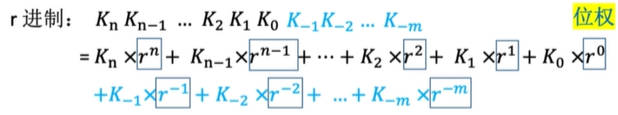
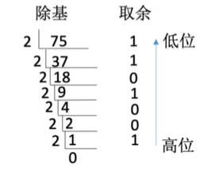
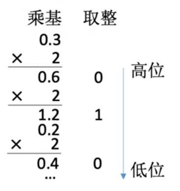
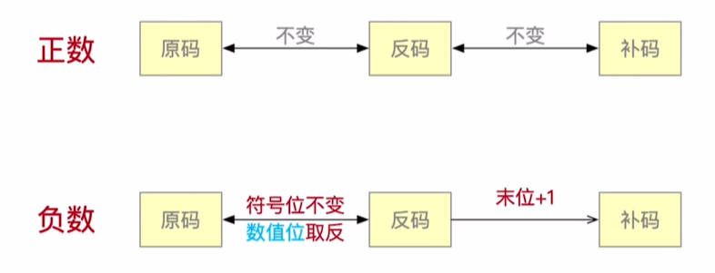
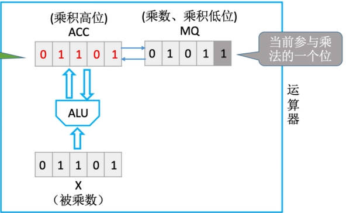
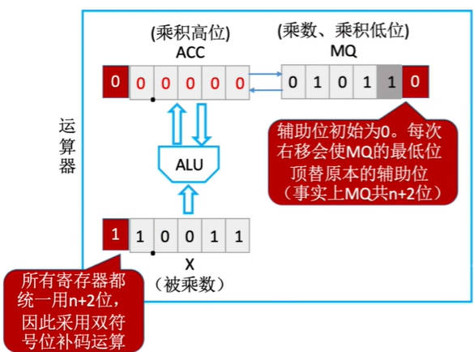
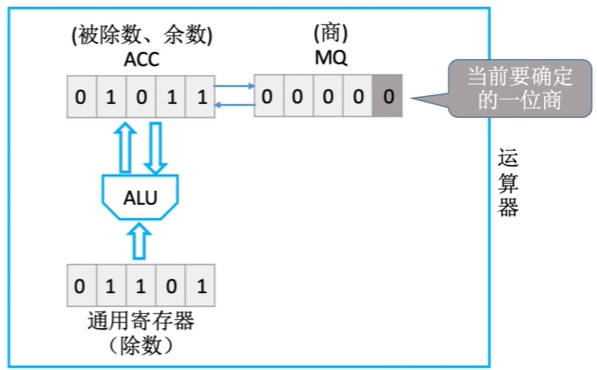
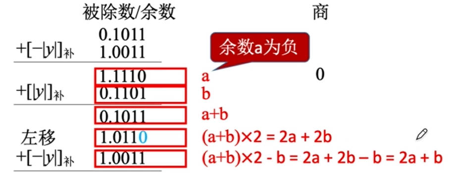
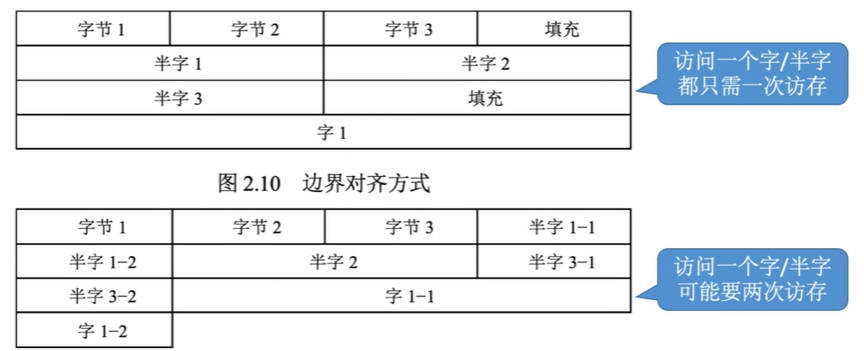
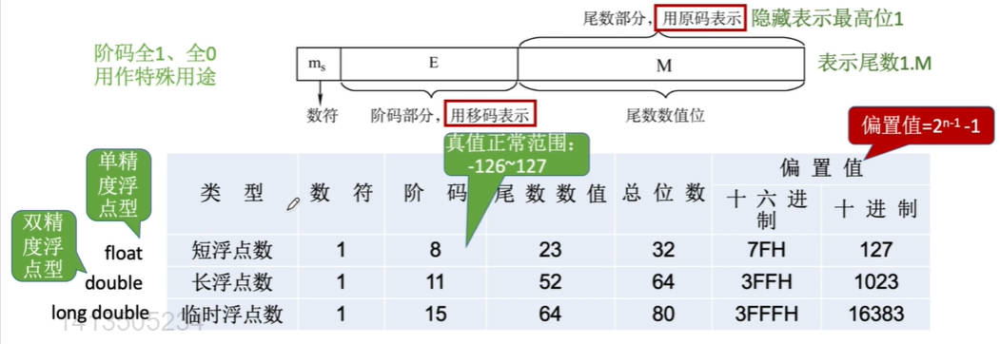

# 进位计数制

## r进制计数法



- 基数：

    每个数码位所用到的不同符号的个数
    
    比如，十进制每一位可以用到0~9这十个数，十进制的基数就是10。

    r进制的基数为r

- 位权

### 不同进制的标志

通用表示方法：

小括号括起数字部分，右下角下标是几就是几进制。比如 ： `二进制：(1010001)₂`， `八进制：(1652)₈`

- 二进制：
  
  - 数字后边跟一个大B(Binary)：1010001B

- 十六进制

    - 数字后边跟一个大H(Hexadecimal)：16A1H

    - 前面以0x开头：0x16A1

- 十进制：

    - 数字后面跟一个大D(Decimalism)：1652D

## 进制转换

### r进制 -> 十进制

不同数值位的数值分别 乘以 对应的位权 并相加

### 二进制 -> 八进制、十六进制

- 二进制 -> 八进制

    三位一组，每三位对应八进制的一位

    从小数点开始划分，整数部分从右往左三个一组，最后不足三个往前面添0；小数部分从左往右三个一组，最后不足三个往后面添0

- 二进制 -> 十六进制

    四位一组

- 八进制 -> 二进制

    每位八进制对应3位二进制

- 十六进制 -> 二进制

    每位十六进制对应4位二进制

### 十进制 -> 2进制

**整数部分：除基取余法**



**小数部分：乘基取整法**



有的十进制小数无法用二进制精确表示

**拼凑法：**

十进制转八进制和十六进制可以先转化为二进制再转换为其他进制

## 真值和机器数

- 真值：符合人类习惯的数字

- 机器数：数字实际存到机器里的形式，事实上就是把符号数字化

***
***

# 数据的表示和运算

## 无符号整数(unsigned int)

### 表示：

- 全部二进制位都是数值位，没有符号位

- n bit无符号整数表示范围是0~2^n-1

- 可以表示的最小的数是全0，最大的数是全1

### 无符号整数的减法：

- 被减数不变，减数全部按位取反，末位+1

- 从最低位开始按位相加

## 带符号整数(int)

### 原码表示法

**表示：**

- 符号位 0/1 对应 正负，剩余的数值位表示真值的绝对值

- 机器字长为n+1位，则表示范围为：-(2^n-1) ~ 2^n-1

- 真值0有两种形式 `0,0000...` 和 `1,0000...`

**运算：**

符号位不能参与运算

### 补码表示法



**表示：**

- 正数的原码与补码完全一样，

    负数原码转补码： ***符号位不变***， 原码取反+1

    负数补码转原码也是： 符号位不变，取反+1

- 补码数值位不能解读为“位权”，要先把补码转化为原码才能算出真值

- 表示范围：-2^n ~ 2^n - 1 比原码多表示一个负数

- 因为规定补码真值0只有 `0,0000...`一种形式，而`1,000000...`表示 - 2^n

**运算：**

- 加法：直接从最低位开始按位相加，符号位也参与运算

- 减法：A - B = A + (-B)

    由正数的补码得到对应的负数补码：***全部位(包含符号位)*** 按位取反末位+1

### 移码表示法

补码的基础上符号位取反

移码只能用于表示整数

表示范围与补码相同，真值0为 `10000...`

### 定点小数的表示

默认小数点的位置决定了每个位的位权

小数点默认在符号位之后，即数值位第一位是2^(-1)

原反补码转换规则和定点整数一样

原码表示范围：-(1-2^-n) ~ 1-2^-n

补码表示范围：-1 ~ 1-2^-n

`1.000000......`表示-1

***
***

# 运算器中的标志位

## 加减法运算器的标志位：

无论有符号数还是无符号数的加减运算都会产生这四种标志位。但是可能是无意义的。

### OF(OverFlow)溢出标志 有符号数

- 含义：***有符号数***的加减运算是否发生了溢出。OF = 1时，说明发生了溢出

- 计算方法：OF = 最高位产生的进位 **异或** 次高位产生的进位 `Cn ⊕ Cn-1`

### SF(SignFlag) 符号标志 有符号数

- 含义：有符号数加减运算结果的正负性。0表示运算结果为正数，1表示运算结果为负数

- 计算方法：SF = 最高位的本位和

    因为最高位就是符号位

### ZF(ZeroFlag)零标志 有&无符号数

- 表示运算结果是否为0。 1表示运算结果为0，0表示运算结果非0

- 计算方法：运算结果所有位全是0时，ZF = 1；

### CF(Carry Flag)进位/借位标志 无符号数

- 含义：表示无符号数的加减法是否发生了进位或借位。
  
    当CF=1时，说明无符号数的加减法运算发生了进位或错位，也即发生了溢出

- 计算方法：CF = 最高位产生的进位 **异或** sub `Cout ⊕ sub`

    sub是此次计算是否是减法的标志
    - sub = 1 表示减法
    - sub = 0 表示加法
***
***

# 乘法

## 原码一位乘法

因为每次都只有一位参与运算，所以叫一位乘法

### 计算思路：

1. 符号单独处理：符号位异或

2. 数值位取绝对值进行乘法计算

### 计算过程：

先加法再移位，重复n次



1. X与MQ中的乘数的当前最低位(标记为灰色的框中的数字)相乘

2. 相乘得到的结果与ACC相加(ACC初始化为0)

3. ACC 和 MQ 中的数整体右移。(逻辑右移，高位补0)

    ACC右移实现了错位相加，

    MQ右移丢弃了刚刚已经参与过运算的末尾，并将下一次要与MQ相乘的数移入灰框中

4. 乘数的数值位有几位就重复几次，符号位不参与运算。(机器字长-1)
***
## 补码一位乘法(Booth算法)

### 计算思路：

1. 符号位参加运算

2. 根据当前MQ中的最低位(灰色的) 和 辅助位(红色的) 来确定加什么

    - 辅助位 - MQ中最低位 = 1时，(ACC) + x的补码
    - 辅助位 - MQ中最低位 = 0时，(ACC) + 0
    - 辅助位 - MQ中最低位 = -1时，(ACC) + -x的补码

### 计算过程：



1. 计算辅助位 - MQ中最低位，并根据规则与ACC相加

2. ACC 和 MQ 中内容整体右移(算数右移，符号位是啥就填啥)

3. 符号位也参与运算，所以最后要再加一次，而不需要再移位

***
***

# 除法

## 恢复余数法(原码)

### 计算思想：

假设计算 `x / y`

1. 符号单独处理：符号位 = 被除数符号位 异或 除数符号位

2. 数值位取绝对值进行除法运算

3. 需要提前写出：x (被除数) 的绝对值原码， y (除数) 的绝对值原码，y的绝对值补码，y的绝对值的负数补码

### 具体计算：

上商0或1， 得到余数，余数末尾补0



1. 先默认商1，然后求出余数(ACC - 除数)，再将余数放入ACC中

2. 如果放入ACC的余数是负数，则说明应该商0。同时ACC中的数应该保持原样而不应该减去除数，所以ACC再加上除数找回原来的值。如果是正数就直接下一步

3. ACC 和 MQ 中的数整体左移一位(逻辑左移，低位补0)

4. 最后一步商完1如果得到负值，也需要恢复余数

共进行逻辑左移n次(假设机器字长为n)，加减运算 n+1 或 n+2 次

***

## 加减交替法(不恢复余数法)(原码)

### 计算思想：

1. 恢复余数法的改进方法，思想完全一样，只是合并了一些步骤

2. 符号位单独确定，用绝对值计算



### 具体计算：

1. 依旧是默认商1，ACC直接减去除数

2. 如果ACC是负值，说明应该商0。接下来原本要做的事是：

    1. ACC + 除数 恢复为原来的数 `a + b`

    2. 整体左移一位 `2(a+b)`

    3. 下一步依旧默认商1，再减去除数 `2a + b`

    所以将这三步合并，直接计算(2a + b)，即ACC 和 MQ 直接整体左移一位，然后加上除数。

3. 如果ACC中是正值，就正常继续算，即ACC 和 MQ 中的值整体左移，然后减去除数

4. 如果最后一步计算完是负值，也需要恢复余数

**注意：** ACC计算完后是正数则左移减除数，是负数则左移加除数

***

## 加减交替法(补码)

### 计算思想：

1. 符号位参与运算

2. 被除数/余数、除数采用双符号位

3. 需要 被除数补码， 除数补码，负除数的补码

### 具体计算

1. 如果被除数和除数同号，则被除数减去除数；异号则被除数加上除数。得到一个余数

2. 如果余数和除数同号，商1。余数左移一位减去除数

3. 如果余数和除数异号，商0。余数左移一位加上除数

4. 最后一位的商恒置为1。然后算出余数直接结束

移位次数为n次，加减次数为n+1次

***
***

# C语言中的强制类型转换

- **长度相同的无符号数强转为有符号数：**

    不改变数据内容(即机器码)，只会改变解释方式。

- **更长的数据变为更短的数据:**

    高位截断，保留低位

    比如int转short，long转int等等

- **更短的数据变为更长的数据：**

    符号扩展

    根据符号确定高位要补充的数据(无符号数直接填0)

***
***

# 数据的存储和排列

## 大小端模式

4字节int `01 23 45 67 H(H表示十六进制)`

- 01是最高有效字节(MSB)
- 67是最低有效字节(LSB)

### 大端方式存储：

便于人类阅读

```
01H 23H 45H 67H
```

最高有效字节存储在低地址部分

最低有效字节存储在高地址部分

### 小端方式存储：

便于机器处理

```
67H 45H 23H 01H
```

最低有效字节存储在低地址部分

最高有效字节存储在高地址部分

***

## 边界对齐

- 字节：固定单位 1字节(Byte) = 8bit

- 字：由机器字长确定，假设存储字长为32位，则一个字 = 32bit

- 半字：字长的一半，半字 = 16bit

计算机通常是按字节编址，即每个字节对应一个地址

通常也支持按字、按半字、按字节寻址。但给出的字、半字地址最后都要转化为字节地址

访问内存时不能跨行读取



是一种以空间换时间的策略

***
***

# 浮点数

## 浮点数的表示

采用科学计数法的思想，底数X10的指数次方

- 指数：阶码 —— 分为阶符 和 阶码的数值部分。用E表示

    阶码的位数反映浮点数的表示范围

    是常用补码或移码表示的定点整数

- 底数：尾数 —— 分为数符 和 尾数的数值部分.用M表示

    尾数的位数反映数值精度

    是常用原码或补码表示的定点小数

浮点数的真值： `N = r^E * M`

    - r : 阶码的底，通常为2，也可以是2的n次方

当出现正下溢或负下溢时，当作机器0

当出现正上溢或者负上溢时，抛出异常

***

## 浮点数尾数的规格化

### 左规

科学计数法要求底数的最高位应该是一个有效值

`0.02 * 10^5 改为 2 * 10^3`

如果尾数数值部分最高位是0，说明最高位是无效值，把尾数算数左移至最高位是1，阶码部分也做相应的调整。

### 右规

科学计数法要求底数的小数点应该在第一个非零的数值位的后面

`302.6 * 10^5 改为 3.026 * 10^7`

此时应该让尾数右移两位

当浮点数运算的结果尾数出现溢出(双符号位为10或01)时，将尾数右移一位，阶码加一

```
例：a = 010;00.1100, b = 010;00.1000

a + b = 4 * (00.1100 + 00.1000)
      = 4 * (01.0100)
      两个整数相加却得到负数，说明有一位溢出到了符号位

      出现01或10，此时更高的符号位是正确的符号位

      应该进行右规
      = 8 * (00.1010)
```

### 规格化浮点数的特点

- 原码表示的尾数

    正数为0.1xxx的形式，最大值为0.111... 最小为0.1000...

    负数为1.1xxx的形式，最大值为1.100... 最小为1.11....

    规定保证最高数值位是1即可

- 补码表示的尾数

    正数为0.1xxx的形式，最大值表示为0.1111 最小表示为0.10000

    负数为1.0xxx的形式，最大值表示为1.01111 最小值表示为1.000

    补码规定尾数规格化后首位必须与符号位不同

***

## 浮点数标准 IEEE 754 (读音：I tripleE 754)

### 知识补充：移码

- 补码的基础上将符号位取反，移码只能用于表示整数

- 定义：移码 = 真值 + 偏置值



要记住每个类型各部分所占位数

### 阶码

阶码部分用移码表示，其中移码的偏置值是标准中规定的( 规定为2^(n-1)-1 )

阶码的真值 = 移码 - 偏置值 (直接把移码当作无符号数计算)

阶码全1、全0用作特殊用途

阶码理论可以表示 -127 ~ +128，但由于全1(-127) 全0(128)有特殊用途，所以实际范围是 -126~+127

### 尾数

尾数部分用原码表示，由于原码表示时规格化要求最高有效位必须是1，所以直接隐藏最高位的1

```
浮点数真值例子：

float:1 (E)00000011 (M)00010100101000010000000

真值 = (-1) * 1.M * 2^(E-127)

根据首位数符1确定是负数

阶码真值 = 移码(E) - 偏移量127  其中偏移量看作无符号整数

尾数真值要添上前面默认的1，即1.0001...
```

### 最大、最小绝对值

- 最小：

    ```
    尾数全为0，阶码真值最小-126
    
    此时整体真值为(1.0)*2^(-126)
    ```

- 最大

    ```
    尾数全为1，阶码真值最大127
    ```

- 阶码E全为0

  - 当阶码E全为0，尾数M不全为0时，表示非规格化小数，此时尾数前隐含最高位变为0，可以表示比最小值更小的数

    `±(0.xxxxxx)₂ * 2^(-126)`

  - 尾数M也全为0是，表示真值`±0`

- 阶码全为1

    - 尾数M全为0时，表示`±∞`

        当两个浮点数计算发生正上溢或者负上溢时，就会记录为正或者负无穷大

    - 尾数M不全为0时，表示非数值数`NaN`

        当我们进行非法运算比如0/0,∞-∞时，就会记录为NaN

***
***

## 浮点数的运算

步骤：

1. 对阶
   
    使两个数的阶码相等，小阶向大阶看齐

    可能会导致丢失末位精度

2. 尾数加减

    采用双符号位表示尾数，可以挽救尾数溢出

3. 规格化

4. 舍入

    - 0舍1入法

        类似于四舍五入，在尾数右移时，被移去的最高数值位为0，则舍去；最高数值位为1，则尾数末尾+1。

        这样做可能会使尾数又溢出，此时需要再做一次右规
    
    - 恒置1法

        尾数右移时，不论丢掉的最高数值位是1还是0，都使右移后的尾数末尾恒置1
5. 判溢出

    尾数溢出是假溢出可以补救，阶码溢出是真溢出

    阶码上溢时抛出异常

    阶码下溢时按机器0处理

***
***

## 浮点数的强制类型转换

### char -> int -> long(32位) -> double   float -> double

范围，精度都是从小到大，没有损失

### int -> float

可能损失精度，因为int有32位，1个符号位31个数值位。而float尾数部分只有1+23位，所以会损失精度

### float -> int

可能溢出及损失精度，当float表示小数时int会直接截断保留整数，此时损失精度


