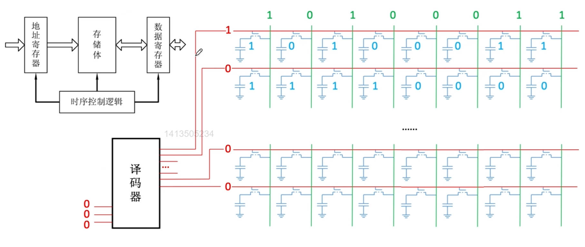
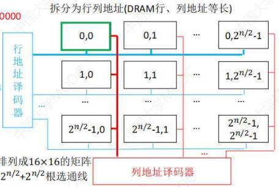

# 存储系统基本概念

## 存储器的层次结构

- CPU 
- 寄存器 

    比如ACC累加寄存器，MQ乘商寄存器等

- Cache 

    读作"cash"，高速缓冲存储器

    把主存中常用的数据Copy一份，缓解主存和CPU的速度矛盾

    可以直接被CPU读写

- 主存 

    就是内存

    可以直接被CPU读写

    借用辅存实现虚拟存储系统，解决主存容量不够的问题

- 磁盘 

    辅存，辅存中的数据要调入主存后才能被CPU访问

- 磁带/光盘

    称为外存

***

## 存储器的分类

### 根据存取方式：

- **随机存取存储器(RAM)**

    读写任何一个存储单元所需时间都相同，与存储单元所在的物理位置无关

    比如：内存条

- **顺序存取存储器(SAM)**

    读写一个存储单元所需时间取决于存储单元所在的物理位置

- **直接存取存储器(DAM)**

    既有随机存取特性，也有顺序存取特性

    先直接选取信息所在的区域，然后按顺序方式存取

    比如：机械硬盘

- 相联存储器

    可以按内容访问的存储器(CAM)

    可以指明想要查找的内容，之后存储器按照内容检索，进行读写

    比如：快表

### 信息的可更改性

- 读写存储器(Read/Write Memory)：

    既可读也可写

    如：磁盘，内存，cache

- 只读存储器(Read Only Memory, ROM)

    只能读不能写

    如：bios的信息

***

## 存储器的性能指标

- 存储容量：

    存储字数(MAR位数) X 存储字长(MDR位数)

- 单位成本：

    每个比特位需要的钱

    每位价格 = 总成本 / 总容量

- 存储速度

    主存带宽：表示每秒从主存进出信息的最大数量，也称数据传输率

    数据传输率 = 数据的宽度(即存储字长) / 存储周期

    存储周期(存取周期)Tm：又称为读写周期或访问周期，是指存储器进行一次完整的读写操作所需的全部时间。即连续两次独立地访问存储器操作之间所需的最小时间间隔。分为：

    - 存取时间Ta：指从启动一次存储器操作到完成该操作所经历的时间，分为读出时间和写入时间
    - 恢复时间

***
***

# 主存储器的基本组成

## 存储器芯片基本组成及原理

### 存储元：

MOS管：可以理解为一种电控开关，输入电压达到某个阈值时，MOS管就可以接通

一个MOS管中存储一个bit的信息，即0或1

根据电容中是否保存电荷来区分0和1

- 读取数据：

    给MOS管加高电平导通，如果电容里保存了电荷，就会往外输出电流，在最右边的导线检测到电流就说明是1。

    电容放电之后电荷就跑了，是破坏性读出，读出后应有重写操作，也称“再生”

- 写入数据：

    在最右边导线处加一个高电平，MOS管也加一个高电平使其导通，给电容充电。然后断开MOS管使得电容可以保存电荷。

### 存储单元：

存储字长是由底层硬件决定的，一行(或者说一个存储单元)放了8个存储元，那存储字长就是8bit

在同一行的存储元的MOS管连接了同一条线，给红线加一个高电平，再检测绿色的线就可以同时读出这一行存储元。

所以读入和写出以字长为单位

一整行称为一个存储单元，多行组成矩阵就称为存储矩阵或存储体(图示存储体包含了两个存储单元)

### 译码器

把想要读取的地址放入MAR中，译码器根据MAR的地址找到这个地址对应的一条输出线(图中红线，称为字选线)，然后给这条线加高电平

之后根据数据线(图中绿线，也称位线)，将每一位的信息传入MDR中。

译码器后面会加一个驱动器，保证其输出的电信号是稳定可靠的。

由于地址位数可能很多，给译码器连上那么多根选通线有难度，所以变成一个矩形，分为行地址译码器和列地址译码器，可以减少选通线的数量

地址会分为两部分，一半给行地址一半给列地址

### 控制电路

对内控制MAR，译码器和MDR

对外提供片选线(CS或CE信号)，当给片选线加一个低电平的时候，意味着此时让这块芯片工作

对外提供读控制线和写控制线

- 分为两条控制线

    当读控制线接收到低电平(WE信号)说明当前执行读操作；写控制线接收到低电平(OE信号)说明执行写操作

- 合为一条控制线

    WE信号，输入低电平为写，高电平为读

***

## 存储芯片概览

存储芯片对外暴露的金属引脚数目：

- 每根地址线对应一个金属引脚(地址有n位就需要有n条地址线)

- 每根数据线对应一个金属引脚(存储字长有n位就需要n条数据线)

- 片选线独对应一个金属引脚

- 读/写控制线对应一个或两个金属引脚

***

## 存储器总容量

n位地址(即MAR有n位) == 有2^n个存储单元

总容量 = 存储单元个数 × 存储字长

8 × 8位的存储芯片：

- 前面的8表示存储单元个数，有8k个，即2^13个 (K = 1024)

- 后面的8位表示存储字长

则总容量共2^13 × 8 bit

***

### 寻址

现代计算机通常按字节编址，即每个字节对应一个地址

同时支持按字节寻址、按字寻址、按半字寻址、按双子寻址

但是即使不按字节寻址，最后也需要将地址转换为字节才能找对应的位置

假如 1字长 = 4字节，那么按字寻址的地址转换位字节地址就是左移两位

***
***

# 特定类型的存储芯片

RAM(Random Access Memory)：动态随机存取存储器

## DRAM 和 SRAM

DRAM(Dynamic)：动态RAM，用于主存，使用栅极电容存储信息(上一讲介绍的)

SRAM(Static)：静态RAM，用于Cache，使用双稳态触发器存储信息

### 双稳态触发器：

双稳态指有两种稳定的状态：A高B低表示1，A低B高表示0

- 读取数据：

    如果左边BL输出低电平，就是0；如果右边BLX输出低电平，就是1

    读出数据触发器状态保持稳定，是非破坏性读出，无需重写，读写速度更快

- 写入数据：

    给BL加低电平，给BLX加高电平就是写入0；写入1同理

### 栅极电容 和 双稳态触发器 区别

- 破坏性：栅极电容是破坏性读取，需要重写；双稳态是非破坏性，无需重写。双稳态读写速度更快

- 栅极只需要一个MOS管，双稳态需要6个MOS管。所以栅极：

    - 每个存储元制造成本低
    - 集成度高
    - 功耗低
    - 发热量低
    - 存储成本低

- 刷新：栅极存储的电荷过一段时间会慢慢消失，电荷只能维持2ms，所以需要不断刷新；双稳态只要不断电，触发器的状态就不会改变

- 送行列地址：SRAM同时送，DRAM分两次送

    同时送的话会让地址线的数量 = 行数 + 列数 = 行数 * 2

    由于DRAM存储数据较多，所以采用地址线复用技术，先送行地址译码器，再送列地址译码器。采用地址线复用技术会将片选线分为行选通线和列选通线，来告诉译码器这次是行地址还是列地址。

二者都属于易失性存储器，断电后信息消失

### DRAM的刷新

- 刷新周期：一般为2ms

- 每次刷新多少存储单元：以行为单位，每次刷新一行**存储单元** (将存储单元排列为矩形，并分为行列译码器)

- 如何刷新：有硬件支持，读出一行的信息后重新写入，占用1个读/写周期

- 什么时候刷新：假设DRAM内部结构排列为128×128的形式，读/写周期(存取周期)0.5μs，那么2ms共4000个周期

    - 思路一 分散刷新：每次读写完都刷新一行

        使得系统的存取周期变为1μs，前0.5μs用于正常读写，后0.5μs用于刷新某行

    - 思路二 集中刷新：2ms内安排某个时间集中全部刷新

        系统的存取周期还是0.5μs，但是有一段时间专门用于刷新无法访问存储器，称为访存"死区"

    - 思路三 异步刷新：2ms内每行刷新1次即可

        每隔2ms/行数 的时间刷新一次

刷新由存储器独立完成，不需要CPU的控制

目前主存通常采用SDRAM芯片

***

## 只读存储器ROM

RAM芯片——易失性，断电后数据消失

ROM芯片——非易失性，断电后数据不会消失

### MROM(Mask)——掩模式只读存储器

厂家按照客户需求，在芯片生产过程中直接写入信息，之后任何人不可重写(只能读出)

可靠性高、灵活性差、生产周期长、只适合批量定制

### PROM(Programmable)——可编程只读存储器

用户可用专门的PROM写入器写入信息，写一次之后就不可更改

### EPROM(Erasable Programmable)——可擦除可编程只读存储器

允许用户写入信息，之后用某种方法擦除数据，可进行多次重写

- UVEPROM(ultraviolet rays)

    用紫外线照射8~20min，擦除所有信息

- EEPROM(E²PROM，第一个E是Electrically)

    可用“电擦除”的方式，擦除特定的字

### Flash Memory——闪速存储器

比如U盘，SD卡就是闪存

在EEPROM基础上发展而来，断电后也能保存信息，且可进行多次快速擦除重写

由于闪存需要先擦除再写入，因此闪存的写 速度要比 读 速度更慢

每个存储元只需单个MOS管，位密度比RAM高，即闪存芯片上的存储元数量更多

### SSD(Solid State Drives)——固态硬盘

由控制单元 + 存储单元(Flash芯片)构成，与闪速存储器的核心区别在于控制单元不一样，存储介质都类似

可进行多次快速擦除重写

### 计算机内的重要ROM

主板上的BIOS芯片就是ROM，存储了“自举装入 程序”，负责引导装入操作系统(开机)

逻辑上，主存由RAM + ROM组成，且二者常统一编址，即BIOS也属于主存。

***
***

# 存储芯片与CPU的连接

符号说明：

- 地址线(Address)用A表示，A0是低位，往上是高位

- 数据线(Data)用D表示，D0是低位，往上是高位

- 片选线用CS或CE表示。上面加横线说明低电平有效，否则是高电平有效

- 读/写数据线用WE或WR表示

    - WE(Write Enable)写使能信号:上面没有横线时，高电平表示往里写数据，低电平表示读数据。有横线时相反

***

## 增加主存的存储字长——位扩展

解决数据总线利用不充分问题

现在的CPU通常都是64位，即一次能读取64位数据，应该有64根数据总线。但是我们存储字长只有8位，数据总线的传输能力利用的很不充分。

通过这种方式连接多个存储芯片扩展主存的存储字长

## 增加主存的存储字数——字扩展

解决地址总线利用不充分问题

假如CPU MAR中有16根地址总线，但是存储单元只有13个，那么就多出来三根地址总线，CPU寻址能力就被浪费掉了

我们再添加一个存储芯片，将低13位的地址总线同时连接这两个芯片，但是此时给一个地址这两个芯片都会工作，导致冲突

### 线选法： 

将A13连接至第一个芯片的片选信号CS，A14连接至第二个芯片的片选信号。那么A13和A14只能是01或者10，才能避免冲突

电路简单但是地址空间不连续

### 线选法的优化：译码器片选法

让A13同时连接两个片选信号，但其中一条路加一个非门，这样两个芯片接收到的片选信号永远相反

这个小电路叫1-2译码器，因为输入了一个信号出来两种结果

同理我们充分利用剩下的三个地址线，就可以产生八种情况，称为3-8译码器

2-4译码器的片选法

### 字位同时扩展法

### 译码器的补充

译码器有使能端，作用类似于片选器，是用来控制译码器是否工作的。

图示译码器型号为74LS138

CPU刚开始发出的电信号是不稳定的，等到稳定了CPU才发出MREQ信号，使得译码器开始工作

***
***

# 主存优化技术

存取周期：可以连续读/写的最短时间间隔 

存取周期 = 存取时间 + 回复时间

DRAM芯片恢复时间比较长，有可能是存取时间的几倍

如何解决多核CPU同时访问的问题

如何解决恢复时间过长的问题

## 双端口RAM

优化多核CPU同时访问一根内存条的速度

两个端口对同一主存操作的情况：

- 两个端口同时对不同地址单元存取数据 √

- 两个端口同时对同一地址单元读出数据 √

- 两个端口同时对同一地址单元写入数据 ×

    会发生写入错误

- 两个端口同时对同一地址单元，一个写入一个读出 ×

    会发生读出错误

后两种情况要暂时关闭一个端口

## 多体并行存储器

就是多插几根内存条

### 高位交叉编址

用高位的几个bit来区分不同的存储体

比如M0的第一个空间编址为00 000，前两个00表示M0这个存储体，后面的是体内地址。以此类推，后面空间编址为00 001，00 002......

M1空间编址为 01 000，01 001......

所以这样编址是地址是竖着排序，如果CPU连续访问，访问完00 001之后访问00 002，还是在访问同一个存储体，需要等待其恢复

### 低位交叉编址

用低位的几个bit来区分不同的存储体

低位与高位不同，地址是横着排列，

M0的地址为：000 00(0)， 001 00(4)， 010 00(8)

M1的地址为：000 01(1)， 001 01(5)， 010 01(9)

CPU连续访问，访问完M0中的00 001后需要访问M1中的00 002时，就无需等待M0恢复

相当于采用“流水线”的方式并行存取(宏观上并行，微观上串行)

假设有n个存储体，连续读取x个存储字所需时间为 xr + (n-1)r，因为最后需要留出(n-1)r的时间让所有的存储体恢复

如果存取周期为T，存取时间为r，为了使流水线不间断，应保证模块数 m ≥ T / r 。当m=T/r时达到完美衔接

双通道内存实际上就是二体低位交叉存储器

### 单体多字存储器

低位交叉编址中，各个存储体是独立的，既能并行工作，也能交叉工作

单体多字存储器相当于把四个存储体拼在一起，只能一行一行读取

***
***

# 外存储器——磁盘存储器

外存储器又称为辅助存储器

目前主要使用磁表面存储器

## 磁表面存储器

通过电磁关系写入数据

只能串行1bit 1bit写入数据

**优点：**

1. 存储容量大，位价格低(每bit的价格)

2. 记录介质可以重复使用

3. 记录信息可以长期保存而不丢失，甚至可以脱机存档

4. 非破坏性独处，读出时不需要再生

**缺点：**

1. 存取速度慢

2. 机械结构复杂

3. 对工作环境要求较高(不能放在强磁场下)

***

## 磁盘设备的组成

### 存储区域

一块硬盘由若干个**记录面**叠放而成，每个记录面划分为若干条**磁道**(磁道是一圈一圈的)，每条磁道又划分为若干个**扇区**，扇区(也称块)是磁盘读写的最小单位。所以磁盘按块存取

- 磁头数：即记录面数，一个记录面对应一个磁头

- 柱面数：每一面盘片上有多少条磁道

- 扇区数：表示每一条磁道上有多少个扇区

### 硬盘存储器

由磁盘驱动器、磁盘控制器和盘片组成

- 磁盘驱动器：核心部件是磁头组件和盘片组件，能够移动磁头，并让盘面转起来

- 磁盘控制器：是硬盘存储器和主机的接口，主流的标准有IDE(ATA)、SATA

***

## 磁盘的性能指标

### 磁盘的容量：

一个磁盘所能存储的字节总数

- 非格式化容量：物理上可以存储的最大容量

- 格式化容量：实际可以使用的容量

### 记录密度： 

盘片单位面积上记录的二进制的信息量

- 道密度：磁道的密度，沿半径方向单位长度的磁道数

- 位密度：磁道单位长度上能记录的二进制代码位数

    磁盘所有磁道记录的信息量是相等的，也就是说越靠近内测位密度越大

- 面密度：位密度和道密度的乘积

### 平均存取时间：

- 寻道时间：磁头移动到目的磁道

- 旋转延迟时间：磁头定位到所在扇区，其实是让盘面旋转到磁头底下

    题目没给就用磁盘转半圈所用的时间

- 传输时间：传输数据所花费的时间，就是目标扇区从磁头下划过的时间，可以通过转速求得

- 磁盘控制器的延迟

### 数据传输率： 

磁盘存储器在单位时间内向主机传送数据的字节数

假设磁盘转速为r(转/秒)，每条磁道容量为N个字节，则数据传输率Dr=rN。因为每次旋转都能读取一整条磁道

***

## 磁盘的地址

磁盘地址由驱动器号、柱面(磁道)号、盘面号、扇区号组成

- 驱动器号：指明是哪块硬盘

- 柱面(磁道)号：指明要读取哪一个磁道，将磁头臂移至指定磁道(寻道)

- 盘面号：指明要读取哪个盘面，并激活对应盘面的磁头

- 扇区号：通过旋转盘面将特定扇区划过磁头下方

***

## 硬盘的工作过程

硬盘的主要操作是寻址、读盘、写盘，每个操作对应一个控制字。硬盘工作时，主机发送对应控制字，硬盘先取控制字，再执行控制字

硬盘属于机械式部件，读写操作是串行的，只能1bit 1bit读或写。而来自总线的数据是并行的（取决于机器字长），所以需要一个并-串变换电路

***

## 磁盘阵列RAID

将多个独立的物理磁盘组成一个独立的逻辑盘，数据在多个物理盘上分割交叉存储、并行访问，具有更好的存储性能、可靠性和安全性

**RAID分级：**

在RAID1~RAID5中，磁盘损坏并不会导致数据损坏或丢失

- RAID0：无冗余和无校验的磁盘阵列

    逻辑上相邻的两个扇区在物理上存到两个磁盘，类似于低位交叉编址的多体存储器

- RAID1：镜像磁盘阵列

    直接存两份数据

- RAID2：采用纠错的海明码的磁盘阵列

    逻辑上连续的bit物理上分散存储在不同盘中，并且4bit的信息+3bit海明校验码。可以纠正1位错误

- RAID3：位交叉奇偶校验的磁盘阵列

- RAID4：块交叉奇偶校验的磁盘阵列

- RAID5：无独立校验的奇偶校验磁盘阵列

提高数据吞吐量，提高安全可靠性，提供容错能力

***
***

# 外存储器——固态硬盘SSD

原理：基于闪存技术Flash Memory，属于电可擦除ROM(EEPROM)

## 组成：

**闪存翻译层：**

将逻辑块号映射到对应的物理地址

负责翻译逻辑块号，找到对应的页

**闪存芯片组**

由若干闪存芯片组成，闪存芯片又分为一个一个块，块再分为一个一个的页

固态硬盘的读写是以页为单位的，相当于磁盘的扇区

## 读写特性

**只能以块为单位进行擦除**

只能以块为单位擦除，每页只能写一次，也就是不能往已经写过东西的页里再写(哪怕页没写满)

如果想写，只能把整块擦除了重新写

如果想向A中一页写入内容，会把块A中的其它内容全部移至另一空块B中，并直接在B中写入新内容。相当于让B代替A，并且将A对应的地址也映射到B处。

导致读块、写慢

**支持随机访问**

系统给定一个逻辑地址，闪存翻译层可通过电路迅速定位到对应的物理地址

读速度块

## 与机械硬盘的比较

- 读写速度：SSD快，随机访问性能高

- SSD里面是电路，没有机械部件，所以安静无噪音、耐摔抗震、能耗低、造价更贵

- SSD的一个“块”被擦除次数过多可能会坏掉，而机械硬盘的扇区不会因为写的次数过多而坏掉

## 磨损均衡技术

将“擦除”平均分布在各个块上，以提升使用寿命

- 动态磨损均衡——写入数据时，优先选择累计擦除次数少的新山村块

- 静态磨损均衡——进行数据的分配、迁移，让老旧的闪存块承担以读为主的储存任务

***
***

# Cache

Cache被集成在CPU内部，用SRAM实现，速度快，集成度低(体积大)，成本高

## 基本概念和原理

### 局部性原理

- 空间局部性：

    在最近的未来要用到的信息(指令和数据)，很可能与现在正在使用的信息在存储空间上是邻近的

    比如：访问数组元素，顺序执行的指令代码

- 时间局部性：

    在最近的未来要用到的信息，很可能是现在正在使用的信息

    比如：循环结构中的指令代码和数据

基于局部性原理，可以把CPU目前访问的地址“周围”的部分数据放到Cache中

### 性能分析

如果CPU想要访问的信息能在Cache中找到，称为命中

- 命中率H：CPU欲访问的信息在Cache中的比率

- 缺失(未命中)率：M=1-H

假设CPU访问Cache耗时tc，访问内存耗时tm：

系统的平均访问时间t=

- 先在Cache中找，找不到再去内存中找：

    `H·tc + (1-H) (tc + tm)`

- 同时在Cache和内存中找，命中则立即停止访问主存：

    `H·tc + (1-H) tm`

### 如何界定“周围”

将主存的存储空间“分块”，如，每1kB为一块，主存和Cache之间以“块”为单位进行数据交换

块号就是给块编码，编码后主存地址可拆分为 主存块号 + 主存地址

每次被访问的主存块，一定会被立即复制进Cache中

操作系统中块的别名：

- 主存中：块 —— 页/页面/页框

- Cache中：块 —— 行

***

## Cache和主存的映射

给一个主存地址，我们怎么去Cache中寻找对应的地址

可以给每个Cache块增加一个**标记**，记录对应的主存块号。再增加一个有效位，有效位是1说明当前标记有效。

### 全相联映射(随意放)

主存中的块可以放在Cache中任意一个位置

CPU访问主存的过程：

CPU发过来一个主存地址

1. 主存地址的前22位对比Cache中所有块的标记

2. 若标记匹配且有效位=1，则Cache命中，通过地址后6位访问该块内地址中对应的位置

3. 若未命中或有效位=0，则正常访问主存

### 直接映射(只能放固定位置)

主存块在Cache中的位置 = 主存块号 % Cache总块数

    取余相当于保留末尾n位，其中2^n=Cache总块数

    比如：Cache有8位，那对Cache取余的结果就是主存块号的末尾3位

缺点：空间利用率不充分

优点：可以优化标记，由于主存块号末尾n位直接反映了在Cache中的位置，所以标记就可以不记录末尾3位

访存过程：

1. 根据主存块号的后n位确定Cache行(Cache块)

2. 若主存块号前面的位数与Cache标记匹配，且有效位=1，则Cache命中，根据地址后6位访问相应数据

### 组相联映射(可放在特定分组)

主存块所属分组 = 主存块号 % 分组数

主存块可以放在所属分组中的任意位置

比如：Cache分8块，2路组相联映射——2块为一组，分4组

同样，对分组数取余就是末尾2位，所以标记不用取最后2位

访存过程：

1. 根据主存块号的后n位确定所属的分组号

2. 若主存块号前面的位数与分组内的某个标记匹配且有效位为1，则Cache命中

***

## Cache的替换算法 

如果Cache装满了就需要覆盖掉一个内存块，那么替换掉哪个内存块呢

- 全相联映射：Cache完全满了才需要替换

- 直接映射：如果映射的位置已经有数据直接替换就好了，不需要考虑替换哪个

- 组相联映射：内存块所属的Cache分组装满后需要替换

### 随机算法(RAND,Random)

若Cache已满，则随机选择一块替换

### 先进先出算法(FIFO,First In First Out)

若Cache已满，则替换最先被调入Cache的块，也就是在Cache中待的最久的块

抖动现象：频繁的换入换出现象，刚被替换出去的块很快又被调入

最先被调入的块也可能是被频繁访问的

都没有考虑局部性原理，导致命中率降低

### 近期最少使用算法(LRU,Lest Recently Used)

为每一个Cache块设置一个“计数器”，用于记录每个Cache块已经多久每访问了。当Cache满后替换计数器最大的。

具体算法：

1. 给每个Cache行加一个计数器，初始置为0

2. 如果一次访问未命中且还有空闲行时，新装入的行的计数器置为0，其余非空闲行全+1

3. 命中时：所命中行的计数器归0，计数器的值比它低的要+1。

        其实计数器的值比它大的也可以+1，但是没有意义，因为本来就是最大的了。

4. 未命中且无空闲行，计数器值最大的行被替换，并将该行计数器清零，其余全部+1

Cache命中率高，实际运行效果优秀

如果频繁访问的主存块数量 > Cache行的数量，会发生抖动

### 最不经常使用算法(LFU,Least Frequently Used) 

为每一个Cache块设置一个计数器，用于记录每个Cache块被访问过几次。当Cache满后替换计数器最小的

若有多个计数器最小的行，可按行号递增、或FIFO策略进行选择

其实并没有很好地遵循局部性原理，因为这个算法参考了全局的访问频率

***

## Cache写策略

Cache只保存了内存数据的一个副本，当CPU重写数据时优先在Cache中写，那怎么保证Cache中的副本数据和内存中的母本数据的一致性

### 写命中

CPU要向目标地址中写入数据，且目标地址已经在Cache中

- 写回法：当CPU对Cache写命中时，只修改Cache的内容，而不立即写入主存，只有当此块被换出时才写回内存

    需要增加一个脏位来表示是否被修改过，1表示被修改过。没被修改的Cache块被替换时就不用写回

    减少访存次数，但是有数据不一致的隐患

- 全写法(写直通法)：当CPU对Cache写命中时，必须同时把数据同时写入Cache和主存，一般使用写缓冲

        写缓冲：当CPU写命中时，
        会往Cache中写入数据，
        同时往写缓冲中写入数据。
        之后空余时间在专门的控制电路控制下逐一写回

### 写不命中

- 写分配法：先把主存中的块调入Cache，再在Cache中修改。通常搭配写回法使用

- 非写分配法：直接写入主存，不调入Cache

### 多级Cache

通常有多级Cache，越靠近CPU的速度越快，容量越小

- Cache之间用全写法+非写分配法

- Cache与主存之间用写回法+写分配法

***
***

# 虚拟存储

CPU机器指令中携带的地址都是逻辑地址(虚地址)，我们需要转化为主存中的物理地址才可以取到想要的数据

## 页式存储

将程序分为与 主存的块 同样大小的部分，称为页

一个程序(进程)再逻辑上被分为若干大小相等的“页面”，与“块”的大小相同，以便可以离散地放入不同的主存块中

页 是逻辑层面的划分；块 是物理层面的划分

### 虚地址 vs 实地址

逻辑地址(虚地址)：程序员视角看到的地址

物理地址(实地址)：实际在主存中的地址

通过 **页表** 将 逻辑页号 和 主存块号 的一一对应

CPU执行的机器指令中，使用的是 逻辑地址 ，因此需要通过 页表 将逻辑地址转为物理地址，才能在主存中找到想要的数据

### 地址变换过程

逻辑地址 = 页号 + 页内地址 (取决于每个页面是多大,也就是每块有多大)

1. 将逻辑地址拆分为 逻辑页号 + 页内地址

2. 访问主存中的页表基址寄存器，找到页表的起始地址，这样就可以根据起始地址找到所有页表项

    根据局部性原理，我们可以将近期访问的页表项放入一个更快的存储器中

3. 查询页表，找到得到指定页表项，找到逻辑页面对应的主存块号

4. 将查出的主存块号和刚开始的业内地址拼接，得到最终的物理地址

### 地址变换过程(增加TLB快表)

引入快表之后，原来的页表称为慢表

1. 将逻辑地址拆分为 逻辑页号 + 页内地址

2. 在快表中尝试寻找 逻辑页号对应的页项，找到的话直接去主存中获取数据

3. 未命中的话去慢表中查找，并访问对应主存块。将此次寻找的页表项存入快表中

快表中存储的是页表项的副本，Cache中存储的主存块的副本

快表是一种“相联存储器”，可以按内容寻访，也就是可以直接按照逻辑页号查找

***

## 虚拟存储系统

运行时只需要将应用的一部分数据调入内存中就可以正常运行

### 页式虚拟存储器

将辅存中的程序代码分页，用到哪页把哪页调入主存中

给外存也分块，分成大小与主存和Cache的块相同的块

各位的功能都和之前的类似

- 有效位：此页内容是否已经调入主存

- 访问位：当前页访问的次数，用于替换算法

- 脏位：当前页面数据是否有写入

### 段式虚拟存储器

按照功能模块拆分，每段大小可能不一样

虚拟地址分为 段号 + 段内地址