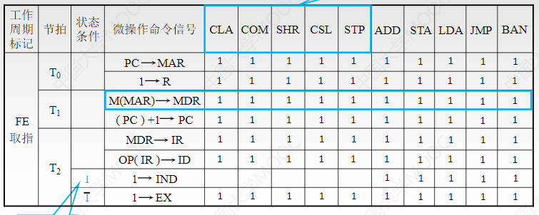
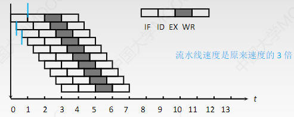

# CPU的功能与结构

CPU的基本功能

1. 指令控制
    
    完成取指令、分析指令和执行指令的操作，即程序的顺序控制

2. 操作控制
 
    CPU管理并产生由内存取出的指令的操作信号，把各种操作信号送往相应的部件，从而控制这些部件按指令的要求进行动作

3. 时间控制

    让各个操作按时间先后顺序执行。为每条指令按时间顺序提供应有的控制信号

4. 数据加工

    对数据进行算术和逻辑运算

5. 中断处理

    对计算机运行过程中出现的异常情况和特殊请求进行处理

基本结构

- 运算器

    对数据进行加工

- 控制器

    协调并控制计算机各部件执行程序的指令序列

    基本功能包括：

    - 取指令，自动形成指令地址(PC+1)，自动发出取指令的命令

    - 分析指令：操作码译码(分析本条指令要完成什么操作)；通过地址码找到操作数的有效地址

    - 执行指令：根据分析形成操作信号控制序列，控制相应设备完成操作

    - 中断处理：管理总线及输入输出，处理异常情况和特殊请求

## 运算器的基本结构

运算器负责对数据进行加工运算

- 算术逻辑单元(ALU)

    主要功能是进行算术/逻辑运算

- 通用寄存器组

    用于存放操作数和各种地址信息等

    如AX、BX、CX、DX、SP(堆栈指针)

专用数据通路方式：为每个寄存器和ALU之间传送数据专门建立数据线路。会导致线路很多成本增加；并且所有寄存器都在传输数据，但ALU只需要其中一个，需要分辨(可以使用多路选择器或三态门)。

CPU内部单总线方式：将所有寄存器的输入端和输出端都连接到一条公共的道路上。数据的传输会出现冲突，性能降低

- 暂存寄存器

    用于暂存从主存读来的数据

如果两个操作数分别来自主存和R0，最后结果存回R0，那主存来的操作数直接放入暂存器就不会破坏运算前R0的内容

ALU要等来自A、B的电信号稳定之后才能输出稳定的结果，那么在等待信号稳定的过程中输出的东西如果跑出去就会占据总线。所以输出端设置暂存寄存器来等待电信号稳定

- 累加寄存器ACC

    是一个通用寄存器，用于暂时存放ALU运算的结果信息

- 程序状态字寄存器PSW(标志寄存器)

    保留运算结果的状态信息，比如溢出标志OP、符号表示SF等

- 移位器

    对运算结果进行移位运算。比如乘法操作时就需要移位

- 计数器

    控制乘除运算的操作步骤

## 控制器的基本结构

1. 程序计数器PC

    指明下一条指令在主存中存放的地址。PC有自增功能

2. 指令寄存器IR(Instruction Register)

    用于保存当前正在执行的那条指令

3. 指令译码器ID(Instruction Decoder)

    仅对操作码字段进行译码，告诉控制器当前要执行什么操作

4. 微操作信号发生器

    输入信号有：指令译码器译出的操作码、来自PSW的标志信息、时序系统发出的时序信号

    根据要执行的操作产生控制整个计算机系统所需的各种控制信号

控制单元CU = IR + ID + 操作控制器OC

5. 时序系统

    用于产生各种时序信号，都是由统一时钟CLOCK分频得到

6. 存储器地址寄存器 MAR

    用于存放要访问的主存单元的地址

7. 存储器数据寄存器 MDR

    用于存放向主存写入的信息或从主存读出的信息

橙色框中的是对用户可见的寄存器，也就是说程序员可以通过汇编语言修改寄存器中的值

- 通用寄存器组

- 程序状态字寄存器PSW

- 程序计数器PC

    无条件转移指令就可以控制

***

# 指令执行过程

## 指令周期

CPU从主存中取出并执行一条指令所需的全部时间

- 取指周期

    - 取指令 并 PC+1  (需要访存，需要时间很长)

    - 对指令译码

- 执行周期

    - 执行指令

指令周期常常用若干机器周期（CPU周期）来表示(比如取指周期占一个机器周期，执行周期占一个机器周期)

机器周期一般以读取一条指令字的最短时间来定义

一个机器周期又包含若干时钟周期（也称节拍、T周期或CPU时钟周期），是CPU操作的最基本单位

- 定长的机器周期：每个机器周期的长度都是相同的，包含相同的时钟周期

- 不定长的机器周期

每个指令周期内机器周期数可以不等，每个机器周期内节拍数也可以不等

- 空指令NOP：指令周期只包含取指周期，即只包含一个机器周期

- 加法指令ADD：指令周期包括取指周期和执行周期，包含两个机器周期

- 乘法指令NUL：执行周期更长

- 具有间接寻址的指令：包括取指周期、间址周期和执行周期

- 带有中断周期的指令：最后再加一个中断周期

设置四个触发器来判断当前处于 取指周期(取指令)、间址周期(取有效地址)、执行周期(取操作数)、中断周期(保存程序断点) 的哪个阶段

标志触发器:

- FE：取值周期

- IND：间址周期

- EX：执行周期

- INT：中断周期

***

## 指令周期的数据流(向)

### 取指周期

1. 当前指令地址送至存储器地址寄存器

    `(PC) --> MAR`

    将PC中保存的地址信息取出并送至MAR

2. CU发出控制信号，经控制总线传到主存，这里是读信号(主存储器留下了读和写两个接口)

    `1 --> R`

    给存储器的控制接口R输出高电平1，表示这是读操作

3. 将MAR所指主存中的内容经数据总线送入MDR

    `M(MAR) --> MDR`

    M()表示取出括号中的寄存器所包含的地址指向的数据，()表示取出括号中的寄存器里包含的内容

    将MAR中地址所指向的数据放入MDR中

4. 将MDR中的内容送入IR

    `(MDR) --> IR`

    取指令过程中MDR包含的内容应该是一条指令

5. CU发出控制信号，形成下一条指令地址

    `(PC) + 1 --> PC`

    每次取出一条指令后，PC的值自动+1

### 间址周期

有的指令采用间接寻址，地址码部分保存的是操作数的有效地址的存放位置（操作数地址的地址）

所以我们需要先通过间址周期找到操作数的有效地址

1. 将指令的地址码送入MAR

    `Ad(IR) --> MAR` 或 `Ad(MDR) --> MAR`

    Ad()表示取出当前指令中的地址码信息

    表示把IR当前指令中的地址信息送入MAR中。由于取指时是将MDR中的信息复制一份给IR，所以MDR中存储的也是指令信息

2. CU发出控制信号，启动主存做读操作

    `1 --> R`

3. 将MAR所指主存中的内容经数据总线送入MDR

    `M(MAR) --> MDR`

    此时MDR中存储的就是操作数的有效地址

4. 将有效地址送至指令的地址码字段

    `(MDR) --> Ad(IR)`

    就是将取到的操作数的有效地址拼接到IR中，覆盖掉之前的间接地址

    也可以直接放入MAR中，直接取操作数

### 执行周期

执行周期的任务是根据IR中的指令字的操作码和操作数通过ALU操作产生执行结果

由于不同的执行周期操作不同，所以没有统一的数据流向

### 中断周期

中断：暂停当前任务去完成其它任务

为了能够恢复当前任务，需要保存断点(其实就是保存PC的值，即下一条要执行的指令)

一般只用堆栈来保存断点，用SP栈顶指针指向栈顶地址。假设SP指向栈顶元素而不是栈顶元素上的空位置，并且栈顶在低地址部分

1. CU控制将SP减1，修改后的地址送入MAR中

    `(SP-1) --> SP , (SP) --> MAR`

    移动SP让SP指向栈顶元素上面的空位置，也就是将要入栈的元素要存放的位置。并把这个地址给MAR，告诉主存下一步要往这里存数据

2. CU发出控制信号，启动主存做写操作

    `1 --> W`

3. 将断点(PC内容)送入MDR

    `(PC) --> MDR`

    把将要写入主存的数据复制到MDR中

    然后把MDR中的数据放到MAR中指明的地址就好了

4. CU控制将中断服务程序的入口地址送入PC

    就是把我中断了当前的任务，然后下面要执行的任务的指令放入PC

    入口地址由向量地址形成部件产生，也叫向量地址

    `向量地址 --> PC`

***

## 指令执行方案

### 单指令周期

定长的机器周期

对所有指令都选用相同时间的执行周期来完成，以可能出现的最大节拍数为准(通常以访存所需节拍数作为参考)

如果实际所需节拍数较少，可将微操作安排在末尾几个节拍

指令之间串行执行

**优点：** 指令执行的控制电路好设计，因为所有指令的节拍数是一样的，我们只需要数节拍数就知道指令什么时候结束

**缺点：** 本来需要时间很短的指令也要延长到和最慢的那条指令相同。降低整个系统的运行速度

### 多指令周期

对不同类型的指令选用不同的执行周期来完成

指令之间串行执行

### 流水线方案

在每一个时钟周期启动一条指令，尽量让多条指令同时运行，但每条指令各自处在不同的执行步骤中

因为指令在不同阶段用到的硬件部件是不一样的

指令之间并行执行

***
***

# 数据通路

数据通路就是数据在功能部件之间传送的路径

信息从哪里开始，中间经过哪些部件，最后传到哪里

数据通路基本结构：

- CPU内部单总线方式

- CPU内部多总线方式

- 专用数据通路方式

数据流动的分类：

- 寄存器之间数据传送

- 主存与寄存去之间的数据传送

- 寄存器与ALU算术逻辑单元之间的流动

总线：

- 内部总线：是指同一部件之间的总线

    比如CPU内部链接各寄存器及运算部件之间的总线

- 外部总线：是指同一台计算机系统的各部件互相连接的总线

    比如CPU、内存、各类I/O接口间互相连接的总线

## CPU内部单总线方式

CPU内部只有一个公共通路，也就是说同一时刻只能传输一条信息。

这条内部总线称为Bus，所有数据都能坐

所有信号如IRin，PCin，PCout等都是CU发出的

### 寄存器之间数据传送

比如把PC内容送至MAR

1. 将PCout导通，把PC的内容送到总线上

    `(PC) --> Bus`

    PCout有效 (需要指明当前操作哪个信号有效)

2. 将MARin导通，把总线内容送到MAR中

    `Bus --> MAR`

    MARin有效

### 主存与寄存器之间的数据传送

比如CPU从主存中读取指令

1. 将PC中保存的指令地址放入MAR中

    `(PC) --> Bus --> MAR`

    PCout 和 MARin 有效
    
2. CU发出读命令(通过控制总线发出，图中未画出)

    `1 --> R`

3. 主存根据MAR中的地址找到对应的数据，并放入MDR中

    `MEM(MAR) --> MDR`

    MDRin有效 (MDRin是控制内部总线流入，而不是外部总线流入，描述有问题，外部的可以写为MDRinE)

4. 将MDR中的指令放入IR中进行指令分析

    `MDR --> Bus --> IR`

    MDRout 和 IRin有效

### 执行算术或逻辑运算

比如一条加法指令，其中一个操作数已经存放至ACC累加寄存器中，另一个操作数由指令指明存放位置

1. 把指令中的地址码放入MAR中

    `Ad(MDR) --> Bus --> MAR` 或者`Ad(IR) --> Bus --> MAR`

    MDRout 和 MARin 有效

2. CU发出读命令

    `1 --> R`

3. 通过MAR中的地址找到相应的数据并放入MDR中

    `MEM(MAR) --> 数据线 --> MDR`

    MDRin有效

4. 将取得的操作数放到暂存寄存器Y中

    `MDR --> Bus --> Y`

    MDRout 和 Yin 有效

5. 将ACC中存的加数放入ALU中，之后CU发出控制信号让ALU做加法运算，结果先存入暂存寄存器Z中

    Y和ALU有专用通路，数据传输不占用内部总线，所以可以Y和ACC中内容同时输入ALU中

    `(ACC) + (Y) = Z`

    ACCout 和 ALUin有效

6. 等电信号稳定后，将Z中的结果写回ACC中

    `Z --> ACC`

    Zout 和 ACCin有效

***

## 专用数据通路

如果想要取出一条指令

1. 让PC的值先传入MAR中

    `(PC) --> MAR` 

    C0有效

2. MAR中的指令地址通过外部的地址总线传送给主存

    `(MAR) --> 主存`

    C1有效

3. 控制单元向主存发送读命令

    `1 --> R`

4. 主存通过外部地址总线将数据传输给MDR

    `M(MAR) --> MDR`

    C2有效

5. 将MDR中的指令送入IR中进行指令分析

    `(MDR) --> IR`

    C3有效

6. PC+1

    `(PC) + 1 --> PC`

7. 将指令的操作码部分送给CU，进行指令译码

    `Op(IR) --> CU`

    C4有效

多路选择器：可能有的硬件上接通了多个信号通路，可以用多路选择器选择让哪个信号通过。

三态门：功能和多路选择器一样，通过微操作信号发生器发出的信号决定让哪个信号通过

***
***

# 控制器的设计

控制器的核心是控制单元CU，设计CU就是设计什么时候发出什么微命令

根据 **指令操作码**、**目前的机器周期**、**节拍信号**、**机器状态条件**(PSW中记录的)，即可确定现在这个节拍下应该发出哪些微命令

# 硬布线控制器

采用定长机器周期

**需要向CU输入的信息：**

- 指令操作码

    操作码译码器解析完IR的命令之后输入给CU

- 目前的机器周期

    FE、IND、EX、INT四个触发器集成在CU内部，根据哪个触发器的值为1判断处于哪个机器周期

- 当前处于周期内的第一个节拍

    通过节拍发生器输入给CU，由于是定长机器周期，所有指令的节拍数相同的

- 机器的状态条件

    标志来自执行单元的反馈信息，比如来自PSW、ACC的符号位，或者来自I/O设备、主存

**CU输出的信息：**

- 每个输出的控制信号对应一个微命令

    比如要让C1对应微操作(PC)-->MAR,只需将其接到PCout、MARin即可

**硬布线控制器的设计步骤：**

1. 分析每个阶段的微操作序列

    确定对应的微操作在什么阶段，在什么条件下会执行，以此判断什么时候发出对应的信号

2. 选择CPU的控制方式

    采用定长机器周期还是不定长，每个机器周期安排几个节拍？

    假设采用定长，一个机器周期三个节拍

3. 安排微操作时序

    安排好如何用三个节拍完成机器周期内应该完成的微操作

4. 电路设计

    确定每个微命令的逻辑表达式，并用电路实现

### (PC)-->MAR的微操作控制信号举例：

假设C1信号表示执行(PC)-->MAR操作

什么时候输出C1：所有指令的取指周期的第一件事都是(PC)-->MAR，所以

`C1=FE·T0` 即FE和T0都是1时(取值周期的第一个时钟周期)发出C1信号

那就将FE和T0放到与门的两个输入信号，输出信号连在C1处即可

### M(MAR) --> MDR 微操作命令举例

什么时候要发出M(MAR) --> MDR这个微操作信号

逻辑表达式为

`FE·T1 + IND·T1(ADD+STA+LDA+JMP+BAN)+EX·T1(ADD+LDA)`

- `FE·T1`

    在取指周期的第二个时钟周期内

- `IND·T1(ADD+STA+LDA+JMP+BAN)`

- `EX·T1(ADD+LDA)`

    在执行周期的T1节拍内，并且这个执行周期执行的指令是ADD(加法指令)或LDA(取数指令)

***

## 分析每个阶段的微操作序列

### 取指周期

1. PC --> MAR

2. 1 --> R

3. M(MAR) --> MDR

4. MDR --> IR

5. OP(IR) --> ID

6. (PC)+1 --> PC

### 间址周期

1. Ad(IR) --> MAR

2. 1 --> R

3. M(MAR) --> MDR

4. MDR --> Ad(IR)

### 执行周期

执行周期执行的指令各不相同，下面是一个例子

1. CLA —— `0 --> AC`

    clear ACC指令，将ACC清零

2. LDA X —— `Ad(IR) --> MAR` `1 --> R` `M(MAR) --> MDR` `MDR --> AC`

    load ACC指令 将数据加载到ACC中，也就是取数指令，把X指令地址码部分所指内容取到ACC中

3. JMP X —— `Ad(IR) --> PC`

    无条件转移指令  将该指令的地址码部分放入PC中

4. BAN X —— `A0·Ad(IR) + (非)A0·(PC) --> PC`

    Branch ACC Negative指令，条件转移，当ACC为负时转移

    A0指ACC里面的符号位，ACC为负是1

    A0=1时ACC为负，要转移执行左边，将IR的地址码放入PC中；A0=0时ACC为正，不需要转移执行右边，将PC的原值给PC，也就是不变

***

## 安排微操作时序

任务：将各个阶段列出来的微操作序列安排在三个时钟周期内完成

原则：

- 微操作的先后顺序不得随意更改

- 被控对象不同的微操作尽量安排在一个节拍内完成

    比如(PC) --> MAR 的被控对象是寄存器，1 --> R的被控对象是主存，这两个微操作被控对象就不同，应该尽量安排在一个节拍内

- 占用时间较短的微操作，尽量安排在一个节拍内完成，并允许有先后顺序 

    寄存器内的数据流动很快，可以在一个节拍内完成连续流动。
    
    而从主存取数据用时长，必须一个时钟周期才能保证微操作的完成

### 取指周期

1. PC --> MAR

2. 1 --> R —— 存储器空闲即可

3. M(MAR) --> MDR  —— 在1之后

4. MDR --> IR —— 在3之后

5. OP(IR) --> ID —— 在4之后

6. (PC)+1 --> PC —— 在1之后

T0：

- PC --> MAR

- 1 --> R

这两步被控对象不同，可以同时完成

T1:

- M(MAR) --> MDR

- (PC)+1 --> PC

T2:

- MDR --> IR

- OP(IR) --> ID

因为数据在寄存器内流动很快，所以这两步虽然有先后顺序，但是可以在一个节拍内完成。数据连贯的从MDR经IR流入ID

### 间址周期

T0：

- Ad(IR) --> MAR

- 1 --> R

T1:

- M(MAR) --> MDR

需要访问内存，要用一个节拍来完成这个微操作

T2:

- MDR --> Ad(IR)

### 执行周期

**非访存指令：**

CLA：clear指令

- T0：

- T1：

- T2：0 --> AC

    要做的微操作很少，安排在微操作的末尾节拍进行

COM：complement 取反

- T0

- T1

- T2：(非)AC --> AC

SHR：shift 算术右移

- T0

- T1

- T2：

    - L(AC) --> R(AC)

    - AC0 --> AC0

CSL:cyclic shift 循环左移

- T0

- T1

- T2：

    - R(AC) --> L(AC)

    - AC0 --> ACn

STP: stop 停机

- T0

- T1

- T2: 0 --> T

**访存指令：**

ADD X: 加法指令，一个操作数隐含在ACC中

- T0：

    - Ad(IR) --> MAR
    - 1 --> R

- T1:

    - M(MAR) --> MDR

- T2:

    - (AC) + (MDR) --> AC

STA X：存数指令，要存的数在ACC中

- T0：

    - Ad(IR) --> MAR
    - 1 --> W

- T1: AC --> MDR

- T2: MDR --> M(MAR)

LAD X：取数指令，放入ACC中

- T0: 

    - Ad(IR) --> MAR
    - 1 --> R

- T1:

    - M(MAR) --> MDR

- T2:

    - MDR --> ACC

**转移指令：**

JUMP：无条件转移

- T0

- T1

- T2：Ad(IR) --> PC

BAN X：条件转移，当A0为1时转移

- T0

- T1

- T2 A0·Ad(IR) + (非)A0·(PC) --> PC

***

## 电路设计

1. 列出操作时间表

    列出在取指、间址、执行、中断周期的T0、T1、T2节拍内有可能用到的所有微操作

2. 写出微操作命令的最简表达式

3. 画出逻辑图

### 列出操作时间表

I是间址特征，如果有I信号，就将1放入IDX触发器中，表示接下来进入间址阶段；否则就把1放入EX，表示接下来进行执行阶段

前五个是不用访存的指令，肯定不用进入间址阶段

最后一个IND上面一条线，是间址周期标志。因为可能要进行多级间址，当那个标志为0时，表示结束了最后一级间址，可以进入执行阶段；如果标志为1，表示要进行下一级间址

### 写出微操作命令的最简表达式

比如要写出 M(MAR) --> MDR 微操作命令的逻辑表达式，就在上面的表中找到所有可能用到这个命令的情况(用蓝框标出)

1. FE取指阶段T1节拍的所有情况会用到

    `FE·T1`

2. IND间址阶段T1节拍内后五个指令会用到

    `IND·T1(ADD + STA + LDA + JMP + BAN)`

3. EX执行阶段T1节拍内ADD和LDA两个指令会用到

    `EX·T1(ADD + LDA)`

将所有情况加起来就是最终的逻辑表达式

`FE·T1 + IND·T1(ADD + STA + LDA + JMP + BAN) + EX·T1(ADD + LDA)`

=

`T1{FE + IND(ADD + STA + LDA + JMP + BAN) + EX(ADD + LDA}`

### 画出逻辑图

## 硬布线控制器的特点

指令越多，设计和实现就越复杂，因此一般用于RISC(精简指令集系统)

如果扩充一条新的指令，则控制器的设计就需要大改，因此扩充指令较困难

由于使用纯硬件实现控制，因此执行速度很快，微操作控制信号由组合逻辑电路即时产生

***

# 微程序控制器

## 什么是微程序

程序是由指令序列组成的

微程序是由微指令序列组成的，每一种指令对应一个微程序

也就是通过一个微程序来完成一种指令。指令是对微指令功能的封装

指令是对程序执行步骤的描述，微指令是对指令执行步骤的描述

**微命令、微操作和微指令：**

微命令和微操作一一对应，一个微命令对应一个微操作，而一个微指令可能对应多个微操作

微指令的基本格式：操作控制 + 顺序控制

- 操作控制：指明这条微指令包含了哪些微操作

- 顺序控制：指明下一条微指令的地址

## 微程序控制器(CU)的基本结构

微程序控制器CU就是一个小CPU，CPU有的基本都有

- 控制存储器CM

    用于存放各指令对应的微程序，微程序里面包含的微指令按顺序存储

    使用只读存储器ROM构成的，在CPU出厂之前已经写好

- CMAR，别名μPC

    微地址寄存器，相当于MAR+PC结合体

    接收微地址形成部件送来的微地址，为在CM中读取微指令作准备

- 地址译码

    将CMAR中的地址码转化为存储单元控制信号

- CMDR，别名μIR

    相当于MDR

    用于存放从CM中取出的微指令

- 微地址形成部件

    产生初始的微地址和后继微地址

    根据要执行指令的操作码来找到这条指令对应的微程序的起始地址在哪儿

- 顺序逻辑

    控制微指令的执行顺序。因为执行中可能有中断等因素影响微指令的执行顺序

## 微程序控制器工作流程

1. 根据IR中指令的操作码部分，通过微地址形成部件确定对应的微程序在CM中的首地址

2. 根据顺序逻辑，决定接下来要执行的微指令的存放地址

3. 把微指令地址放入CMAR中

4. 根据地址译码器的译码后，选中CMAR所指向的微指令

5. 取出这条微指令，放入CMDR中。将微指令的下地址部分送给顺序逻辑

6. 硬件电路根据微指令的控制码部分向各部件发出控制信号

1. 进入取指周期，完成取指周期中的3条微指令

2. 根据指令地址码的寻址特征位I，判断是否要跳过间址周期

3. 间址周期微程序执行完后转执行周期

4. 执行周期最后一条微指令的下地址指向0，表示执行周期后应该进入下一条指令的取指周期

5. 执行下一条指令之前要根据中断信号判断是否进入中断周期

由于所有指令的取指周期要做的事都是相同的，所以取指周期的微程序是公用的，间址和中断也是公用的

一些早期的CPU可以不提供间接寻址和中断功能，因此可能不包含间址周期、中断周期的微程序段

一条指令对应一个微程序的说法是正确的，图上画的取指周期微程序之类的严格来说是微程序段

## 微指令的设计

如何根据微指令发出相应的微命令(控制信号)

### 微指令的格式：

相容性微命令：可以并行完成的微命令

互斥性微命令：不允许并行完成的微命令

1. 水平型微指令

    一条微指令能定义多个可并行的微命令

    即执行一条水平型微指令能完成多个微操作。那每条微指令就长，需要的微指令数就少，整个微程序看起来胖胖的

    基本格式：操作控制 顺序控制

3. 垂直型微指令

    一条微指令之能定义一个微命令，由微操作码字段规定具体功能基本格式

    只能执行一个微操作，微指令就短，一个微程序需要的微指令数就多，看起来瘦瘦的

    基本格式：微操作码μOP 目的地址Rd 源地址Rs

4. 混合型微指令

在垂直型的基础上增加一些不太复杂的并行操作

### 水平型微指令的编码方式

微指令的编码方式又称微指令控制方式，是指如何对微指令的控制字段进行编码，以形成控制信号。

编码的目标是在保证速度的情况下，尽可能缩短微指令字长

- 直接编码(直接控制)方式

    每一位代表一个微操作命令，某位为1表示该控制信号有效。比如最左边一位代表(PC)-->MAR，最右边一位代表1-->R

    那就可以将最左边一位连接到PCout和MARin接口，把最右边一位连接到系统的控制总线，通过控制总线发出读信号

    **优点：** 简单直观，执行速度快，操作并行性好

    **缺点：** 微指令字长会很长

- 字段直接编码

    将微指令的控制字段分成若干段，每段经译码后发出控制信号

    分段原则：

    - 互斥性微命令分在同一段内，相容性微命令分在不同段

    - 每个小段中包含的位数不能太多，否则增加译码线路的复杂性和译码时间

    - 每个小段要留出一个状态用来表示本字段不发出任何微命令

    **优点：** 可以缩短微指令字长

    **缺点：** 要通过译码电路再发出微命令，速度比较慢

- 字段间接编码方式

    字段对应的微命令需要经过多次译码来解释

    又称隐式编码

### 微指令的地址形成方式

- **断定方式：** 由微指令的下地址字段直接指出后继指令的地址

- 根据机器指令的操作码形成

    由操作码经微地址形成部件形成

- **增量计数器法**

    (CMAR) + 1 --> CMAR

- 分支转移

    微指令分为：操作控制字段 转移方式 转移地址

    当满足转移方式中指明的判别条件后转移至转移地址给出的地址

    相当于JMP跳转指令

- 通过测试网络

    测试网络指内部处理的电路

- 由硬件产生微程序入口地址

    比如可以用专门的硬件记录取指周期微程序首地址

## 微程序控制单元的设计

设计步骤：

1. 分析每个阶段的微操作序列

2. 写出对应机器指令的微操作命令及节拍安排

3. 确定微指令格式

4. 编写微指令码点

以取指周期为例

### 第1、2步

T0：微指令a

- PC --> MAR

- 1 --> R

T1：

- Ad(CMDR) --> CMAR

    指令a执行完后要将指令a的下地址放入CMAR中，表示下一条指令b 的地址

T2：微指令b

- M(MAR) --> MDR

- (PC)+1 --> PC

T3：补充微程序控制器特有的微操作

- Ad(CMDR) -- CMAR

    把b的下地址放入CMAR指明c的地址

T4：微指令c

- MDR --> IR

- OP(IR) --> 微地址形成部件

T5：

- 微地址形成部件 --> CMAR

    根据取到的指令找到微程序的首地址，转移至下一条周期(为简化问题一般跳过间址周期)

### 第3步，确定微指令格式

确定微指令字长，即确定操作码和下地址的位数

- 操作码位数

    根据微操作个数决定采用何种编码方式，以确定微指令的操作控制字段的位数

- 确定下地址位数

    根据CM中存储的微指令总数，确定微指令的顺序控制字段的位数

### 编写微指令码点

根据操作控制字段每一位代表的微操作命令，编写每一条微指令的码点。

就是决定某一位为1时发出哪个控制信号

### 微程序设计分类

- 静态微程序设计：微程序无需改变，采用ROM

- 动态微程序设计：通过改变微指令和微程序改变机器指令

    有利于仿真，采用EPROM

- 毫微程序设计

    微指令程序是用来解释指令的

    毫微程序是用来解释微指令的

***
***

# 指令流水线

一条指令的执行过程可以分成多个阶段，每个阶段用到的硬件是不一样的

## 指令执行的方式

假设指令的每个阶段执行时间是t，每条指令有取指、间址、执行三个阶段，则每条指令执行时间是3t，共执行n条指令

- 顺序执行方式：
 
    一条指令执行完第二条指令才能执行，传统冯·诺依曼机采用的方式，又称串行执行方式

    总耗时 `T=3nt`

    优点：控制简单，硬件代价小

    缺点：执行执行速度慢，各功能部件利用率低

- 一次重叠执行方式

    

    上一条指令的执行阶段与下一指令的取指阶段同时进行，只重叠这一个阶段，所以叫一次重叠

    总耗时：`T = 3t + (n-1)*2t = (1+2n)t`

    优点：程序执行时间缩短，各部件利用率提高

    缺点：需要付出硬件上较大开销，控制过程变复杂

- 两次重叠执行方式

    前后两条指令有两个阶段重叠

    总耗时：`T = 3t + (n-1)*t = (2+n)t`

后两种执行方式就是流水线执行方式

## 流水线的表示方法

1. 指令执行过程图

    

    主要用于分析指令执行过程以及影响流水线的因素

2. 时空图

    

    主要用于分析流水线的性能

## 流水线的性能指标

1. 吞吐率

2. 加速比

3. 效率

### 吞吐率(TP)

是指在单位之间内流水线所完成的任务数量，或者输出结果的数量

设任务数为n，处理完成n个任务所用时间为Tk

则 `TP = n / Tk`

假设一条指令的执行分为k个阶段，每个阶段耗时Δt，一般取Δt为一个时钟周期

Tk = kΔt + (n-1)Δt = (k + n-1)Δt

TP = n / (k+n-1)Δt

当连续输入的任务数量n-->∞时，TPmax=1/Δt

- 装入时间：第一个任务从开始到结束的时间

- 排空时间：最后一个任务从开始到结束的时间

### 加速比(S)

完成同样的任务，不使用流水线所用的时间与使用流水线所用的时间之比。

不适用流水线也就是顺序执行，还用计算吞吐率的例子

S = T0 / Tk = knΔt / (k+n-1)Δt = kn/(k+n-1)

当n-->∞，Smax = k

### 效率(E)

流水线的设备利用率称为流水线的效率

设备利用率：设备处于忙碌的时间与设备空闲的时间的比值

E = n个任务占用k时空区有效面积 / n个任务所用的时间与k个流水段所围成的时空区总面积

就是图中红框比蓝框

当n-->∞，Emax=1

***

## 指令流水线的影响因素

五段式指令流水线，MIPS架构提出的指令流水线

MIPS架构是最经典的RISC(经典指令集)

1. **IF(Instruction Fetch)取指阶段** 100ns

    从Instruction Cache中取指令

2. **ID(Instruction Decode)译码阶段** 80ns

    指令译码，并从通用通用寄存器中取出想要的操作数放入锁存器A和B中。（旁边的Imm是用来存立即数的）

    RISC中的操作数一定来自寄存器，不能来自主存

3. **EX(Execute)执行阶段** 70ns

4. **M(Memory)访存阶段** 50ns

    从Data Cache中取想要的数据

5. **WB(Writeback)将结果写回** 50ns

    将计算结果写回通用寄存器中

有的指令可能会不需要某些阶段，但是即使不需要某些阶段也要经过这些阶段，不能跳过

为方便流水线设计，将每个阶段的耗时取成一样，以最长耗时为准，即100ns

缓冲寄存器(锁存器)：流水线每个功能段后面都有，用来保存本流水段的执行结果，提供给下一流水段使用。 (比如ID80ns就准备好了下一阶段的数据，但是为了将每阶段耗时取成一样的，就要先把数据放到锁存器里存20ns再给下一个功能段)

### 结构相关(资源冲突)——互斥问题

多条指令在同一时刻争用同一资源而形成的冲突

比如ID阶段要读寄存器，WB阶段要写寄存器，两条指令的这两个阶段同时进行就会发生冲突

解决办法：

- 后一相关指令暂停一周期

- 资源重复配置，资源不够加资源

    比如IF阶段需要从内存取指，M阶段需要从内存取数据，这两个阶段都要访问内存有冲突

    使用数据存储器 + 指令存储器两个独立的Cache避免这种冲突

### 数据相关(数据冲突)——同步问题 

指在一个程序中，存在后一条指令的执行必须等前一条指令执行完才能执行的情况

比如add r1,r2,r3 后面是 sub r4,r1,r3

sub指令在译码阶段就需要从寄存器读r1这个数据，而add指令在写回阶段才将r1写回寄存器

红色部分发生了数据冲突

解决方案：

1. 遇到数据冲突的指令和后续指令暂停一至几个周期

    - 硬件阻塞(stall)：通过硬件在两条指令中间添加bubble气泡，让sub往后拖三个周期

    - 往中间加空指令：在两条指令中间加三个nop空指令，空指令也会完成走过五个阶段

2. 数据旁路技术(转发机制)

    在r1和r2运算结束后，直接从ALU的输出端把结果送到ALU的一个输入端，作为下一条指令的输入

3. 编译优化

    通过编译器调整指令顺序来解决数据相关

    将没有冲突的指令放在前面

### 控制相关(控制冲突)

当流水线遇到转移指令和其它改变PC值得指令而造成断流时，会引起控制相关

比如流水线中安排好了地址为12、16、20等指令，但是执行完12后要跳转到地址为1000的指令，1000这条指令没在cache中，还得去内存中取，就造成断流

解决方案：

- 转移指令分支预测

    - 简单预测

    - 动态预测

- 预取转移成功和不成功两个控制流方向上得目标指令

- 加快和提前形成条件码

- 提高转移方向的猜准率

## 流水线的分类

### 根据流水线使用的级别

- 功能级流水线

    比如一条指令要用ALU做浮点运算，那就将这个运算过程再细分为流水线，分为求阶差、对阶、尾数相加、结果规格化四个阶段

- 处理机级流水线

    就是指令流水线，取指、译码、执行、访存、写回

- 处理机间流水线

    是一种宏流水，其中每一个处理机完成某一专门任务，各个处理机所得到的结果需存放在与下一处理机所共享的存储器中

### 按流水线可以完成的功能

- 单功能流水线

    只能实现一种固定的专门功能的流水线

- 多功能流水线

    通过各段间的不同连接方式可以同时或不同时地实现多种功能的流水线

    比如指令流水线

### 按同一时间内各段之间的连接方式

- 静态流水线

    同一时间内，流水线的各段只能按同一种功能的连接方式工作

- 动态流水线

    同一时间内，某些段正在实现某种运算，另一些段却正在进行另一种运算

### 按各功能段之间是否有反馈信号

- 线性流水线

    从输入到输出，每个功能段只允许经过一次，不存在反馈电路

- 非线性流水线

    存在反馈回路，比如ALU的输出又接回到ALU的输入端

## 流水线的多发技术

1. 超标量技术

    

    每个时钟周期内可以并发多条独立指令

    要配置多个功能部件

    不能调整指令的执行顺序

    需要通过编译优化技术，把能并行执行的指令安排在一起

2. 超流水技术

    

    在一个时钟周期内再分段

    在一个时钟周期内一个功能部件会使用多次

    不能调整指令的执行顺序

3. 超长指令字

    

    由编译程序挖掘出指令间潜在的并行性

    将多条能并行操作的指令组合成一条

    变为具有多个操作码字段的超长指令字

    采用多个处理部件

## 常见的指令的五段式流水线

### 运算类指令的执行过程

加法指令(两个寄存器相加)——`ADD Rs，Rd`

加法指令(寄存器与立即数相加)——`ADD #996,Rd`

算术左移指令——`SHL Rd`

- IF:根据PC从指令Cache中取出指令到IF段的锁存器

- ID：译码，取出操作数至ID段锁存器

- EX：运算，将结果存入EX段锁存器

- M：空段，RISC系统不需要把结果写回主存，只需要写回寄存器

- WB：将运算结果写回指定寄存器

### LOAD指令的执行过程

取数指令：`LOAD Rd,996(Rs)`——将((Rs)+996)地址下的数取到Rd寄存器当中。或简写为`LOAD Rd,mem`

基址寻址法，Rs是基址，996是偏移量

- IF:根据PC从指令Cache取指令至IF段的锁存器

- ID：将基址寄存器Rs里的值放到锁存器A中，将偏移量放到Imm中

- EX：运算，得到有效地址

- M：从数据Cache中取出有效地址对应的数并放入锁存器中

- WB：将取出的数写回寄存器

RISC处理器中只有取数LOAD和存数STORE指令才能访问主存

### STORE指令的执行过程

存数指令：`STORE Rs,996(Rd)`——将Rs寄存器里的内容存放到地址为((Rd)+996)的主存中。或简写为`STORE Rs,mem`

- IF:根据PC从指令Cache取指令至IF段的锁存器

- ID：将基址寄存器Rd里的值存到锁存器A中，将偏移量的值放到Imm。将要存的数(Rs中的值)放到B

- EX：运算，得到有效地址。并将锁存器B的内容(要存的数)放到锁存器Store中

- M：写入数据Cache

- WB：空段

### 条件转移指令的执行过程

转移类指令常采用相对寻址，即相对于PC的地址，指令中只需给出偏移量即可

`beq Rs，Rt，#偏移量`——若(Rs)==(Rt),则(PC)+指令字长+(偏移量×指令字长)-->PC；否则(PC)+指令字长-->PC

这里的PC是当前正在执行的指令的地址，加指令字长就是因为在IF段结束后PC自动+1

`bne Rs,Rt,#偏移量`——不相等时转移

- IF：根据PC从指令Cache取指令至IF段的锁存器

- ID：进行比较的两个数放入锁存器A、B；偏移量放入Imm

- EX：运算——比较两个数

- M：将目标PC值写回PC，也就是修改PC的值

    可以理解为写回PC的功能段是单独的段，称为WrPC段，耗时比M段短，可安排在M段时间内完成

- WB：空段

### 无条件转移指令

`jmp #偏移量`——(PC)+指令字长+(偏移量×指令字长) --> PC

- IF：根据PC从指令Cache取指令至IF段的锁存器

- ID：偏移量放入Imm

- EX：将目标PC值写回PC

    反正不需要计算，干脆把WrPC段安排在EX

- M：空段

- WB：空段

WrPC段越早完成，越早修改PC的值，越能避免控制冲突

***
***

# 多处理器的基本概念

## SISD SIMD MISD MIMD

### 单指令流单数据流SISD结构

计组中一直学习的就是这种结构

硬件组成：一个处理器 + 一个主存储器

单指令流：CPU同一时间段内只能处理一个指令序列

单数据流：每一条指令只能处理1~2个数据

各个进程的指令序列只能并发，不能并行

不支持数据级并行，即同一时间只能处理一个数据

### 单指令流多数据流SIMD结构

每一时刻只能执行一条指令，但是指令能同时并行处理多个类似的数据

是一种数据级并行技术

硬件组成：一个指令控制部件CU + 多个处理单元/执行单元 + 多个局部存储器 + 一个主存储器

每个执行单元都有各自的寄存器组、局部存储器、地址寄存器

不同执行单元执行同一条指令，处理不同的数据

### 多指令流单数据流MISD结构

多条指令并行执行，处理同一个数据

现实中没有这种计算机

### 多指令流多数据流MIMD结构

现在系统都是这种结构

各指令序列并行执行，分别处理多个不同的数据

是一种线程级并行、甚至是线程级以上(进程级)并行技术

- (共享存储)多处理器系统 == 多核计算机系统

    各处理器可以访问同一个主存

    包含多个处理器和一个主存

- 多计算机系统

    由多台计算机组成，各计算机之间不能直接访问别人的存储器，只能通过消息传递相互传送数据

    拥有多个处理器+多个存储器

### 向量处理机

SIMD思想的进阶应用

一条指令的处理单位是向量，专门用来进行向量计算的计算机，常用于超级计算机中

***

## 硬件多线程

不支持硬件多线程的处理器只有一套寄存器组，那当我们要切换线程的时候，就要保存寄存器组的各种东西，并去内存中恢复要执行的线程(就是恢复要执行线程的寄存器组)，浪费很多时间

支持硬件多线程的处理器有很多组寄存器组，每个线程保存在一个寄存器组中

### 细粒度多线程

轮流发射各线程的指令，每个时钟周期都换线程

线程切换代价较低

指令会并行执行，但是线程之间并不会并行执行

### 粗粒度多线程

连续几个时钟周期发射同一线程的指令序列，发生阻塞时切换另一个线程

只有流水线阻塞时才切换一次线程

线程切换代价高，需要重载流水线

指令级并行，线程间并不并行

### 同时多线程(SMT)

一个时钟周期内，同时发射多个线程的指令

指令级并行，线程级并行

