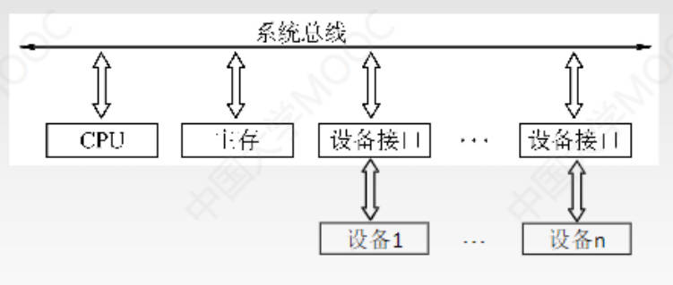
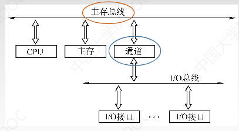
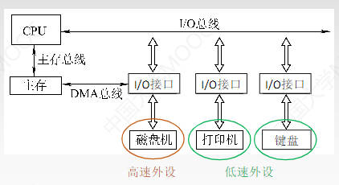
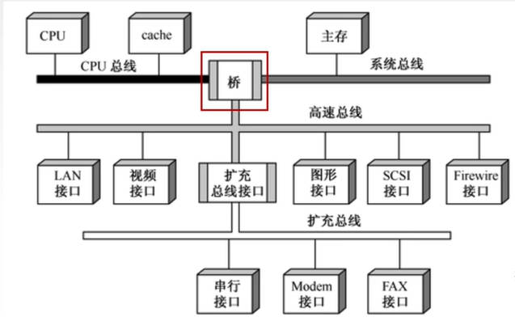
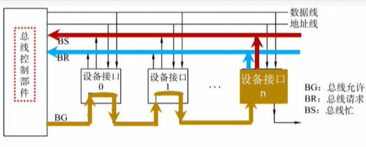
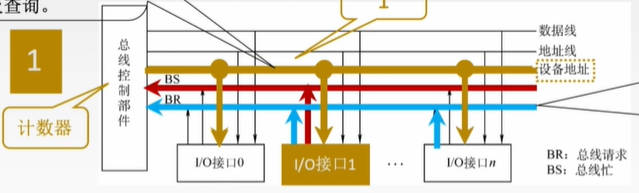
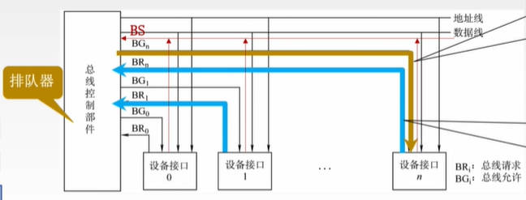
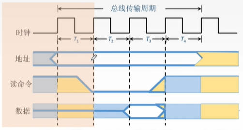

# 总线概述

## 基本概念

### 总线定义

定义：总线是一组能为多个部件分时共享的公共信息传送线路

- 分时：同一时刻只允许有一个部件向总线发送信息，如果系统中有多个部件，则它们只能分时地向总线发送信息

- 共享：指总线上可以连接多个部件，各个部件之间互换信息都可以通过这组线路分时共享

分散连接：增加设备时直接建立专门的线路，早期计算机外部设备少时使用

总线连接：将新增加的设备直接连在总线上即可

数据通路表示的是数据流经的路径，而数据总线是承载数据流通的物理媒介

### 总线的特性

- 机械特性

    尺寸、形状、管脚数、排列顺序

- 电气特性

    传输方向、有效的电平范围(电压处于什么范围代表低电平，什么范围代表高电平)

- 功能特性

    每根传输线的功能(地址、数据、控制)

- 时间特性

    信号时序关系

***

## 总线的分类

### 按数据的传输格式

- 串行总线

    一次只能传一位数据

    **优点：** 只需要一条传输线，成本低，抗干扰能力强，多用于长距离传输。应用于计算机内部时，可以节省布线空间

    **缺点：** 在数据发送和接收的时候要进行拆卸和装备，要考虑串行-并行转换的问题

- 并行总线

    一次能传输多位数据

    **优点：** 总线的逻辑时序比较简单，电路实现容易

    **缺点：** 信号线数量多，占用更多布线空间；远距离传输成本高；工作频率高时，并行的信号线之间会产生严重干扰，所以无法提升工作频率

### 按总线功能

- 片内总线

    芯片内部的总线，是CPU芯片内部寄存器与寄存器之间、寄存器与ALU之间的公共连接线

- 系统总线

    是计算机系统内各功能部件(CPU \ 主存 \ I/O接口)直线相互连接的总线

    - 数据总线(DB)

        传输数据信息，包括指令和操作数；位数与机器字长、存储字长有关；双向传输

    - 地址总线(AB)

        传输地址信息，包括主存单元或I/O端口的地址；位数与主存地址空间大小及设备数量有关；单向传输——只能由CPU发出地址信息

    - 控制总线(CB,control)

        一根控制线传输一个信号；信号可以是CPU送出的控制命令，也可以是内存返回CPU的反馈信号；对于一根控制线来说是单向传输，对于整个控制总线是双向传输

- 通信总线

    用于计算机系统之间或计算机系统与其它系统之间信息传送的总线，也称外部总线

    比如网线

### 系统总线的结构

- 单总线结构

    

    CPU、主存、I/O设备都连接在一组总线上

    总线内部再细分地址总线、数据总线和控制总线

    **优点：** 结构简单，成本低，易于接入新的设备

    **缺点：** 带宽低、负载重，多个设备争用唯一的总线，不支持并发(这里是并行的意思)传送操作；当速度慢的I/O设备占据总线时，会浪费总线的快速传输的能力

- 双总线结构  

    

    有两条总线，一条是主存总线，用于CPU、主存和通道(专门负责管理I/O设备)之间进行数据传送；另一条是I/O总线，用于多个外部设备与通道之间进行数据传送

    主存总线支持突发(猝发)传送：送出一个地址，收到多个地址连续的数据

    **优点：** 将较低速的I/O设备从单总线上分离出来

    **缺点：** 需要增加通道等硬件设备

- 三总线结构

    

    磁盘通过DMA总线与主存连接，提高传输速度；低速外设通过I/O总线直接与CPU连接，提升相应速度

    **优点：** 提高了I/O设备的性能，使其更快地相应命令，提高系统吞吐量

    **缺点：** 系统工作效率较低。因为三条总线同时只能有一条线在工作

- 四总线结构

    

    越靠近CPU的总线速度较快

    桥接器：用于连接不同的总线，具有数据缓冲、转换(比如把串行数据变为并行数据)和控制功能(比如总线仲裁)

    比如北桥和南桥

***

## 总线的性能指标

### 总线周期(总线的传输周期)

一次总线操作所需的时间，包括：

- 申请阶段

    进行仲裁

- 寻址阶段

    主设备通过地址总线将要读或者写的地址单元传递给从设备

- 传输阶段

    通过数据总线往从设备里读出或写入数据

- 结束阶段

    释放总线的使用权

通常由若干个总线时钟周期组成

### 总线时钟周期

即机器的时钟周期；现在的计算机系统中，总线时钟周期可能由桥接器提供

大多数情况下，一个总线周期包含多个总线时钟周期

有的时候，一个总线周期就是一个总线时钟周期

有的时候，一个总线时钟周期可包含多个总线周期

### 总线的工作频率

总线上各种操作的频率，为总线周期的倒数

若总线周期=N个时钟周期，则总线工作频率 = 时钟频率/N

实际上是指一秒内传送几次数据

### 总线的时钟频率

即机器的时钟频率

是时钟周期的倒数，若时钟周期为T，则时钟频率为1/T

实际指一秒内有多少个时钟周期

### 总线宽度

又称总线位宽

是指总线上同时能传输的数据位数

通常是指数据总线的根数

### 总线带宽

总线的数据传输率，即单位时间内总线上可传输数据的位数

通常用每秒钟传送信息的字节数来衡量，单位为字节/秒(B/s)表示

总线带宽 = 总线工作频率 × 总线宽度 = 总线宽度 / 总线周期

是总线本身所能达到的最高传输速率。在计算实际的有效数据传输率时，要用实际传输的数据量

### 总线复用

是指一种信号线在不同的时间传输不同的信息

比如地址总线和数据总线复用，分时传输地址信息和数据信息

可以使用更少的线传输更多的信息，从而节省了空间和成本

### 数据线数

地址总线、数据总线和控制总线三种总线数的总和

***
***

# 总线仲裁

解决多个设备争用总线的问题

同一时刻只能有一个设备控制总线传输，可以有多个设备从总线接收数据

主设备：获得总线控制权的设备，主设备可以决定与哪个从设备进行数据交互

从设备：被主设备访问的设备，只能相应从主设备发来的各种总线命令

总线仲裁分类：

- 集中仲裁方式

    - 链式查询方式

    - 计数器定时查询方式

    - 独立请求方式

- 分布仲裁方式

## 集中仲裁方式

工作流程：

- 主设备发出请求信号

- 若多个主设备同时要使用总线，则由总线控制器（集成在CPU内或桥接器内）的判优、仲裁逻辑按一定的优先等级顺序确定哪个主设备能使用总线

- 获得总线使用权的主设备开始传送数据

### 链式查询方式

- BG：总线允许信号

- BR：总线请求

- BS：总线忙

分配过程：

假设设备1和设备n都想用总线

- 想使用总线的设备发送BR信号

- 总线控制部件接收到BR信号，发出BG信号

- BG信号按顺序传递，设备0不需要使用总线，就继续传递，设备1需要使用总线，就将BG信号截断

- 设备1阶段BG信号后获得总线使用权，成为主设备，然后发送BS信号，总线控制部件接收到后停止发送BG信号

- 直到设备1用完总线，撤销BS信号，总线控制部件检测到还有BR信号，就发送BG信号。依然是按顺序传递，直到被截断

优先级：离总线控制器越近的部件优先级越高

**优点：** 只需要很少几根控制线就能按一定优先次序实现总线控制，结构简单，扩充容易

**缺点：** 

- 对硬件电路的故障敏感

    如果设备1坏了不能传递BG信号，那后面的设备都不能使用总线了

- 优先级不能改变

- 会产生饥饿现象

    优先级高的部件一直想使用总线，后面的部件就一直无法使用

### 计数器查询方式

与链式查询方式相比，少了一根BG线，多了一组连接各设备的设备地址线。总线控制部件里加了一个计数器

分配过程：

- 想要使用总线的接口发送BR信号

- 总线控制部件接收到BR信号，但是不知道哪个部件发出的，于是启动计数器

- 计数器从0开始，询问接口0用不用，接口0不用，计数器变为1，问接口1用不用......

- 接口1要使用，就把总线使用权给接口1，接口1发送BS信号

**优点：**

- 通过计数的初始值可以改变优先次序

    - 从0开始：设备的优先级按顺序排列，固定不变

    - 从上一次的终点开始：设备的优先级相等

    - 初值还可以由程序设置

- 对电路的故障没有链式那么敏感

**缺点：**

- 增加了控制线数

    为了能连接所有设备，若设备有n个，则需[log2n]+2条控制线，2是BS和BR

- 控制电路相对比链式查询复杂

### 独立请求方式

每一个设备和控制部件之间都有一根总线请求线BR和总线允许线BG线。总线控制部件中有一个排队器

分配方式：

- 想使用总线的设备通过自己转悠的总线请求线BR发送信号

- 总线控制部件根据接收到的BR信号，通过内部的排队器决定让哪个部件使用，并通过总线允许线BG直接给它总线使用权

- 主设备发送BS信号

**优点：**

- 响应速度块，总线允许信号BG直接从控制器发送到相关设备

- 对优先次序的控制相当灵活

**缺点：**

- 控制线数量多。若设备有n个，则需要2n+1条控制线。+1是BS线

- 总线的控制逻辑更加复杂

## 分布仲裁方式

不需要中央仲裁器，每个潜在的主模块都有自己的仲裁器和仲裁号，多个仲裁器竞争使用总线

- 当设备有总线请求时，就把各自唯一的仲裁号发送到共享的仲裁总线上

- 每个仲裁器将从仲裁总线上得到的仲裁好与自己的仲裁号进行比较

- 如果仲裁总线上的号优先级更高，则自己的总线请求就不予相应，并撤销仲裁号

- 最后获胜者的仲裁号保留在仲裁总线上

***
***

# 总线的操作和定时

占用总线的一对设备（主设备和从设备）如何进行数据传输

总线周期四个阶段

- 申请分配阶段

    需要使用总线的设备提出申请，经过仲裁决定总线使用权。
    
    可以分为传输请求和总线仲裁两个阶段

- 寻址阶段

    获得使用权的主模块通过总线发出本次要访问的从模块的地址及有关命令，启动参与本次传输的从模块

- 传输阶段：

    主模块和从模块进行数据交换，可单向或双向进行数据传送

- 结束阶段：
 
    主模块的有关信息均从系统总线上撤出，让出总线使用权

## 总线定时

总线定时是指总线在双方交换数据的过程中控制它们在时间上有条不紊的进行配合，

实质是指定一种协议或者规则，让数据的发送方和接收方能按照一种统一的规则进行交互

- 同步通信(同步定时方式)

    由统一时钟控制数据传送，相当于有人喊节拍，两个设备一起在节拍下工作

- 异步通信（异步定时方式）

    采用应答方式，没有公共时钟标准

- 半同步通信

    同步、异步的结合

- 分离式通信

    充分挖掘系统总线每瞬间的潜力

### 同步定时方式

若干个时钟产生相等的时间间隔，每个间隔构成一个总线周期，在一个总线周期内，发送方和接收方可进行一次数据传送

假设CPU作为主设备，某个输入设备作为从设备

进行读命令：

- CPU在T1时刻的上升沿给出地址信息

- 在T2的上升沿给出读命令（低电平有效）。相应的输入设备按命令进行一系列内部操作，必须在T3的上升沿来之前将CPU所需的数据送到数据总线上

    读命令在T2上升沿对应的时刻变为低电平

- CPU在T3时钟周期内，将数据线上的信息传送到其内部寄存器中

    要是从设备跟不上节奏，数据传送就会出问题

- CPU在T4的上升沿撤销读命令，输入设备不再向数据送线上传送数据，撤销它对数据总线的举动

    读命令在T4上升沿时刻变为高电平

**优点：** 传送速度快，具有较高的传输速率；总线控制逻辑简单

**缺点：** 主从设备属于强制性同步；不能及时进行数据通信的有效性检验，可靠性较差

适用于总线长度较短（传输的信息比较可靠）；总线所接部件的存取时间比较接近的系统

### 异步定时方式

没有统一的时钟，也没有固定的时间间隔，完全依靠传送双方相互制约的“握手”信号来实现定时控制

主设备提出交换信息的“请求”信号（比如地址信息，读命令），经接口传送到从设备；从设备接到主设备的请求后，通过接口向主设备发出回答信号（比如要读出的数据）

根据“请求”和“回答”信号的撤销是否互锁，分为

- 不互锁方式——速度最快，可靠性最差

    主设备发出请求后，不必等到接到从设备的回答信号，而是经过一段时间便撤销请求信号

    从设备接到请求信号后，发出回答信号，并经过一段时间自动撤销回答信号

    双方不存在互锁关系，及信号的撤销没有相互制约的关系

- 半互锁方式

    主设备发出请求信号后，必须等接到从设备的回答信号后，才撤销请求信号，有互锁的关系

    而从设备接到请求信号后，发出回答信号，不必等待获知主设备的请求信号已经撤销，即可自动撤销回答信号，不存在互锁关系

- 全互锁方式——最可靠，速度最慢

    主设备发出请求信号后，必须等收到从设备的回答后，才撤销请求信号

    从设备给出回答信号之后，必须等到主设备的请求信号撤销后才能撤销

**优点：** 总线周期长度可变，能保证两个工作速度相差很大的部件或设备之间可靠地进行信息交换

**缺点：** 比同步控制方式稍复杂一些，速度比同步定时方式慢

### 半同步通信

统一时钟地基础上，增加一个“等待”响应信号WAIT

从设备接到请求，但是准备数据的速度跟不上节奏时，会发送WAIT请求让主设备等自己几个节拍

### 分离式通信

从设备准备数据的时候是不需要使用总线的，但是此时这对主从设备依然占据着总线

分离式通信将一个总线传输周期分为两个子周期

- 子周期1：

    主模块申请占用总线，使用完后（发送完地址和读信号）放弃总线的占用权

- 子周期2：

    从设备准备好数据后，从模块申请占用总线，将各种信息送至总线上

**特点：**

- 各模块（主模块和从模块）均有权申请占用总线

- 采用同步方式通信，不用等对方回答

    有统一的节拍，主设备在规定的节拍内发出请求信号，然后规定的节拍内释放总线控制权

- 各模块准备数据时，不占用总线

- 总线利用率提高

***
***

# 总线标准

趋势：串行总线替代并行总线

- 并行传输还是串行传输？

    并行

- 几根数据线，几根地址线？

    32根数据线，数据线、地址线复用

- 用哪种总线仲裁方式？

    链式查询方式

- 用哪种总线定时方式？

    同步定时方式，每四个时钟完成一次数据传输

- 总线工作频率？

    985MHz

- 电气特性？

    每根线传送1bit数据，0~0.5V为低电平，4.8~5.2V为高电平；低电平表示1，高电平表示0

- ......

硬件厂商就按照一起指定的标准，各自研发硬件设备，类比于软件中的接口

**总线标准基本概念：** 总线标准是国际上公布或推荐的互连各个模块的标准，它是把各种不同的模块组成计算机系统时必须遵守的规范。

按总线标准设计的接口可视为通用接口，在接口的两端，任何一方只需根据总线标准的要求完成自身方面的功能要求，而无须了解对方接口的要求

总线分类

- 系统总线：通常与CPU直接相连

    比如用于连接CPU与北桥芯片、CPU与主存等

- 局部总线：没有直接与CPU连接，通常是连接告诉的北桥芯片

    比如连接显卡、声卡等

- 设备总线、通信总线：通常由南桥芯片控制

    用于连接计算机与计算机，或连接计算机与外部I/O设备

## 系统总线标准

### ISA

1984年IBM公司推出

### EISA

扩展的ISA总线，1988年推出

### FBS——前端总线

Intel推出

### QBI

Intel推出，现在很多在使用的

## 局部总线标准

### VESA

又叫做视频局部总线

1991年推出，由视频电子标准协会推出

是针对多媒体PC要求告诉传送活动图像的大量数据应运而生的

并行总线

### PCI

1992年由Intel公司推出

并行总线

也可以直接连接CPU，所以说是系统总线也没问题

### AGP(加速图形接口)

1996年由Intel推出

是基于PCI 2.1版规范进行扩充修改而成

### PCI-E(PCI-Express)

在2001年由Intel推出，是第三代I/O技术

不同于之前的总线标准都是并行传输，PCI-E是串行传输

在传输速率方面，PCI-E总线利用串行的连接特点能轻松将数据传输速度提到一个很高的频率，达到远超出PCI总线的传输速率。可以达到10GB/S以上

同时支持双向传输模式，可以运行全双工模式

采用点对点串行连接的设备连接方式，意味着每一个PCI-E设备都拥有自己独立的数据连接，各个设备之间并发的数据传输互不影响

支持热拔插

## 设备/通信总线

### RS-232C

1970s推出

是一种串行通信总线

速度很慢，当时推出是为了连接打印机

### SCSI（小型计算机系统接口）

并行总线标准

### PCMCIA

适应用存储卡（PC卡）进行数据交换的需求

并行总线

### USB(Universal Serial Bus)

设备总线，是设备和设备控制器之间的接口

是一种串行总线

Type A

接口中的四个针脚

- VCC & GND 

    在接口的两侧，用于供电

- -D & +D

    两个针脚配合着每次传送1bit数据

    用差模信号的方式表示，即用两个针脚的电压差来表示二进制的0/1

    使用双绞线，将-D和+D这两条线拧成麻花状，更加抗干扰

    差模信号抗干扰能力强

Type B

Type C

### IDE（ATA）

用于连接硬盘，90s使用

并行总线

### SATA(Serial 串行)

串行硬盘接口

