# 输入输出系统

I/O就是输入/输出(Input/Output)

I/O设备就是可以将数据输入到计算机，或者可以接收计算机输出数据的外部设备

I/O设备可统称为外部设备 

- 输入设备——鼠标、键盘

- 输出设备——显示器、打印机

- 既可输入、又可输出的设备——硬盘、光盘

## 主机如何与I/O设备进行交互

I/O接口：又称I/O控制器(I/O Controller)、设备控制器，负责协调主机与外部设备之间的数据传输。

是一块芯片，集成在主板上，通过总线与CPU连接，里面包括

- 数据寄存器

    存放主机要输出的数据，或外设要输入的数据

- 控制寄存器

    对外部设备的控制信息，比如让键盘的灯亮

- 状态寄存器

    反映当前外设设备的状态，比如是否损坏，是否忙碌，是否就绪

## I/O控制方式

### scanf执行过程——程序中断方式

`scanf("%c",&i);`

1. CPU通过控制总线向I/O接口发出读命令；通过地址总线指明要读的是哪个设备（键盘）；通过地址总线指明这次要读的设备放入哪个寄存器（数据寄存器）

2. CPU等待键盘输入完成后，取走输入数据

    - 程序查询方式：CPU不断轮询检查I/O控制器中的“状态寄存器”，检测到状态为已完成后，再从数据寄存器取出输入数据

        一直轮询检查会导致CPU一直被占用，干等着键盘输入而无法干其他事

    - 程序中断方式：等待键盘I/O时CPU可以先去执行其他程序，键盘I/O完成后I/O控制器向CPU发出中断请求，CPU响应中断请求并取走输入数据

数据流：键盘 --> IO接口的数据寄存器 --> 数据总线 --> CPU某寄存器 --> 主存(存储到变量i对应地址)

### DMA控制方式——三总线结构

对于快速设备比如磁盘，如果也跟键盘一样每准备好一个字就给CPU发送一次中断请求，就会导致CPU需要花大量的时间来处理中断服务程序，CPU利用率严重下降

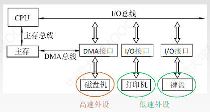

DMA接口（即DMA控制器）也是一种特殊的I/O控制器

1. CPU向DMA接口发出读/写命令，并指明主存地址、磁盘地址、读写数据量等参数

2. DMA控制器自动控制磁盘与主存的数据读写，通过主存与高速I/O设备之间的直接数据通路（DMA总线）。每完成一整块数据读写，才向CPU发出一次中断请求

通过DMA总线读写数据时也会占据一个存取周期，不能和CPU同时读写内存

### 通道控制方式——双总线结构

对于商用中型机、大型机可能会接上超多的I/O设备，不可能都让CPU来管理

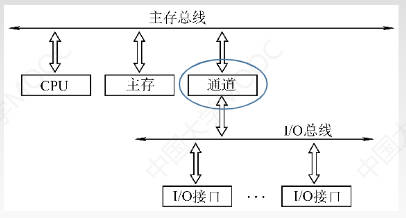

通道：是具有特殊功能的处理器，能对I/O设备进行统一管理。可以识别并执行一系列**通道指令**，通道指令种类、功能通常比较单一

1. CPU向通道发出I/O指令——指明通道程序在内存中的位置，并指明要操作的是哪个I/O设备。之后CPU就可以做其它事情

2. 通道执行内存中的通道程序，控制I/O设备完成一系列任务。可以通过编程灵活控制通道程序要执行的动作

3. 通道执行完规定的任务后，向CPU发出中断请求，之后CPU对中断进行处理

## I/O系统基本组成

### I/O硬件：

包括外部设备、I/O接口、I/O总线

### I/O软件：

包括驱动程序、用户程序、管理程序、升级补丁等

通常采用I/O指令 和 通道指令 实现主机和I/O设备的信息交换

- I/O指令：CPU指令的一部分，操作码 + 命令码 + 设备码

    - 操作码：用于识别这是一条怎样的指令，是I/O指令而不是加减乘除指令；指明CPU要对I/O接口做什么

    - 命令码：指明要对I/O设备进行什么操作，比如让键盘的灯亮起来

    - 设备码：要对哪个设备进行操作

- 通道指令：通道能识别的指令

    通道程序提前编制好放在主存中

    在含有通道的计算机中，CPU执行I/O指令对通道发出命令，由通道执行一系列通道指令代替CPU对I/O设备进行管理

***
***

# 外部设备

## 输入设备

### 键盘

每个键相当于一个开关，当按下键时电信号连通；松开键时电信号断开

键盘输入信息的步骤：

1. 查出按下的是哪个键

2. 将该键翻译成能被主机接收的编码，如ASCII码

3. 将编码传送给主机

### 鼠标

常用的有机械式和光电式两种

鼠标在平面上移动时，其底部传感器把运动的方向和距离检测出来，从而控制光标做响应运动

## 输出设备

### 显示器

性能指标：

- 分辨率：所能表示的像素个数，以宽、高的像素的乘积表示，例如800×600

- 灰度级：是指黑白显示器中所显示的像素点的亮暗差别，在彩色显示器中表现为颜色的不同，灰度级越多，图像层次越清楚逼真。
 
    灰度级位数是指每一个像素点要用多少比特位表示，n位灰度可以表示2^n种不同的亮度或颜色

- 显示存储器（VRAM、显存、刷新存储器）

    为了不断提高刷新图像的信号，必须把一帧图像信息存储在刷新存储器中。

    存储容量由图像分辨率和灰度级决定，分辨率也高，灰度级越多，显存越大

    一帧图片的比特位大小：`VRAM容量 = 分辨率 × 灰度级位数`，也就是一次最少要写入这么多数据，也是显存的理论最小值，小于这个数就一帧也放不下了 单位B

    一秒钟内刷新的图像大小：`VRAM带宽 = 分辨率 × 灰度级位数 × 帧数` 也就是一秒钟最少要写入这么多数据 单位B/S

    现代计算机中，显存除了作为当前显示帧的缓存，还会保存即将渲染的图像数据，一般都比较大

    集成显卡计算机中，通常分配一片内存作为显存

### 打印机

- 击打式打印机：利用机械动作使印字机构与色带和纸相撞而打印字符

- 非击打式打印机：采用电、磁、光、喷墨等物理、化学方法来印刷字符

***
***

# I/O接口

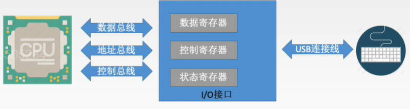

## I/O接口的作用

作用：

- 数据缓冲：通过数据缓冲寄存器(DBR，数据寄存器)达到主机和外设工作速度的匹配

- 错误或状态监测：通过状态寄存器反馈设备的各种错误、状态信息，供CPU查用

- 控制和定时：接收从控制总线发来的控制信号、时钟信号

- 数据格式转换：串-并、并-串 等格式转换

- 与主机和设备通信：实现主机——I/O接口——I/O设备之间的通信

## I/O接口（I/O控制器）工作原理

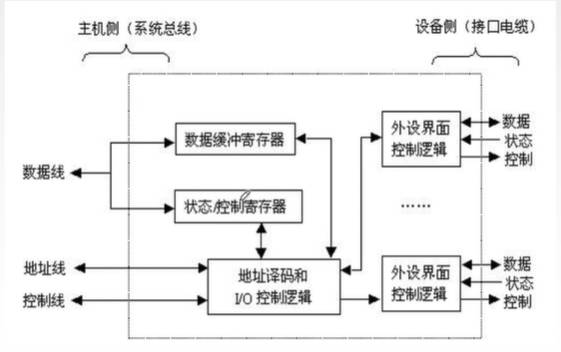

左边主机侧（系统总线）是内部接口，与系统总线相连，实际上是与内存、CPU相连，是金手指那一侧；

右边设备侧（接口电缆）是外部接口，通过接口电缆与外设相连，是USB插口那一侧；可以有很USB接口，即I/O控制器能连接多个设备

工作流程：

1. 发命令：CPU发送命令字到I/O控制寄存器，向设备发送命令；I/O接口根据CPU发出的命令字向外设发送电信号

    需要驱动程序的协助，因为各个设备厂商命令码是不一样的

2. 读命令：CPU从状态寄存器读取状态字，获得设备或I/O控制器的状态信息

    比如是否已准备就绪，是否已完成

3. 读/写数据：从数据缓冲寄存器发送或读取数据，完成主机与外设的数据交换

    完成后外设会通过控制线发送中断信号，让CPU得知I/O操作的完成

由于控制寄存器和状态寄存器在使用时间上是错开的（接收CPU发来的命令字，返回设备的状态字），因此可将二者合二为一

## I/O总线作用：

- 数据线用于传输：

    读写数据、状态字、控制字（命令字）、中断类型号

- 地址线：

    指明I/O端口——寄存器也称为端口，所以是指明哪个寄存器

- 控制线：

    读写I/O端口的信号，中断请求信号

如何确定要操作的外设：

- 给外设编址，用地址线传输要操作的外设信息。和端口信息要分开传输

- 每个设备对应一组寄存器，直接操作不同的寄存器就是操作不同设备

## I/O端口的编址

I/O控制器中的寄存器的编址方式

- 统一编址：与内存统一编址，又称存储器映射方式

    靠不同的地址码区分内存和I/O设备。访存类的指令都可以访问I/O端口，比如LOAD/STORE指令

    RISC精简指令集系统常用

    优点：

    - 不需要专门的输入、输出指令，所有访存指令都能访问端口，程序设计灵活性高

    - 端口有较大的编制空间

    - 读写控制的逻辑电路简单

    缺点：

    - 端口占用了主存地址空间，使主存地址空间变小

    - 外设寻址时间过长

- 独立编址

    会出现地址重复的现象，I/O地址中有0~5，内存中也有0~5

    需要靠不同的指令区分内存和I/O设备。只能用专门的I/O指令访问I/O端口（Intel处理器常用，比如IN、OUT就是IO指令）

    优点：

    - 使用专用I/O指令，程序编制清晰

    - I/O端口地址位数少，地址译码速度块

    - I/O端口的地址不占用主存地址空间

    缺点

    - I/O指令类型少，一般只能对端口进行传送操作，程序设计灵活性差

    - 需要CPU提供存储器读写、I/O设备读写两组控制信号，增加了控制逻辑电路的复杂性

## I/O接口类型

### 按数据传送方式

- 并行接口：一个字节或一个字所有位同时传送

- 串行接口：一位一位的传送

### 按主机访问I/O设备的控制方式可分为

- 程序查询接口

- 中断接口

- DMA接口

### 按功能选择的灵活性可分为

- 可编程接口

- 不可编程接口

***
***

# I/O控制方式

x86中的IO指令实例

- `IN Rd，Rs`——把IO端口Rs的数据输入到CPU寄存器Rd

- `OUT Rd，Rs`——把CPU寄存器Rs的数据输出到IO端口Rd

CPU寄存器就是CPU内部的比如通用寄存器、加法寄存器这些，IO端口中的寄存器就是数据缓冲寄存器，状态/控制寄存器

## 程序查询方式

模拟打印3个字符的过程

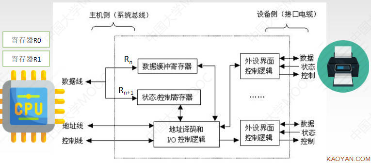

1. 假设启动打印对应的命令字已经存放在通用寄存器R1中，`OUT Rn+1,R1`将打印命令字放在到控制寄存器

2. I/O端口接到命令字后，通过I/O控制逻辑经过控制线给打印机发出相应的控制信号

3. 打印机启动操作完成，就绪后，会把自己就绪的状态存到Rn+1状态/控制寄存器中

4. CPU给出OUT指令后，就一直处于轮询等待状态，不断执行`IN Rn+1,R0`指令，将Rn+1的内容输入R0，检查打印机是否是就绪状态

5. 检测到打印机的就绪信号后，通过控制线指明这次要执行写操作，通过地址线指明要写入Rn数据缓冲寄存器，把字符a放入数据线上，将a写入Rn

6. 把a通过数据线给打印机，打印完成后，通过状态线将就绪的信息放入Rn+1，CPU知道打印机就绪后，就继续将b放入Rn进行下一个字符的打印

7. 三个字符都打印完成后，传入一个停机信号

特点：CPU有踏步等待现象，CPU与I/O串行工作

除了独占查询，CPU还可以进行定时查询，就是每隔一段时间查一次

***
***

# 中断

是指在计算机执行现行程序的过程中，出现某些急需处理的异常情况或特殊请求，CPU暂时中止现行程序，而转去对这些异常情况或特殊请求进行处理，在处理完毕后CPU又自动返回到现行程序的断点处，继续执行原程序

工作流程：

1. 中断请求

    中断源向CPU发送中断请求信号

    CPU在每个指令末尾的中断阶段看有没有中断请求

2. 中断响应

    CPU判断自己是否具有响应中断的条件（是否处于关中断状态，即不允许中断，通过PSW的IF位判断）

    多个中断源同时提出请求时通过中断判优逻辑响应一个中断源

3. 中断处理

    中断隐指令——修改CPU的执行流到要处理中断的程序（通过修改PC的值）

    中断服务程序——去处理中断程序

## 关中断

CPU处于关中断状态时，不响应中断请求。用于实现原子操作——必须一气呵成地完成地操作。

在PSW中有一位表示关中断状态，IF=0时表示关中断，IF=1时表示开中断

- 非屏蔽中断：关中断时也会被响应，如断点

- 可屏蔽中断：关中断时不会被响应

## 中断请求标记

用于判断是哪个设备发来的中断信号

**中断请求标记触发器：** 中断系统对每个中断源设置中断请求标记触发器INTR，当其状态为1时，表示中断源有请求。

**中断请求标记寄存器：** 由中断请求标记触发器组成，该寄存器可集中在CPU中，也可分散在各个中断源中

CPU是在每条指令执行阶段结束前向接口发出中断查询信号（取指、间址、执行、中断），以获取I/O的中断请求

CPU响应中断需满足以下三个条件

1. 中断源有中断请求

2. CPU允许中断，即处于开中断状态

3. 一条指令执行完毕，且没有更紧迫的任务

## 中断判优

既可以用硬件实现，也可以用软件实现

### 硬件实现——硬件排队器

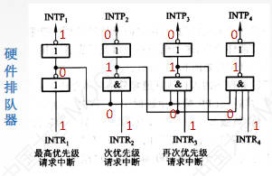

当有多个中断请求时，经过硬件排队器的电路，一定是优先级最高的中断请求为1，其它都是0

### 软件实现——查询程序

按照寄存器中优先级递减的顺序一位一位查询

速度比硬件要慢很多

### 优先级设置

1. 硬件故障中断属于最高级，其次是软件中断

2. 非屏蔽中断优于可屏蔽中断

3. DMA请求优于I/O设备传送的中断请求

4. 高速设备优于低速设备

5. 输入设备优于输出设备

    输入设备放入数据缓冲区的内容不被取走的话就会被下一个放入的信息覆盖掉，导致信息丢失

6. 实时设备优于普通设备

## 中断处理过程

### 中断隐指令

中断隐指令是一系列任务，而不是一条具体的指令

保存原程序的PC值，并让PC指向中断服务程序的第一条指令

CPU在检测到中断信号后，中断隐指令的主要任务：

1. 关中断

    保存断点是原子操作，必须保证不被打断

2. 保存断点

    保证在中断服务程序执行完毕后能正确地返回到原来的程序，将原来程序的断点(即PC中的内容)保存起来。可以放入堆栈，也可以存入指定单元

3. 引出中断服务程序

    就是取出中断服务程序的入口地址并传送给程序计数器PC

如何找到中断服务程序的入口地址

- 硬件向量法

    由硬件产生向量地址，再由向量地址找到入口地址

- 软件查询法

### 中断服务程序的主要任务

1. 保护现场

    保存通用寄存器和状态寄存器的内容，以便返回原程序后可以恢复CPU环境

2. 中断服务（设备服务）

    主体部分，去处理中断请求

3. 恢复现场

    通过出栈指令或取数指令把之前保存的信息送回寄存器中

4. 中断返回

    开中断，并通过中断返回指令回到原程序断点处

在响应中断请求时开中断，处理完中断请求后才开中断，中间不会响应新的中断请求。

单重中断：执行中断服务程序时不响应新的中断请求

***

## 多重中断

又称中断嵌套，执行中断服务程序时可响应新的中断请求

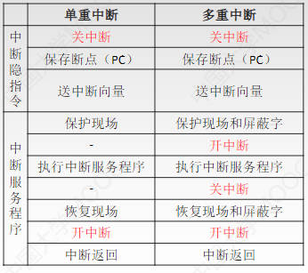

只需要多开关几次中断就能实现多重中断

保护现场和恢复现场必须是一气呵成的

### 中断屏蔽字

通过屏蔽字来指明在执行中断执行程序时哪些中断请求应该被忽略

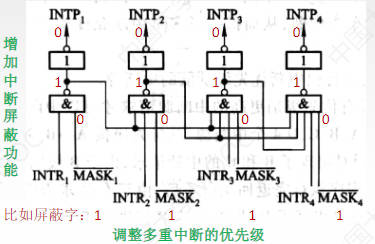

一般用1表示屏蔽，0表示正常申请

每个中断源对应一个屏蔽字（是指在某个中断源运行时，其它中断源中的MASK值是对应于这个中断源唯一固定的）

屏蔽字中1越多，优先级越高，每个屏蔽字中至少有一个1（至少要能屏蔽自身的中断）

***

## I/O控制——程序中断方式 

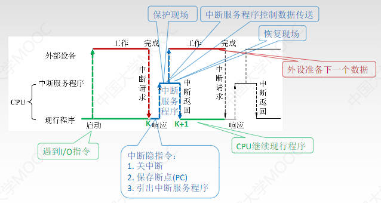

1. CPU在执行现行程序时遇到I/O指令后，向外部设备发送启动命令，然后CPU继续执行现行程序，外部设备同时去准备数据

2. 外部设备准备好数据后，给CPU发送中断请求

3. CPU暂停现行程序，去响应中断信号。首先是执行中断隐指令——关中断、保存断电、引出中断服务程序

4. 之后执行中断服务程序——保护现场、中断服务程序控制数据传送（比如从数据缓冲寄存器中读走数据），读完数据后外设就可以继续准备下一个数据了，而中断服务程序还要恢复现场，CPU继续执行现行程序。

***
***

# DMA方式

CPU向DMA控制器指明要输入还是输出；要传送多少个数据；数据在外设中的地址，要放入主存的位置

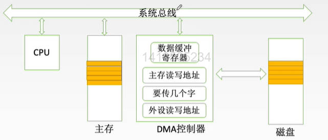

数据传送过程

传送前：

1. DMA控制器接受外设发出的DMA请求，并向CPU发出使用总线的请求

    外设每准备好一个字，就会发送一个DMA请求

2. CPU响应此总线请求，发出总线响应信号，DMA控制器接管总线控制权，进入DMA操作周期

传送时：

3. 确定传送数据的主存单元地址及长度，并自动修改主存地址计数和传送长度计数

4. 规定数据在主存和外设间的传送方向，发出读写等控制信号，执行数据传送操作

传送后：

5. 向CPU报告DMA操作的结束，通过中断信号报告

## DMA控制器结构

DMA控制器英文缩写为DMAC（Controller）

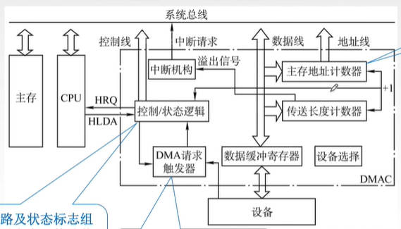

- 控制/状态逻辑

    控制和时序电路，用于指定传送方向，修改传送数据，每一步应该做什么操作等等

- DMA请求触发器

    I/O设备将数据放入数据缓冲寄存器后，将DMA请求触发器置为1，然后控制/状态逻辑接收到高电平就知道写完一个字了，就将数据缓冲寄存器的内容写到主存里

- 主存地址计数器（AR）

    存放要交换数据的主存地址

- 传送长度计数器（WC）

    用来计数，记录已经传了多少字或者还要传多少字。当计数溢出时表示数据传送完毕，自动发中断请求信号（通过中断机构）

- 数据缓冲寄存器

    用于暂存每次传送的数据

- 中断机构

    当一个数据块传送完毕后触发中断机构，向CPU提出中断请求

在DMA传送过程中，DMA控制器将接管CPU的地址总线、数据总线和控制总线。CPU的主存控制信号被禁止使用。当DMA传送结束后，将恢复CPU的一切权力并开始执行其操作

## DMA传送过程

预处理：

- 主存起始地址 --> AR

- I/O设备地址 --> DAR

- 传送数据个数 --> WC

- 启动I/O设备

数据传送：

此过程中CPU继续执行主程序

1. 设备将数据写入DR

2. 写满后向DMA控制器发送DMA请求（将DMA请求触发器的值置为1）

3. 控制/状态逻辑检测到DMA请求后，向总线发送总线请求，申请总线控制权

4. CPU将总线控制权交给DMA控制器，DMA控制器接管总线

5. DMA控制器完成一次数据传送

    将数据缓冲寄存器的内容放到数据线上，主存地址计数器的内容放到地址线上。将数据写入主存

6. 修改参数

    主存地址计数器的值改为下一个要写入的主存地址，传送长度计数器的值修改

7. 如果传送长度计数器发生溢出，说明数据传输完成，发送溢出信号给中断机构，中断机构发出中断请求

后处理：

CPU接到DMA发来的中断请求后

- 中断服务程序

- 做DMA结束处理

## DMA传送方式

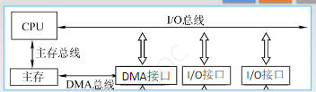

在三总线结构中，DMA与主存之间有专门的DMA总线，这样当DMA要访问主存时就不需要看CPU的脸色。但是如果主存不支持双端口访问，那应该优先满足谁的访问需求

### 停止CPU访问主存

DMA传送一整块数据的过程中直接停止CPU访问主存

优点：控制简单

缺点：CPU处于不工作状态或保持状态，未充分发挥CPU对主存的利用率

### DMA和CPU交替访存

一个CPU周期分为C1和C2两个周期

C1专供DMA访存，C2专供CPU访存

优点：不需要总线使用权的申请、建立和归还过程。因为时间是分配好的，到谁了就谁用

缺点：

- 硬件逻辑更为复杂

- 不能充分利用主存，因为可能CPU需要频繁访问主存而分配给DMA的访存时间用不到

### 周期窃取（周期挪用）

周期是指主存存取周期

DMA访问主存有三种可能

- CPU此时不访存——不冲突

- CPU正在访存——等待CPU存取周期结束后让出总线

- CPU与DMA同时请求访存——I/O访存优先