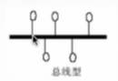
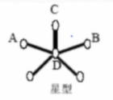
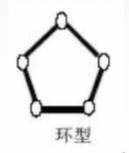
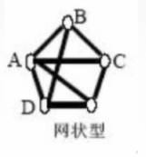
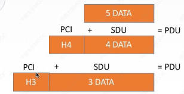
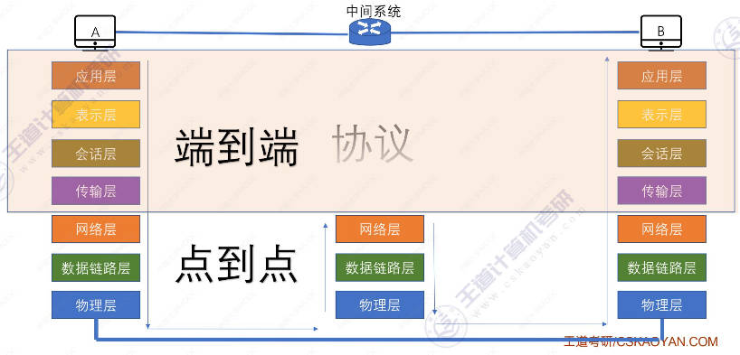
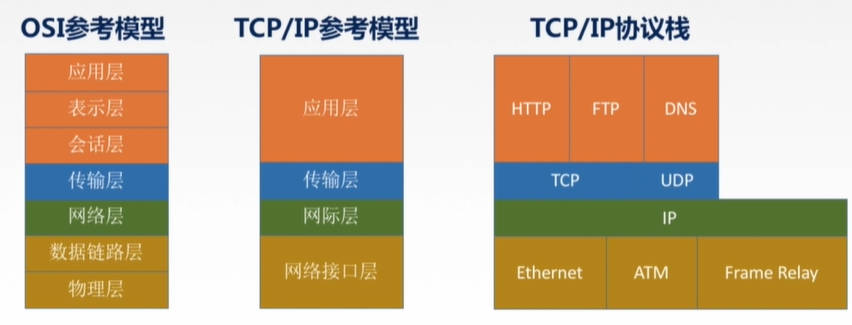
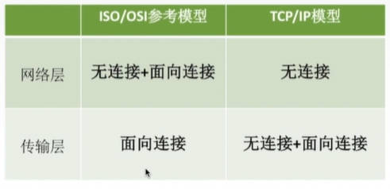

# 计算机网络概述

- 计算机网络已经由一种通信基础设施发展成为一种重要的**信息服务基础设施**

## 概念和功能

### 概念：

计算机网络：是一个将分散的、具有独立功能的**计算机系统**，通过**通信设备与线路**连接起来，由功能完善的**软件**实现**资源共享和信息传递**的系统

### 功能

1. 数据通信

2. 资源共享

    同一个计算机网络上的其它计算机可使用某台计算机的计算机资源的行为

    可共享硬件、软件、数据

3. 分布式处理

    多台计算机各自承担同一工作任务的不同部分

4. 提高可靠性

    一台计算机坏了可以由其它的顶替

5. 负载均衡

***

## 计算机网络的发展

### 第一阶段

- ARPAnet阿帕网

    一战期间美国国防部高级研究计划局ARPA设计的一个分散的指挥系统

- Internet因特网

    1983年阿帕网接受TCP/IP，选定Internet为主要的计算机通信系统

网络把许多计算机连接在一起，互联网（internet）把许多网络连接在一起，因特网（Internet）是世界上最大的互联网

### 第二阶段

NSFNET：

1985年美国国家科学基金会NSF建设，三级结构：校园网（企业网）——地区网——主干网

### 第三阶段

多层次ISP结构：

本地ISP——地区ISP——主干ISP

ISP：因特网服务提供商。如中国电信、联通、移动

---

## 计算机网络的组成

### 组成部分

- 硬件

- 软件

- 协议

    一系列规则和约定的集合

### 根据工作方式

- 边缘部分

    由端系统组成，用户直接使用

    端与端之间的通信方式（指两个端的进程之间的通信）

    - C/S方式：client/server，客户端服务器方式，所有客户都需要访问服务器

    - B/S方式：Browser/Server，浏览器服务器方式，和C/S一样，不过用户在使用浏览器访问服务器

    - P2P方式：peer-to-peer，没有固定的服务器，所有人都既是服务器又是客户端，地位平等

- 核心部分

    为边缘部分提供服务

### 功能组成

七层模型（由上到下）：（应用层、表示层、会话层）、传输层、（网络层、数据链路层、物理层）

- 通信子网：实现数据通信

    各种传输介质、通信设备、相应的网络协议组成

    七层模型的下三层

- 资源子网：实现资源共享/数据处理

    实现资源共享功能的设备和软件的集合

    上三层

---

## 分类

### 按分布范围分

- 广域网 WAN

    使用交换技术

- 城域网 MAN

- 局域网 LAN

    使用广播技术

- 个人区域网 PAN

### 按使用者分

- 公用网

    比如电信联通搭建的网络

- 专用网

    比如军队内网、学校内网

### 按交换技术分

数据的交换方式

- 电路交换

    先建立连接，然后一直占用着连接交换数据，然后释放连接

    比如打电话

- 报文交换

    存储转发，先把报文传输给一个路由器，然后路由器先存储这个报文，并转发给下一个路由器

    报文：完整的文件

- 分组交换

    存储转发，不过是把报文切割进行了分组

### 按拓扑结构分

圆圈表示网中结点（路由器、主机等），线表示通信线路

- 总线型

    

- 星型

    

- 环型

    

- 网状型

    

### 按传输技术分

- 广播式网络

    共享公共通信信道

- 点对点网络

    使用分组存储转发和路由选择

---

## 性能指标

### 速率

别名： 数据率 或 数据传输率 或 比特率

定义：指连接在计算机网络上的主机在数字信道上传送数据的速率

单位：Tb/s = 10³Gb/s = 10⁶Mb/s = 10⁹kB/s = 10¹²b/s

### 带宽

原来传输模拟信号时，指某个信号具有的频带宽度，即最高频率与最低频率之差，单位是Hz

现在传输数字信号，指网络的通信线路传送数据的能力，通常是单位时间内从网络中的某一点到另一点所能通过的最高数据率

（网络设备所支持的最高速度）

单位：b/s, kb/s...

- 第一μs：往链路上放了1bit数据

- 第二μs：往链路上放了1bit数据，前面放的1bit往前移动200m...

即1s能往链路上放几bit数据，放的越多，带子越宽（带宽越大）

### 吞吐量

表示在单位时间内通过某个网络（或信道、接口）的数据量

带宽是最大能通过数据量，吞吐量是实际通过的数据量

受网络的带宽和网路的额定速率的限制

单位：b/s,kb/s...

### 时延

指数据（报文/分组/比特流）从网络（或链路）的一端传送到另一端所需的时间。

也叫延迟或迟延

单位：s

- 发送时延（传输时延）

    主机将所有数据推到数据信道上所需的时间

    `发送时延 = 数据长度 / 信道带宽`

    高速链路是指提高了带宽，减少了发送时延

- 传播时延

    数据在信道上传播所需时间

    取决于电磁波传播速度和链路长度，电磁波传播速度是固定的，很难改变

    `传播时延 = 信道长度 / 电磁波在信道上的传播速率`

- 排队时延

    在路由器等待输出/输入链路可用所耗费的时间

- 处理时延

    等待路由器检错和找出口的时间

### 时延带宽积

时延带宽积 = 传播时延（s） × 带宽（bit/s）

单位：bit（s × bit/s）

指的是管道里面能容纳bit数的容量，又称为以比特为单位的链路长度

经过这个管道需要走5s，每秒有5bit数据，那管道中最多同时存在25bit数据

### 往返时延RTT

从发送方发送数据开始（第一个bit放上信道的时间）到发送方收到接收方的确认（接收方收到第一个bit数据后立即发送确认）总共经历的时延

RTT越大，在收到确认之前，可以发送的数据越多，因为等的时间越久

RTT包括：

- 往返传播时延 = 传播时延 * 2

- 末端处理时间

### 利用率

信道利用率：有数据通过的时间 / （有+无）数据通过时间

网络利用率：信道利用率加权平均值

利用率越高，时延越大（堵车）

---
---

# 体系结构&参考模型

## 分层结构

### 名词解释

- 实体：每一层当中的活动元素称为实体，第n层中的活动元素称为n层实体。同一层的实体称为对等实体

- 协议：为进行网络中的对等实体数据交换而建立的规则、标准或约定称为网络协议

    协议是水平方向的——只有对等实体之间才有协议

    - 语法：规定传输数据的格式
    - 语义：规定所要完成的功能
    - 同步：规定各种操作的顺序

- 接口（访问服务点SAP）：上层使用下层服务的入口

- 服务：下层为相邻上层提供的功能调用

    垂直方向的

- SDU服务单元：数据部分

- PCI协议控制信息：控制协议操作的信息

- PDU协议数据单元：对等层次之间传送的数据单位

PDU = PCI + SDU

上一层的PDU作为下一层的SDU

### 分层基本原则

1. 各层之间相互独立，每层只实现一种相对独立的功能

2. 每层之间界面自然清晰，易于理解，相互交流尽可能少

3. 结构上可分割开。每层都采用最合适的技术来实现

4. 保持下层对上层的独立性，上层单向使用下层提供的服务

5. 整个分层结构应该能促进标准化工作

---

## OSI参考模型

为了解决计算机网络复杂的大问题——分层结构

为了支持异构网络系统的互联互通——ISO与1984年提出开放系统互连（OSI）参考模型

“物联网淑慧试用”

### 应用层

所有能和用户交互产生网络流量的程序

用于提供用户和网络的接口

典型应用层服务：

- 文件传输（FTP协议）

- 电子邮件（SMTP协议）

- 万维网（HTTP协议）

### 表示层

用于处理在两个通信系统中要交换的信息的表示方式（语法和语义）

主要功能：

- 数据格式变换

- 数据加密解密

- 数据压缩和恢复

### 会话层

向表示层实体/用户进程提供建立连接并在连接上有序地传输数据

称为会话，也是建立同步（SYN）

功能：

- 建立、管理、终止会话

- 使用校验点，使会话在通信失效时从校验点/同步点继续恢复通信，实现数据同步

### 传输层

负责主机中两个进程地通信，即端到端的通信。

传输单位是报文段或用户数据报

功能：

- 可靠传输、不可靠传输

    发送端收到接收端发来的确认收到的信号之后才发送下一个数据包

- 差错控制

- 流量控制

    控制发送速率

- 复用分用

### 网络层

主要任务是把**分组**从源端传到目的端，为分组交换网上的不同主机提供通信服务

网络层传输单位是数据报，分组是数据报的切割

功能：

- 路由选择

    选择最佳路径

- 流量控制

- 差错控制

- 拥塞控制

    整体网络是否拥堵

### 数据链路层

主要任务是把网络层传下来的数据报组装成帧

数据链路层（链路层）的传输单位是帧

保证数据的正确性和完整性

功能

- 成帧：定义帧的开始和结束

- 差错控制：包括帧错和位错

    可以检错后直接扔掉，也可以纠错

- 流量控制

- 访问（接入控制）：控制对信道的访问

- 物理寻址

### 物理层

主要任务是在物理媒体上实现比特流的透明传输

    透明传输：
    指不管所传数据是什么样的比特组合，
    都应当能在链路上传送

物理层传输单位是比特

功能：

- 定义接口特性

- 定义传输模式：单工、半双工、双工

- 定义传输速率

- 比特同步

- 比特编码

---

## TCP/IP参考模型

两个参考模型的相同点：

1. 都分层

2. 基于独立的协议栈的概念

3. 可以实现异构网络互联

    不同厂家的设备实现通信

不同点：

1. OSI定义三点：服务、协议、接口

2. OSI先出现，参考模型先于协议发明，不偏向特定协议

3. TCP/IP设计之初就考虑到异构网互联问题，将IP作为重要层次

4. 

---

## 5层参考模型

应用层：支持各种网络应用

传输层：进程与进程之间的数据传输

网络层：源主机到目的主机的数据分组路由与转发

数据链路层：把网络层传下来的数据报组装成帧

物理层：比特传输
    