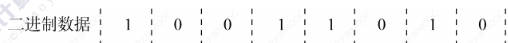
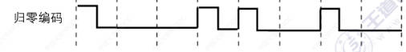
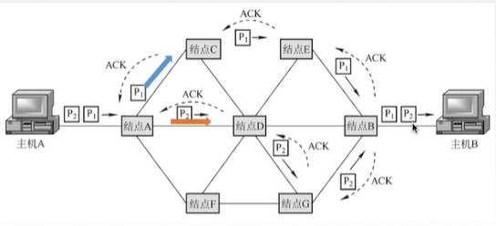
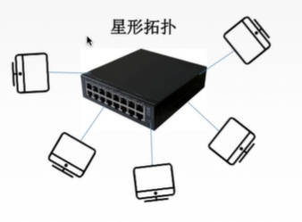

# 物理层基本概念

物理层解决如何在连接各种计算机的传输媒体上传输数据比特流，而不是指具体的传输媒体

主要任务：确定与传输媒体接口有关的一些特性，也就是定义标准

## 接口特性

- 机械特性：定义物理连接的特性

    规定物理连接时所采用的规格、接口形状、引线数目、引脚数量和排列情况

- 电气特性：规定传输二进制位时，线路上信号的电压范围、阻抗匹配、传输速率和距离限制等

- 功能特性：指明某条线上出现的某一电平表示何种意义，接口部件的信号线的用途

    比如描述一个物理层接口引脚处于高电平时的含义

- 规程特性：（过程特性）定义各条物理线路的工作规程和时序关系

## 典型的数据通信模型

通信的目的：传送消息（语音、文字、图像、视频）——图中的“在吗”那三句话

- **数据data**：传送信息的实体，通常是有意义的符号序列

    也就是图中的“在吗？”对应的二进制序列

- **信号**：数据的电气/电磁的表现，是数据在传输过程中的存在形式

    - 数字信号/离散信号：代表消息的参数的取值是离散的

    - 模拟信号/连续信号：代表消息的参数的取值是连续的

    模拟信道只允许模拟信号通过，数字信道允许数字信号通过

- 信源：产生和发送数据的源头

- 信宿：接收数据的终点

- 信道：信号的传输媒介

    一般用来表示向某一个方向传送信息的介质，有方向性（一条信道只能按特定的方向发送信息，不能往回发送）

    一条通信线路往往包含一条发送信道和接收信道

    按传输信号分类：

    - 模拟信道：传送模拟信号

    - 数字信道：传送数字信号

    按传输介质分：

    - 无线信道

    - 有线信道

---

## 设计数据通信系统要考虑的3个问题

### 选择单工 or 半双工 or 全双工通信方式

- 单工通信：

    只有一个方向的通信而没有反方向的交互，只需要一条信道

    比如：广播

- 半双工通信/双向交替通信

    通信的双方都可以发送或接收信息，但不能双方同时发送和接收，就是A发的时候B不能发

    需要两条信道（A给B发信息一条，B给A发信息一条）

    比如：对讲机

- 全双工通信/双向交替通信

    通信双方可以同时发送和接收信息

    需要两条信道

### 选择串行传输 or 并行传输

串行传输：

- 将表示一个字符的8位二进制数按由低位到高位的顺序依次发送

    也就是一个bit一个bit的发送

    速度慢、费用低、适合远距离

并行传输：

- 将表示一个字符的8位二进制数同时通过8条信道发送

    速度快、费用高、适合近距离

### 选择同步传输 or 异步传输

同步传输：

- 数据的传送以一个数据区块为单位，因此同步传输又称为区块传输

    在传送数据时需要先送出一个或多个同步字符，再送出整批的数据。用于使发送方和接收方时钟同步

异步传输：

- 将比特分成小组进行传送，小组可以是一个字符（8位）或更长。

    发送方可以在任何时刻发送这些比特组，而接收方不知道它们什么时候到达

    传送数据时，加一个字符起始位和一个字符终止位

    比如键盘输入

---

## 数据通信中关于数据传输速率的几个术语

速率也叫数据率，是指数据的传输速率，表示单位时间内传输的数据量

### 码元

码元是指一个固定时长的信号波形（比如一个0对应的高波形就是一个码元），是数字通信中数字信号的计量单位

这段固定时长称为***码元长度***

码元的离散状态有M个时，称为***M进制码元***，图中码元只有0和1两个离散状态，所以为二进制码元

一个码元可以携带多个比特的信息量。比如波形有4种离散状态（4进制码元），那一个码元就可以表示2bit数据、同理16进制码元可表示4bit数据

### 码元传输速率

别名：码元速率、波形速率、调制速率、符号速率等

表示单位时间内数字通信系统所传输的码元个数（也可称为是脉冲个数或信号变化的次数）

单位：波特（Baud）。1波特表示数字通信系统每秒传输一个码元

码元速率只与码元长度T有关 `RB = 1/T`
与几进制码元无关

### 信息传输速率

别名：信息速率、比特率

表示单位时间内数字通信系统传输的二进制码元个数（即比特数）

单位：比特/秒（b/s）

如果1个码元携带nbit信息量，则 M Baud的码元传输速率对应的信息传输速率为`nM bit/s`

### 带宽

模拟信号系统中——最高频率和最低频率间的插值代表系统的通频带宽，单位为Hz

数字设备中——表示单位时间内从网络中的某一点到另一点所能通过的最高数据率，单位是比特每秒（bps）

用来表示网络的通信线路所能传输的数据的能力

---
---

# 奈氏准则和香农定理

## 奈氏准则（奈奎斯特定理）

### 失真

影响失真的因素：

- 码元传输速率：速率越快失真越严重

- 信号传输距离

- 噪声干扰

- 传输媒体质量

### 失真的一种现象——码间串扰

信道带宽是信道能通过的最高频率和最低频率之差，当传输的频率高于最高频率，就会导致码间串扰

码间串扰：接收端收到的信号波形失去了码元之间清晰界限的现象

也就是码元传输速率太快，导致码元之间的界限不清楚，接收端识别不了

### 奈氏准则

在理想（无噪声）低通（带宽受限，也就是频率低于最高频率的信号可以通过）条件下，为了避免码间串扰，极限码元传输速率为2*W Baud，W是信道带宽，单位Hz（只有在两个定理中单位是Hz，其它都是bps）

`极限码元传输速率 = 2*W （Baud）`

求的是码元速率

结论：

1. 在任何信道中，码元传输的速率是有上限的，超出上限会出现严重的码间串扰问题

2. 信道的频带越宽（即能通过的信号高频分量越多，W越大），就可以用更高的速率进行码元的有效传输

3. 奈氏准则只给出了码元传输速率的限制，但并没有对信息传输速率给出限制

4. 所以想要提高数据的传输速率，就必须设法使每个码元能携带更多个比特的信息量，即采用多元制的调制方法

---

## 香农定理

### 信噪比

噪声存在于所有电子设备的通信信道中。由于噪声随机产生，它的瞬时值有时会很大，因此噪声会使接收端对码元的判决产生错误

噪声的影响是相对的，若信号较强，那么噪声影响相对较小

信噪比 = 信号的平均功率 / 噪声的平均功率

常记为S/N，并用分贝（dB）作为度量单位，即`信噪比（dB） = 10 * lg（S/N）`数值是等价的，只是单位不同

### 香农定理

在带宽受限且有噪声的信道中，为了不产生误差，信息的数据传输速率有上限值

`信道的极限数据传输速率 = Wlog2（1+S/N）（b/s）`

- W：带宽，单位Hz

- S/N：信噪比，注意题目中可能给的是dB，要换算到S/N的表示方法

结论：

1. 信道的带宽或信道中的信噪比越大，则信息的极限传输速率就越高

2. 对一定的传输带宽和一定的信噪比，信息传输速率的上限是确定的

3. 只要信息的传输速率低于信道的极限传输速率，就一定能找到某种方法来实现无差错的传输

4. 香农定理得出的为极限信息传输速率，实际信道能达到的传输速率要比它低不少

---

## Nice 和 香农 的区别

- 奈氏准则是内忧——带宽受限无噪声条件下，为避免码间串扰；香农定理是外患，是带宽受限有噪声条件下

- 奈氏准则的2W是码元传输速率，要求极限数据传输率还要考虑码元的形式数量 `2Wlog2V` ；香农定理直接求极限数据传输率 `Wlog2(1+S/N)` 

如果题目中既给了V（给了是几进制信号）也给了信噪比S/N，那就两个公式都用，其中较小的值就是极限数据传输率

---
---

# 编码和调制

编码：数据-->数字信号 （就是规定怎么表示1怎么表示0，比如高电平是1还是低电平是1）

- 数字数据 by数字发生器--> 数字信号

- 模拟数据 byPCM编码器--> 数字信号

调制：数据-->模拟信号

- 数字数据 by调制器--> 模拟信号

- 模拟数据 by放大器调制器--> 模拟信号

## 基带信号与宽带信号

信道：信号的传输媒介

- 根据传输信号的不同：模拟信道、数字信道

- 根据传输介质不同：无线信道、有线信道

### 基带信号

在数字信道上传输（基带传输）的就是基带信号

将数字信号1和0直接用两种不同的电压表示，再送到数字信道上去传输（基带传输）

直接来自信源的信号，直接表达了要传输的信息。比如说话的声波

传输距离较近时采用基带传输方式（近距离衰减小，信号内容不易发生变化）

### 宽带信号

在模拟信道上传输（宽带传输）的信号就是宽带信号

把基带信号进行调制后形成的频分复用模拟信号，再传送到模拟信道上去传输（宽带传输）

把基带信号经过载波调制后，把信号的频率范围搬移到较高的频段以便在信道中传输

传输距离较远时采用宽带传输方式（远距离衰减大，即使信号变化大也能最后过滤出来基带信号）

---

## 数字数据编码为数字信号

通过数字发生器

### 非归零编码【NRZ】

高电平是1，低电平是0——高1低0

编码容易实现，但没有检错功能，且无法判断一个码元的开始和结束（发一连串1或一连串0都是一条直线），以至于收发双方难以保持同步

还需要额外传输时钟周期才能知道多久表示一个码元

### 归零编码【RZ】

信号电平在一个码元之内都要恢复到零的编码

一个码元的前半段高电平，后半段恢复到低电平表示1；全低电平表示0

### 反向不归零编码【NRZI】

信号电平翻转表示0，信号电平不变表示1

就是如果下个信号发送的是0，就高电平变低电平或低电平变高电平；如果下个信号是1，电平保持不变

对于全一编码还是无法识别

### 曼彻斯特编码

前高后低是1，前低后高是0（也可以相反）

这样的话每传输一个bit都会有一个电平跳变，只需要看电平跳变两侧电平就可以区分是0还是1

由于码元传输速率指的是一秒传输的脉冲个数，或者信号变化的次数，曼彻斯特编码一个码元长度中信号变化了两次（电平变化一次，过虚线一次），但是只传输了1bit

所以其所占频带宽度是原视的基带宽度的两倍，数据传输速率是调制速率（码元传输速率）的1/2（假设使用二进制码元）

### 差分曼彻斯特编码

同1异0——以虚线为界，如果与前面半个码元的电平相同，说明这个码元是1，如果不同则为0

每个码元中间都会有一次电平的跳转

抗干扰性强于曼彻斯特编码

### 4B/5B编码

比特流中插入额外的比特以打破一连串的0或1

就是用5bit来编码4bit的数据，5bit本来对应32种情况，其中16种用来表示4bit的所有情况，其它16种作为控制码（帧的开始结束、线路的状态信息等）或保留

编码效率为80%

---

## 数字数据调制为模拟信号

在发送端将数字信号转换为模拟信号，在接收端将模拟信号还原为数字信号。分别对应于调制解调器的调制和解调过程

### 调制方法

- 调幅ASK

    没有振幅表示0，有振幅表示1

- 调频FSK

    频率低表示0，频率高表示1

- 调相PSK

    正弦表示0，余弦表示1

### 调幅+调频的结合（QAM）

比如某通信链路采用4个相位，每个相位有4种振幅的QAM调制技术

一共有4×4=16种状态，也就是说能表示16种码元状态，则一个码元携带4bit信息

---

## 模拟数据编码为数字信号

计算机内部处理的是二进制数据，所以需要将模拟音频通过采样、量化转换成有限个数字表示的离散序列（即实现音频数字化）

最典型的例子是对音频信号进行编码的脉码调制（PCM）

### 1.抽样

模拟信号是连续的，数字信号是离散的

对模拟信号周期性扫描，把时间上连续的信号变成时间上离散的信号

为了使所得的离散信号能无失真地代表被抽样的模拟数据，要使用采样定理进行采样`f采样频率 ≥ 2f信号最高频率`

模拟信号实际上是由正弦波叠加而成，所以是为了通过采样确定波形，需要一个周期采样两次

### 2.量化

把抽样取得的电平幅值按照一定的分级标度转化为对应的数字值，并取整数

这样就把连续的电平幅值转换为离散的数字量

### 3. 编码

把量化的结果转换为与之对应的二进制编码

---

## 模拟数据调制为模拟信号

为了实现传输的有效性，可能需要较高的频率。

这种调制方式还可以使用频分复用技术，充分利用带宽资源

一般是把频率调制为更高的频率

---
---

# 数据交换方式

交换是通过某些交换中心将数据进行集中和传送。传输线路为各个用户共用，从而大大节省通信线路，降低系统费用

## 电路交换（Circuit Exchanging）

### 电路交换的原理

在数据传输期间，源结点与目的结点之间有一条由中间结点构成的专用物理连接线路，在数据传输结束之前，这条线路一直保持

### 电路交换的阶段

建立连接（呼叫/电路建立）

- 主机A向离它最近的交换结点（交换设备A）发送呼叫请求，其中包含A、B的地址

- 交换设备A执行路由选择算法，选择交换设备B作为下一跳的结点，并把呼叫请求转发给B

- 以此类推，B转发给C，C传发给D，D把呼叫请求交付给主机B

- 如果主机B此时可以接受A的连接请求，它会原路返回，通过D-C-B-A的顺序来发送呼叫应答。AB连接成功

通信（数据传输）

- A、B两台主机都可以发送数据，也就是全双工的方式

释放连接（拆除电路）

- A发送释放请求

- 释放请求按照原路径A-B-C-D进行转发，最终发给B

- B主机收到释放请求之后，返回一个释放的应答，并按照D-C-B-A的顺序将连接依次释放

### 电路交换的特点：

独占资源，适用于远程批处理信息传输或系统间实时性要求高的大量数据传输的情况

优点：

- 传输时延小

- 数据顺序传送，无失序问题

- 实时性强，双方一旦建立物理通路，便可以实时通信，适用于交互式会话类通信

- 全双工通信，没有冲突，通信双方有不同的信道，不会争用物理信道

- 适用于模拟信号和数字信号

- 控制简单，电路的交换设备及控制比较简单

缺点：

- 建立连接所花费的时间长

- 线路独占导致即使通信线路空闲，也不能供其它用户使用，信道使用效率低

- 灵活性差，双方连接通路中的任何一点出了故障，必须重新拨号建立新连接，不适应突发性通信

- 交换设备无数据存储能力，难以平滑通信量

- 电路交换时数据直达，不同类型、不同规格、不同速率的中断很难相互进行通信

- 无法发现与纠正传输差错，难以在通信过程中进行差错控制

## 报文交换（Message Exchanging）

报文（message）：是网络中交换与传输的数据单元，即站点一次性要发送的数据块。报文包含了将要发送的所有数据，其长短很不一致，长度不限且可变

### 报文交换的原理

无需在两个站点之间建立一条专用通路，其数据传输的单位是报文，传送过程采用**存储转发**方式

### 发文交换的流程

1. 数据块加上报头（包括源地址，目的地址，控制信息等）组成报文

2. 报文传送到交换设备A，A手下报文后，暂存报文并检查有无错误

3. 当所需要的输出电路空闲时，利用路由信息（交换设备中维护着一张路由表，可以判断怎么走最短）找到下一个结点地址并传送给下一个结点

    每两个结点之间的线路并不是独占的，可以同时传输多个用户的报文。只是人多了会拥堵，所以等空闲再传输

4. 把报文传送给目的主机

### 报文交换特点

优点：

- 无需建立连接，无建立连接时延，用户可随时发送报文

- 动态分配线路，动态选择报文通过的最佳路径，可以平滑通信量

- 提高线路可靠性：某条传输路径发生故障，可重新选择另一条路径传输

- 提高线路利用率

- 提供多目标服务：一个报文可同时发往多个目的地址

- 在存储转发中容易实现代码转换和速率匹配，甚至收发双方可以不同时处于可用状态。这样就便于类型、规格和速度不同的计算机之间进行通信

缺点：

- 实时性差，不适合传送实时或交互式业务的数据。数据进入交换节点后要经历存储转发过程，从而引起转发时延

- 只适用于数据信号

- 由于报文长度没有限制，而每个中间结点都要完整的接收传来的整个报文，线路不空闲还可能存储多个报文，需要每个网络结点有较大的缓冲区。为了降低成本，也可以把等待转发的报文存在磁盘上，但是会进一步增加传送时延

## 分组交换（Packet Exchanging）

分组交换网中要限制所传输的数据单位的长度，一般选128B

发送结点首先对终端设备送来的数据报文进行接收、存储，然后将报文划分成一定长度的分组，并以分组为单位进行传输和交换。接收结点将收到的分组组装成信息或报文

### 分组交换过程

1. 源主机将报文划分成小数据块，每个小数据块都要加上控制信息（源和目的地址、编号）

2. 每个小数据块各自找路走到目的主机

3. 目的主机重组成报文，交付给上层

### 分组交换特点

优点：

- 无需建立专用通信线路，无建立时延

- 线路利用率高

- 简化存储管理：因为分组的长度固定，相应的缓冲区的大小也固定

- 加速存储：后一个分组的存储可以和前一个分组的转发并行操作；传输一个分组比一份报文所需缓冲区小，减少等待发送时间

- 减少出错几率和重发数据量，提高可靠性，减少传输时延

- 分组短小，适用于计算机之间突发式数据通信

缺点：

- 仍存在存储转发时延，而且其结点交换机必须具有更强的处理能力

- 每个分组都要加控制信息，降低了通信效率，增加了处理时间

- 当分组交换采用数据报服务时，可能会出现失序、丢失或重复分组，分组到达目的结点时，要对分组按编号进行排序等工作，增加了麻烦

### 数据报方式

1. 源主机（A）将报文分成多个分组，依次发送到直接相连的结点（A）

2. 结点A收到分组后，对每个分组差错检测后进行路由选择，不同分组的下一跳结点可能不同

3. 结点C收到分组P1后，对分组P1进行差错检测，若正确则向A发送确认信息，A收到C确认后则丢弃分组P1副本

4. 所有分组到达主机B

特点：

- 无连接服务，即发送方和接收方无需建立连接

- 同一报文的不同分组到达目的结点时可能发生乱序、重复与丢失

- 每个分组在传输过程中都必须携带源地址和目的地址，以及分组号

- 分组在交换结点存储转发时需要排队等候，会带来一定时延。当通信量大或网络拥堵时，交换结点可根据情况丢弃部分分组（后面会补发，不会丢数据）

- 网络具有冗余路径，当某一交换结点或一段链路出现故障时，可相应地更新转发表，寻找另一条路径。对故障的适应能力强

### 虚电路方式

虚电路将数据报方式和电路交换方式结合，以发会两者优点

虚电路：一条源主机到目的主机类似于电路的路径（逻辑链接），路径上所有结点都要维持这条虚电路的建立，都维持一张虚电路表，每一项记录了一个打开的虚电路的信息

过程：

- 建立连接（虚电路建立）

- 数据传输

    每个分组携带虚电路号（标记自己是从哪条虚电路过来的），分组号、检验和控制等信息。

    不需要源地址和目的地址，因为分组只能也只需要沿着建立好的路径走

- 释放连接（虚电路释放）

特点：

- 为网络层提供连接服务（通信需要事先建立好路径）。源结点与目的结点之间建立一条逻辑连接，而非实际物理连接

- 分组不携带源地址、目的地址，开销小。同一报文的不同分组到达目的结点时不会乱序、重复或丢失

- 分组通过虚电路上的每个结点时，结点只进行差错检测，不需进行路由选择(因为路径确定)

- 链路是通用的：每个结点可能与多个结点之间建立多条虚电路，每条虚电路支持两个特定的端系统之间的数据传输，可以对两个数据端点的流量进行控制，两个端系统之间也可以有多条虚电路为不同的进程服务

- 致命弱点：当网络中某个结点或某条链路出故障而彻底失效时，则所有经过该结点或链路的虚电路将遭到破坏

---

## 数据交换方式的选择

电路交换：传送数据量大，且传送时间远大于呼叫时间时，选择电路交换。电路交换时延最小

分组交换：当端到端的通路有很多段的链路组成时，采用分组交换传送数据较为合适

从信道利用率上看，报文交换和分组交换优于电路交换，其中分组交换比报文交换的时延小，尤其适合于计算机之间的突发式的数据通信

---
---

# 物理层传输介质
    
传输介质也称传输媒体/传输媒介，是数据传输系统中在发送设备和接收设备之间的物理通路（是看得见摸得着的真正意义上物理通路）

传输媒体并不是物理层。传输媒体在物理层下面，物理层是体系结构第一层，传输媒体有时被称为第0层。就是一条路，传输的是信号，传输媒体并不知道自己传输的信号代表什么意思，但是物理层知道。

传输介质可分为：

- 导向性传输介质：电磁波被导向沿着固体媒介（铜线/光纤）传播

- 非导向性传输介质：自由空间，介质可以是空气、真空、海水等

## 导向性传输介质

### 双绞线

古老又常用的传输介质，它由两根采用一定规则并排绞合的、相互绝缘的铜导线组成

绞合可以减少对相邻导线的电磁干扰

- 屏蔽双绞线（STP）：为了进一步提高抗电磁干扰能力，在双绞线外面再加上一个由金属丝编织成的屏蔽层

- 非屏蔽双绞线（UTP）：无屏蔽层的双绞线

价格便宜，是最常用的传输介质之一，在局域网和传统电话网中普遍使用。模拟传输和数字传输都可使用，通信距离一般为几公里到几十公里。

距离太远时：对于模拟传输要使用放大器放大衰减的信号，对于数字传输，要使用中继器将失真的信号整形

### 同轴电缆

由导体铜质芯线、绝缘层、网状编织屏蔽层和塑料外层构成

按特性阻抗数值不同，通常分为两类

- 50Ω同轴电缆：主要用于传送基带数字信号，又称为基带同轴电缆，在局域网中广泛应用

- 75Ω同轴电缆：主要用于传送基带数字信号，又称为基带同轴电缆，主要用于有线电视系统

由于外层屏蔽层作用，同轴电缆抗干扰特性比双绞线好，被广泛用于传输较高速率的数据，传输距离更远，价格更贵

### 光纤

光纤通信就是利用光导纤维（简称光纤）传递光脉冲来进行通信。由于可见光的频率很大，因此光纤通信系统的带宽远远大于其它各种传输媒体的带宽

光纤主要有纤芯（实心的）和包层构成，光波通过纤芯进行传导。包层较纤芯有较低的折射率，利用全反射将光传递下去

- 多模光纤：同时有多个光线射入传播，易失真，适合近距离传输

- 单模光纤：在横向模式直接传输光信号的光纤，基本直线传播不反射，衰耗很小，适合远距离传输

光纤包在光缆中使用，一根光缆少则只有一根光纤，多则包括十至数百根光纤

## 非导向性传输介质

### 无线电波

信号向所有方向传播

有较强穿透能力，可传远距离，广泛用于通信领域（如手机通信）

### 微波

信号沿固定方向传播

通信频率较高，频段范围宽，因此数据率很高，主要用于

- 地面微波接力通信

- 卫星通信

### 红外线和激光

信号固定方向传播

把要传输的信号分别转换为各自的信号格式，即红外光信号和激光信号，再在空间中传播（微波是不需要转换信号的）

---
---

# 物理层设备

## 中继器——对信号再生和还原

由于存在损耗，在线路上传输的信号功率会逐渐衰减，衰减到一定程度时将造成信号失真，因此会导致接受错误

**中继器的功能**：对信号进行再生和还原，对衰减的信号进行放大，保持与原数据相同，以增加信号传输的距离，延长网络的长度

中继器的两端一端连接原来的数据一端连接再生过后的数据

- 两端的网络部分是网段而不是子网，

- 中继器只将任何电缆段上的数据发送到另一段电缆上，仅作用于信号的电气部分，不管数据中是否有错误数据或不适于网段的数据

- 两端可连相同媒体，也可连不同媒体（比如一端双绞线一端同轴电缆）

- 两端的网段一定要是同一个协议，中继器不会存储转发

5-4-3规则：只能有不超过五个网段，最多四个物理层的网络设备，只有三个段可以挂接计算机

### 集线器（多口中继器）

**集线器的功能：** 对信号进行再生放大转发，对衰减的信号进行放大，接着转发到其它所有（除输入端口外）处于工作状态的端口上。不具备信号的定向传送能力，是一个共享式设备（广播，要转发就所有工作端口都转发）

集线器不能分割冲突域，同时发送数据会产生碰撞