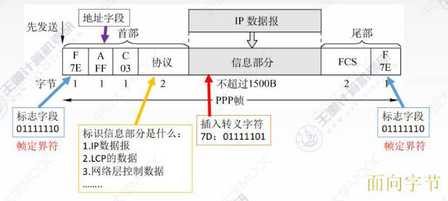

# 功能概述

本章中认为数据是直接从一个数据链路层传至另一个数据链路层

## 基本概念

- 结点：主机、路由器

- 链路：网络中两个结点之间的物理通道

    链路的传输介质主要有双绞线、光纤和微波。分为有线链路和无线链路

- 数据链路：网络中两个结点之间的逻辑通道

    把实现控制数据传输协议的硬件和软件加到链路上就构成数据链路

- 帧：链路层的协议数据单元，封装网络层数据报

## 功能概述

数据链路层在物理层提供服务的基础上向网络层提供服务

最基本的服务是：将网络层来的数据可靠的传输到相邻结点的目标机网络层

主要作用：加强物理层传输原始比特流的功能 —— 将物理层提供的可能出错的物理连接改造成逻辑上无差错的数据链路，使之对网络层表现为一条无差错的链路（数据链路层把物理层的错误都解决了，网络层就觉得没有错误）

比如：因为物理层没有纠错功能，只会傻傻的传送数据，那如果发生数据丢失或重复，就要链路层来负责解决，比如再发一份

功能：

- 为网络层提供服务：无确认无连接服务、有确认无连接服务、有确认面向连接服务

    确认：接收端收到消息后返回确认帧

    面向链接：消息传送前要先建立连接

- 链路管理：连接的建立、维持、释放（用于面向连接的服务）

- 组帧

- 流量控制：如果接收方接收不过来了就让发送方发慢点

- 差错控制：帧错和位错

---
---

# 封装成帧和透明传输

## 封装成帧

封装成帧：在一段数据的前后部分添加首部和尾部，就构成了一个帧

首部和尾部包含许多控制信息，其中一个重要作用：帧定界 —— 接收端在收到物理层上交的比特流后，根据首部和尾部的标记（帧首部的定界符和帧尾部的定界符），从收到的比特流中识别帧的开始和结束

帧同步：接收方应当能从接收的二进制比特流中区分帧的起始和终止 

## 透明传输

透明传输：不管所传数据是什么样的比特组合，都应当能够在链路上传送。因此链路层就看不见有什么妨碍数据传输的东西

哪有什么岁月静好，不过是有人替你负重前行 —— 如果传送的数据比特组合刚好与某一个控制信息完全一样，就必须采取适当措施，否则接收方会误认为这是某种控制信息。依次来保证数据链路层看来传输是透明的

## 封装成帧的一些方法

### 字符计数法

帧首部使用一个计数字段（第一个字节，八位）来标明帧内字符数

比如第一个帧首部是5，那包括计数字段在内往后数5个都是第一帧

缺点：COunt字段的脆弱性——假如一个帧首部的计数字段错误，影响了该帧的结束字符位置，那后面的所有帧就全错位了

### 字符填充法

我们可以使用SOH（Start of header，帧首部的第一个字节）和EOT（End of transmission，帧尾部的最后一个字节），将它俩设置为特定的比特组合来标识帧开始和帧结束。比如SOH——00000001，EOT——00000100

当传送的帧是文本文件时，由于文本文件的字符都是ASCII码，不会出现与SOH和EOT冲突的比特流，因此本身就是透明传输

当传送的是非ASCII码（比如二进制代码的程序或图像）时，有可能数据部分中会碰巧出现与SOH或EOT相同的比特组合，此时要采用字符填充方法来实现透明传输

在引起误会的数据前边填充一个字节的数据，充当转义字符。转义字符也是一个特定的比特组合。接收方在接收数据时会把所有转义字符去掉

缺点：复杂性、不兼容性

### 零比特填充法“5 1 1 0”

使用SOH和EOT来标记帧首部和帧尾部，不过此时二者比特组合相同，都是01111110

实现透明传输的方法：

1. 在发送端，扫描整个信息字段，只要连续5个1就往后面添一个0（不用管5个1后面是什么，遇到5个1就添0）

2. 在接收端收到一个帧时，先找到标识字段确定边界，再用硬件对比特流进行扫描，发现连续的5个1就把后面的0删除

### 违规编码法

曼彻斯特编码法中，前高后低代表1，前低后高代表0，那高高和低低就是违规编码

我们就用高高和低低来定界帧的起始和终止

是在物理层来实现透明传输

---
---

# 差错控制

差错原因：

概括来说，传输中的差错都是由噪声引起的

- 全局性：由于线路本身电气特性所产生的随机噪声（热噪声），是信道固有的，随机存在的

    解决办法：提高信噪比来减少或避免干扰

- 局部性：外界特定的短暂原因所造成的冲击噪声，是产生差错的主要原因

    解决办法：通常利用编码技术来解决

差错类型：

- 位错：1个比特位出错，1变0，0变1

- 帧错：比如发送1-2-3三个帧

    - 丢失：收到1-3

    - 重复：收到1-2-2-3

    - 失序：收到1-3-2

数据链路层的编码针对的一组比特，通过冗余码的技术实现检测一组二进制比特串在传输过程中是否出现了差错

冗余编码：在数据发送之前，先按某种关系附加上一定的冗余位，构成一个符合某一规则的码字后再发送。当发送的数据变化时，就会打破这一规则，从而检测出差错

有效传输：发送端发的什么，接收端就接的什么。—— 所以检错编码并不能实现有效传输，因为会直接把错误帧丢弃，纠错编码能实现有效传输

## 位错

### 检错编码——奇偶校验码

在原有效数据低位（后面）加一位校验元，即要传输的n位数据中有1位校验元，n-1位信息元

- 奇校验码：加完校验元后保证n个数据中1的个数为奇数

- 偶校验码：加完校验元后保证n个数据中1的个数为偶数

只能检测出奇数个比特错误，检错效率50%。如果两个比特一起变就可能检测不出来

### 检错编码——CRC循环冗余码

1. 准备待传的有效数据，分为大小相同的几个组，假设每组都有d位

2. 每个组都在低位（后面）加上r位冗余码（也叫FCS帧检验序列）构成帧再发送，每组就是d+r位

    计算r位冗余码：

    - 加0：假设生成多项式的阶为r，则在有效数据后加r个0（如果给的是比特序列，那就是比特位数-1）

    - 模2除法：数据加0后除以生成多项式，余数就是冗余码。
 
        这里的除是模2除法，正常列竖式做乘法，但是把中间减的步骤换为异或

        

3. 接收端检错过程：把每一个帧都除以生成多项式，然后检查得到的余数R

    如果R=0，则判定这个帧没有错；如果R不为0，判定这个帧有差错，直接丢弃

FCS的生成以及接收端CRC检验都是由硬件实现的，处理很迅速

凡是接收端数据链路层接收的帧均认为无差错

### 纠错编码——海明码

海明距离：两个合法编码（码字）的对应比特取值不同的比特位数称为这两个码字的海明距离（码距）；一个有效编码集中，任意两个合法编码（码字）的海明距离的最小值称为该编码集的海明距离（码距）

如果编码系统中码距是n，可以检测出n-1位错，纠正n-2位错

要检测n位错误，需要码距为n+1；要纠正n为错误，需要码距为2n+1

海明码编码过程：（要发送的数据D=1100）

1. 确定校验码位数r

    数据有m位，冗余码/校验码有r位 —— 则校验码一共有2^r种取值 —— 只要2^r ≥ m+r+1（海明不等式），就能覆盖所有错误种类（m+r任意一位出错，再加上没有错误）

    m=4，求得r=3（穷举法），则最后数据共7位，4位数据，3位校验码

2. 确定校验码和数据的位置

    

    校验码放在序号为2^n的位置，数据按序填上（从低位到高位排序，即左大右小）

3. 求出校验码的值

    

    每位校验码采用通配符的形式确定自己的管辖范围
    
    - 第4位的二进制是100，那么所有1**——100（4）、101（5）、110（6）、111（7）都归第4位的校验码管

    - 第2位的二进制是010，那么\*1*——010、011、110、111都归第2位的校验码管

    - 第1位的二进制是001，那么**1——001、011、101、111都归第1位的校验码管

    在每个校验码的管辖范围内，使用偶校验

    - 第4位1**管的四个数据里，保证要有偶数个1，由于111、110是1，101是0，所以100校验码是0

    - 第2位\*1*管的四个数里，保证要有偶数个1，是0

    - 第1位是1

4. 检错和纠错

    若接收方收到的数据是1110001

    

    - 4号校验码管辖的数据为：0，1，1，1

    - 2号校验码管辖的数据为：0，0，1，1

    - 1号校验码管辖的数据为：1，0，1，1

    其中1号和4号不满足偶校验，管辖的数据里发生差错；2号校验码满足偶校验，管辖的数据都是正确的

    那么我们可以用集合的方法，求出1和4的交集，再让2减去1和4的交集

    或者：求三个方程

    1. x4 0 1 1 1 满足偶校验 —— x4 = 1

    2. x2 0 0 1 1 满足偶校验 —— x2 = 0

    3. x1 1 0 1 1 满足偶校验 —— x1 = 1

    所以是第101（5）位出现错误，即x4 x2 x1位

## 帧错

在传输层解决

---
---

# 流量控制和可靠传输机制

## 数据链路层的流量控制概述

较高的发送速度和较低的接受能力不匹配，会造成传输出错，因此要进行流量控制

数据链路层的流量控制是点对点的（两个相邻节点之间的，比如交换机A与交换机B之间）；而传输层的流量控制是端到端的（发送方与接收方之间）

数据链路层的流量控制手段：接收方收不下就不回复确认；传输层的流量控制手段：接收端给发送端一个窗口公告

流量控制方法主要是滑动窗口

滑动窗口不止可以流量控制，还可以可靠传输，因为有自动重传机制

## 停止-等待协议

除了比特出差错，底层信号还会出现丢包问题；还需要实现流量控制，因此有停等协议

### 停等协议——无差错情况

每发送一个帧就停止发送，等待对方的确认，在收到确认后再发送下一个帧

每个正在发送中的帧必须有独一无二的编号，由于每发送一个数据帧就停止并等待，所以用1bit来编号就足够。上面的0帧和下面的0帧并不是同一帧，只是编号相同

### 停等协议——有差错情况

**数据帧丢失或检测到帧出错**

帧出错后接收方直接丢弃数据，也不返回确认帧

- 超时计时器：每次发送一个帧就启动一个超时计时器，当计时器到期时还没有收到确认帧，就重发

    设置的重传时间应当比帧传输的平均RTT（往返时延）更长一些

- 发完一个帧后，必须保留它的副本

- 数据帧和确认帧必须编号

    保证发出的帧和收到的确认帧是相匹配的

**ACK（确认帧）丢失**

- 接收方看到发来两个一样的帧，就会丢弃重复的1号帧，并重传ACK1。此时就要依靠编号的作用

**ACK迟到**

发送1帧的时候是收到了0帧的确认，发现不匹配就会直接丢弃

### 性能分析

信道利用率：发送方在一个发送周期内，有效地发送数据所需要的时间占整个发送周期的比率

`信道利用率 = （L/C）/ T`

- T：发送周期：从开始发送数据，到收到第一个确认帧为止

- L：T内发送了L比特的数据

- C：发送方的数据传输率

信道吞吐率：`=信道利用率*发送方的发送速率`

停等协议信道利用率：

信道利用率比较低，发送方大部分处于空闲状态，在等数据在路上跑

---

## 滑动窗口

发送窗口：发送方维持一组连续的允许发送的帧的序号。

在发送窗口内的帧才允许发送，一般滑动窗口是收到确认帧之后才允许往前移动窗口

接收窗口：接收方维持一组连续的允许接收帧的序号

接收窗口是0号帧，就是接收方只允许接收0号帧，发来1号帧我不要

若采用n个比特对帧编号，那么发送窗口的尺寸Wt应满足`1 ≤ Wt ≤ 2^n-1`

在停等协议中，发送窗口和接收窗口的大小都是1

## 滑动窗口协议——后退N帧协议（GBN）

发送窗口有n个，接收窗口只有1个

1. 发送方在发送完0号帧后，可以不用等确认帧继续发送 发送窗口中有的帧

2. 接收方在接收到0号帧后发一个确认帧，接收窗口右移

3. 发送方收到确认帧之后，发送窗口也右移

接收方可以累计确认，比如收到1号后右移一格不确认，收到2号再右移一格不确认，收到三号再右移一格，然后发送确认帧，发送方虽然只收到ACK3，但是它知道前面都正确接收了，就直接右移三格。接收方必须一格一格移动

发送窗口可以分为四个部分：

- 发完被确认的

- 发送了在等待确认的

- 还能发送的

- 还不能发的

### GBN发送方必须响应的三件事

1. 上层的调用：即来自网络层的要发送数据的调用

    收到调用后，发送方会先检查发送窗口是否已满，没满就产生一个帧并将其发送；满了就将数据返回上层，告诉上层窗口已满，上层等一会儿再发送（实际发送方可以先接收然后放到缓存区中）

2. 收到了一个ACK

    说明自己要移动窗口了

    在GBN协议中，对n号帧的确认采用累计确认的方式，标明接收方已经收到n号帧和它之前的全部帧

3. 超时事件：协议的名字为后退N帧/回退N帧，就来源于出现丢失和时延过长帧时发送方的行为

    如果出现超时，发送方重传所有已发送但未被确认的帧

    比如：发送方发完一号帧，继续发送2、3、4帧，但是1帧丢了，后面接收方虽然收到了2、3、4，但是不会接收而是直接丢弃。等待超时计时器到时间之后，发送方就会重传1、2、3、4帧

### GBN接收方要做的事

如果正确收到n号帧，并且按序（即n号帧处于接收窗口中），那么接收方为n帧发送一个ACK，并将该帧中的数据部分交付给上层

其余情况都丢弃帧，并为最近按序接收的帧重新发送ACK。接收方无需缓存任何失序帧，只需要维护一个信息：expectedseqnum（下一个按序接收的帧序号）

比如接收方收到了0、1、2，它维护的expectedseqnum就知道下一个要接收3号帧。但是3号帧没来，来了4、5号帧，那它就都丢掉，并重新发送2号的ACK

### GBN协议重点总结

1. 累计确认（偶尔捎带确认）

    双方会互相发数据，那就可以把确认帧放在要发送的数据里一起发送过去

2. 接收方只按顺序接收帧，不按序就会无情丢弃

3. 丢弃数据之后会再次确认序列号最大的、按序到达的帧

4. 发送窗口最大为2^n-1，接收窗口为1

### GBN协议性能协议

优点：因连续发送数据帧而提高了信道利用率

缺点：在重传时必须把原来已经正确传送的数据帧重传，使传送效率降低

---

## 滑动窗口协议——选择重传协议（SR）

GBN的累计确认导致了批量重传的问题，为了解决这个问题，可以设置单个确认，同时加大接收窗口，设置接收缓存，缓存乱序到达的帧

发送窗口和接收窗口都有多个，但是窗口中头部的帧收到确认帧或者收到之后才能移动窗口

### SR发送方必须响应的三件事

1. 上层的调用

2. 收到了一个ACK

    如果收到ACK，发送方将被确认的帧标记为接收。如果该帧需要是窗口的下界（位于窗口最左边），则窗口向前移动到还未被标记为确认的最小序号帧处。移动后的窗口内如果有未发送帧，则发送这些帧

3. 超时事件

    每个帧都有自己的定时器，一个超时时间发生后只重传一个帧

### SR接收方要做的事

来者不拒（只接收 接收窗口内的帧）

SR接收方将确认一个正确接收的帧而不管其是否按序，失序的帧将被缓存，并返回给发送方一个确认帧。直到前面缺失所有帧都被收到，才将一批帧按顺序交付给上层，然后向前移动滑动窗口

如果收到了窗口序号之外小于窗口下界的帧（说明这帧其实已经收到过了），就返回一个收到的重复帧的ACK

其它情况直接丢弃

### 滑动窗口的长度

发送窗口最好等于接收窗口（大了会溢出，小了没意义）

WTmax = WRmax = 2^(n-1)

n是用来给帧编号的比特数，GBN是2^n

如果窗口长度大于这个极限值，发送方就可能在还没有收到上一个ATK0的情况下就能发送下一个不同的0号帧了，那等上一个ATK0超时又会发上一个0号帧，此时接收方就会搞不清楚

### SR协议重点总结

1. 对数据帧逐一确认，收一个确认一个

2. 只重传出错帧

3. 接收方有缓存

4. 滑动窗口长度最大为2^(n-1)

---
---

# 介质访问控制（MAC，Multiple Access Control）

传输数据使用的两种链路：

- 点对点链路：两个相邻结点通过一个链路相连，没有第三者。

    应用：PPP协议，常用于广域网

- 广播式链路：所有主机共享通信介质

    应用：早期的总线以太网、无线局域网，常用于局域网

    典型拓扑结构：总线型、星型（逻辑总线型）

介质访问控制：采取一定的措施，使得两对结点之间的通信不会发生互相干扰的情况

- 静态划分信道——信道划分介质访问控制协议

    - 频分多路复用FDM（Frequency）

    - 时分多路复用TDM（Time）

    - 波分多路复用WDM（Wave）

    - 码分多路复用CDM（Code）

- 动态分配信道

    - 轮询访问介质访问控制：令牌传递协议

    - 随机访问介质访问控制协议（随机访问MAC协议）：ALOHA协议、CSMA协议、CSMA/CD协议、CSMA/CA协议

## 信道划分介质访问控制（静态划分信道）

将使用介质的每个设备与来自同一信道上的其它设备的通信隔离开，把时域和频域资源合理地分配给网络的设备

多路复用技术：把多个信号组合在一条物理信道上进行传输，使得多个计算机或终端设备共享信道资源，提高信道利用率

实际上是把一条广播信道逻辑上分成几条用于两个结点之间通信的互不干扰的子信道，把广播信道转变为点对点的信道

### 频分多路复用FDM——并行

每个用户占据一个频段，在通信过程中自始至终都占用这个频带。

频分复用的所有用户在同样的时间占用不同的带宽（频率带宽）资源

优点：充分利用传输介质带宽，系统效率高，由于技术比较成熟，实现也比较容易

### 时分多路复用TDM——并发（时间片轮转）

将时间划分为一段段等长的时分复用帧（TDM帧，是在物理层传送的比特流所划分的帧，和数据链路层的帧没关系）。

每一个时分复用的用户在每一个TDM帧中占用固定序号的时隙，所有用户轮流占用信道。比如主机A只能在A帧的时间中使用信道，这个时间内也只能让A使用

**改进的时分复用——统计时分复用STDM**

各用户有了数据就随时发往集中器的数据缓存。集中器按顺序扫描输入缓存，把缓存中的输入数据放入STDM帧中，一个帧满了就发出。按需动态分配时隙

帧长：如果一个信道的带宽是8000bit/s，规定周期为1s，那么一个TDM帧或STDM帧就是8000bit。对于TDM，每个用户最高都是2000bit/s,对于STDM，一个人最高是可以达到8000bit/s

### 波分多路复用WDM

就是光的频分多路复用

在一根光纤中传输多种不同波长（频率）的光信号，由于波长（频率）不同，所以各路光信号互不干扰，最后再用波长分解复用器将各路波长分解出来

### 码分多路复用CDM

A、B两个源站要发送数据，发送到C后再分解

码分多址（CDMA）是码分复用的一种方式

每一个bit都被分为多个码片/芯片（chip），每一个站点被指定一个唯一的m位的芯片序列，发送这一bit时发送芯片序列（通常把0写成-1）

比如A对应的芯片序列是S=00011011，B对应的芯片序列是T=00101110。A现在要发送1bit数据，这个bit是1，它不发1，而是发S序列；B要发0，它不发0，而是发T序列的反码，即-T

当A、B站点同时发送数据时

1. 要求各个站点的芯片序列相互正交，规格化内积为0

    `S·T=0`

2. 两个向量到了公共信道上，线性相加

    `S + (-T)`

3. 到达C后，进行数据分离：合并的数据和源站规格化内积

    `A : S·(S-T)=1`

    `B : T·(S-T)=-1` 也就是0

---

## 动态划分信道

也叫动态动态媒体介入控制/多点接入

信道并非在用户通信时固定分配给用户

### ALOHA协议

**纯ALOHA协议：**

不监听信道，不按时间槽发送，随机重发，想发就发

如果发生冲突（比如一个站点数据帧发到一半另一个站点的数据也开始发了），接收方就会检测出差错，然后不予确认，发送方在一定时间内收不到确认就会判断发生冲突

超时后等一随机时间再重传

很容易产生冲突，吞吐量低，效率低

**时隙ALOHA协议：**

控制想发就发的随意性

把时间分成若干个相同的时间片，所有用户在时间片开始时刻同步接入网络信道，若发生冲突，则必须等到下一个时间片开始时刻再发送

要按照时间片（时间槽发送）

### CSMA协议

载波监听多路访问协议CSMA（carrier sense multiple access）

- CS：载波侦听/监听，每一个站在发送数据之前要检测一下总线上是否有其它计算机在发送数据

        当几个站同时在总线上发送数据时，
        总线上的信号电压摆动值将会增大（由于互相叠加）

- MA：多点接入，表示许多计算机以多点接入的方式连接在一根总线上

协议思想：发送帧之前，监听信道。信道空闲时发送完整帧，信道忙时推迟发送

**1-坚持CSMA：** 监听信道忙就一直监听
 
- 如果一个主机要发送消息，那么它先监听信道

    空闲则直接传输，不必等待；忙则一直监听，直到空闲马上传输

    如果数据传输之后发生冲突（一段时间内未收到肯定恢复），则等待一个随机长的时间再监听，重复上述过程

- 优点：只要媒体空闲，站点马上发送，避免了媒体利用率的损失

- 缺点：如果有两个或两个以上的站点有数据要发送，冲突就不可避免（监听到空闲就会一起发送，导致冲突）

**非坚持CSMA：** 监听信道忙后就不继续监听

- 如果一个主机要发送消息，那么它先监听信道

    空闲则直接传输，不必等待；忙则等待一个随机的时间之后再进行监听

- 优点：采用随机的重发延迟时间可以减少冲突发生的可能性

- 缺点：可能存在媒体处于空闲状态，但是大家都在延迟等待过程中，导致媒体使用率低

**p-坚持CSMA：** 是对监听信道空闲的处理

- 如果一个主机要发送信息，那么它先监听信道

    空闲则以p的概率直接传输，1-p的概率等到下一个时间槽再传输；忙则持续监听直到信道空闲再以p概率发送

    若发送时产生冲突，则等到下一个时间槽开始再监听并重复上述过程

- 优点：既能像非坚持算法一样减少冲突，又能像1-坚持算法那样减少媒体空闲时间

### CSMA/CD协议
 
CSMA协议在发送数据后就不管了，只有收不到确认才知道发生了冲突；也就是说就算遇到冲突也不知道，还再继续发数据，造成资源浪费

载波监听多点接入/碰撞检测CSMA/CD（carrier sense multiple access with collision detection）

- CS载波侦听/监听：在每一个站在发送数据之前以及发送数据时都要检测总线上是否有其它计算机在发送数据（在自己发送站点检测有没有信号进入站点）

- MA多点接入：表示许多计算机以多点接入的方式连接在一根总线上，说明是用于总线型网络

- CD碰撞检测（冲突检测）：边发送边监听，以判断自己在发送数据时其它站是否也在发送数据。说明是用于半双工网络，不允许双方同时发信息

**传播时延对载波监听的影响——争议期的确定**

设单程端到端的传播时延为τ

1. 当A主机的数据传送到一半的时候，B主机也想传送数据。但是B主机在它那侧检测发现总线是空闲的（因为A主机数据还没到B主机），于是B也把数据放到信道上，就发生了碰撞

2. 碰撞之后两边数据信号就叠加在一起，都不能用了，但是A和B都不知道发生了碰撞，信号依然在往前传送。只有叠加后的信号传递到主机后，主机通过差错检测才能知道发生了碰撞。当检测到发生了碰撞之后，就会立即停发数据
 

3. 如果A主机发送的数据马上就要到达B了，B才想发信号，那么B的信号刚放上信道，就与A主机的信号发生碰撞，B立即就能知道发生了碰撞，而A主机需要等碰撞后的信号传到自己才能知道发生了碰撞。所以最慢要在A发送信号后再经过`2*τ`的时间才能知道发生了碰撞。
 
    2τ也称为争议期，如果过了争议期还没有检测到冲突，则认为无冲突

**截断二进制指数规避算法**

用来确定碰撞后的重传时机

1. 确定基本退避（推迟）时间为争用期2τ

2. 定义参数k，它等于重传次数，k=min(重传次数，10)。即重传次数超过10次时，k取10

3. 从离散的整数集合[0,1,...,2^k-1]中随机取一个数r，重传所需退避时间就是r倍的基本退避时间，即2rτ

4. 当重传达16次仍不能成功时，说明网络太拥挤，认为此帧永远无法正确发出，抛弃此帧并向高层报告出错

**最小帧长**

如果帧太短，那还没检测到碰撞就发送完了，所以为了使CSMA/CD协议有它的存在意义，才定义了一个最小帧长。只有CSMA/CD协议中最小帧长才有意义，只是为了给它一个面子

帧长（bit）/ 数据传输速率 ≥ 2 * 传播时延 （2τ）

### CSMA/CA协议

载波监听多点接入/碰撞避免CSMA/CA（carrier sense multiple access with collision avoidance）

用于无线局域网，无线网无法做到360°全面检测碰撞，只能避免碰撞

隐蔽站：当A和C都检测不到信号，认为信道空闲时，就会同时向B发送数据帧，导致冲突，此时C相对于A来说就是隐蔽站

工作过程：

1. 发送数据前，先检测信道是否空闲

2. 空闲则发出RTS（request to send），RTS包括发射端的地址、接收端的地址、下一份数据将持续发送的时间等信息；信道忙则等待

3. 接收端收到RTS后，将响应CTS（clear to send）

4. 发送端收到CTS后，开始发送数据帧；同时预约信道：发送方告诉其它站点自己这次要传多久数据

5. 接收端收到数据帧后，利用CRC来检验数据是否正确，正确则响应ACK帧

6. 发送方收到ACK就可以进行下一个数据帧的发送，若没有则一直重传至规定重发次数为止（采用二进制指数退避算法来确定随机的推迟时间）

避免冲突的三大机制：

1. 预约信道

2. ACK帧

3. RTS/CTS帧（可选）

### 轮询访问 介质访问控制

轮询访问MAC协议/轮流协议/轮转访问MAC协议，既要不产生冲突，又要发送时占全部带宽

**轮询协议：**

主节点轮流邀请从属结点发送数据

实际是主节点分别给从属结点发送比较短的数据帧来询问

问题：

1. 轮询开销

    发送询问的数据帧需要有开销

2. 等待延迟

    对于靠后的主机会等比较久

3. 单点故障

    主节点坏掉就全坏了

**令牌传递协议：**

令牌：一个特殊格式的MAC控制帧，不含任何信息。用于控制信道的使用，确保同一时刻只有一个结点独占信道

1. 没有主机需要发送数据时，令牌就在主机之间转

2.如果主机D需要给主机A发送数据，就会再拿到令牌后修改令牌的标志位，并将要发送的数据放入令牌中，使令牌变为一个数据帧

3. 之后令牌继续转，路过C、D时C、D发现数据不是给自己的就不管，到A后A将数据复制下来，然后继续传

4. 令牌传了一圈回到D后，D会检查数据帧是否出错，如果出错就重发，没错就修改令牌标志位，然后让令牌继续往下传递

每个结点都不能无限制地持有令牌

问题：

1. 令牌开销

2. 等待延迟

3. 单点故障

    如果其中一台主机宕机，整条路就断了

应用于令牌环网，物理上是星型拓扑，逻辑上是环形拓扑

令牌传送常用于负载较重、通信量较大的网络

---
---

# 局域网基本概念和体系结构

局域网（Local Area Network）：简称LAN，是指某一个区域内由多台计算机互联成的计算机组，使用广播信道

特点：

1. 覆盖的地理范围较小

2. 使用专门铺设的传输介质（双绞线、同轴电缆）进行联网，数据传输速率高

3. 通信延迟时间短，误码率低，可靠性较高

4. 各站为平等关系，共享传输信道

5. 多采用分布式控制和广播式通信，能进行广播和组播

决定局域网的主要因素为：网络拓扑，传输介质与介质访问控制方法（MAC协议）

### 局域网拓扑结构

星型拓扑

总线型拓扑（常用，优势大）

环形拓扑

树型拓扑

### 局域网传输介质

有线局域网

无线局域网

### 局域网介质访问控制方法

CSMA/CD

令牌总线

令牌环

## 局域网的分类

1. 以太网：应用最为广泛的局域网

    符合IEEE802.3系列标准规范

    逻辑拓扑：总线型

    物理拓扑：星型或拓展星型

    MAC协议：CSMA/CD

2. 令牌环网：已经是明日黄花

    逻辑拓扑：环形

    物理拓扑：星型

3. FDDI网：光纤分布式数据接口

4. ATM网：较新型的单元交换技术，使用字节固定长度的单元进行交换

5. 无线局域网（WLAN）

    采用IEEE 802.11标准

### IEEE 802系列标准

是IEEE 802 LAN/MAN标准委员会指定的局域网、城域网技术标准（1980年2月成立）

IEEE 802.3：以太网

IEEE 802.5：令牌环网

IEEE 802.8：FDDI网

IEEE 802.11：无线局域网

IEEE 802标准所描述的局域网参考模型只对应OSI参考模型的数据链路层与物理层

它将数据链路层又分为

- 逻辑链路层LLC子层——挨着网络层

    LLC负责识别网络层协议，然后对它们进行封装。

    为网络层提供服务：无确认无连接、面向连接、带确认无连接、告诉传送

- 介质访问控制MAC子层

    主要功能包括数据帧的封装/卸装，帧的寻址和识别，帧的接收与发送，链路的管理，帧的差错控制等

    MAC子层的存在屏蔽了不同物理链路种类的差异性

## 以太网（Ethernet）

以太网是由Xerox公司创建并由Xerox、Intel和DEC公司联合开发的基带总线局域网规范，是当今现有局域网采用的最通用的通信协议标准。使用CSMA/CD技术

### 以太网在局域网各种技术中占统治性地位的原因：

1. 造价低廉

2. 是应用最广泛的局域网技术

3. 比令牌环网、ATM网便宜，简单

4. 满足网络速率要求：10Mb/s ~ 10Gb/s

### 以太网的两个标准

- DIX Ethernet V2：第一个以太网规约

- IEEE 802.3：以太网也叫802.3局域网

满足任何一个标准都可以看作以太网

### 提供的是无连接、不可靠的服务

- 无连接：发送方和接收方无需握手

- 不可靠：不对发送方的数据帧编号，接收方不向发送方进行确认，差错帧直接丢弃，差错纠正由高层负责
    
只实现无差错接收，不实现可靠传输

### 10BASE-T以太网

是传送基带信号的双绞线以太网

- BASE：传送的是基带信号（数字信号）

- T：twisted双绞线，采用的是无屏蔽双绞线UTP

- 10：传输速率是10Mb/s

物理上星型拓扑，逻辑上总线型，每段双绞线最长为100m

采用曼彻斯特编码

采用CSMA/CD

### 适配器和MAC地址

计算机与外界局域网的连接是通过通信适配器的，也就是网卡（现在一般都集成在显卡上）

适配器上装有处理器和存储器，存储器包括RAM和ROM，ROM上有计算机的硬件地址，即MAC地址(也称以太网地址、局域网硬件地址)

在局域网中，硬件地址又称为物理地址，或MAC地址，唯一标识了一台设备

MAC地址：每个适配器有一个全球唯一的48位二进制地址，前24位代表厂家，后24位厂家自己指定，常用6个16进制数表示

### 以太网MAC帧

最常用的MAC帧是以太网V2的格式

- 前导码：用于发送方和接收方进行时钟同步，和帧开始定界符，不属于MAC帧

- 目的地址：接收方的地址

    - 单播地址：发送给一个固定的MAC主机

    - 广播地址：发送给所有主机

    - 多播地址

- 源地址：发送方的地址

- 类型：指明网络层使用的是什么协议

- 数据部分：大小范围位 46~1500 B ，因为CSMA/CD协议要求帧最短64B，减去其它的算出数据最少46B

- FCS：帧检验序列

由于使用的曼彻斯特编码，当电压不变化就说明没数据了

### 高速以太网

速率≥100Mb/s的以太网称为高速以太网

1. 100BASE-T以太网

    在双绞线上传送100Mb/s基带信号的星型拓扑以太网，使用IEEE802.3的CSMA/CD协议

    支持全双工和半双工，可在全双工方式下工作而无冲突

2. 吉比特以太网

    在光纤或双绞线上传送1Gb/s信号

    支持全双工和半双工，可在全双工方式下工作而无冲突

3. 10吉比特

    在光纤上传输10Gbit/s的信号

    只支持全双工，无冲突

---

## 无线局域网

### IEEE 802.11标准

是无线局域网通用的标准，是IEEE所定义的无线网络通信标准

802.11的MAC帧头格式：

基本服务集BSS1中的主机H1给BSS2中的一台主机发送数据，会先通过802.11协议，将数据发往BSS1中的服务接入点AP1，再由服务接入点AP1传到路由器，由于二者是有线连接，所以使用的协议是802.3协议

- 地址1：接收该帧的MAC地址，也就是AP1的地址

- 地址2：传输该帧的MAC地址，也就是H1的地址

- 地址3：子网连接路由端口的MAC地址，也就是路由器R1的地址

- 地址4：通常用于自组织模式

当消息经过路由器发给H1时，数据流向为：路由器R1 --> 服务接入点AP1 --> 主机H1，此时地址1是H1，地址2是AP1，地址3依然是R1

### 无线局域网分类

有固定基础设施无线局域网

- 有比如路由器、交换器、基站等固定设施

无固定基础设施无线局域网的自组织网络

- 没有固定设施，有几台主机组成的网络，每台主机都可以作为路由器

---

## VLAN 虚拟局域网

### 传统局域网的局限

- 缺乏流量隔离：由于是采用广播网络，广播流量会跨越整个机构网络

- 管理用户不变：如果一个主机在不同组间移动，必须改变物理布线，连接到新的交换机上

- 路由器成本较高

### VLAN基本概念

虚拟局域网VLAN（Vitrual Local Area Network）是一种将局域网内的设备划分成与物理位置无关的逻辑组的技术。每个VLAN是一个单独的广播域/不同的子网

从逻辑上把局域网拆分成更小的局域网，构成逻辑上的广播域

### VLAN实现

基于接口（端口）的VLAN技术：

基于MAC地址的VLAN技术

只能实现同一个VLAN中的访问，不同的VLAN访问需要借助路由器或者三通交换机

当处于一个VLAN中的主机发送广播数据时，交换机就会检查VLAN表，找到与发送数据主机同一VLAN中的设备发送

如果单独给特定主机发数据，检查交换机的VLAN表，当发送和接收数据的主机在同一VLAN中就直接发

如果发现在同一VLAN中，但是连接在不同交换机下，就交给交换机，交换机会贴上一个VLAN标记，然后发到另一个交换机中，然后再指定主机中

VLAN标记共4字节，以太网的MAC帧加上VLAN标记就变成了802.1Q帧。

- 前两个字节标明是IEEE 802.1Q帧，

- 接下来4位没用，
 
- 后面12位是VLAN标识符VID，唯一表示了该以太网帧属于哪个VLAN

主机和交换机之间只会发送普通MAC帧，交换机与交换机之间才会发送802.1Q帧。接收方的交换机会把VLAN标记去掉之后再给对应主机

A和E可以实现访问，但是A和C、D，G、H都不能实现访问，因为不在同一虚拟局域网中

---

## 广域网（WAN，Wide Area Network）及相关协议

广域网：通常跨界很大的物理范围，所覆盖的范围从几十公里到几千公里，能连接多个城市或国家，或横跨几个洲并能提供远距离通信，形成国际性的远程网络

广域网的通信子网主要使用分组交换技术。将不同地区的局域网或计算机系统互连起来，达到资源共享的目的。如因特网是世界范围内最大的广域网

### PPP协议

点对点PPP（Point-to-Point Protocol）是目前使用最广泛的数据链路层协议，用户使用拨号电话接入因特网时一般使用PPP协议

只支持全双工

PPP协议应满足的要求：

1. 简单：无需纠错无需序号无需流量控制，都交给上层

2. 封装成帧：在帧前后加上帧定界符

3. 透明传输：异步线路用字节填充，同步线路用比特填充

4. 多种网络层协议

5. 多种类型线路：同步/异步，串行/并行，电/光

6. 差错检测

7. 检测连接状态：链路是否可以正常工作

8. 最大传送单元：数据部分最大长度为MTU

9. 网络层地址协商：知道通信双方的网络层地址

10. 数据压缩协商：发送数据时要将数据压缩

PPP协议的三个组成部分：

- 一个将IP数据报封装到串行链路（同步串行/异步串行）的方法

- 链路控制协议LCP：建立并维护数据链路连接，实现身份验证——物理连接

- 网络控制协议NCP：PPP可支持多种网络层协议，每个不同的网络层协议都要一个响应的NCP来配置，为网络层协议建立和配置逻辑链接——逻辑链接

PPP协议的帧格式：

- 开头和结尾的F（7E，01111110）：帧定界符

- A（FF）、C（03）：地址字段、控制字段：没有赋予意义

- 协议：标识信息部分是什么类型

- FCS：帧检验序列

都是以字节为单位的，数据部分也是整数个字节，所以是面向字节

### HDLC协议

高级数据链路控制（High-Level Data Link Control，HDLC），是一个在同步网上传输数据、面向比特的数据链路层协议，是由ISO根据IBM公司的SDLC（SynchronousData Link Control）协议扩展开发而成的

数据报文可透明传输，用0比特插入法实现，采用全双工通信。所有帧采用CRC实现差错检验，对信息帧进行顺序编号，可防止漏收或重份，传输可靠性高

# 数据链路层设备

## 在物理层扩展以太网

主机和集线器之间电缆的距离不能超过100m，如果实现相隔很远的主机之间的通信，就要在物理层扩展以太网

可以改用光纤的方式连接

也可以用集线器把多个集线器连接起来

每个集线器内都是一个冲突域，即同一时刻只能有一台主机发送数据，如果两台一起发数据就会产生冲突

为了实现远距离传输，可以把多个集线器再连接起来，这样的话就扩大了冲突域。这样可以扩大通信范围，但是会降低通信调律，发生冲突次数会增多

## 在链路层扩展以太网——网桥

网桥：可以根据MAC帧的目的地址对帧进行转发和过滤。

当网桥收到一个帧时，并不向所有接口转发此帧，而是先检查此帧的目的MAC地址，然后再确定将该帧转发到哪一个接口，或者把他丢弃

既实现了跨冲突域的通信，也没有将冲突域合并

优点：

1. 过滤通信量，增大吞吐量

    各个冲突域内的信号传输互不影响

2. 扩大了物理范围

    不同冲突域之间也可以数据传输

3. 提高了可靠性

4. 可互联不同物理层、不同MAC子层和不同速率的以太网

### 透明网桥

透明：指以太网上的站点并不知道所发送的帧将经过哪几个网桥，是一种即插即用的设备。

通过自学习算法实现即插即用：

- 网桥插好之后，内部会维护转发表，但是刚插好的时候网桥并不知道具体的拓扑结构，因此转发表是空的

- 当有主机发的数据经过网桥时，网桥就会自动完善转发表，把发数据的主机地址和对应自己哪个接口收到的数据记录下来

    比如：当A要给B发送数据时，A会在自己的冲突域内广播，B收到数据，网桥也会收到数据。网桥收到数据检查转发表，发现没有A，就把`A-左接口`填入表中，表示A在自己的左边；然后找B，没找到，就继续往右转发，因为它不知道其实B也在自己左边。

### 源路由网桥

源路由网桥：在发送帧时，把详细的最佳路由信息（经过的路由器最少或时间最短）放在帧的首部中

找到最佳路径的方法：

源站（发送信息的站）会以广播方式向欲通信的目的站发送一个发现帧。

由于是广播的方式，这个发现帧会以所有可能的路径达到终点，然后重点会返回一个帧，此时源站就知道了所有可能的路径，然后做出选择

---

## 以太网交换机——多接口网桥

网桥通常只有两个端口，以太网交换机通常有十几个端口，每个端口都可以连在集线器上，或者直接连在主机上

每一个端口引出的区域都是一个冲突域

可以独占传输媒体带宽，如果以太网交换机的带宽是10Mb/s，那下面的每个集线器或者主机都能分得10Mb/s

### 直通式交换机

查完目的地址(大小为6B)就立刻转发

延迟小

但是可靠性低（不进行差错检测）；无法支持具有不同速率的端口的交换

交换机也具有自学习功能，和网桥一样

### 存储转发式交换机

将帧放入高速缓存，并检查是否正确，正确则转发，错误则丢弃

延迟大，可靠性高，可以支持具有不同速率的端口的交换

## 冲突域和广播域

冲突域：在同一个冲突域中同一时间内只能有一台设备发送信息

广播域：网络中能接收任意设备发出的广播帧的所有设备的集合。就是如果站点发出一个广播信号，所有能接收到这个信号的设备范围称为一个广播域

