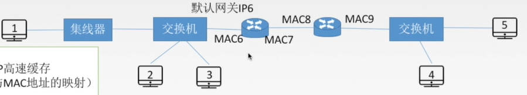

# 1. 网络层基本概念

网络层的主要任务是实现源主机与目的主机之间（点对点）的通信

网络层向上只提供简单灵活的、无连接的、尽最大努力交付的数据报服务，这就使得网络层中的路由器比较简单，并且价格低廉。

网络层传输单位是数据报

## 1.1 网络层功能

### 1.1.1 路由选择与分组转发

路由选择：确定分组下一步要发往哪里。即根据路由选择协议构造出一张路由表

分组转发：一个分组到达网络层时路由器所采取的动作。即根据路由表将数据报从合适的端口转发出去。

### 1.1.2 异构网络互联

全球范围内有数以百万计的网络，这些网络根据用户需求的不同有着不同的寻址方案、网络接入机制、差错处理方法等

网络层需要让这些异构的网络实现互联

异构网络指数据链路层和物理层均不相同，比如传输介质、数据编码方式、链路控制协议、数据单元格式和转发机制等不尽相同

### 1.1.3 拥塞控制

当过量分组进入网络时，由于路由器端口缓冲区有限制，会导致大量分组在到达路由器后被丢弃，整个网络的吞吐量骤降，网络出现拥塞。

流量控制是发送端和接收端之间点对点的通信量控制，而拥塞控制则是一个全局性问题，要保证整个网络中存在的报文没超过网络承载力。

## 1.2 SDN的基本概念

网络层的主要任务是路由选择和转发，可以将网络层抽象地划分为数据层面和控制层面，其中控制层面负责路由选择，数据层面负责转发

在传统互联网中，每个路由器都有控制层面和数据层面

SDN（Software-Defined Networking）则是将路由器的控制层面集中起来，形成一个远程控制器。这样的话路由器中就只用保留数据层面，只用做收到分组、查找转发表、转发分组等工作；由远程控制器掌握整个网络的状态，为每个分组计算出最佳路由，通过Openflow协议将转发表下发给路由器。

**远程控制器**

远程控制器可能在具有高可靠性的远程数据中心中，并由ISP或第三方管理

控制层面的组成

1. SDN控制器

    维护准确的网络状态信息；并为运行在控制平面中的网络控制应用程序提供这些信息

    分为三层

    - 对于网络控制应用程序的接口（北向接口，向上）：与网络控制应用程序进行交互的接口

    - 网络范围状态管理层：负责维护网络状态信息

    - 通信层（南向接口，向下）：与下层网络设备（路由器）的信息交互，得到网络状态（通过Openflow协议）

2. 网络控制应用程序：

    根据SDN控制器提供的方法，监视、编程和控制下面的网络设备

# 2. 路由算法

路由器中的路由表/转发表是由路由算法得到的

根据能否随网络的通信量或拓扑自适应地调整变化，可以将路由算法分为 静态路由算法 和 动态路由算法

## 2.1 静态路由算法（非自适应路由算法）

管理员手工配置路由信息

- 优点：简便、可靠，在负荷稳定、拓扑变化不大的网络中运行效果很好，广泛用于高度安全性的军事网络和较小的商业网络

- 缺点：路由更新慢，不适用大型网络

## 2.2 动态路由算法（自适应路由算法）

路由器间彼此交换信息，按照路由算法优化出路由表项

- 优点：路由更新快，适用大型网络，可以及时响应链路费用（路径的代价）或网络拓扑变化

- 缺点：算法复杂，增加网络负担

分类：

  - 全局性：链路状态路由算法OSPF

      所有路由器掌握完整的网络拓扑和链路费用信息

  - 分散性：距离向量路由算法RIP

      路由器只掌握物理相连的邻居及链路费用

## 2.3 层次路由

**存在的问题**

- 因特网规模很大，如果所有路由器都知道整个因特网的结构，那路由表会很大

- 许多单位不想让外界知道自己的路由选择协议，但还想连入因特网

**自治系统**

基于以上两点原因，因特网将整个互联网划分为许多较小的自治系统（自治系统内包含很多局域网），每个自治系统自主决定本系统内采用的路由选择协议。

自治系统（AS）：在单一的技术管理下的一组路由器，这些路由器使用一种AS内部的路由选择协议和共同的度量以确定分组在该AS内的路由，同时还使用一种AS之间的路由协议以确定在AS之间的路由

内部网关协议（IGP）：一个自治系统内使用的路由选择协议称为内部网关协议，也称域内路由选择协议，具体的协议有RIP和OSPF等

一个AS内的所有网络都属于一个行政单位来管辖，一个自治系统的所有路由器在本自治系统内都必须连通

**自治系统间通信**

由于每个系统使用的路由选择协议都不相同，如果两个自治系统需要通信，就需要一种协议来屏蔽这种差异，即外部网关协议

外部网关协议（EGP）：用于在不同自治系统之间的路由器之间交换路由信息，并负责为分组在不同的自治系统之间传递时选择最优路径。具体的协议有BGP

**所有的路由选择协议**

- 内部网关协议IGP

    一个AS之内使用的

    比如：RIP、OSPF

- 外部网关协议EGP

    AS之间的

    比如：BGP

# 3. IPv4

## 3.1 IP数据报格式

分为首部和数据部分（TCP、UDP段）

固定部分有20字节，每个数据报都有，里面包括

- 版本：是IPv4还是IPv6。占4位

- 首部长度：首部的长度，即固定部分和可变部分加起来一共多少

    占4位，单位是4B，通过填充保证首部一定是4字节的整数倍。最小是5，因为固定部分就有20B，首部最少就是20B

- 区分服务：占8位，指示期望获得哪种类型的服务，没什么用

- 总长度：占16位，首部长度+数据长度，单位是1B

    所以数据报长度是有上限的，2^16-1 B，过大就会将数据报分组

- 标识、标志、片偏移

- 生存时间（TTL）：占8位，IP分组的保质期，经过一个路由器就-1，变成0就丢弃

    为了防止数据报在网络中无限制兜圈子

- 协议：占8位，数据部分使用的协议（即网络层的上层传输层使用的协议）

    TCP对应的协议字段值是6，UDP是17

- 首部检验和：占16位，用来检验首部，判断数据报是否出错

- 源地址：32位

- 目的地址：32位

可变部分：

- 可选字段（长度可变：0~40bit）

    用来支持排错、测量以及安全等措施

- 填充字段：保证首部长度是4B的整数倍

**IP数据报分片**

MTU：在链路层中每一个数据帧都有上限，即最大传送单元MTU，比如以太网的MTU是1500字节

分片：网络层的整个IP分组（首部+数据部分）在数据链路层包装的数据帧中充当数据部分，因此IP分组总长不能超过MTU。当长度超过MTU时，就要分片

**标识、标志、片偏移**

标识：16位，同一数据报的分片使用同一标识，用来标记分片属于哪个数据报

标志：3位，但是只有两位有意义

- 最高位：保留

- 第二位（中间位）：DF（Dont't Fragment）

    DF=1：禁止分片；DF=0：允许分片

- 最低位MF（More Fragment）：如果DF=1禁止分片，那这个位就没意义

    MF=1：后面还有分片

    MF=0：代表这是最后一个分片，或者这个数据报没有分片

片偏移：占13位，指出较长分组分片后，该片在原分组中的相对位置，

- 单位是8B：因此可以推出，每个分片的长度一定都是8B的整数倍（除了最后一个分片）

    比如片偏移字段值是1，表示这个片在原数据报中从8B开始

分片后，每个片依旧有最少20B的首部，首部大小随原数据报

一总八片首4：总长度单位是1B，片偏移单位是8B，首部长度单位是4B

## 3.2 IP地址

IP地址：全世界唯一的32位(4字节)标识符，标识路由器或主机的接口（一个主机可能有多个接口，每个接口都有一个IP地址）

三大历史阶段：

- 分类的IP地址

- 子网的划分

- 构成超网（无分类编址方法）

一台主机可以有多个IP地址，但是这多个IP地址必须分属不同的子网

**IP地址格式**

`{<网络号><主机号>}`

比如`11011111 00000001 00000001 00000001`

用点分十进制表示为：`223.1.1.1`，每八位用十进制标识，中间用点隔开

**IP地址应用**

- 三个路由器将网络分为了三个广播域，IP地址分别为：222.1.1.x，222.1.2.x，222.1.3.x

- 每个广播域中的每台主机都有一个自己的主机号

- 在IP地址为222.1.2.x的区域中，虽然有网桥，但是网桥并不能划分广播域

- 每个路由器都有三个端口，因此还有222.1.4.x，222.1.5.x，222.1.6.x三个IP地址，也是网络但是只有一条链路组成，称为无编号网络（无名网络）

### 3.2.1 分类的IP地址

- A类：

    最大可用网络数：2^7-2（1~126）

    每个网络中的最大主机数：2^24-2

    全0和全1都是特殊IP地址

- B类：

    最大可用网络数：2^14-1（128.1~191.255）

    每个网络中的最大主机数：2^16-2

- C类：

    最大可用网络数：2^21-1（192.0.1~223.255.255）

    每个网络中最大的主机数：2^8-2

**特殊的IP地址**

- `0.0.0.0`网络号全0，主机号全0：表示本网范围内的一台主机。

    只能用作源地址，不能作为目的地址

- `0.0.0.x`网络号全0，主机号特定值：表示本网络范围内的某台特定主机

    只能用作源地址，不能作为目的地址

- `255.255.255.255`网络号全1，主机号全1：表示本网络的广播地址，即向本网络（广播域内）的所有主机发送广播

    不能用作源地址，只能作为目的地址

- `x.x.x.0`网络号为特定值，主机号全0：是一个网络地址，表示一个网络

    不能用作源地址或者目的地址

- `x.x.x.1`网络号为特定值，主机号全1：直接广播地址，对特定网络上的所有主机进行广播

    不能作为源地址，只作为目的地址

- `127.x.x.x`网络号为127，主机号为任意数（非全0/1）：用于本地软件的环回测试，数据报不会出本主机

    可以作为源地址，也可以作为目的地址

私有IP地址：内部网络的IP地址

- A类地址：`10.0.0.0~10.255.255.255`网段个数为1

- B类地址：`172.16.0.0~172.31.255.255`网段个数为16

- C类地址：`192.168.0.0~192.168.255.255`网段个数为256

**网络地址转换NAT**

路由器对目的地址是私有IP地址的数据报一律不进行转发，因此需要NAT技术实现与因特网的通信

网络地址转换NAT（Network Address Translation）：在专用网连接到因特网的路由器上安装NAT软件，安装了NAT软件的路由器叫NAT路由器，它至少有一个有效的外部全球IP地址

即允许一个公网地址给多个内网主机使用

NAT转换表：有WAN端和LAN端两列，实现了内网IP和外网IP的一一对应

- WAN端：外网IP，全球IP地址

- LAN端：内网IP，本地主机的私有IP地址

外网IP通过不同的端口号来区分内网中的不同主机，内网主机的每个端口号都会唯一对应一个外网IP端口号，所以一个主机会对应多个外网IP端口号

进行数据传输时，通过查NAT转换表将内网主机中进行数据传输的程序端口号转化为外网IP，然后进行数据传输

为已知的内部IP添加外网端口是管理员的工作，如果查询不到对应的端口路由器就会把数据报直接丢弃

只有使用了NAT时数据传输中IP地址才会改变，否则IP永远不会变，只有MAC地址会变

**分类的IP地址的弱点**

1. IP地址空间的利用率有时很低

    申请的网络号对应的主机数量一般都用不完

2. 两级IP地址不够灵活

### 3.2.2 子网划分和子网掩码

两级IP地址（网络号+主机号）会使得IP地址空间利用率降低，因为一个子网中可能用不完那么多主机号，于是在IP地址中又增加了一个 子网号 字段，使两级IP地址变为三级IP地址

一个单位向ISP申请好网络号后，可以自己将对应的主机号部分再划分为子网号和主机号

划分子网后，对外仍表现为一个网络，即本单位外的网络看不见本单位内的子网的划分

那传输时使用的IP地址，该如何知道哪几位是子网部分，哪几位是主机地址，进而找到对应的主机呢

**子网掩码：**

将IP地址中主机号的部分都用0表示，其他部分（网络号和子网号）都用1表示

比如二级IP地址的子网掩码就是`11111111 11111111 00000000 00000000` 即`255 255 0 0`

将子网掩码与IP地址逐位相与，就得到主机对应的子网网络地址

**路由器转发分组的过程：**

路由表中会维护：目的网络地址、目的网络子网掩码、下一跳的地址

1. 路由器收到数据报后，会提取目的IP地址

2. 判断是否直接交付：目的IP地址是否在自己的网络中，不在的话需要转发到下一个路由器中

    判断方法：用目的IP地址分别与子网的子网掩码进行相与，如果结果与其中一个子网的网络地址相同，则说明是指定地址

3. 如果不能直接交付，则检查路由表中有没有特定主机路由，如果有特定主机路由表项的IP地址和目的IP地址相同，就按照那一行的要求进行

4. 如果没有特定主机路由，就检测路由表中有无路径

    用目的IP地址与路由表中所有的子网掩码进行相与，找到相对应的网络地址

5. 如果没找到，就将分组交给默认路由处理`0.0.0.0`

    默认路由会发给另一个路由器进行处理，也是重复上述动作。但是由于有生存时间TTL的限制，并不会无限转发

### 3.2.3 无分类编址CIDR

将网络号和子网号合并为一个网络前缀，这个网络前缀是可变长的

记法：IP地址后加上“/”，然后写上网络前缀的位数
`128.14.32.0/20`，表示前20位是网络前缀

融合了子网地址与子网掩码，方便子网划分：直接往主机号取几位并到前面网络前缀中

CIDR地址块：网络前缀相同的IP地址组成一个CIDR地址块，地址块范围就是主机号全0~主机号全1，主机块全0表示本网络

地址掩码（子网掩码）：网络前缀部分全1，主机号部分全0

**构成超网：**

将多个子网聚合成一个较大的子网，叫做构成超网，或路由聚合

方法：将网络前缀缩短，多个网络地址取前面相同的几位作为新的合体网络的前缀

**最长前缀匹配：**

使用CIDR时，查找路由表（将目的地址跟路由表中的子网网络掩码按位相与，看结果与哪个子网地址相同）可能会得到几个匹配结果，应选择具有最长网络前缀的路由。因为前缀越长，地址块越小，路由越具体

# 4. IPv6

IPv6由来：

- 从根本上解决IPv4地址耗尽的问题，

- 改进首部格式，以实现快速处理/转发数据报的功能，和支持QoS（Quality of Service，用于解决网络延迟和阻塞问题）

## 4.1 IPv6数据报格式

分为基本首部和有效载荷两部分，基本首部固定40B，有效载荷不超过65535B，有效载荷包括扩展首部和数据部分

基本首部：

- 版本：指明了协议版本，总是6

- 优先级：区分数据报的类别和优先级

- 流标签：从特定源点到特定终点的一系列数据报称为一个流，所有同属一个流的数据报具有同样的流标签

- 有效载荷长度：有效载荷部分的长度——扩展首部+数据部分

- 下一个首部：指向下一个扩展首部，没有下一个扩展首部则指向上层协议首部（上层协议首部被封装在下层数据段中，所以实际上是指向了数据）

- 跳数限制：相当于TTL生存时间

- 源地址：128位

- 目的地址：128位

## 4.2 IPv6和IPv4

**IPv4和IPv6的区别：**

- IPv6从32位（4B）扩大到128位（16B），有更大的地址空间

- 将IPv4的校验和字段彻底移除，以减少每跳的处理时间

- 将IPv4的可选字段移出首部，变成了扩展首部。路由器不对扩展首部进行检查，提高了路由器的处理效率

- IPv6支持即插即用，不需要DHCP协议

- IPv6首部长度必须是8B的整数倍，IPv4首部是4B的整数倍

- IPv6只能在主机处分片，IPv4可以在路由器和主机处分片

**IPv4到IPv6的过渡**

双栈协议：在一台设备上同时启用IPv4协议栈和IPv6协议栈。

隧道技术：如果一个IPv6数据报要通过IPv4的路由器，就将其封装到IPv4数据报中，原数据报作为数据部分，再添加一个IPv4首部。封装到IPv4数据报中进行传输的过程称为隧道。

## 4.3 IPv6地址

### 4.3.1 地址形式

一般形式：冒号十六进制记法 —— 用16进制数表示，每4个十六进制数为一组，中间用冒号分隔，共八组（4 * 4 * 8 = 128）

压缩形式：0在每组的开头可以省略，如果一组全是0，就保留一个0

零压缩：压缩完后，一连串连续的0可以被一对冒号取代。双冒号表示法在一个地址中仅可出现一次

### 4.3.2 基本地址类型

单播：一对一通信，单播地址可以做源地址也可以做目的地址

多播：一对多通信，指定多个主机通信。多播地址只可以做目的地址

任播：一对多中的一个通信，只可以作为目的地址。当数据报中封装的目的地址是任播地址时，主机会发给任播组内离他最近的那一个主机

# 5. 网络层协议

## 5.1 ARP协议

### 5.1.1 数据发送的过程

1. 应用层提交要发送的数据

2. 传输层把大的报文分段，形成报文段

3. 网络层给每个报文段加头——包括源主机IP地址和目的主机IP地址，构成一个IP数据报

4. 在数据链路层封装——加上源MAC地址和目的MAC地址

### 5.1.2 ARP协议具体过程

由于在实际网络的链路上传送数据帧时，最终必须使用MAC地址，所以网络层的数据报传输到链路层时，链路层要进行封装，在头部加上MAC地址——源MAC地址和目的MAC地址。ARP协议用于通过IP地址找对应的MAC地址

ARP高速缓存：每个主机和路由器中会有一个ARP高速缓存，存着自己局域网内部的设备IP地址和MAC地址的映射

如果在ARP缓存中没找到IP地址对应的映射，就要通过ARP协议寻找

**源主机和目的主机在同一局域网中：**

1. 广播ARP请求分组

    

    ARP请求分组包括：自己的IP地址、目的IP地址、自己的MAC地址、需要的MAC地址（会先填上全1，表示广播）

2. 指定的目的主机会返回一个单播ARP响应分组

    包括目的主机自己的IP地址和MAC地址

3. 把得到的MAC地址封装进数据帧，然后放物理层传输；并将此映射写入ARP缓存

**不在同一局域网中：**

假如主机1要发信息给主机5

1. 主机1查ARP缓存，不在一个网段中肯定查不到。之后主机会用自己的子网掩码与目的IP地址相与，看看是不是在自己的网段中

2. 发现不在同一网段中，就在目的MAC地址位置写默认网关地址（主机所在网段的路由器的地址，也就是MAC6），目的IP地址不变，然后就直接放物理层传输

    也是通过广播ARP请求分组的方式得到默认网关地址MAC6，请求分组中目的IP地址写IP6

3. 到路由器进行解封装和重新封装，最高解封装到网络层，因为路由器只有3层。重新封装时，IP地址依然是IP1-->IP5，但是MAC地址要发生变化：MAC7 --> MAC8

    通过广播ARP请求分组得到MAC8

4. 到下一个路由器还是需要解封装和重新封装。封装的IP地址依然不变，MAC地址变为：MAC9 --> MAC5

    依然通过广播ARP请求分组得到MAC5

数据发送的过程中IP地址永远不变，MAC地址会一直改变

## 5.2 DHCP协议

主机如何获得IP地址：

- 静态配置：比如机房中电脑数量是固定的，可以分配给其固定的IP地址，需要提供IP地址、子网掩码、默认网关

- 动态配置：一个网段中有DHCP服务器，如果有移动的设备进入服务区，就要动态分配一个IP地址

动态主机配置协议DHCP：是应用层协议，使用客户/服务器方式，客户端和服务端通过广播方式进行交互，基于UDP

DHCP提供即插即用联网机制，允许地址重用（有一个IP池，这个主机用完了给下个主机用），支持移动用户加入网络，支持在用地址续租（分配的每个IP地址都是有时间限制的，用完了可以再申请新的，也可以续租）

分配IP的过程：

全是以广播的方式

1. 主机广播DHCP发现报文

    用于找到网络中的服务器

2. DHCP服务器广播DHCP提供报文

    如果服务器还有剩余IP，就会拟分配给主机一个IP地址及相关配置。

    多个服务器都有剩余IP就都会拟分配，主机收到多个发来的IP地址后采用先到先得，使用先发来的IP地址

3. 主机广播DHCP请求报文

    主机向服务器请求刚刚拟分配的IP地址

    同时由于是广播，也告诉其它服务器我已经选好地址了，不需要你的地址了    

4. DHCP服务器广播DHCP确认报文

    正式将IP地址分配给主机

## 5.3 网际控制报文协议ICMP

用于报告IP数据报发生的错误，封装在IP数据报中发送

ICMP支持主机或路由器通过发送特定ICMP报文进行：

- 差错（或异常）报告

    通信过程中遇到出错的分组，丢弃之后还要发送一个ICMP报文

- 网络探询

ICMP报文位于IP数据报的数据部分，包括：

- 类型：1字节，

- 代码：1字节

- 检验和：2字节，用于检验整个ICMP报文

- 4字节，取决于ICMP报文的类型

- ICMP数据部分（长度取决于ICMP数据报的类型）

    对于差错报文来说，数据部分就是发生差错的那个IP数据报的首部

    

### ICMP差错报文：

类型：

- 终点不可达：无法交付问题

    当路由器或主机不能向上层交付数据报时向源点发送该报文

- 源点抑制（已取消）：拥塞丢数据问题

    当路由器或主机由于拥塞而丢弃数据报时，向源点发送抑制报文，告诉源点慢点发

- 时间超过：TTL=0

    当路由器收到生存时间TTL=0的数据报时，丢弃数据报并向源点发送时间超过报文

    当终点在预定时间内不能收到一个数据报的全部数据报片时，就把已收到的数据报片丢弃，并向源点发送时间超过报文

- 参数问题：首部字段有问题

    当路由器或目的主机收到的数据报的首部中有的字段的值不正确时，就丢弃该数据报，并向源点发送参数问题报文

- 改变路由（重定向）：值得更好的路由

    路由器发送高边路由报文，让主机知道下一应将数据报发送给另外的路由器

差错报文数据部分组成：出现差错的报文的首部和前八个字节。数据部分再加上ICMP的类型代码检验和等8个字节内容构成ICMP报文，再加上首部组成IP数据报

不发送ICMP差错报文的情况：

- 对ICMP差错报告报文不再发送ICMP差错报告报文

- 只对数据报的第一个分片发送ICMP差错报告报文，后续数据报片不发送

- 对于具有组播地址的数据报都不发送ICMP差错报告报文

    组播是一点到指定多点，和广播不同

- 对具有特殊地址（比如127.0.0.0或0.0.0.0）的数据报不发送ICMP差错报告报文

### ICMP询问报文

- 回送请求和回答报文：测试目的站是否可达及了解其相关状态

    主机或路由器向特定主机发出回送请求，收到此报文的主机必须给源主机或路由器发送ICMP会送回答报文

- 时间戳请求和回答报文：用来进行时钟同步和测量时间

    请某个主机或路由器回答当前的日期和时间

### ICMP的应用

PING：测试两个主机之间的连通性，使用了回送请求和回答报文

Traceroute：跟踪一个分组从源点到终点的路径，使用了ICMP时间超过差错报告报文

源主机会发送一连串TTL不同的数据报，第一个设置为1，第二个设置为2......当到达第一个路由器时，第一个数据报TTL减为0，路由器就会删除此数据报并返回一个时间超过差错报告报文，到第二个路由器同理，以此测算出分组路径

## 内部网关路由选择协议——RIP协议（UDP报文）

RIP是应用层协议，通过广播UDP报文来交换信息

RIP是一种分布式的基于距离向量的路由选择协议，是因特网的协议标准，最大优点是简单

要求网络中每一个路由器都维护从它自己到其它每一个目的网络的唯一最佳距离记录

- 距离：通常为跳数，即从源端口到目的端口所经过的路由器个数。直接连接的网络距离为1，最多允许一条路经过15个路由器，距离为16表示网络不可达，

RIP只适用于小互联网

### RIP交换信息

- 仅和相邻路由器交换信息

- 交换的信息是自己的路由表（全部表项）

- 每30s交换一次信息，然后根据新信息更新路由表。如果超过180s没收到邻居路由器的通告，则判定相邻路由器没了，并更新自己的路由表（删除所有经过该相邻路由器的链路）

路由器刚开始工作的时候，只知道直接连接的网络的距离。经过若干次更新后，所有路由器最终都会知道到达本自治系统任何一个网络的最短距离和下一条路由器的地址，即收敛

交换信息是通过发送RIP报文完成的，一个RIP报文最多可传送25个路由，超过必须用多个RIP报文传送

好消息传得快，坏消息传得慢。有更短的路径则很快都能知道，如果出现故障则传遍网络（让所有路由器知道这个故障）会很慢——慢收敛

### 距离向量算法

1. 修改相邻路由器发来的RIP报文中的所有表项

    对地址为X的相邻路由器发来的RIP报文，修改此报文中的所有项目——把所有“下一跳”字段中的地址改为X，并把所有的距离+1

2. 对修改后的RIP报文中的每一个项目进行检查

    - 如果项目的目的地址是原来路由表中没有的，则直接将该项目填入R1路由表

    - 如果项目的目的地址路由表中原来就有（即原来就有到那里的路）

        - 如果原表中的路径下一跳也是X，则用收到的项目替换源路由表中的项目（不管距离缩短还是加长，都要替换为新的）

        - 如果下一条不是X，则比较两条路的距离，更短则更新，否则不处理

3. 若180s还没有收到相邻路由器X的更新路由表，则把X记为不可达路由器，即把距离设置为16

4. 返回

## 内部网关路由选择协议——OSPF协议（IP数据报）

开放最短路径优先OSPF协议：

- 开放：OSPF协议不是受某一家厂商控制，而是公开发表

- 最短路径优先：使用了Dijkstra的最短路径算法SPF

最主要的特征就是使用分布式的链路状态协议

直接采用IP数据报传送消息

### OSPF协议交换信息

- 使用洪泛法向自治系统内所有路由器发送信息 —— 路由器向所有相邻路由器发送信息，收到信息的路由器又将子信息发往其所有相邻路由器

    最终整个区域内所有路由器都得到了这个信息的副本

- 发送的信息是与本路由器相邻的所有路由器的链路状态

    本路由器和哪些路由器相邻，以及链路的代价/度量——费用、距离、时延、带宽等

- 只有当链路状态发生变化时，路由器才向所有路由器洪泛发送此信息

最后，所有路由器都能建立一个链路状态数据库，即全网拓扑图

### 链路状态路由算法

1. 每个路由器通过发送**HELLO问候分组**发现它的邻居结点，并了解邻居节点的网络地址

2. 设置到每个邻居的成本度量metric

3. 构造**DD数据库表述分组**，向邻站给出自己的链路状态数据库中的所有链路状态项目的摘要信息

4. 如果DD分组中的摘要自己都有，则邻站不做处理；如果有每个摘要自己没有或者有更新的，则发送**LSR链路状态请求分组**，请求自己没有的和比自己更新的信息

5. 收到临站的LSR分组后，给邻站发送**LSU链路状态更新分组**

6. 邻站更新完毕后，返回一个**LSAck链路状态确认分组**进行确认

如果一个路由器的链路状态发生变化

5. 泛洪发送**LSU链路状态更新分组**进行更新

6. 更新完毕后，其它所有站返回一个**LSAck链路状态确认分组**进行确认

7. 使用Dijikstr根据自己的链路状态数据库构造到其它节点间的最短路径

### OSPF的区域

为了使OSPF能用于规模很大的网络，OSPF将一个自治系统再划分为若干个更小的范围，叫做区域

每一个区域有一个32位的区域标识符，用点分十进制表示

- 主干路由器：主干区域内的路由器——R34567

- 区域边界路由器：用于连接两个区域——R347

- 自治系统边界路由器：连接至其它自治系统——R6

- 区域内部路由器

## 外部网关路由选择协议——BGP协议（TCP报文）

BGP是用于连接AS（自治系统间）的协议

- 与其它AS邻站的BGP发言人交换信息

    BGP一般是边界路由器充当，也可以是AS指定的其它路由器

- 交换的信息是网络可达性信息，即到达某个网络所要经过的一系列AS（完整路径）

- 发生变化时更新有变化的部分

### 交换信息的过程

BGP所交换的网络可达性的信息是要到达某个网络所要经过的一系列AS（全部详细路径）

当BGP发言人互相交换了网络可达性的信息后，各BGP发言人就根据所采用的策略从收到的路由信息中找到到达各AS的较好路由。不用选择最好的因为互联网太大了

BGP报文要作为TCP报文的数据段，然后加上TCP首部组成TCP报文，再加上IP首部组成IP报文。BGP是应用层协议，借助TCP传送

### BGP-4的报文

1. OPEN报文：用来与相邻的另一个GBP发言人建立关系，并认证发送方

2. UPDATE报文：通告新路径或撤销源路径

3. KEEPALIVE报文：在无UPDATE时，周期性证实邻站的连通性；也作为OPEN的确认

4. NOTIFICATION（通知）报文：报告先前报文的差错；也被用于关闭连接

# IP组播

IP数据报的三种传输方式

- 单播：一对一

- 广播：一对多，目的地址是全1，必须给同一广播域内所有设备都发送

- 组播（多播）：一对多，但是可以指定发送给谁

组播：当网络中的某些用户需要特定数据时，组播数据发送者仅发送一次数据，借助组播路由协议为组播数据报建立组播分发树。被传递的数据到达距离用户端尽可能近的节点后才开始复制和分发

## IP组播地址

IP组播地址让源设备能够将分组发送给一组设备。属于多播组的设备将被分配一个组播组IP地址

组播地址范围为224.0.0.0~239.255.255.255（D类地址），一个D类地址表示一个组播组。组播地址只能用作分组的目标地址。源地址总是为单播地址

1. 组播数据报是尽最大努力交付，不提供可靠交付，应用于UDP

2. 对组播数据报不产生ICMP差错报文

3. 并非所有D类地址都可以作为组播地址

## 硬件组播 —— 局域网范围内的组播

当数据报进入局域网后，检查其MAC地址。如果MAC地址以01-00-5E开头，说明是组播。剩下的6个十六进制位决定多播地址。其中还有一位固定是0，低23位来自D类IP地址映射（直接把IP地址低23位抄过来），用于表示一个组播组。

但是D类IP地址可能低23位相同但前面不相同，映射到MAC之后低23位相同说明是一个组播组，但其实不是一个组播组

所以收到多播数据报的主机，还要在IP层利用软件进行过滤，把不是本主机要接收的数据遗弃

## 互联网中组播的协议

### 网际组管理协议IGMP：

让路由器知道本局域网上是否有主机（的进程）参加或退出了某个组播组。组播路由器只知道所连接的局域网中有无组播组的成员，不知道具体有多少个

进而知道收到一个组播数据报要不要发给自己所属的局域网的主机

IGMP工作阶段：

某主机要加入组播组时，该主机向组播组的组播地址发送一个IGMP报文，声明自己要成为该组成员。本地组播路由器收到IGMP报文后，利用组播路由选择协议把这组成员关系发给因特网上的其它组播路由器

本地路由器会周期性探询本地局域网上的主机，以便知道这些主机还是否是组播组的成员。只要有一个主机响应，组播路由器就认为这个组是活跃的

### 组播路由选择协议

组播路由协议的目的是找出以源主机为根节点的组播转发树

构造树是为了避免在路由器之间兜圈子。不同的多播组对应于不同的多播转发树；同一个多播组对于不同源点也有不同的多播转发树

常用的三种算法

- 基于链路状态的路由选择

- 基于距离-向量的路由选择

- 协议无关的组播：可以根据组播组中主机距离远近分为稀疏和密集两种算法

# 移动IP

目的是达到设备移动，IP不动的效果

移动IP技术是以固定的网络IP地址移动结点，实现跨越不同网段的漫游功能，并保证了基于网络IP的网络权限在漫游过程中不发生任何改变

## 名词解释

- 移动结点：具有永久IP地址的移动设备

- 归属代理（本地代理）：一个移动结点的永久居所称为归属网络（号码归属地），在本地负责管理结点通信的实体称为归属代理

- 永久地址（归属地址/主地址）：移动站点在归属网络中的原始地址

- 外部代理（外地代理）：在外部网络中帮助移动结点完成移动管理功能的实体称为外部代理

- 转交地址（辅地址）：可以是外部代理的地址或动态配置的一个地址

## 移动IP通信过程

当一个移动结点A进入外部网络后

1. 获得外部代理的转交地址

    - 被动获得：外部代理在外部网络内广播一个SMP报文，包含了转交地址

    - 主动获得：A主动发送一个广播报文，获得转交地址

2. 移动节点通过外部代理发送注册报文给归属代理（包含永久地址&转交地址）

3. 归属代理接收请求。并将移动结点的永久地址和转交地址绑定，并返回一注册响应报文

    以后到达该归属代理的数据报将被封装并以隧道方式发给转交地址

4. 外部节点接收注册相应，并转发给移动代理

A移动到了下一个网络：

1. 在新外部代理登记注册一个转交地址

2. 新外部代理给本地代理发送新的转交地址，本地代理会覆盖掉旧的地址

3. 通信

A回到了归属网络：

1. A向本地代理注销代理地址

2. 按原始方式进行通信

# 网络层的设备——路由器

路由器是一种具有多个输入端口和多个输出端口的专用计算机，其任务是转发分组

网络层向上提供简单灵活的无连接服务，尽最大努力交付，不确保不丢失。所以路由器会对收到的IP分组头进行差错校验，但不保证IP分组不丢失

路由选择部分：包括路由选择处理机、路由选择协议、路由表；根据所选定的路由选择协议构造出路由表，同时经常或定期地和相邻路由器交换路由信息而不断地更新和维护路由表

分组转发部分：

- 交换结构：根据转发表（由路由表得来）对分组进行转发

    若收到RIP/OSPF分组等，则把分组送往路由选择处理机

    若收到数据分组，则查找转发表并输出

- 多个输入端口

- 多个输出端口

## 输入端口的处理：

从链路上接收一个分组，交由物理层接收

之后到达链路层，链路层会按照链路层的协议，将帧头帧尾去掉，然后交付给网络层

网络层进行判断：如果是RIP/OSPF分组，就交给路由选择处理机；如果是数据，就放入交换结构中

查表和转发过程容易产生一定的时延

## 输出端口的处理

从交换结构接收到一个分组

在网络层会设置一个缓冲区，如果交换结构传来分组的速度超出链路发送的速度，则暂存在缓冲区中；如果缓冲区被存满就会丢弃分组

## 路由表和路由转发

路由表：根据路由选择算法得出，主要用途是路由选择，总用软件来实现

默认路由：如果在自己的路由表中没有找到指定表项，就转发给默认路由。默认路由也是一个具体的路由器，发给它后它会在自己的路由表中寻找。

转发表：由路由表得来，可以用软件实现，也可以用特殊的硬件实现。