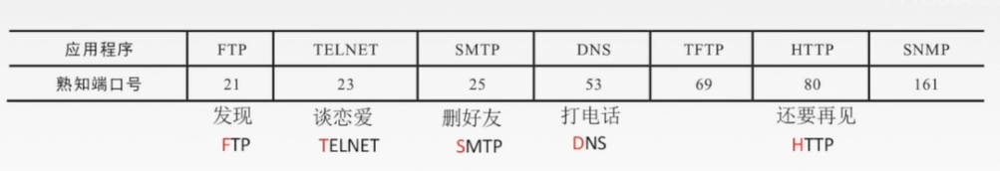
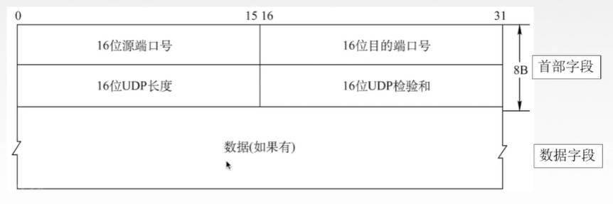
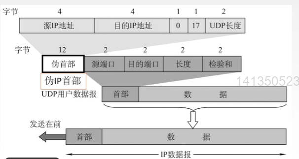
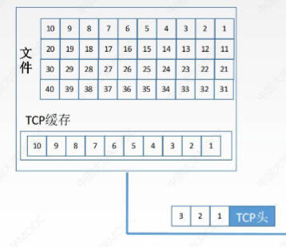
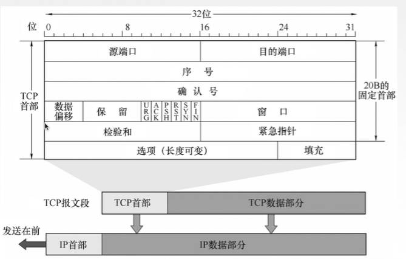
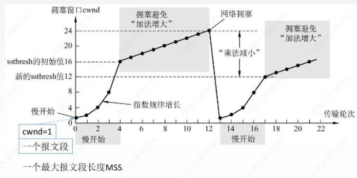
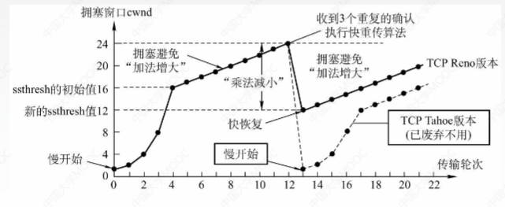

# 1. 传输层概述

只有主机才有传输层，通信子网（路由器）中没有传输层

为应用层提供通信服务，使用网络层的服务

## 1.1 传输层的功能

**传输层提供进程和进程之间的逻辑通信**

网络层提供主机和主机之间的逻辑通信

**复用和分用**

- 复用：多个用户使用一个IO资源发送消息

  在传输层指多个进程使用一个传输层协议发送数据

- 分用：多个用户使用一个IO资源接收消息

  在传输层指多个进程使用一个传输层协议接收数据

**对收到的报文进行差错检测**

传输层对首部和数据部分都会检测

而网络层只检查IP数据报的首部

## 1.2 传输层的两个协议——UDP和TCP

**TCP：** 面向连接的传输控制协议，提供可靠传输

传送数据之前必须建立连接，数据传送结束后要释放连接， 不提供广播或多播服务。由于TCP要提供可靠的面向连接的传输服务，因此增加了许多开销：确认、流量控制、计时器及连接管理等

可靠，面向连接，时延大，适用于大文件

**UDP：** 无连接的用户数据报协议，提供不可靠传输

传送数据之前不需要建立连接，收到UDP报文后也不需要给出任何确认

不可靠，无连接，时延小，适用于小文件

## 1.3 传输层的寻址与端口

**端口**（逻辑端口/软件端口）：

是传输层的服务访问点（TSAP），标识主机中的应用进程。能够让应用层各种进程将其数据通过端口向下交付给传输层，以及让传输层知道应当将收到的数据向上通过端口交付给哪个应用。

**端口号**：

端口会有一个唯一的数字来标识，即端口号。端口号只有本地意义，在因特网中的不同计算机的相同端口号是没有联系的

长度为16bit，能标识2^16(65536)个不同的端口号

可分为：

- 服务端使用的端口号

    - 熟知端口号（知名端口号）：0~1023

        给TCP/IP最重要的一些应用程序使用，让所有用户都知道

    - 登记端口号：1024~49151

        为没有熟知端口号的应用程序使用

- 客户端使用的端口号

    49152~65536

    仅在客户进程运行时才动态选择，也称短暂端口号（临时端口），通信结束后，刚用过的客户端口号就不再使用了，可供其他客户进程以后使用



套接字：在网络中采用发送方和接收方的套接字组合来识别端点，套接字唯一标识了网络中的一个主机和它上面的一个进程

`套接字Socket = (主机IP地址，端口号)`

# 2. UDP协议

无连接，不可靠

只在IP数据报服务之上增加了很少功能，即复用分用和差错检测功能

## 2.1 UDP主要特点

1. **UDP无连接**，减少开销和发送数据之前的时延

    无连接指 UDP既无需建立连接也不用维护连接状态

2. **UDP不保证可靠交付**，UDP没有流量控制和重传机制，不能保证数据能够到达目的地

    但是可以有应用层来维护可靠性，这意味着应用开发者可以根据应用的需求来灵活设计自己的可靠机制

    比如：HTTP3.0使用UDP，通过QUIC机制保证可靠性

3. **UDP是面向报文的**，适合一次性传输少量数据的网络应用

    面向报文是指 报文是UDP处理的最小单位，对于应用层交下来的报文，UDP既不合并也不拆分，只是添加首部后就向下交给IP层；对于IP层交上来的UDP数据包，去除首部后就原封不动地交付给上层应用

    因此应用程序必须选择合适大小的报文。如果数据报过大超过MTU，那UDP直接丢给IP层之后，IP层也会进行分片，如果丢失了一个分片，那就要重传所有的UDP报文；若数据报过小，会使首部的相对长度太大

4. **无拥塞控制**，网络中拥塞时也不影响主机的发送效率，适合很多实时应用

5. **UDP首部开销小**，8B

    TCP首部由20B

## 2.2 UDP首部格式

UDP数据报包含两部分：UDP首部和用户数据



UDP数据报有固定大小为8B的首部字段

- 源端口号：可有可无

    如果需要对方的回复，就添上；不需要回复就可以是全0

- 目的端口号

- UDP长度

    整个UDP用户数据报的长度，即首部+数据的长度

    最小值是8，即仅有首部

- DUP检验和

    检验整个UDP数据报（首部+数据）在传输中是否有错，错就丢弃
    
    该字段可选，不想计算校验和是就令该字段全为0

传输层收到UDP数据报之后向上层交付时，如果找不到对应的目的端口号，就丢弃报文，并给发送方发送ICMP“端口不可达”差错报告报文

## 2.3 UDP校验

**伪首部**

在计算校验和时，要在UDP数据报之前增加12B的伪首部



加上伪首部之后得到一个临时UDP数据报，校验和就是按照这个临时的DUP数据报计算的。伪首部就只是为了计算校验和，既不向下传送也不向上递交。

- 源IP地址：4B 32位

- 目的IP地址：4B 32位

- 第三个字段固定全0

- 协议字段：指明报文使用的协议

    封装UDP报文的IP数据报首部协议字段是17，所以这里填17

- UDP长度：UDP首部8B + 数据部分长度 （不包括伪首部）

**检验过程**

发送端：

1. 添上伪首部

2. 校验和字段填充为全0

3. 将UDP数据报视为由16位字组成

   所以若UDP数据报的数据部分不是偶数个字节，就在末尾填入一个全零字节（此字节不发送）

4. 伪首部 + 首部 + 数据部分 采用二进制反码求和

5. 把求得的和再求反码，填入检验和字段

6. 去掉伪首部，发送

接收端：

1. 添上伪首部（如果不为偶数个字节，还要补上全零字节）

2. 伪首部 + 首部 + 数据部分 采用二进制反码求和

3. 结果全为1则无差错，否则丢弃数据报 或者 附上出差错的警告交给应用层

# 3. TCP协议

## 3.1 TCP协议的特点

TCP是在不可靠的IP层之上实现的 可靠的 数据传输协议

IP层不可靠，它不保证网络包的交付、按序交付，也不保证网络包中的数据的完整性；TCP能确保接收端收到的网络包是无损坏、无间隔、非冗余和按序的

TCP通过一个四元组唯一确定一个连接：{源IP地址，源端口，目的IP地址，目的端口}

1. TCP是**面向连接**（虚连接）的传输层协议

    虚连接是指并不是实际可以传输数据的物理连接，只是一条逻辑连接

2. 每一条TCP连接只能有两个端点，每一条TCP连接只能是**端到端**的（进程对进程）。TCP连接的端点是套接字（IP+端口号）

    即，TCP不能提供广播、多播

3. **TCP提供可靠交付的服务**，无差错、不丢失、不重复、按序到达

    可靠有序，不丢不重

4. **TCP提供全双工通信**，允许通信双方的应用进程在任何时候都能发送数据

    发送缓存用于存储：准备发送的数据 & 已发送但尚未收到确认的数据

    接收缓存用于存储：按序到达但尚未被接受应用程序读取的数据 & 不按序到达的数据

5. **TCP面向字节流**

    虽然应用程序和TCP的交互是一次一个数据块（大小不等），但是TCP把应用程序交下来的数据看成仅仅是一连串的无结构的字节流（字节序列）

    在生成报文的时候，可取出任意个字节作为数据部分，第一个字节的序号是多少是随机的
    
    与UDP不同，UDP报文的长度由应用进程决定，UDP协议不会插手
    
    而TCP报文的长度则根据接收方给出的窗口值和当前网络拥塞程度，由TCP决定。如果应用进程传来的数据块太长，TCP就把它划分得短一些再传送；如果太短，就积累一些字节再发出去



## 3.2 TCP报文段首部格式

TCP传送的数据单位称为TCP报文段，TCP报文段既可以用来运载数据，也可以用来建立连接、释放连接、应答。

TCP报文段分为首部和数据两个部分，首部由20B的固定首部（前面）和4N字节的可变首部（后面）组成。



- 源端口（2字节）

- 目的端口（2字节）

- 序号（4字节）：

    TCP面向字节流，每一个字节都按顺序编号。本字段表示本报文段所发送数据的第一个字节的序号

- 确认段（4字节）：

    收到一个报文后要返回一个确认报文段，确认报文端的首部就会有确认段这一字段

    表示期望收到对方下一个报文段的第一个数据字节的序号，即下一个要哪个字节（数据链路层的GBN和SR协议中的ACK都是收到哪个返回几号ACK）

    若确认号为N，则证明N-1及之前的所有数据都已正确收到（累计确认机制）

- 数据偏移（首部长度）（4位）：

    TCP报文段的数据起始处 距离 TCP报文段的起始处有多远。单位是4B。

    就是TCP首部（固定部分加上可选字段）总长度，由于4位2进制数最大表示15，因此TCP首部最大长度为60B

- 控制位：共六位

    - 紧急位URG：URG=1时，表明此报文段中有紧急数据，是最高优先级的数据，应尽快传送，不用在缓存里排队，配合紧急指针字段使用

    - 确认位ACK：ACK=1时确认号（确认段）才有效。在连接建立后所有传送的报文段都必须把ACK置为1

    - 推送位PSH：PSH=1时，接收方将此报文尽快交付接收应用进程，而不再等到缓存填满后再向上交付

    - 复位RST：RST=1时，表明TCP连接中出现严重差错，必须释放连接，然后再重新建立传输连接。

    - 同步位SYN：SYN=1时，表明这是一个连接请求/连接接受报文（connection request / connection accepted），然后进一步通过ACK来区分这两种可能。

      同时，SYN=1时，该报文也在设置自己的初始序列号

    - 终止位FIN：FIN=1时，表明此报文段发送方数据已发完，要求释放连接

- 窗口（2字节）：

    指的是发送本报文段的一方的接收窗口容量，即允许对方发送的数据量

    接收到此报文的一方就可以根据窗口大小设置发送窗口

- 检验和：检验首部+数据

    检验时要加上12B的伪首部，伪首部与UDP伪首部相同，只是把第UDP伪首部的四个字段（协议字段）改为6

- 紧急指针：

    URG=1时才有意义，指出本报文段中紧急数据的字节数，即指出了紧急数据的末尾在报文段的位置（因为紧急数据在报文段数据的最前面）。

- 选项：是长度可变的字段，可选

- 填充：将首部填充至是4字节的整数倍，因为数据偏移的单位是4B，所以首部长度必须是4B的整数倍。

    其实是为了网络设备硬件设计和处理方便，首部长度需要是4字节的整数倍，UDP的首部也是4字节整数倍

## 3.3  连接建立——三次握手

TCP连接传输的三个阶段：连接建立 - 数据传送 - 连接释放

TCP连接的建立采用客户/服务器(C/S)方式，主动发起连接建立的应用进程叫做客户，而被动等待连接建立的应用进程叫服务器

### 3.3.1 三次握手的过程

假设运行在一台主机（作为客户）上的一个进程想与另一台主机（作为服务器）上的进程建立一条连接，客户应用进程首先通知客户TCP，他想建立一个与服务器上某个进程之间的连接，客户的TCP会用以下步骤与服务器中的TCP建立一条TCP连接


建立连接之前，服务器进程应该是一直处于LISTEN状态，主动监听某个端口，等待客户机的连接请求

1. 客户端发送连接请求报文段（SYN报文），无应用层数据

    在连接请求报文段中：SYN=1（同步位），seq=x（序号字段，即数据部分携带的字节序号，随机生成）

    客户进程进入SYN-SENT（同步已发送）状态

2. 服务器端收到连接请求报文后，为该TCP连接分配缓存和变量，并向客户端返回确认报文段（SYN + ACK报文），允许链接。也无应用层数据

    SYN=1；ACK=1（确认位）；seq=y（随机）；ack=x+1（确认号，因为收到客户端发送的连接请求报文的seq是x）

    服务器进程进入SYN-RCVD（同步收到）状态

3. 客户端收到了确认报文后，为该TCP连接分配缓存和变量，并向服务器端返回确认的确认（ACK报文），这个报文可以携带数据

    SYN=0；ACK=1；seq=x+1；ack=y+1；
    
    客户进程进入ESTABLISHED（已建立连接）状态；服务器收到这个确认报文后，也就如ESTABLISHED状态

接下来就可以传送应用层数据，TCP提供的是全双工通信，即双方的应用进程在任何时候都能发送数据

```
在Linux中，可以通过 netstat -napt 命令查看TCP状态
```

### 3.3.2 为什么要三次握手

首先要明确：三次握手是指从 开始建立连接 到 双方都进入ESTABLISHED状态，中间总共发送三次报文

**防止旧的连接初始化成功造成混乱**


由于网络环境的错综复杂，有可能客户端发送了一个请求建立连接的报文半天没发到，客户端就关闭连接并重新建立了一个连接，但这时候却收到了第一个连接的确认报文，客户端对比ack和自己的seq发现这是原来的已经废弃的连接的确认报文，则第三次握手就发了一个RST报文，以此中止历史连接。

如果只有两次握手，那服务器收到客户端连接请求报文段就会直接建立连接，然后回复确认报文。在网络阻塞的情况下，客户端可能重发了多个连接请求报文，服务器就收到一个建一个连接，最后建了很多冗余的无效链接，造成不必要的资源浪费。

**同步双方初始序列号**

TCP协议通信双方必须维护一个序列号，序列号是TCP可靠传输的关键，通过序列号，TCP可以实现去除重复数据、保证按序接收数据、标识发送出去的数据报中哪些是已经被对方收到的

如何同步序列号：

- 客户端：

  客户端第一次握手发送的请求连接报文携带了seq，收到服务器端的确认报文，发现其中的`ack=seq+1`，就知道自己的报文被成功接收，并且自己的序号被认可，于是进入ESTABLISHED状态

- 服务器端：

  服务器端第二次握手发送的确认报文携带了seq，收到客户端第三次握手发送的确认报文之后，发现其中的`ack=seq+1`，就知道自己的报文被成功接收，并且序号被认可，于是进入ESTABLISHED状态

如果用两次握手，那服务器无法确认客户端能否正确接收自己的报文

并且，初始序列号ISN是基于始终随机生成的。`ISN = M + F`，M是一个计时器，每隔4ms加一，F是一个Hash算法，是根据源IP、目的IP、源端口、目的端口 用MD5算法 生成的一个随机数值

### 3.3.3 SYN洪泛攻击

**正常流程**

服务器在内核维护了两个队列——SYN队列和ACK队列，当服务器端接收到客户端的SYN，会将其加入到内核的SYN队列，接着发送SYN+ACK给客户端，等待客户端回应ACK报文。服务端接收到ACK报文后，就把连接从SYN队列移除并放入Accept队列


**SYN攻击**

SYN攻击指攻击者短时间伪造不同IP地址的SYN报文（第一次握手发送的报文），服务端每接收到一个报文，就进入SYN_RCVD的状态，但是服务端回应的ACK+SYN报文，无法应答。

久而久之就会**占满服务端的SYN接收队列**（未连接队列），使得服务器不能为正常用户服务

并且服务器端进入SYN_RCVD状态后，如果超过时间还没有收到客户端的ACK消息，则会重新发送ACK+SYN，直到重试超过一定次数时才会放弃，导致大量资源被占用，直到**资源耗尽**

**避免的方法**

当SYN队列被占满后，后续服务器收到SYN包不进入SYN队列，而是计算出一个cookie值，然后直接发送SYN+ACK报文给客户端。接收到客户端应答报文后，服务器会检查这个ACK包的合法性，如果合法，就直接放入Accept队列

或者使用SYN Cache，用Cache来缓存系统当前所有半开连接信息，并且在收到SYN报文时不分配资源，而是收到ACK报文之后再分配资源

## 3.4  连接释放——四次挥手

### 3.4.1 四次挥手过程

参与一条TCP连接的两个进程中的任何一个都能终止该连接，连接结束后，主机中的资源（缓存和变量）将被释放


1. 客户端发送连接释放报文段，停止发送数据，主动关闭TCP连接

    FIN=1；seq=u（等于前面已传送过的数据的最后一个字节的序号+1）

    客户进程进入FIN-WAIT-1（终止等待1）的状态

2. 服务器端收到连接释放请求后，服务器端回送一个确认报文段，

    ACK=1；seq=v（序号，取决于上一个报文发到哪里）；ack=u+1（确认号）

    服务器进入CLOSE-WAIT（关闭等待）状态。此时客户到服务器这个方向的连接就释放了，TCP处于半关闭状态（服务器还能向客户发送报文）；客户端收到服务器端的确认报文后，进入FIN-WAIT-2阶段

3. 服务器端也发完数据，就发出连接释放报文段，主动关闭TCP连接

    FIN=1；ACK=1；seq=w（在半关闭服务器状态可能又发送了一些数据）；ack=u+1（因为客户端并没有发新的数据）

    服务器进入LAST-ACK（最后确认）状态，还需要等待客户端最后的确认报文才能关闭

4. 客户端收到连接释放报文之后，必须回送一个确认报文段

    ACK=1；seq=u+1；ack=w+1

    客户端进入TIME-WAIT状态，此时TCP连接还未释放，必须再经过 时间等待计时器 设置的2MSL后，客户机才进入CLOSED状态，连接彻底关闭；服务器端收到客户端的确认报文段之后，进入CLOSED阶段。

### 3.4.2 最后为什么要等2MSL

**为什么要有TIME-WAIT状态**

- 尽量保证服务器端能收到客户端发的最后一个ACK确认报文，从而使得服务器端能正常关闭

- 为了保证这个旧连接中的数据报都消失在了网络中

  由于网络的原因，可能一些数据报发生了延迟。此时如果相同端口的TCP连接被复用，而这个新的连接收到了本属于旧连接的报文，可能产生数据错乱等问题

**什么是MSL**

MSL，Maximum Segment Lifetime，报文最大生存时间，是指任何报文在网络上存在的最大时间

TCP报文是基于IP协议的，而IP头中有一个TTL，表示一个IP报文能经过的最大路由数。所以MSL应该大于等于TTL消耗为0的时间

**为什么是2MSL**

```
如果我们是要保证服务器端能接收到ACK报文并正常关闭
那么应该参考服务器端的超时重传时间RTO和MSL来计算TIME-WAIT的时间

所以为了实现完美关闭连接，我们应该设置的时间是：从服务器端发送第一个FIN报文开始，到它最后一次重传FIN报文的时间，再加上MSL。

这个时间过于保守，只有所有的ACK报文都丢失的情况下才需要这么久，并且保证服务器端正常关闭这个目标也并没有那么关键。因为有用的数据已经都传输完了
```

2MSL是为了保证旧连接的数据报都消失在了网络中

首先进入TIME-WAIT的前提是客户端已经收到FIN数据报，那么接下来的客户端发送的ACK数据报只有两种可能

- ACK数据报不断丢失：那服务器端就会不断重发FIN，然后客户端不断收到FIN，重新进入TIME-WAIT计时；假如连重发的FIN也丢了（概率很低，基本不可能，如果发生那出错也没办法）

- ACK数据报被服务器端收到：从发送到被收到最多经历一个MSL。但是我们考虑一个极端情况，服务器在收到ACK的前一瞬间，重发了一个FIN报文，那就要保证这个报文也消失在网络中，也需要一个MSL，所以TIME-WAIT是2MSL。

### 3.4.3 为什么要四次挥手

为什么四次挥手 = 为什么要有CLOSE-WAIT阶段

因为 产生四次挥手的原因是 服务器端的FIN释放连接报文和ACK确认报文是分开发送的，中间多了CLOSE-WAIT阶段。

这样是为了确保服务器端的数据全部传送完毕。

如果把服务器端的FIN和ACK合在一起，放在CLOSE_WAIT阶段之后一起发给客户端呢？那就会导致客户端发送完连接释放请求报文之后可能迟迟收不到回应（因为服务器在CLOSE_WAIT），从而一直超时重传。

# 4. TCP可靠传输

可靠：保证接收方进程从缓存区读出的字节流与发送方发出的字节流是完全一样的

## 4.0 TCP实现可靠传输的机制

**校验和**

与UDP校验一样，增加一个伪首部计算校验码。如果收到的报文段的校验和有差错，就丢弃这个报文段

**数据分块**

TCP面向字节，为每个字节进行编号，并将应用层的数据分割成TCP认为最适合发送的数据块

**序列号和确认应答**

给发送的每一个包进行编号。

收到数据后，会对传输方进行确认应答，发送ACK报文，报文中带有对应的确认序列号

**重传**

- 超时重传：发送方在规定的时间内没有收到确认就要重传已经发送的报文段，即超时重传

  TCP采用自适应算法，通过SRTT（平滑往返时间，根据平均往返时间使用公式计算）动态计算RTO（Retransmission TimeOut，超时重传时间）

  

- 冗余ACK（冗余确认）：每当比期望序号大的失序报文段到达时，发送一个冗余ACK，指明下一个期待字节的序号。也叫快速重传技术

  改善超时重传中超时周期太长的问题

**流量控制**

通过接收缓存区的大小控制发送端的发送速率，是端到端的问题

**拥塞控制**

防止过多的数据注入到网络中。是全局的，发生拥塞时端点并不了解拥塞发生的西接，只是表现为通信时延的增加

## 4.1 流量控制

流量控制：让发送方慢点，让接收方来得及接收，匹配发送方的发送速率和接收方的读取速率

### 4.1.1 滑动窗口

利用滑动窗口机制实现流量控制，发送方会维护一个发送窗口

`发送窗口 = min(rwnd，cwnd)`

- rwnd（接收窗口）：接收方根据自己的接收缓存的大小，调整ACK报文的 窗口 字段值，来通知发送方自己的接收窗口的大小，从而调整发送窗口
- cwnd（拥塞窗口）：发送方根据当前网络拥塞程度估计出来的窗口值，在拥塞控制中会讲到

**滑动窗口数据报丢失现象**

当服务器资源非常紧张的时候，操作系统可以直接减少接收缓冲区的大小

1. 假如刚开始双方窗口都是200，发送方发送了一个80字节的数据，则接收方收到后 返回的通告窗口报文 为120字节。
2. 此时由于服务器端繁忙，服务器的操作系统直接把接收窗口收缩为60，但是这个通告窗口报文还没发出去，发送方就已经发送了一个120字节的数据
3. 接收方收到后发现数据超过接收窗口的大小，就会将整个数据报丢弃
4. 此时发送方发送窗口为0，又收到了第二步中接收方发来的将接收窗口收缩60的通告窗口报文，发送方就将发送窗口右端左移60，发送窗口大小直接变成负值

出现这种情况的原因是，接收方先减少缓存，再收缩窗口。

为了防止这种情况，必须先通告给发送方要收缩窗口，再减少自己的缓存。

**与数据链路层的动态窗口区别**

- 传输层定义端到端用户之间的流量控制，数据链路层定义相邻的两个中间结点的流量控制
- 数据链路层的窗口大小不能动态变化；传输层的可以动态变化，由操作系统控制

### 4.1.2 窗口关闭

如果接收方的应用程序没办法及时读取缓冲区内容，导致接收缓存变满，那么接收方会将接收窗口设置为0，客户端收到ACK报文后，发送窗口也减少为0。此时即发生窗口关闭。

**窗口关闭的死锁现象**

当窗口关闭时，在接收方处理完数据后，会向发送方通告一个窗口非0的ACK报文，如果这个报文在网络中丢失了，就会导致：

- 发送方在等待接收方的非0窗口通知
- 接收方在等待发送方的数据

此时就发生了死锁

**死锁解决办法**

实际上，TCP为每个连接设有一个持续定时器，只要TCP连接一方收到对方的零窗口通知，就启动持续计时器。

如果持续计时器超时，就会发送窗口探测（Window Probe）报文，对方在这个报文的确认报文中，就会给出自己现在的接收窗口大小。如果窗口依然为0，就重新启动持续计时器，如果不为0就发送数据。

### 4.1.3 糊涂窗口综合症

如果接收方的应用程序太忙，一直不取走接收窗口里的数据，就会导致发送方的发送窗口越来越小。到最后，如果接收方腾出几个字节的空间并通告这几个字节的窗口，发送方也会义无反顾地发出这几个字节。

TCP+IP头都有40字节，为了几个字节的数据加上这么大的头部，太浪费资源了，这就是糊涂窗口综合症

**解决办法：**

- 让接收方不通告小窗口给发送方

  当接收窗口小于 `min(MSS, 接收缓存/2)`时，就向发送方通告窗口为0。（MSS是TCP最大报文段长度）

- 让发送方避免发送小数据

  使用Nagle算法，它在满足以下两个条件的任意一个时，才会发送数据

  - 等到发送窗口大小 >= MSS 或 可以发送的数据大小 >= MSS
  - 收到之前发送数据的ACK确认报文

  对于一些需要小数据报交互的场景，要关闭Nagle算法

## 4.2 拥塞控制

出现拥塞的条件：对资源需求的总和 > 可用资源（资源可以是带宽，接收缓存，处理机等）。在端点表现为通信时延的增加

拥塞控制：防止过多的数据注入到网络中，是一个全局性的控制

只要发送方没有在规定时间内接收到ACK应答报文，也就是发生了超时重传，就认为网络中出现拥塞

TCP采用了一套拥塞控制算法，共有四个策略：慢开始、拥塞避免、快重传、快恢复

以下算法描述中假定：

1. 数据单方向传送，而另一个方向只传送确认

2. 接收方总是有足够大的缓存空间，因而发送窗口大小取决于拥塞程度

    在正常情况下发送窗口大小本应为  `Min{接收窗口rwnd，拥塞窗口cwnd}`

### 4.2.1 慢开始



纵坐标：拥塞窗口大小，刚开始cwnd=1，单位是一个报文段，也就是一个最大报文段长度MSS

横坐标：传输轮次，可以有以下三种解释

- 发送了一批报文段并收到它们的确认的时间

- 一个往返时延RTT 

- 开始发送一批拥塞窗口内的报文段到开始发送下一批拥塞窗口内的报文段的时间

**算法核心**

发送方每收到一个ACK，拥塞窗口cwnd的大小就会加一；表现在宏观上就是每经过一个RTT，拥塞窗口大小翻倍

**算法过程**

- 连接建立完成后，刚开始初始化cwnd=1，表示可以传一个MSS大小的数据
- 收到一个ACK确认应答后，cwnd增加一，变为2。于是一次（一个RTT内）就能发送两个
- 再收到这两个的ACK确认应答，就可以比原来多发两个，cwnd变成4
- 发出4个后再收到这4个ACK，就可以比原来多发4个，变成8个

另外会设置一个慢开始门限ssthresh，当cwnd < ssthresh时，使用慢启动算法，拥塞窗口指数增长；当cwnd >= ssthresh时，就会使用拥塞避免算法

注意：cwnd无法越过ssthresh，也就是说当2*cwnd > ssthresh时，会将cwnd直接设置为ssthresh

### 4.2.2 拥塞避免

每收到一个ACK，cwnd增加1/cwnd，表现出来就是每经过一个RTT，拥塞窗口大小加一

也就是说cwnd >= ssthresh后，拥塞窗口开始线性增长

**拥塞发生算法：超时重传时**

当网络出现拥塞，也就是发生了数据报重传，重传机制有超时重传和快速重传两种，不同机制下使用的拥塞发生算法也不同

超时重传的算法如下：

将ssthresh设为cwnd/2（按发生重传时的cwnd计算），cwnd设为1

然后重新开始慢启动

### 4.2.3 快重传



快重传要求接收方每收到一个失序的报文就立即发送重复确认，而不要等到自己发送数据时才进行稍待确认

假设发送方发送了Msg1~Msg5五个报文，其中Msg2丢失了，接收方收到了Msg1、3~5这四个报文。按照快重传的要求，接收方在收到失序报文后就会发送对Msg1的重复确认（冗余ACK），携带的ACK是2。在收到3个对一个包的重复确认（冗余ACK）后，发送方就会立即重传对方未收到的Msg报文。

```
快重传机制中，有的认为是收到三个冗余ACK后触发重传（王道），有的认为是收到三个重复的ACK（包括本应发送的那个ACK）之后就触发重传（小林图解网络，LeetCode计算机网络突击面试）
```


TCP认为这种情况不严重，因为大部分没丢，只丢了一小部分，所以拥塞发生算法选择为快恢复算法。

### 4.2.4 快恢复

快速算法认为：能收到3个重复的ACKK，那说明网络也没那么糟糕

于是设置 `cwnd = cwnd / 2`，` ssthresh = cwnd`，即拥塞窗口和门限值都设置为发生拥塞时拥塞窗口的一半，**然后**进入快速恢复算法

**快恢复算法：**

- cwnd = ssthresh+3，

  加3是因为确认已经收到了三个重复的确认数据包

- 重传丢失的数据包

- 如果再收到重复的ACK，那么cwnd+1，继续重传

- 如果收到了新数据的ACK，说明缺失的数据已经全部收到，将cwnd重新设置为ssthresh（即发生拥塞时的cwnd的一半）

**快恢复算法结束**

接下来直接进入拥塞避免状态，此时cwnd = ssthresh = 发生拥塞时的cwnd的一半

## 4.3 TCP粘包问题

由于TCP协议是面向字节流的，所以可能会出现多个数据报放在一起变成一堆0101之后分不清哪个是哪个了，这就是粘包现象

**粘包现象发生的原因**

- 发送端：

  由于TCP默认开启Nagle算法（见4.1.3节糊涂窗口综合症解决办法），所以发送端可能会攒几个小数据包，等数据多了再组装成一个TCP报文发送，那接收方收到之后就分不清了。

- 接收端

  如果接收端的应用层没有及时读取发来的数据，可能来了多个TCP数据报，它们被拆去头部之后放在缓冲区中，又无法区分了

**常见解决办法**

粘包现象引起的原因就是分不清消息的界限，那我们可以在消息首尾加上特殊标志来区分一条消息，头标志中还可以再加入消息长度信息
