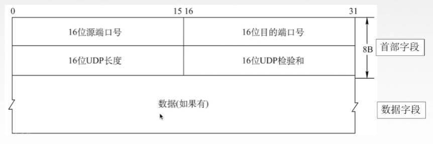
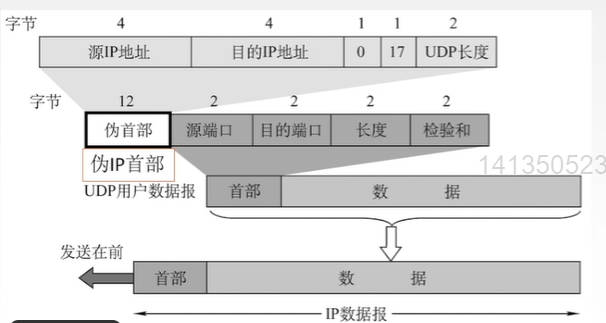
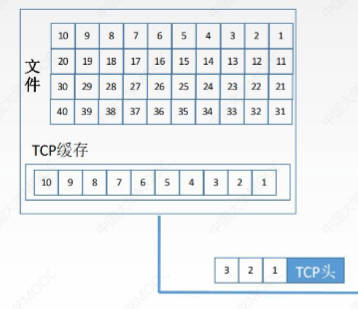
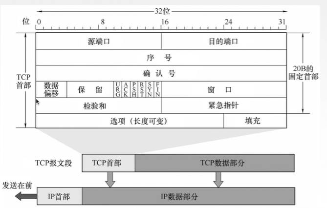
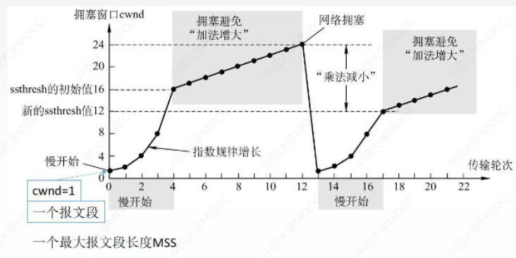
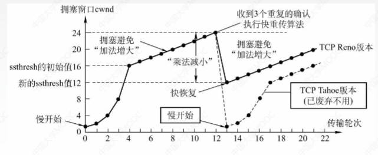

# 传输层概述

只有主机才有的层次，为应用层提供通信服务，使用网络层的服务

## 传输层的功能

1. 传输层提供进程和进程之间的逻辑通信
    
    网络层提供主机和主机之间的逻辑通信

2. 复用和分用

    复用：多个进程的数据使用同一个传输层的协议进行传输

    应用层所有的应用进程都可以通过传输层再传输到网络层

    分用：将收到的报文段分发给指定进程

    传输层从网络收到数据后交付指定的应用进程

3. 对收到的报文进行差错检测

## 传输层的两个协议——UDP和TCP

**TCP：** 面向连接的传输控制协议，提供可靠传输

传送数据之前必须建立连接，数据传送结束后要释放连接， 不提供广播或多播服务。由于TCP要提供可靠的面向连接的传输服务，因此增加了许多开销：确认、流量控制、计时器及连接管理等

可靠，面向连接，时延大，适用于大文件

**UDP：** 无连接的用户数据报协议，提供不可靠传输

传送数据之前不需要建立连接，收到UDP报文后也不需要给出任何确认

不可靠，无连接，时延小，适用于小文件

## 传输层的寻址与端口

端口（逻辑端口/软件端口）：是传输层的SAP，标识主机中的应用进程。

端口号：端口会有一个唯一的数字来标识，即端口号。端口号只有本地意义，在因特网中的不同计算机的相同端口号是没有联系的

长度为16bit，能标识65536个不同的端口号

可分为：

- 服务端使用的端口号

    - 熟知端口号（知名端口号）：0~1023

        给TCP/IP最重要的一些应用程序使用，让所有用户都知道

    - 登记端口号：1024~49151

        为没有熟知端口号的应用程序使用

- 客户端使用的端口号

    49152~65536

    仅在客户进程运行时才动态选择

套接字：在网络中采用发送方和接收方的套接字组合来识别断电，套接字唯一标识了网络中的一个主机和它上面的一个进程

`套接字Socket = (主机IP地址，端口号)`

# UDP协议

无连接，不可靠

只在IP数据报服务之上增加了很少功能，即复用分用和差错检测功能

UDP主要特点

1. UDP无连接，减少开销和发送数据之前的时延

2. UDP不保证可靠交付

3. UDP是面向报文的，适合一次性传输少量数据的网络应用

    面向报文是指UDP协议回想应用层传来的报文完整的放在UDP用户数据报数据部分，不会拆分也不会改变

    如果数据报过大，容易丢失，且传到网络层后网络层也要分片，增加时延

4. 无拥塞控制，适合很多实时应用

5. UDP首部开销小，8B

    TCP首部由20B

## UDP首部格式

固定大小为8B的首部字段，数据字段可有可无

- 源端口号：可有可无

    如果需要对方的回复，就添上；不需要回复就可以是全0

- 目的端口号

- UDP长度

    整个UDP用户数据报的长度，即首部+数据的长度

- DUP检验和

    检验整个UDP数据报（首部+数据）是否有错，错就丢弃

分用时如果找不到对应的目的端口号，就丢弃报文，并给发送方发送ICMP“端口不可达”差错报告报文

## UDP校验

### 伪首部

伪首部伪的是IP首部，伪首部只在计算检验和时才出现，不向下传送也不向上递交

- 源IP地址：4B32位

- 目的IP地址：4B32位

- 第三个字段固定全0

- 协议字段：指明报文使用的协议

    封装UDP报文的IP数据报首部协议字段是17，所以这里填17

- UDP长度：UDP首部8B + 数据部分长度 （不包括伪首部）

### 检验过程

发送端：

1. 添上伪首部

2. 校验和字段填充为全0

3. 数据部分用全0填充至4B的整数倍

4. 伪首部 + 首部 + 数据部分采用二进制反码求和

5. 把求得的和再求反码，填入检验和字段

6. 去掉伪首部，发送

接收端：

1. 添上伪首部

2. 伪首部 + 首部 + 数据部分采用二进制反码求和

3. 结果全为1则无差错，否则丢弃数据报或者附上出差错的警告交给应用层

# TCP协议

## TCP协议的特点

1. TCP是面向连接（虚连接）的传输层协议

    虚连接是指并不是实际可以传输数据的物理连接

2. 每一条TCP连接只能有两个端点，每一条TCP连接只能是点对点的

    TCP不能提供广播、多播

3. TCP提供可靠交付的服务，无差错、不丢失、不重复、按序到达

    可靠有序，不丢不重

4. TCP提供全双工通信

    发送缓存，用于存储：准备发送的数据 & 已发送但尚未收到确认的数据

    接收缓存：按序到达但尚未被接受应用程序读取的数据 & 不按序到达的数据

5. TCP面向字节流

    TCP把应用程序交下来的数据可看成仅仅是一连串的无结构的字节流（字节序列）

    在生成报文的时候，可取出任意个字节作为数据部分，第一个字节的序号是多少是随机的

## TCP报文段首部格式

- 源端口（2字节）

- 目的端口（2字节）

- 序号（4字节）：
 
    TCP面向字节流，每一个字节都按顺序编号。本字段表示本报文段所发送数据的第一个字节的序号

- 确认段（4字节）：

    收到一个报文后要返回一个确认报文段，确认报文端的首部就会有确认段这一字段

    表示期望收到对方下一个报文段的第一个数据字节的序号，即下一个要哪个字节（数据链路层的GBN和SR协议中的ACK都是收到哪个返回几号ACK）

    若确认号为N，则证明N-1及之前的所有数据都已正确收到（累计确认机制）

- 数据偏移（首部长度）（4位）：

    TCP报文段的数据起始处距离TCP报文段的起始处有多远。单位是4B

- 控制位：共六位

    - 紧急位URG：URG=1时，表明此报文段中有紧急数据，是最高优先级的数据，应尽快传送，不用在缓存里排队，配合紧急指针字段使用

    - 确认位ACK：ACK=1时确认号（确认段）才有效。在连接建立后所有传送的报文段都必须把ACK置为1

    - 推送位PSH：PSH=1时，接收方将此报文尽快交付接收应用进程，而不再等到缓存填满后再向上交付

    - 复位RST：RST=1时，表明TCP连接中出现严重差错，必须释放连接，然后再重新建立传输连接。

    - 同步位SYN：SYN=1时，表明这是一个连接请求/连接接受报文

    - 终止位FIN：FIN=1时，表明此报文段发送方数据已发完，要求释放连接

- 窗口（2字节）：

    指的是发送本报文段的一方的接收窗口容量，即允许对方发送的数据量

    接收到此报文的一方就可以根据窗口大小设置发送窗口

- 检验和：检验首部+数据

    检验时要加上12B的伪首部，伪首部第四个字段（协议字段）为6

- 紧急指针：

    URG=1时才有意义，指出本报文段中紧急数据的字节数，即指出了紧急数据的末尾在报文段的位置。

- 选项：是长度可变的字段，可选

- 填充：将首部填充至是四字节的整数倍

## TCP连接管理

TCP连接传输的三个阶段：连接建立 - 数据传送 - 连接释放

TCP连接的建立采用客户服务器方式，主动发起连接建立的应用进程叫做客户，而被动等待连接建立的应用进程叫服务器

### 连接建立过程——三次握手

假设运行在一台主机（作为客户）上的一个进程想与另一台主机（作为服务器）上的进程建立一条连接，客户应用进程首先通知客户TCP，他想建立一个与服务器上某个进程之间的连接，客户的TCP会用以下步骤与服务器中的TCP建立一条TCP连接

1. 客户端发送连接请求报文段，无应用层数据

    在连接请求报文段中：SYN=1（同步位），seq=x（序号字段，即数据部分携带的字节序号，随机生成）

2. 服务器端收到连接请求报文后，为该TCP连接分配缓存和变量，并向客户端返回确认报文段，允许链接。也无应用层数据

    SYN=1；ACK=1（确认位）；seq=y（随机）；sck=x+1（确认号，因为收到客户端发送的连接请求报文的seq是x）

3. 客户端收到了确认报文后，为该TCP连接分配缓存和变量，并向服务器端返回确认的确认，可以携带数据

    SYN=0；ACK=1；seq=x+1；ack=y+1；

### SYN洪泛攻击

攻击者发送TCP SYN（连接请求报文段），当服务器返回ACK后（确认报文），该攻击者就不对其进行再确认，这个TCP连接就会处于挂起状态，也就是半连接状态

服务器收不到再确认，就会重复发送ACK给攻击者，这样会更加浪费服务器的资源。攻击者对服务器发送非常大量的TCP连接，每一个都没法完成三次握手，在服务器上，这些TCP连接会因为挂起状态而小号CPU和内存，最后服务器可能死机，就无法为正常用户提供服务

设置SYN Cookie可以用来防御

### TCP的连接释放——四次挥手

参与一条TCP连接的两个进程中的任何一个都能终止该连接，连接结束后，主机中的资源（缓存和变量）将被释放

1. 客户端发送连接释放报文段，停止发送数据，主动关闭TCP连接

    FIN=1；seq=u（连接释放报文段通常是没有数据的，所以u可以用来标识这样一个报文段）

2. 服务器端收到连接释放请求后，服务器端回送一个确认报文段，此时客户到服务器这个方向的连接就释放了——半关闭状态（服务器还能向客户发送报文）

    ACK=1；seq=v（序号，取决于上一个报文发到哪里）；ack=u+1（确认号）

3. 服务器端发完数据，就发出连接释放报文段，主动关闭TCP连接

    FIN=1；ACK=1；seq=w；ack=u+1（因为客户端并没有发新的数据）

4. 客户端回送一个确认报文段，再等到时间等待计时器设置的2MSL（MSL是最长报文段寿命）后，连接彻底关闭

    ACK=1；seq=u+1；ack=w+1

    要等一个时间再关闭是为了防止确认报文端丢失导致服务器端永远无法关闭；如果等待的话，服务器端收不到确认就会重传第三个报文段，从而让客户端重发确认报文段

## TCP可靠传输

可靠：保证接收方进程从缓存区读出的字节流与发送方发出的字节流是完全一样的

TCP实现看可靠传输的机制

1. 校验

    与UDP校验一样，增加一个伪首部计算校验码

2. 序号

    面向字节，为每个字节进行编号

3. 确认

    收到数据后进行确认，可以累计确认和捎带确认

4. 重传

    发送方在规定的时间内没有收到确认就要重传已经发送的报文段，即超时重传

    TCP采用自适应算法，动态改变重传时间RTTs（加权平均往返时间）

冗余ACK（冗余确认）：每当比期望序号大的失序报文段到达时，发送一个冗余ACK，指明下一个期待字节的序号。也叫快速重传技术

## 流量控制

流量控制：让发送方慢点，让接收方来得及接收

利用滑动窗口机制实现流量控制

在通信过程中，接收方会根据自己接收缓存的大小，动态地调整发送方的发送窗口大小，即接收窗口rwnd（通过设置确认报文段的窗口字段将rwnd大小通知给发送方），发送方的发送窗口取接收窗口rwnd和拥塞窗口cwnd的最小值

- 接收窗口：接收方根据接收缓存设置的值，并告知给发送方，反映接收方容量

- 拥塞窗口：发送方根据自己估算的网络拥塞程度而设置的窗口值，反映网络当前容量

发送窗口的大小可以动态变化，可以通过改变确认报文段中窗口字段的大小控制发送窗口的大小，间接控制发送速率；接收缓存满后可以将接收窗口设置为0，让发送端暂停发送

如果接收方接收缓存已满，将接收窗口设置为0，将缓存中内容上交之后又发送了一个合理的窗口值。如果这个报文丢失了，那发送方会一直等待接收方给自己一个合理的窗口值，而接收方由于发送过了，又会一直等待发送方发送数据，会产生类似死锁的情况

TCP为每一个连接设有一个持续计时器，只要TCP连接的一方收到对方的零窗口通知，就启动持续计时器；若持续计时器设置的时间到期，就发送一个零窗口探测报文段，接收方收到探测报文段时给出现在的窗口值

## TCP拥塞控制

出现拥塞的条件：对资源需求的总和 > 可用资源（资源可以是带宽，接收缓存，处理机等）

拥塞控制：防止过多的数据注入到网络中，是一个全局性的控制

假定：

1. 数据单方向传送，而另一个方向只传送确认

2. 接收方总是有足够大的缓存空间，因而发送窗口大小取决于拥塞程度

    本来发送窗口大小 = `Min{接收窗口rwnd，拥塞窗口cwnd}`

### 慢开始 和 拥塞避免 算法

纵坐标：拥塞窗口大小，刚开始cwnd=1，单位是一个报文段，也就是一个最大报文段长度MSS

横坐标：传输轮次，可以有以下三种解释

- 发送了一批报文段并收到它们的确认的时间
 
- 一个往返时延RTT 

- 开始发送一批拥塞窗口内的报文段到开始发送下一批拥塞窗口内的报文段的时间

算法过程

1. 刚开始只注入一个报文段，探寻一下网络拥塞程度，发现不拥塞就成指数增长，如果指数增长超过门限值就先增长到门限值

2. 增长到ssthresh慢开始门限后，开始缓慢增加以进行拥塞避免，一次只增加一个报文段，加法增大

3. 检测到发出网络拥塞之后，直接将报文段降到1。同时设置新的门限值为 刚刚发生拥塞的值/2

### 快重传和快恢复

快重传：如果数据传输过程中有数据丢失，比如2号数据丢失，接收方就会在后面每一次收到新的报文段（2号以后的报文段）后发送一个1号的确认ACK——冗余ACK。当发送方收到3个冗余ACK（共四个，一个正常三个冗余），就会立即重发2号，即使还没达到超时计时器的时间要求。

快恢复：当收到3个重复的确认后，执行快重传算法，之后立即进行快恢复。将拥塞窗口的值降为刚才的一半，并执行拥塞避免，后面一个一个增大

