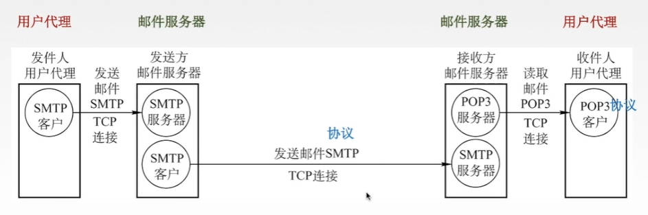

# 应用层概述

应用层对应用程序的通信童工服务

应用层的协议定义了：

- 应用进程交换的报文类型，比如是请求还是响应

- 各种报文类型的语法，如报文中的各个字段及其详细描述

- 字段的语义，即包含在字段中的信息的含义

- 进程何时、如何发送报文，以及对报文进行响应的规则

应用层的功能

- 文件传输、访问和管理 —— FTP

- 电子邮件 —— SMTP、POP3

- 虚拟终端 —— HTTP

- 查询服务和远程作业登录 —— DNS

## 网络应用模型

### 客户/服务器（Client/Server，C/S）模型

服务器：提供计算服务的设备

服务器的特点

1. 永久提供服务

2. 永久性访问地址/域名

客户机：请求计算服务的主机

客户机特点：

1. 与服务器通信，使用服务器提供的服务

2. 间歇性接入网络

3. 可能使用动态IP地址

4. 不与其它客户机直接通信

### P2P（peer to peer）模型

不存在永远在线的服务器，每个主机既可以提供服务，也可以请求服务

任意端系统/节点直接可以直接通讯

节点间接性接入网络

节点可能改变IP地址

可扩展性好：可以应对大量主机涌入网络

网络健壮性强：有节点坏掉影响不大

# 域名系统DNS

由于各个服务器的IP地址不方便记忆，于是引入域名。在实际访问网站时，输入域名后，主机就会去DNS服务器找对应的IP地址。DNS将IP地址返回给主机后，就能正常访问对应网站服务器

## 域名

### 域名的命名规则

`www.cskaoyan.com.`

域名由英文字母数字，和`.`组成，每一个点分隔开的东西叫做一个标号，比如www是一个标号，cskaoyan是一个标号。不区分大小写

域名的标号自左到右由低到高——www是三级域名、cskaoyan是二级域名、com是顶级域名（如果com后面还有，则com后面的`·`叫做根，根后面才叫顶级域名，前面的以此类推减少一级）

顶级域名包括

- 国家顶级域名：cn，us，uk

- 通用顶级域名：com，net，org（非盈利性组织），gov（政府），int（国际组织），aero（航空传输的企业），museum（博物馆），travel（旅游业）

- 基础结构域名/反向域名：arpa

    用于反向域名解析，也就是IP地址到域名的映射

二级域名：

- 类别域名：ac（科研机构）、com（工商金融等企业）、edu（教育行业）、mil（中国国防机构）、net（提供互联网服务的机构）、org（非营利性组织）

- 行政区域名：用于我国各省、自治区、直辖市：bj、js等

- 自己注册的二级域名：比如cctv，cskaoyan，只要保证注册的域名是全球唯一的

三级域名：有指定二级域名的会分配一个三级域名，比如北大网站`www.pku.edu.cn`

四级域名：跳转到网页的指定功能。比如www是主页，mail是发送邮件的页面

### 域名服务器

DNS服务器也要进行分层

主机发送DNS请求的顺序：本地域名服务器 —— 根域名服务器 —— 顶级域名服务器 —— 权限域名服务器

本地域名服务器（默认路由服务器）：不在DNS服务器的分层体系当中，是离主机最近的服务器，不超过几个路由器的距离。如果一台主机要查询的另一台主机同属一个本地ISP，就可以立刻将查询的主机名转换为IP地址；本地域名服务器中还有高速缓存，存储了最近访问过的域名和对应IP地址。可以使DNS查询过程变得简单快速

根域名服务器：最高层次，最重要的服务器。知道所有顶级域名的IP地址。得到域名后根域名服务器会先查看顶级域名，然后看对应的服务器在哪里

顶级域名服务器：管理该顶级域名服务器注册的所有二级域名

权限域名服务器：负责一个区的域名服务器

### 域名解析过程

递归查询：本地域名服务器把要解析的域名给根域名服务器之后，根域名服务器一层一层向下寻找，直到找到对应的IP地址，将其直接给本地域名服务器

迭代查询：本地域名服务器把要解析的域名给根域名服务器之后，根域名服务器找到对应的顶级域名服务器，然后将顶级域名服务器地址给本地域名服务器，然后本地域名服务器再去找响应的顶级域名服务器，由本地域名服务器一层一层查找

主机和本地域名服务器中还有高速缓存

# 文件传输协议FTP

简单文件传送协议TFTP（Trivial File Transfer Protocol）：是一个比较容易实现，而且它比较面向小文件得一种文件传送协议

文件传送协议FTP：提供不同种类主机系统（硬、软件体系等都快可以不同）之间的文件传输能力

实际上是服务器端和客户端之间的拷贝

### FTP服务器和用户端

FTP是居于客户/服务器（C/S）的协议

用户通过一个客户机程序连接至在远程计算机上运行的服务器程序

FTP服务端：依照FTP协议 提供服务，进行文件传送的计算机就是FTP服务器

FTP客户端：连接FTP服务器，遵循FTP协议与服务器传送文件的电脑就是FTP客户端

### FTP工作原理

首先进行登录，也可以匿名登陆

之后建立TCP连接，FTP使用TCP实现可靠传输

服务器进程包括1个主进程 和 n个从属进程

- 1个主进程

    负责打开熟知端口21等待用户发出连接请求

- 从属进程

    由从属进程负责处理用户具体请求

控制进程和数据进程都属于从属进程。客户端和服务器的控制进程之间会建立一个控制连接（端口号是21），数据进程之间会建立一个数据连接（端口号是20）。控制连接始终是打开的，数据连接在数据传送完毕后就会关闭

主动传输模式会使用20端口，被动传输模式由服务器和客户端自行协商决定（端口>1024）

- 主动传输模式：客户端和服务器建立控制连接之后，服务器主动发送数据连接的端口号20

- 被动传输模式：客户端和服务器建立控制连接之后，客户端询问服务器端数据连接的端口号是多少，此时服务器就会返回一个大于1024的端口号

# 电子邮件 SMTP协议 POP3代理

## 电子邮件系统概述

### 电子邮件信息格式

- 信封：根据信封上的信息传送邮件

    比如有收件人邮箱

- 内容：电子邮件的主要部分

    - 首部：要自己填写To（给谁）和Subject（主题），自动补充From和Date

    - 主体

### 电子邮件系统组成结构

用户代理：电子邮件客户端软件

- 为用户提供一个交互界面

- 功能：

    - 撰写：给用户提供编辑邮件的环境

    - 显示：用户写好的信显示在屏幕上，看到收到的和发出的邮件

    - 处理：发送和接收邮件后对邮件进行处理，进行删除存盘打印转发等处理

    - 通信：利用邮件发送协议把邮件发到邮件服务器中

邮件服务器

- 功能

    - 发送&接收邮件：发送给接收方邮件服务器，或者接收从发送方邮件服务器传来的邮件

    - 向发件人报告邮件传送结果

协议

- SMTP协议（发送邮件）：从发件人用户代理发到发送方邮件服务器，或从发送方邮件服务器发到接收方邮件服务器

- POP3协议、IMAP协议（接收邮件）：收件人用户代理从接收方邮件服务器接收邮件

## 简单邮件传送协议SMTP

使用TCP连接，端口号是25，C/S模式

SMTP规定了两个相互通信的SMTP客户进程和SMTP服务器进程之间应如何交换信息

负责发送邮件的SMTP进程就是SMTP客户，负责接收邮件的进程就是SMTP服务器

通信三个阶段

1. 连接建立

    发送方写邮件，之后把写好的邮件发送给发送方邮件服务器，放到邮件服务器缓存中。服务器每隔一定时间进行扫描，如果发现缓存中有邮件，就会与接收方邮件服务器建立TCP连接。

    建立好连接之后，接收方邮件服务器发送220Service Ready，告诉发送方邮件接收器可以接收邮件。发送方收到之后会发送一个HELLO命令，接收方如果有能力接收邮件，就回答`250 OK`，否则回复`421 Service not available`

- 邮件发送

    发送方：MAIL FROM：<发送方的邮箱地址>

    接收方：250 OK / 没有准备好返回另外指定的数字

    发送方：RCPT TO：<目的邮箱地址> 可以有多个RCPT命令，群发

    接收方：250 OK / 或其它指定的数字；让SMTP服务器确定是否有这个用户

    发送方：DATA  要开始传输邮件内容

    接收方：SMTP服务器同意传输

    发送方：开始传输邮件内容

    接收方：接收结束

- 连接释放

    邮件发完，SMTP客户发送QUIT命令，SMTP服务器返回221，表示同意释放TCP连接

### MIME

SMTP协议存在一些缺点：

- 不能传送可执行文件或者其它二进制对象

- 仅限于传送7bit的ASCII码，不能传送其它非英语国家的文字

- SMTP服务器会拒绝超过一定长度的邮件

通用因特网邮件扩充MIME：将非ASCII码转换为7位ASCII码

## 邮局协议POP3

建立在TCP链接上，端口号为110，使用C/S模式

工作方式有两种：

- 下载并保留（在服务器）

    用户下载完邮件之后邮件依然保留在服务器缓存中

- 下载并删除

    用户下载完邮件之后就把附件删除

## 网际报文存取协议IMAP

IMAP协议比POP协议复杂。当用户PC的IMAP看客户程序打开IMAP服务器的邮箱时，用户可以看到邮箱的首部。若用户需要打开某个邮件，该邮件才上传到用户的计算机上

可以让用户在不同的地方使用不同的计算机随时上网阅读处理邮件，还允许只读取邮件中的某一个部分（比如先看正文，有WIFI时再下载附件）

## 基于万维网的电子邮件

使用浏览器登录电子邮箱

用户发送到发送方邮件服务器的过程和用户从接收方邮件服务器读取邮件的过程使用HTTP协议，邮件服务器之间发送的过程依然使用SMTP协议

# 万维网和HTTP协议

万维网WWW（World Wide Web）是一个大规模的、联机式的信息储藏所/资料空间，是无数个网络站点和网页的集合

可以通过统一资源定位符URL来唯一标识一个资源（文字、视频、音频）

URL一般形式：`<协议>://<主机>:<端口>/<路径>`

- 协议是http时，主机部分是域名

- 协议是ftp时，主机部分是IP地址

用户通过点击超链接获取资源，这些资源通过超文本传输协议（HTTP）传送给使用者

万维网以客户/服务器的方式工作，用户使用的浏览器就是万维网客户程序

万维网使用超文本标记语言HTML，使得万维网页面设计者可以很方便地从一个界面的连接转到另一个界面，并能在自己的屏幕上显示出来

## 超文本传输协议HTTP

HTTP协议定义了浏览器(万维网客户进程)怎么样万维网服务器请求万维网文档，以及服务器怎样把文档传送给浏览器

每个万维网的网点都会有一个服务器进程，不断监听TCP的端口80，看是否有万维网的客户来请求服务

用户浏览页面方法：

1. 输入URL

2. 点击超链接

主机的具体过程：

1. 浏览器分析URL

2. 浏览器向DNS请求解析IP地址

3. DNS解析出IP地址

4. 浏览器与服务器建立TCP连接

5. 浏览器发出取文件命令

6. 服务器响应

7. 释放TCP连接

8. 浏览器显示

### HTTP协议的特点

**HTTP协议是无状态的：**

也就是无记忆的，一个用户两次访问网站时，服务器做出的反应是完全相同的

但在实际工作中，一些万维网站点希望能够识别用户，所以出现了cookie

Cookie是存储在用户主机中的文本文件，记录一段时间内某用户的访问记录，以为用户提供个性化服务

**HTTP协议本身是无连接的**

也就是通信双方在交换HTTP报文之前不需要先建立HTTP连接

HTTP的连接方式：

- 持久连接Keep-alive

    - 非流水线：发送完一个请求后，只有收到响应才能发送下一个请求

    - 流水线：可以连续发送请求

- 非持久连接Close

    每次发送HTTP请求都要重新三次握手建立TCP连接

### HTTP的报文结构

分为请求报文和响应报文。HTTP报文是面向文本的，因此在报文中的每一个字段都是一些ASCII码串

**请求报文：**

开始行

- 方法：是一些命令，对请求的数据执行的命令，比如获取或者删除

- url

- 版本：使用什么版本的HTTP协议

- CRLF：回车换行

首部行：用于说明浏览器、服务器和报文主题的一些相关信息

- 方法：GET，请求获取信息

- url：index.html

- 版本：HTTP/1.1

- Host：请求的数据在这个网址上

- Connection：Close，非持续连接

**响应报文：**

状态码：3位

- 1xx表示通知信息，如请求收到或正在处理

- 2xx表示成功，如接受或知道了 `202 Accepted`

- 3xx表示重定向，如要完成请求还必须采取进一步的行动 `301 Moved`

- 4xx表示客户的差错，如请求中有错误的语法或不能完成 `404 Not Found`

- 5xx表示服务器的差错，如服务器失效无法完成请求

