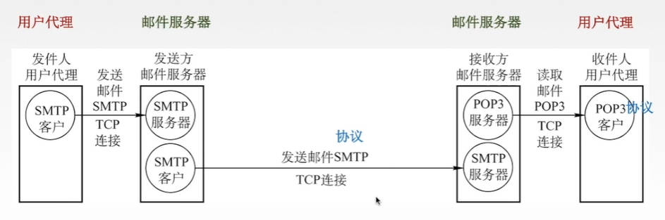
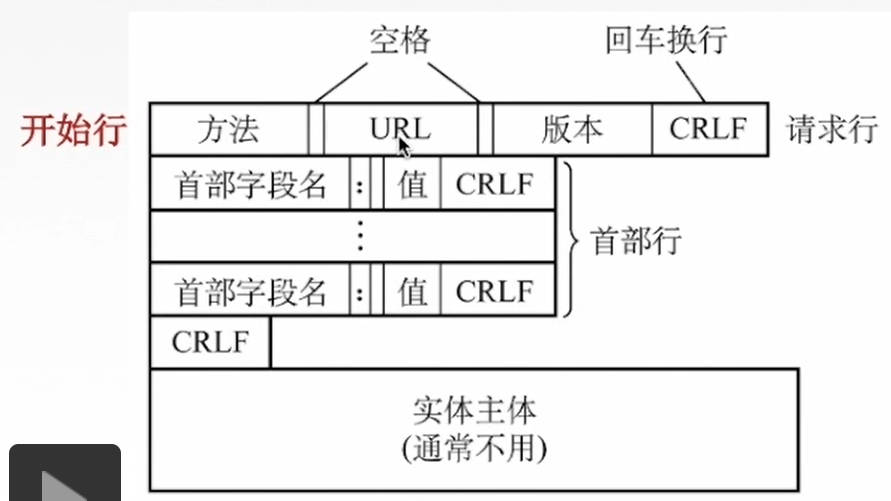
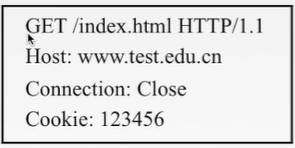
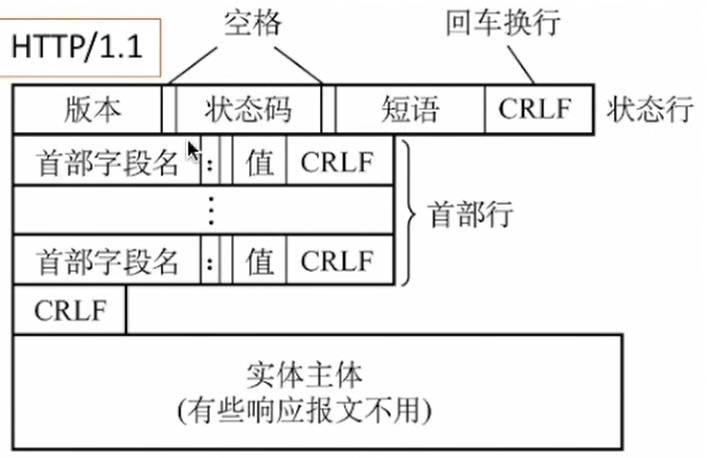

# 1. 应用层概述

应用层对应用程序的通信提供服务，只需要专注于为用户（在这里指各种应用程序）提供功能，不用关心数据是如何传输的，只需要把应用数据传给下一层（传输层）

应用层工作在用户态，下边的层都工作在内核态

应用层的协议定义了：

- 应用进程交换的报文类型，比如是请求还是响应

- 各种报文类型的语法，如报文中的各个字段及其详细描述

- 字段的语义，即包含在字段中的信息的含义

- 进程何时、如何发送报文，以及对报文进行响应的规则

应用层的功能

- 文件传输、访问和管理 —— FTP

- 电子邮件 —— SMTP、POP3

- 虚拟终端 —— HTTP

- 查询服务和远程作业登录 —— DNS

# 2. 网络应用模型

## 2.1  客户/服务器（Client/Server，C/S）模型

**服务器：**

提供计算服务的设备

服务器的特点

1. 永久提供服务

2. 永久性访问地址/域名

**客户机：**

请求计算服务的主机

客户机特点：

1. 与服务器通信，使用服务器提供的服务

2. 间歇性接入网络

3. 可能使用动态IP地址

4. 不与其它客户机直接通信

**常见使用C/S模型的应用：**

- Web
- FTP
- 远程登陆
- 电子邮件

## 2.2  P2P（peer to peer）模型

不存在永远在线的服务器，每个主机既可以提供服务，也可以请求服务

任意端系统/节点直接可以直接通讯

节点间接性接入网络

节点可能改变IP地址

**主要优点：**

- 可扩展性好：可以应对大量主机涌入网络

- 网络健壮性强：有节点坏掉影响不大

# 3. 域名系统DNS

由于各个服务器的IP地址不方便记忆，于是引入域名。在实际访问网站时，输入域名后，主机就会去DNS服务器找对应的IP地址。DNS将IP地址返回给主机后，就能正常访问对应网站服务器

## 3.1 域名的命名规则

`www.cskaoyan.com.`

域名由英文字母数字，和`.`组成，每一个点分隔开的东西叫做一个标号，比如www是一个标号，cskaoyan是一个标号。不区分大小写

域名的标号自左到右由低到高——www是三级域名、cskaoyan是二级域名、com是顶级域名（如果com后面还有，则com后面的`·`叫做根，根后面才叫顶级域名，前面的以此类推减少一级）

顶级域名包括

- 国家顶级域名：cn，us，uk

- 通用顶级域名：com，net，org（非盈利性组织），gov（政府），int（国际组织），aero（航空传输的企业），museum（博物馆），travel（旅游业）

- 基础结构域名/反向域名：arpa

    用于反向域名解析，也就是IP地址到域名的映射

二级域名：

- 类别域名：ac（科研机构）、com（工商金融等企业）、edu（教育行业）、mil（中国国防机构）、net（提供互联网服务的机构）、org（非营利性组织）

- 行政区域名：用于我国各省、自治区、直辖市：bj、js等

- 自己注册的二级域名：比如cctv，cskaoyan，只要保证注册的域名是全球唯一的

三级域名：有指定二级域名的会分配一个三级域名，比如北大网站`www.pku.edu.cn`

四级域名：跳转到网页的指定功能。比如www是主页，mail是发送邮件的页面

## 3.2 域名服务器

DNS服务器也要进行分层

主机发送DNS请求的顺序：本地域名服务器 —— 根域名服务器 —— 顶级域名服务器 —— 权限域名服务器

- 本地域名服务器（默认路由服务器）：不在DNS服务器的分层体系当中，是离主机最近的服务器，不超过几个路由器的距离。如果一台主机要查询的另一台主机同属一个本地ISP，就可以立刻将查询的主机名转换为IP地址；本地域名服务器中还有高速缓存，存储了最近访问过的域名和对应IP地址。可以使DNS查询过程变得简单快速

- 根域名服务器：最高层次，最重要的服务器。知道所有顶级域名的IP地址。得到域名后根域名服务器会先查看顶级域名，然后看对应的服务器在哪里

- 顶级域名服务器：管理该顶级域名服务器注册的所有二级域名

- 权限域名服务器：负责一个区的域名服务器

## 3.3 域名解析过程

**递归查询**：

本地主机向本地域名服务器询问域名，本地域名服务器把要解析的域名发给根域名服务器，根域名服务器去顶级域名服务器查找，顶级域名服务器去权限域名服务器查找，然后再一层一层返回

该方法给根域名服务器造成负载过大，实际中几乎不适用

**递归和迭代相结合的查询**：

递归查询：本地主机将要查询的域名发给本地域名服务器，本地域名服务器替主机寻找，这是递归查询

迭代查询：本地域名服务器把域名发给根域名服务器之后，根域名服务器不会替他找，只会把对应顶级域名服务器地址发给本地域名服务器，本地域名服务器还要自己去访问顶级域名服务器，再自己访问权限域名服务器。这是迭代查询

主机和本地域名服务器中还有高速缓存

# 4. 文件传输协议FTP

简单文件传送协议TFTP（Trivial File Transfer Protocol）：是一个比较容易实现，而且它比较面向小文件得一种文件传送协议

文件传送协议FTP：提供不同种类主机系统（硬、软件体系等都快可以不同）之间的文件传输能力

实际上是服务器端和客户端之间的拷贝

## 4.1 FTP服务器和用户端

FTP是基于客户/服务器（C/S）的协议

用户通过一个客户机程序连接至在远程计算机上运行的服务器程序

FTP服务端：依照FTP协议 提供服务，进行文件传送的计算机就是FTP服务器

FTP客户端：连接FTP服务器，遵循FTP协议与服务器传送文件的电脑就是FTP客户端

## 4.2 FTP工作原理

首先进行登录，也可以匿名登陆

之后建立TCP连接，FTP使用TCP实现可靠传输

服务器进程包括1个主进程 和 n个从属进程

- 1个主进程

    负责打开熟知端口21等待用户发出连接请求

- 从属进程

    由从属进程负责处理用户具体请求

控制进程和数据进程都属于从属进程。客户端和服务器的控制进程之间会建立一个控制连接（端口号是21），数据进程之间会建立一个数据连接（端口号是20）。控制连接始终是打开的，数据连接在数据传送完毕后就会关闭

主动传输模式会使用20端口，被动传输模式由服务器和客户端自行协商决定（端口>1024）

- 主动传输模式：客户端和服务器建立控制连接之后，服务器主动发送数据连接的端口号20

- 被动传输模式：客户端和服务器建立控制连接之后，客户端询问服务器端数据连接的端口号是多少，此时服务器就会返回一个大于1024的端口号

# 5. 电子邮件

## 5.1电子邮件系统组成

**电子邮件信息格式**

- 信封：根据信封上的信息传送邮件

    比如有收件人邮箱

- 内容：电子邮件的主要部分

    - 首部：要自己填写To（给谁）和Subject（主题），自动补充From和Date

    - 主体

**电子邮件系统组成结构**

用户代理：电子邮件客户端软件

- 为用户提供一个交互界面

- 功能：

    - 撰写：给用户提供编辑邮件的环境

    - 显示：用户写好的信显示在屏幕上，看到收到的和发出的邮件

    - 处理：发送和接收邮件后对邮件进行处理，进行删除存盘打印转发等处理

    - 通信：利用邮件发送协议把邮件发到邮件服务器中

邮件服务器

- 功能

    - 发送&接收邮件：发送给接收方邮件服务器，或者接收从发送方邮件服务器传来的邮件

    - 向发件人报告邮件传送结果

协议

- SMTP协议（发送邮件）：
  - 从发件人用户代理发到发送方邮件服务器 

  - 从发送方邮件服务器发到接收方邮件服务器

- POP3协议、IMAP协议（接收邮件）：
  - 收件人用户代理从接收方邮件服务器接收邮件

## 5.2 简单邮件传送协议SMTP

使用TCP连接，端口号是25，C/S模式

SMTP规定了两个相互通信的SMTP客户进程和SMTP服务器进程之间应如何交换信息

负责发送邮件的SMTP进程就是SMTP客户，负责接收邮件的进程就是SMTP服务器

**通信三个阶段**

1. 连接建立

    发送方写邮件，之后把写好的邮件发送给发送方邮件服务器，放到邮件服务器缓存中。发送方服务器每隔一定时间进行扫描，如果发现缓存中有邮件，就会与接收方邮件服务器建立TCP连接。

    建立好连接之后，接收方邮件服务器发送`220 Service Ready(服务就绪)`，告诉发送方邮件接收器可以接收邮件。发送方收到之后会发送一个HELO命令，接收方如果有能力接收邮件，就回答`250 OK`，否则回复`421 Service not available`
    
    SMTP不使用中间的邮件服务器，不管发送方和接收方相隔多远，都会在双方服务器之间直接建立连接

- 邮件发送

    发送方：`MAIL FROM：<发送方的邮箱地址>`

    接收方：250 OK / 没有准备好返回另外指定的数字

    发送方：`RCPT TO：<目的邮箱地址>` 可以有多个RCPT(recipient的缩写)命令群发。

    接收方：250 OK / 或其它指定的数字；让SMTP服务器确定是否有这个用户

    发送方：`DATA`  表示要开始传输邮件内容

    接收方：`354 Start main input; end with <CRLF>.<CRLF>`表示服务器端（接收方）同意传输

    发送方：开始传输邮件内容，以`<CRLF>.<CRLF>`表示邮件内容结束

    接收方：接收结束

- 连接释放

    邮件发完，SMTP客户发送QUIT命令，SMTP服务器返回221，表示同意释放TCP连接

**MIME**

SMTP协议存在一些缺点：

- 不能传送可执行文件或者其它二进制对象

- 仅限于传送7bit的ASCII码，不能传送其它非英语国家的文字

- SMTP服务器会拒绝超过一定长度的邮件

通用因特网邮件扩充MIME：将非ASCII码转换为7位ASCII码

MIME并未改动SMTP或取代他，只是定义了传送feiASCII码的编码规则

## 5.3 邮件读取协议

### 5.3.1 POP3

POP是一个邮件读取协议，建立在TCP链接上，端口号为110，使用C/S模式

采用Pull的通信方式，当用户读取邮件时，用户代理向邮件服务器发出请求，拉取邮件

工作方式有两种：

- 下载并保留（在服务器）

    用户下载完邮件之后邮件依然保留在服务器缓存中

- 下载并删除

    用户下载完邮件之后就把附件删除

### 5.3.2  网际报文存取协议IMAP

IMAP协议比POP协议复杂。当用户PC的IMAP看客户程序打开IMAP服务器的邮箱时，用户可以看到邮箱的首部。若用户需要打开某个邮件，该邮件才上传到用户的计算机上

可以让用户在不同的地方使用不同的计算机随时上网阅读处理邮件，还允许只读取邮件中的某一个部分（比如先看正文，有WIFI时再下载附件）

## 5.4 基于万维网的电子邮件

使用浏览器登录电子邮箱

用户发送到发送方邮件服务器的过程和用户从接收方邮件服务器读取邮件的过程使用HTTP协议，邮件服务器之间发送的过程依然使用SMTP协议

# 6. 万维网和HTTP协议

## 6.1 万维网

万维网WWW（World Wide Web）是一个大规模的、联机式的信息储藏所/资料空间，是无数个网络站点和网页的集合

在万维网中，一个有用的东西称为一个“资源”，通过“统一资源定位符”（URL）来唯一标识一个资源（文字、视频、音频），这些资源通过HTTP协议（超文本传输协议）传送给使用者，使用者通过点击URL链接来获取资源

**URL一般形式：**

`<协议>://<主机>:<端口>/<路径>`

在URL中不区分大小写

- 协议：指用什么协议来获取万维网文档

  - 协议是http时，主机部分是域名

  - 协议是ftp时，主机部分是IP地址

- 主机：存放资源的主机 在因特网中的域名或IP地址

万维网以客户/服务器（C/S）的方式工作，用户使用的浏览器就是万维网客户程序

万维网使用超文本标记语言HTML，使得万维网页面设计者可以很方便地从一个界面的连接转到另一个界面，并能在自己的屏幕上显示出来

## 6.2 超文本传输协议HTTP

### 6.2.1 HTTP基本概念

**超文本传输协议**

- 协议：HTTP是一个用在计算机世界的协议，它确立了计算机之间交流通信的规范，以及相关的各种控制和错误处理方式

- 传输：HTTP是用来在两点之间传输数据的协议

- 超文本：

  现在的图片、视频、压缩包等都算文本

  超文本是 文字、图片、视频等的混合体，最关键有超链接，能从一个超文本跳转到另外一个超文本

所以，HTTP是一个在计算机世界里 专门用于在两点之间传输文件、图片、音频、视频等超文本数据 的约定和规范

**HTTP常见字段：**

- Host字段：客户端发送请求时，用于指定服务器的域名，比如www.a.com
- Content-Length字段：服务器返回数据时，表名本次回应的数据长度
- Connection字段：设置为Keep-Alive时，表示客服端要求服务器持久连接

- Content-Type字段：用于服务器回应时，告诉客户端本次数据是什么格式

  比如：`Content-Type：text/html;charset=utf-8`，表示发送的是网页，编码是utf8

- Content-Encoding字段：服务器返回数据时：表示服务器返回的数据使用了什么压缩格式

**HTTP浏览网页的过程**

每个万维网的网点都会有一个服务器进程，不断监听TCP的端口80，看是否有万维网的客户来请求服务

用户浏览页面方法：

1. 输入URL

2. 点击超链接

主机的具体过程：

1. 浏览器分析URL

2. 浏览器向DNS请求解析IP地址

3. DNS解析出IP地址

4. 浏览器与服务器建立TCP连接

5. 浏览器发出取文件命令

6. 服务器响应

7. 释放TCP连接

8. 浏览器显示

### 6.2.2 HTTP报文结构

分为请求报文和响应报文。HTTP报文是面向文本的，因此在报文中的每一个字段都是一些ASCII码串

**请求报文：**

开始行

- 方法：是一些命令，对请求的数据执行的命令，比如获取或者删除

- url

- 版本：使用什么版本的HTTP协议

- CRLF：回车换行

首部行：用于说明浏览器、服务器和报文主题的一些相关信息

- 方法：GET，请求获取信息

- url：index.html

- 版本：HTTP/1.1

- Host：请求的数据在这个网址上

- Connection：Close，非持续连接

**响应报文：**

HTTP常见状态码

- 1xx：提示信息，表示目前是协议处理的中间状态
- 2xx：表示服务器已成功处理客户端请求
- 3xx：表示客户端请求的资源位置发生了变动，需要客户端用新的URL访问

- 4xx：表示客户端发送的报文有误，服务器无法处理
- 5xx：表示客户端请求报文正确，但是服务器处理时内部发生了错误

### 6.2.3 GET 与 POST

**GET**

一般用于请求从服务器获取资源，这个资源可以是：静态的文本、页面、图片、视频等

GET请求的数据直接放在HTTP包头中，也就是URL之后，格式为`login.action?name=user_name&password=user_pwd&virify=%E4%E5`

直接明文传输数据，不安全，能传输的数据长度有限（URL本身没有对数据长度做限制，是浏览器对整个URL的长度有限制）

浏览器会直接把http header和data一起发给服务器，服务端相应200，请求成功

**POST**

主要向服务器提交数据，数据放在请求报文的body里

比如，在评论区写好评论，点击提交，浏览器就会执行一次POST请求。把留言文字放入请求报文body里，然后拼接好POST请求头，通过TCP协议发送给服务器

POST的数据放在body中，且可以加密，安全性高，能传输的数据大小也比较大

浏览器会先发送http header给服务器，告诉服务器等一下会有数据过来，服务器相应100continue，告诉浏览器已准备接收数据，浏览器再post一个data给服务器，服务器相应200，请求成功

**安全和幂等**

- 安全：指请求方法不会破坏服务器上的资源

  GET请求是安全的，因为它是只读操作

  POST会新增或提交数据，修改服务器上的资源，所以不安全

- 幂等：多次执行相同操作，结果是相同的

  GET方法幂等，因为它只会请求和读取数据

  POST方法不幂等，多次提交数据就会创建多个资源

### 6.2.4 HTTP1.1 优缺点

**优点**

- 简单：HTTP基本报文格式就是header + body，其中header信息也是key-value简单文本的形式，易于理解

- 灵活，易于扩展：

  HTTP协议中的每个组成（比如请求方法、状态码、头字段）都没有被固定死，允许开发人员自定义和扩充

  HTTP工作在应用层，下层可以随意变化

- 应用广泛、跨平台：

**双刃剑特性**

- 无状态

  好处：无状态使得服务器不会去记忆HTTP的状态，减轻服务器负担

  坏处：在完成有关联性的操作时非常麻烦，可以使用Cookie、session等技术解决。Cookie将状态信息保存在浏览器中，每次发送请求将状态信息一起发给服务器，session将状态保存在服务器中，每次放松请求只需发送session ID，之后服务器去找对应的状态信息

- 明文传输

  好处：便于调试

  坏处：HTTP传输的所有信息都毫无隐私可言，很容易被窃取

**缺点：**

- 不安全

  窃听风险：使用明文通信，信息不安全

  冒充风险：不验证通信方身份，可能遭遇伪装的网站

  篡改风险：无法证明报文完整性，接收到的报文可能已遭篡改

## 6.3 HTTPS

HTTPS（Hyper Text Transfer Protocol over Secure Socket Layer）并不是单独的协议，而是指为了解决HTTP的安全问题，在HTTP的基础上，在HTTP与TCP层之间加入了SSL/TLS协议

HTTPS的端口号是443，不同于HTTP端口80

为了解决HTTP存在的三个安全风险，HTTPS使用了以下三个方法

- 混合加密：采用对称解密和非对称加密结合的混合加密方式，实现信息的机密性
- 摘要算法：实现完整性
- 数字证书：解决冒充风险

### 6.3.0 加密的相关知识

**对称加密：**

通信双方用同样的规则加密，用同样的密钥解密。

优点：只使用一个密钥，运算速度快

缺点：密钥必须保密，但是无法做到安全的密钥交换，密钥在传输过程中同样有可能被劫持。只要外人得到密钥，一样可以解密数据

**非对称加密：**

用两个密钥进行加密和解密——公开密钥和私有密钥

公开密钥是所有人都知道的密钥，私有密钥只有持有方才有，一般放在服务器中。用公钥加密的内容必须用私钥才能解开，私钥加密的内容只有公钥能解开

服务器中有成对的公钥和私钥，然后公布自己的公钥让客户端知道，客户端用公钥加密数据，这段数据只有用服务器端的私钥才能解密

**数字证书：**

为了保证公钥的可信度，将服务器公钥放在第三方权威机构CA颁发的SSL证书中，只要证书是可信的，公钥就是可信的

证书由明文和数字签名组成，

### 6.3.1 HTTPS建立连接的过程

HTTPS采用对称加密和非对称加密结合的混合加密方式。

- 在通信建立前采用非对称加密的方式交换**会话密钥**

  主要解决了对称加密密钥无法安全交换的问题

- 在通信过程中使用会话密钥进行对称加密。

  对称加密运算速度快

HTTPS建立连接的过程为：TCP三次握手，TLS四次握手

首先**TCP三次握手**建立通信连接

**TLS四次握手**

1. 客户端发送Client Hello

   生成第一随机数，并明文发给服务器端

2. 服务器发送Server Hello

   生成第二随机数，明文发给客户端

   并且把证书和公钥发给客户端，

   都发送完毕后发送Server Hello Done告诉客户端发送完毕

3. 客户端回应

   客户端会生成第三个随机数——预主密钥，预主密钥会通过服务器发来的公钥进行加密，再发送给服务器，并告诉服务器随后的信息都将用会话密钥加密通信（对称加密）

   客户端通过三个随机数生成会话密钥

4. 服务器最后回应

   服务器也通知随后的信息都用会话密钥加密通信，并发送服务器握手结束通知

   服务器通过三个随机数生成会话密钥

并不需要每次HTTPS请求都进行TLS握手

服务器会为每个客户端软件维护一个session ID，在TLS握手阶段传给浏览器，生成与该浏览器通信用的会话密钥后，服务器会把该密钥存到对应的session ID下。之后该浏览器的每次请求都会携带session ID，服务器会根据session ID找到对应的密钥并进行解密加密操作。

**数据传输**

之后双方的加密通信就是对称加密的方式，使用普通的HTTP协议，用会话密钥加密内容

# 7. HTTP的发展

**WEB1.0**

- 1989：http0.9，第一个http协议发布，只能传送HTML文本类型的数据
- 1996：http1.0，第一次支持富文本，增加响应文件类型，默认不持久连接
- 1997：http1.1，默认持久连接

**WEB2.0**

- 2015：http2.0
- 2022：http3.0

## 7.1 HTTP1.x

HTTP1.1与HTTP1.0相比：

- **持久化连接**：HTTP1.0默认是非持久连接，HTTP1.1默认是持久连接，减少了性能开销

- **连续传输**：HTTP1.1新增支持流水线传输，即第一个请求发出去就可以发第二个请求，不用等第一个请求得到响应。而HTTP1.0发送第一个请求之后必须收到回复才能发送第二个请求

  **队头阻塞问题**：HTTP1.1按顺序发送多个请求后，服务器是按请求的顺序相应的。如果第一个请求处理的时间很长，那后面的请求都得等着

- **允许请求部分资源**：请求资源时，HTTP1.0默认将资源相关的对象全部发送给请求方，HTTP1.1允许只请求部分资源

- HTTP1.1新增24个错误状态响应码

## 7.2 HTTP2.0

- **二进制传送：**HTTP1.1及以前都是用明文文本传输；HTTP2.0采用了二进制传送，增加数据传输效率，并且统一了数据格式

- **头部压缩**：每次进行HTTP请求响应的时候，头部里很多字段都是重复的，在HTTP1.1中每次都会直接发送整个头部。HTTP2.0采用HPACK算法将头部压缩。

  **HPACK算法：** 在客户端和服务器端同时维护一张头部信息表，存放了所有的字段以及对应的序号，发送时头部只需存放字段对应的编号即可

- **数据流：**把报文拆成二进制数据帧，同一个报文拆成的数据帧携带相同的stream id，这些数据帧分别单独传输，到达目的地后再按照stream id组装起来还原为原始数据。

- **多路复用：**在一个连接中可以并发 发送多个请求或响应多个请求，而不用按照顺序发送或响应，这样就解决了HTTP1.1中串行发送和处理请求带来的问题——队头阻塞

- **服务器推送：**改善了传统的“请求-应答”工作模式，服务器不再只能被动地响应，也可以主动向客户端发送消息。

  比如客户端请求一个html文件，服务器发送完之后可以把这个html也页面相关的静态文件也发送给客户端。当客户端准备向服务器请求静态文件的时候，就可以直接从缓存中获取，而不需要再发送请求。

## 7.3 HTTP3.0

在HTTP3.0之前使用的都是TCP连接，来保证可靠传输。TCP的主要问题在于：如果多个HTTP请求复用一个TCP连接，一旦发生了丢包现象，触发TCP的重传机制，那么所有的HTTP请求都必须等待重传。另外TCP还有慢启动、拥塞窗口尺寸设置等问题

所以HTTP3.0改为使用UDP协议，因为UDP不管传输顺序也不管丢包，而使用QUIC协议保证可靠性传输

- QUIC有一套自己的机制保证可靠传输，当某个流发生丢包时只阻塞这个流
- TLS升级成1.3版本，只需要3次握手，并且QUIC把以往TCP（3次）和TLS1.3（3次）的共计6次握手合并成3次
- 头部压缩算法升级成QPack

