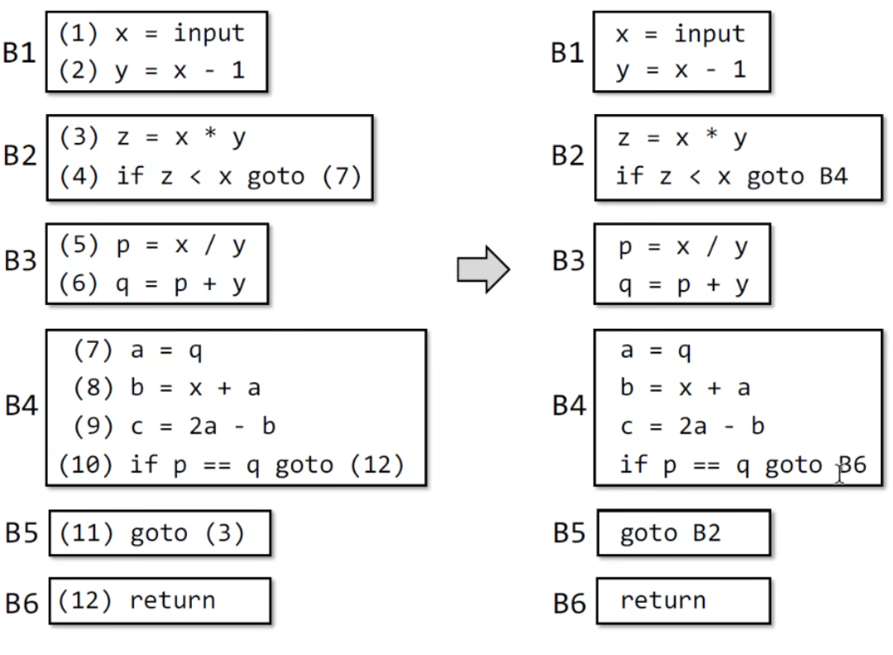
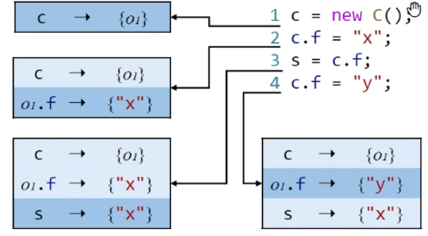

中科院李炼、北大熊英飞、哈工大苏小红、南大李樾

软件工程/系统软件/程序设计语言顶刊顶会

学术刊物：

1. [TOPLAS：ACM Transactions on Programming Languages and Systems](https://dl.acm.org/journal/toplas)
2. [TOSEM：ACM: Transactions on Software Engineering and Methodology](https://dl.acm.org/journal/tosem)
3. [TSE：IEEE Transactions on Software Engineering](https://ieeexplore.ieee.org/xpl/RecentIssue.jsp?punumber=32)
4. [TSC：IEEE Transactions on Services Computing](https://ieeexplore.ieee.org/xpl/RecentIssue.jsp?punumber=4629386)

学术会议：
1. [PLDI：ACM SIGPLAN Conference on Programming Language Design and Implementation](https://dblp.uni-trier.de/db/conf/pldi/index.html)
2. [POPL：ACM SIGPLAN-SIGACT Symposium on Principles of Programming Languages](http://dblp.uni-trier.de/db/conf/popl/)
3. [FSE：ACM International Conference on the Foundations of Software Engineering](http://dblp.uni-trier.de/db/conf/sigsoft/)
4. [SOSP：ACM Symposium on Operating Systems Principles](http://dblp.uni-trier.de/db/conf/sosp/)
5. [OOPSLA：Conference on Object-Oriented Programming Systems, Languages,and Applications](http://dblp.uni-trier.de/db/conf/oopsla/)
6. [ASE：International Conference on Automated Software Engineering](http://dblp.uni-trier.de/db/conf/kbse/)
7. [ICSE：International Conference on Software Engineering](http://dblp.uni-trier.de/db/conf/icse/)
8. [ISSTA：International Symposium on Software Testing and Analysis](http://dblp.uni-trier.de/db/conf/issta/)
9. [OSDI：USENIX Symposium on Operating Systems Design and Implementations](http://dblp.uni-trier.de/db/conf/osdi/)
10. [FM：International Symposium on Formal Methods](http://dblp.uni-trier.de/db/conf/fm/)

# 1. 什么是静态分析

```
Static analysis analyzes a program P to reason about its behaviors and determines whether it satisfies some properties before running P.
```

静态分析就是在运行一个程序P之前，先分析出这个程序可能的行为，并判断它是否满足它所需的性质

**莱斯定理**

但是Rice's Theorem莱斯定理说，所有我们感兴趣的（non-trival的）特性，比如空指针异常、内存泄露等，我们都不可能准确说出这个程序中有没有、有几个，即不可能做到sound and complete（也即truth）

所以我们只能在sound 和 complete之间做取舍，在静态分析领域一般都会选择接受sound，即接受一定的误报率，而不接受有些异常未被报出


最终静态分析可以概括为：在保证soundness（正确性）的前提下，在precision（精度）和speed（速度）之间取舍

**may和must**

- may analysis - Sound

  指输出的信息可能是真的（over-approximation）但是所有真结果必须输出，over就是把程序动态运行的所有可能情况都考虑

  或者说，只要有可能，就会输出

- must analysis - Complete

  指输出的信息必须是真的（under-approximation），可以接受有些真结果没有输出，但是输出出来的必须都是真的

# 2. IR

Intermediate Representation中间表示。

在静态分析过程中，需要先把源代码变成某种中间表示，以利于静态分析算法的操作。没有固定的要求和格式，只要有利于算法实现，就可以。

 ## 2.1 编译器 vs 静态分析器

编译器：把高级语言转化为机器码。需要经过：

- 词法分析，生成Tokens

  使用正则表达式

- 语法分析，生成AST

  使用上下文无关文法分析

- 语义分析，生成Decorated AST （装饰过的AST）

  使用Attribute Grammar

- Translator，生成IR（一般是三地址码IR，3-address）

上述步骤是编译器前端，而静态分析一般就在IR的基础上分析

- Code Generator，生成机器码

**AST vs 3AC**

AST其实也可以看作一种中间表示，但大部分静态分析器都在3地址码IR上分析，很少有静态分析器直接在AST上做分析，这是因为：

- IR更接近底层语言
- IR是语言无关的，即不同的语言可以翻译为相同结构的IR
- AST缺乏控制流信息，而IR可以包含控制流信息

## 2.2 3AC三地址码

3-Adderss Code，三地址码，是一种中间表示形式。

三地址码没有固定的形式，比如soot生成的中间表示叫jimple，LLVM生成的中间表示叫LLVM IR，它们都是一种三地址码

3-Address Code要求每条语句中最多包含3个Address，Adderss可以是变量名、常量或者临时变量。同时要求等号右边最多只有一个操作符

## 2.3 Basic Block（BB）

使用三地址码建控制流图时，一般使用BB作为图的节点

**定义**

代码基本块Basic Block是满足下列条件的 最大 连续 三地址码序列：

- Basic Block的入口只有一个，并且是块中的第一条指令
- Basic Block的出口只有一个，并且是块中的最后一条指令

**算法**

从三地址码构建Basic Block的算法

1. 找到所有需要作为入口的语句（leader）

   根据Basic Block的定义，作为入口的语句可以根据以下条件寻找

   - 程序的第一条指令是leader
   - 所有jump指令的目标指令是leader（保证BB入口只有一个）
   - 所有jump指令后面紧跟着的下一条指令是leader（保证BB出口只有一个）

2. 从每个leader开始往下，直到遇到下一个leader，这就是一个Basic Block


## 2.4 Control Flow Graph（CFG）

控制流图的节点就是Basic Block，接下来需要给节点之间添加边

在加边之前，先将所有跳转语句从跳转到某一条指令变为跳转到某一个BB



**加边规则**

- 由跳转语句连接的两个BB之间需要加边
- 两个相邻的BB之间需要加边，除非上一个BB的结尾是无条件跳转语句

**从3AC到CFG的完整过程**

1. 由3AC构建Basic Block
2. 将指令中的跳转语句的目标，从指令变为BB
3. 给BB之间加边
4. 最后给整个CFG加上Entry节点（只有一个）和Exit节点（可能有多个）

# 3. Data Flow Analysis应用

Data Flow Analysis──How **application-specific** Data Flows through the Nodes（BBs/statements）and Edges（control flows）of CFG（a program）？

也就是说，数据流分析就是，针对于**当前应用所关注的**数据，分析这个数据是怎样流经CFG中的节点和边的，当流经节点时，这个数据会经过Transfer function的处理，当流经边时，会经过Control-flow constraint的处理。

- Data Abstraction：由于我们只关注想要的数据的流动，因此需要先对所有数据进行Abstraction，定义一个我们关注的数据所保存的格式
- Transfer Function：定义当数据流经某个节点时，根据这个节点的特性数据该如何改变
- Control-flow constraint：定义当数据流经某个边时，根据这个边的特性数据该如何改变

最终数据流分析会在每个program point处给出对应的data abstraction的状态，这就是数据流分析的结果

## 3.1 基本概念

这小节是介绍一下静态分析中的一些形式化符号化表述

### 3.1.1 Input and Output States

IR中每个语句的执行，都会将程序从一个状态点变为一个新的状态点。对于一个语句来说，改变前的状态点叫input state，改变后的状态点叫output state。程序的状态点叫做program point。

可达性分析会在每一个program point处给出，当前的data abstraction是什么样子的

对于某个语句的状态点有三种情况

- 顺序执行

  

  此时s2的input state就等于s1的output state

- 分散

  

  此时s2和s3的input state 都等于s1的output state

- 聚合

  

  此时s2的input state等于s1和s3的output state做meet运算，用^符号表示。就是把两个状态通过某种处理合并起来

### 3.1.2 Transfer Function

让程序状态点program point从input state变为output state的这个过程，可以表示为经过了一个input state经过了一个Transfer Function得到了output state。

Transfer Function用小写f和语句符号表示，比如经过语句 s 发生变化就表示为 fs(IN[s]) 

这个Function是自己定义的，根据应用场景和自己抽象出来的数据，定义数据经过这点之后会怎么改变

这种Transfer Function有两种情况

- Forward Analysis

  顺着执行流分析，也就是in经过转换函数得到了out

  

  

- Backward Analysis

  逆着执行流分析，也就是通过out经过某种转换得到in

  

  

### 3.1.3  Control Flow's Constraints

对于Basic Blocks也有上述同样的概念，即Basic Blocks也有对应的input state和output state，并且Basic Blocks也是某种Transfer Function

- 在Basic Blocks内部的语句之间的状态改变

  

  由于在BB内部的语句一定是顺序执行，因此有 `IN[si+1] = OUT[si]`

  并且由于BB的入口一定是第一个语句，出口一定是最后一个语句，因此有

  `IN[B] = OUT[s1]`  `OUT[B] = OUT[sn]`

- 在Basic Blocks之间的状态改变

  forward analysis：

  

  backward analysis：

  

## 3.2 Reaching Definitions Analysis

可达性分析

**Reaching Definitions可达性定义**

可达性定义：在程序状态点（program point） p 定义的d 可以到达点q，当且仅当从 点p到点q有一条路径，并且这条路径上d没有被kill掉

d的定义点的意思是，给d进行赋值的点，而不是声明d的点

被kill掉的意思是，d没有遇到新的定义点，即路径中没有重新给d进行赋值

比如 `D: v = x op y`，op表示一个二元操作符，比如+-*/

这个语句创造了变量v的一个定义点D，并且kill了变量v当前的其他定义点，但是v还没执行到的定义点不受影响

**分析之前的一些概念定义**

在分析之前，首先需要对本次分析所需要关注的数据进行抽象，以及对数据流经每个点和边后如何变动进行定义，即Transfer Function（点）和Control Flow Constraints（边）

- Data Abstraction

  把所有关注的定义点用一个bit vector表示，每个bit表示一个定义点的状态

- Transfer Function

  

# X.程序间分析

## X.1 构建函数调用图Call Graph

函数调用图说明了在函数内部的所有函数调用点指向哪个具体函数，以及函数返回值具体返回到哪里。这对于程序间分析来说是必须的

### X.1.1 求单个调用点

构建函数调用图有许多算法，比如CHA算法，其中最重要的一步就是确定某处调用的函数具体的定义在哪里，也就是具体调用了哪个函数。

函数的定义可以由函数签名来表示。函数签名的形式为`<C: T foo(P,Q,R)>`，表示foo函数定义在类C中，返回值为T，参数类型为P,Q,R

定义Dispatch(c, m)来确定某一点的函数签名，其中c是函数调用对象，m是函数签名，即调用是`c.m()`。如果对象c中有m，则结果就是m；否则就往c的父类c'中找m，直到找到m。

函数调用类型如下

- Static call

  静态方法

  此时调用的方法肯定是唯一的，而且就是m本身

- Special call

  包括三种调用：构造器、类中的私有成员方法、父类的成员方法

  构造器和类中私有成员方法是m本身，父类成员方法需要通过dispatch方法寻找，但肯定是唯一确定的

- Virtual call

  调用Special以外的其他静态方法，主要是接口调用和多态调用（父类引用指向子类对象）

  此时具体的方法签名只能在运行时才能知道，所以必须通过dispatch方法寻找，且不能唯一确定

具体算法如下：


需要注意的是，在处理virtual call时，只会考虑c的声明（引用）类型，而不会在意c的真正类型

### x.1.2 求整个调用图

求调用图的步骤

1. 从程序的入口函数（main函数）开始
2. 对于入口函数中的每个函数调用点，都通过Resolve找到它们对应的函数。将这些函数与main函数用边连起来（表示调用关系）。
3. 再从这些新找到的函数中再找其中的每个调用点，进一步找到对应函数，再连起来。重复以上步骤直到所有方法都被加入到调用图中

# Y 指针分析

指针分析就是求解一个指针都可能指向哪些内存地址

对于面向对象语言来说（以Java为例），指针分析就是求解一个指针（变量variable或者属性field）能指向哪些对象（object）

指针分析是may analysis，也就是说求出的可能指向是比实际上要多的

**注意：** 别名分析研究的是：两个指针指向同一个object吗，如果能指向，则说这两个指针是别名。别名分析可以从指针分析的结果中推断而来

最终的指针分析会选择 Allocation-site、Context-sensitive、Flow-insensitive、Whole-program

## Y.1 指针分析分类

根据对指针分析过程中一些因素的选择和问题的回答，可以从以下几个方面进行分类


### Y.1.1 Heap abstraction

如何对堆内存进行抽象

在程序实际运行过程中，堆中的对象数量可能是无限的。在静态分析过程中，如何将运行过程中可能产生的无限对象 抽象为静态分析时有限的对象就是一个很关键的问题

主要分为两大流派：Store base model和Storeless model

其中Store based model中的一种Allocation sites，思路是只在创建对象的地方新建一个抽象对象，即只在new语句处新建对象。即使这个new语句在循环中执行多次也只会创建一个。

### Y.1.2 Context Sensitivity

如何对调用上下文进行建模

上下文是指，在程序运行时一个方法会被调用很多次，在不同的地方被调用，而在每次调用时都会产生对应的上下文，由于被调用点不同，调用该函数之前执行的代码语句也不同，因此在不同的上下文中函数内的变量、形参等会不同。

上下文敏感就是对于同一个方法的不同上下文环境分别做静态分析；上下文不敏感就是把函数执行时所有可能的上下文都合并成一个上下文进行分析

### Y.1.3 Flow Sensitivity

如何对控制流进行建模

流敏感分析是指，在分析过程中尊重程序执行顺序，做法是在每条语句上都保存 程序执行到该点时的数据流信息（比如前面变量的指向关系）。在流敏感分析中，每个语句都会对应一个指向关系映射图



流非敏感是指，在分析过程中忽视控制流信息，即忽视程序执行顺序，而是将程序视作一些语句的无序集合 。对于流非敏感来说，整个程序只会对应一个指向关系映射图


### Y.1.4 Analysis Scope

分析程序当中的哪些部分

Whole-program：对整个程序中的所有指针都进行指向分析

Demand-driven：只对需求中所需要的指针进行指针分析

## Y.2  指针分析关注点

指针分析中只会关注会影响指针的语句（pointer-affecting statements），对于结构跳转语句（if-else、switch-case、for/while/do-while、break/continue）这种对指针没影响的语句不会关注

在Java中的指针有以下几类：

- Local variable，x，局部变量

- Static field，C.f，静态成员变量

- Instance field，x.f，成员变量

- Array element：array[i] 数组

  忽略下标，将数组看作只有一个field的对象

  原代码：

  ```java
  array = new String[10];
  array[0] = "x";
  array[1] = "y";
  s = array[0];
  ```

  指针分析处理中的代码，会忽略掉所有下标

  ```java
  array = new String[];
  array.arr = "x";
  array.arr = "y";
  s = array.arr;
  ```

为了简化分析，Static field和Local variable分析方式类似，Array element和Instance field分析方式类似，因此下面只关注Local variable和Instance field

针对于上面的几类指针，对应需要关注的语句Pointer-Affecting Statements类型有

- New，创建一个对象并复制给局部变量 x = new T()
- Assign，给局部变量赋值 x = y
- Store，向成员变量中存值，x.f = y
- Load，从成员变量中取值，y = x.f
- Call，方法调用，r = x.k(a, ...)

## Y.3 指针分析中的符号


- Variables：x，y表示程序中的变量，Y表示程序中所有变量的集合

- Fields：程序中的所有域

- Objects：表示程序中的对象

  由于使用allocation site，所有对象都抽象为了new语句处创建的对象，所以这个O实际上就表示程序中所有对象创建点的集合

- Instance Fields：Objects对象中的域，所以集合就是O和F的乘积

- Pointers：指针由两部分组成，程序中所有Variables和所有Instance Fields

最后的指向关系用pt表示，pt表示一种映射关系mapper，它的key是程序中某个具体的指针，value就是该指针对应的指针集，指针集就是该指针能指向的所有对象的集合。那么这个指针集一定属于O的幂集（幂集是所有子集构成的集合），用p(O)表示

pt(p)就表示指针p对应的指针集，即指针p能指向的所有对象的集合。

## Y.4 指针分析规则

当指针分析过程中遇到Pointer-Affecting Statements时，需要执行的动作


在rule一栏中，横线上面表示前提条件，下面表示结果

- **New**


new语句会创建一个新的对象oi，这个新对象oi会无条件加入x的指针集中，即将oi加入x可以指向的对象集合

- **Assign**


将y赋值给x，那么y可能指向的对象x现在也都可以指向了。

因此规则就是，如果一个对象oi在y的指针集中，那么就将这个对象加入到x的指针集中。即如果y指向oi，则让x也指向oi。也即将y指针集中的所有元素都加入到x的指针集中

- **Store**


将y赋值给x的成员变量f，也就是将y的指针集的所有元素都加入到x.f的指针集中

规则是，如果oi在x的指针集中，oj在y的指针集中，那么将oj加入到oi.f的指针集中。即x的指针集中的所有对象的域f都有可能指向oj所能指向的对象

- **Load**


从x指向的对象 的field里面，读取一个对象f赋值给y

规则是，如果oi在x的指针集，并且同时oj在oi.f的指针集中，那么就把oj加入到y的指针集中

并不是直接把x.f的指针集中对象全都加入到y的指针集中，而是要先取x的指针集，再在指针集中取f域的指针集

