中科院李炼、北大熊英飞、哈工大苏小红、南大李樾

软件工程/系统软件/程序设计语言顶刊顶会

学术刊物：

1. [TOPLAS：ACM Transactions on Programming Languages and Systems](https://dl.acm.org/journal/toplas)
2. [TOSEM：ACM: Transactions on Software Engineering and Methodology](https://dl.acm.org/journal/tosem)
3. [TSE：IEEE Transactions on Software Engineering](https://ieeexplore.ieee.org/xpl/RecentIssue.jsp?punumber=32)
4. [TSC：IEEE Transactions on Services Computing](https://ieeexplore.ieee.org/xpl/RecentIssue.jsp?punumber=4629386)

学术会议：
1. [PLDI：ACM SIGPLAN Conference on Programming Language Design and Implementation](https://dblp.uni-trier.de/db/conf/pldi/index.html)
2. [POPL：ACM SIGPLAN-SIGACT Symposium on Principles of Programming Languages](http://dblp.uni-trier.de/db/conf/popl/)
3. [FSE：ACM International Conference on the Foundations of Software Engineering](http://dblp.uni-trier.de/db/conf/sigsoft/)
4. [SOSP：ACM Symposium on Operating Systems Principles](http://dblp.uni-trier.de/db/conf/sosp/)
5. [OOPSLA：Conference on Object-Oriented Programming Systems, Languages,and Applications](http://dblp.uni-trier.de/db/conf/oopsla/)
6. [ASE：International Conference on Automated Software Engineering](http://dblp.uni-trier.de/db/conf/kbse/)
7. [ICSE：International Conference on Software Engineering](http://dblp.uni-trier.de/db/conf/icse/)
8. [ISSTA：International Symposium on Software Testing and Analysis](http://dblp.uni-trier.de/db/conf/issta/)
9. [OSDI：USENIX Symposium on Operating Systems Design and Implementations](http://dblp.uni-trier.de/db/conf/osdi/)
10. [FM：International Symposium on Formal Methods](http://dblp.uni-trier.de/db/conf/fm/)

# 1. 什么是静态分析

```
Static analysis analyzes a program P to reason about its behaviors and determines whether it satisfies some properties before running P.
```

静态分析就是在运行一个程序P之前，先分析出这个程序可能的行为，并判断它是否满足它所需的性质

**莱斯定理**

但是Rice's Theorem莱斯定理说，所有我们感兴趣的（non-trival的）特性，比如空指针异常、内存泄露等，我们都不可能准确说出这个程序中有没有、有几个，即不可能做到sound and complete（也即truth）

所以我们只能在sound 和 complete之间做取舍，在静态分析领域一般都会选择接受sound，即接受一定的误报率，而不接受有些异常未被报出


最终静态分析可以概括为：在保证soundness（正确性）的前提下，在precision（精度）和speed（速度）之间取舍

**may和must**

- may analysis - Sound

  指输出的信息可能是真的（over-approximation）但是所有真结果必须输出，over就是把程序动态运行的所有可能情况都考虑

  或者说，只要有可能，就会输出

- must analysis - Complete

  指输出的信息必须是真的（under-approximation），可以接受有些真结果没有输出，但是输出出来的必须都是真的

# 2. IR

Intermediate Representation中间表示。

在静态分析过程中，需要先把源代码变成某种中间表示，以利于静态分析算法的操作。没有固定的要求和格式，只要有利于算法实现，就可以。

 ## 2.1 编译器 vs 静态分析器

编译器：把高级语言转化为机器码。需要经过：

- 词法分析，生成Tokens

  使用正则表达式

- 语法分析，生成AST

  使用上下文无关文法分析

- 语义分析，生成Decorated AST （装饰过的AST）

  使用Attribute Grammar

- Translator，生成IR（一般是三地址码IR，3-address）

上述步骤是编译器前端，而静态分析一般就在IR的基础上分析

- Code Generator，生成机器码

**AST vs 3AC**

AST其实也可以看作一种中间表示，但大部分静态分析器都在3地址码IR上分析，很少有静态分析器直接在AST上做分析，这是因为：

- IR更接近底层语言
- IR是语言无关的，即不同的语言可以翻译为相同结构的IR
- AST缺乏控制流信息，而IR可以包含控制流信息

## 2.2 3AC三地址码

3-Adderss Code，三地址码，是一种中间表示形式。

三地址码没有固定的形式，比如soot生成的中间表示叫jimple，LLVM生成的中间表示叫LLVM IR，它们都是一种三地址码

3-Address Code要求每条语句中最多包含3个Address，Adderss可以是变量名、常量或者临时变量。同时要求等号右边最多只有一个操作符

## 2.3 Basic Block（BB）

使用三地址码建控制流图时，一般使用BB作为图的节点

**定义**

代码基本块Basic Block是满足下列条件的 最大 连续 三地址码序列：

- Basic Block的入口只有一个，并且是块中的第一条指令
- Basic Block的出口只有一个，并且是块中的最后一条指令

**算法**

从三地址码构建Basic Block的算法

1. 找到所有需要作为入口的语句（leader）

   根据Basic Block的定义，作为入口的语句可以根据以下条件寻找

   - 程序的第一条指令是leader
   - 所有jump指令的目标指令是leader（保证BB入口只有一个）
   - 所有jump指令后面紧跟着的下一条指令是leader（保证BB出口只有一个）

2. 从每个leader开始往下，直到遇到下一个leader，这就是一个Basic Block

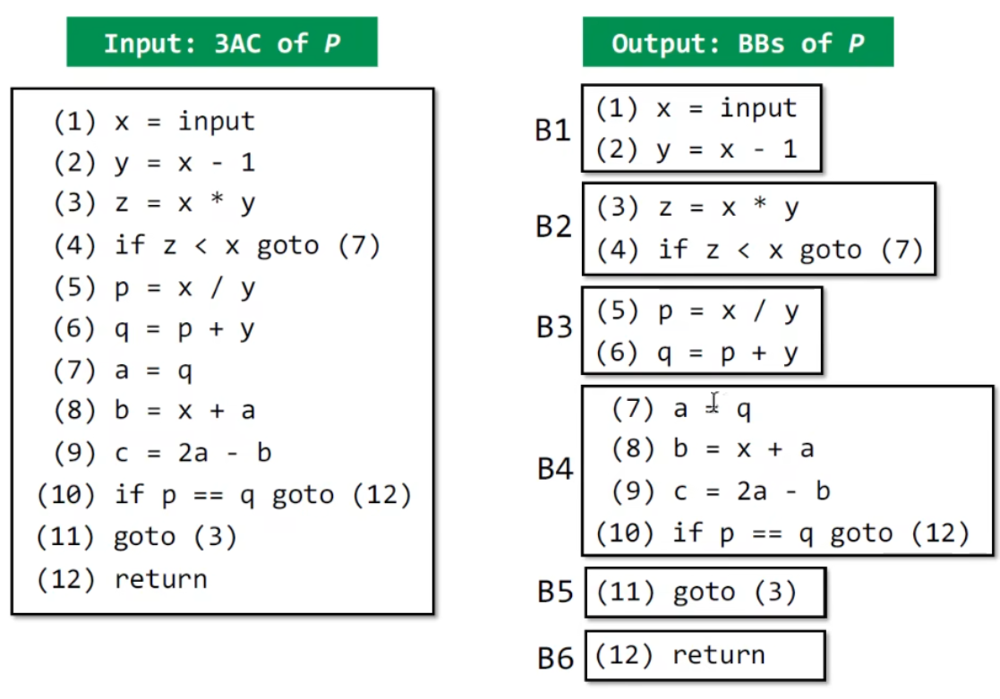

## 2.4 Control Flow Graph（CFG）

控制流图的节点就是Basic Block，接下来需要给节点之间添加边

在加边之前，先将所有跳转语句从跳转到某一条指令变为跳转到某一个BB

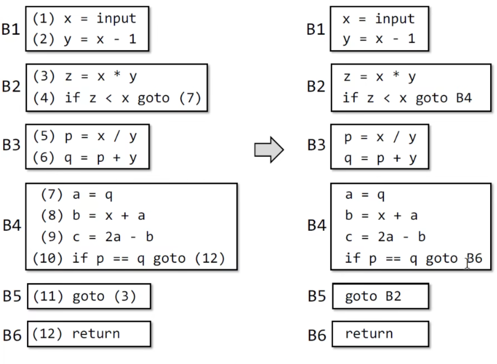

**加边规则**

- 由跳转语句连接的两个BB之间需要加边
- 两个相邻的BB之间需要加边，除非上一个BB的结尾是无条件跳转语句

**从3AC到CFG的完整过程**

1. 由3AC构建Basic Block
2. 将指令中的跳转语句的目标，从指令变为BB
3. 给BB之间加边
4. 最后给整个CFG加上Entry节点（只有一个）和Exit节点（可能有多个）

# 3. Data Flow Analysis应用

Data Flow Analysis──How **application-specific** Data Flows through the Nodes（BBs/statements）and Edges（control flows）of CFG（a program）？

也就是说，数据流分析就是，针对于**当前应用所关注的**数据，分析这个数据是怎样流经CFG中的节点和边的，当流经节点时，这个数据会经过Transfer function的处理，当流经边时，会经过Control-flow constraint的处理。

- Data Abstraction：由于我们只关注想要的数据的流动，因此需要先对所有数据进行Abstraction，定义一个我们关注的数据所保存的格式
- Transfer Function：定义当数据流经某个节点时，根据这个节点的特性数据该如何改变
- Control-flow constraint：定义当数据流经某个边时，根据这个边的特性数据该如何改变

最终数据流分析会在每个program point处给出对应的data abstraction的状态，这就是数据流分析的结果

## 3.1 基本概念

这小节是介绍一下静态分析中的一些形式化符号化表述

### 3.1.1 Input and Output States

IR中每个语句的执行，都会将程序从一个状态点变为一个新的状态点。对于一个语句来说，改变前的状态点叫input state，改变后的状态点叫output state。程序的状态点叫做program point。

可达性分析会在每一个program point处给出，当前的data abstraction是什么样子的

对于某个语句的状态点有三种情况

- 顺序执行

  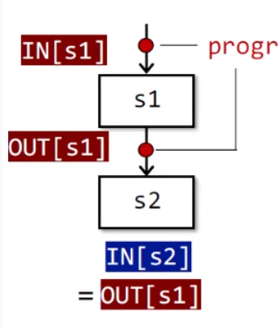

  此时s2的input state就等于s1的output state

- 分散

  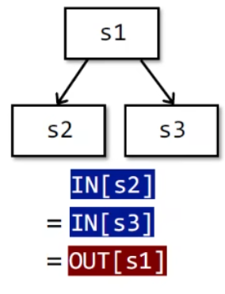

  此时s2和s3的input state 都等于s1的output state

- 聚合

  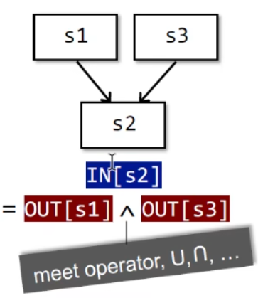

  此时s2的input state等于s1和s3的output state做meet运算，用^符号表示。就是把两个状态通过某种处理合并起来

### 3.1.2 Transfer Function

让程序状态点program point从input state变为output state的这个过程，可以表示为经过了一个input state经过了一个Transfer Function得到了output state。

Transfer Function用小写f和语句符号表示，比如经过语句 s 发生变化就表示为 fs(IN[s]) 

这个Function是自己定义的，根据应用场景和自己抽象出来的数据，定义数据经过这点之后会怎么改变

Transfer Function一般都有gen and kill组成，也可以说数据流分析就是在研究gen and kill问题。在IN经过代码块转化为OUT时，主要完成两件事：gen──该代码块中满足要求的点新增进去；kill──该代码块中不满足要求的点删除掉

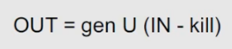

这种Transfer Function有两种情况

- Forward Analysis

  顺着执行流分析，也就是in经过转换函数得到了out

  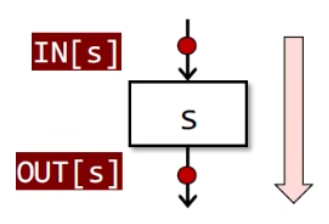

  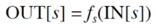

- Backward Analysis

  逆着执行流分析，也就是通过out经过某种转换得到in

  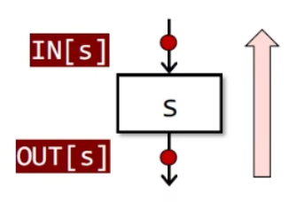

  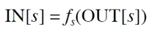

### 3.1.3  Control Flow's Constraints

对于Basic Blocks也有上述同样的概念，即Basic Blocks也有对应的input state和output state，并且Basic Blocks也是某种Transfer Function

- 在Basic Blocks内部的语句之间的状态改变

  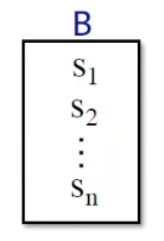

  由于在BB内部的语句一定是顺序执行，因此有 `IN[si+1] = OUT[si]`

  并且由于BB的入口一定是第一个语句，出口一定是最后一个语句，因此有

  `IN[B] = OUT[s1]`  `OUT[B] = OUT[sn]`

- 在Basic Blocks之间的状态改变

  forward analysis：

  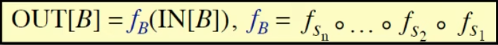

  backward analysis：

  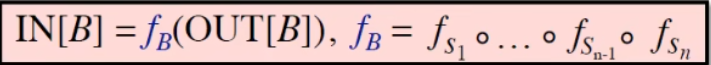

## 3.2 Reaching Definitions Analysis

可达性分析

**Reaching Definitions可达性定义**

可达性定义：在程序状态点（program point） p 定义的d 可以到达点q，当且仅当从 点p到点q有一条路径，并且这条路径上d没有被kill掉

d的定义点的意思是，给d进行赋值的点，而不是声明d的点

被kill掉的意思是，d没有遇到新的定义点，即路径中没有重新给d进行赋值

比如 `D: v = x op y`，op表示一个二元操作符，比如+-*/

这个语句创造了变量v的一个定义点D，并且kill了变量v当前的其他定义点，但是v还没执行到的定义点不受影响

**意义**

Reaching Definitions Analysis可以用于检测使用未定义变量

在程序入口处将所有变量的定义设置为undefined，如果在某点使用变量时发现undefined定义可以到达该点，说明变量未定义

### 3.2.1 data abstraction

在Reaching Definitions中关注的是所有变量的定义点

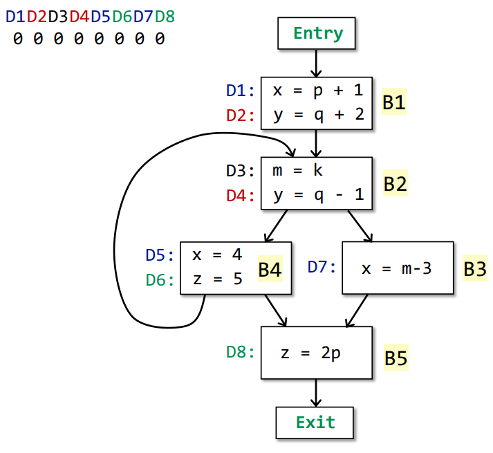

每个定义点用一个bit表示，所有定义点组成一个bit vector

比如在block B2的bit vector中bit vector为01000000，就表示定义点D2（也就是y=q+2这项定义）能到达B2处，其他所有定义点都无法到达B2处

### 3.2.2 transfer function

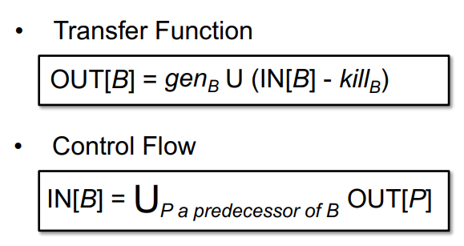

如果在代码块中发现了某个定义，就将该定义对应的bit设为1；如果发现某个定义被kill掉了，就将该定义对应的bit设为0

比如例子中的B2 block，就需要将 m=k对应的D3和y = q - 1对应的D4设为1，同时由于y被重新赋值，所以它的上一个定义D2就被kill掉了

### 3.2.3 Algorithm

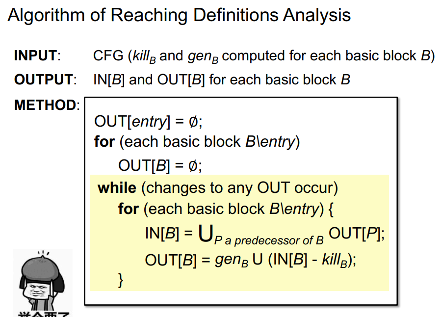

初始化时将所有block的OUT设为空集

然后从entry开始顺着数据流，根据transfer function更新block的OUT，直到把所有block都更新了一遍，这是内层for循环中的工作。

外层while循环中，不断重复上述工作，直到某一轮中所有的OUT都没有发生变化，则算法结束

## 3.3 Live Variables Analysis

Live Variables Analysis目的是判断某个变量v在程序点p处是否存活

如果存在从p点开始的某一条路径，在这条路径中使用到了v，那就说v在p点还活着（is live at p）；否则就说v在p点已经死了（is dead at p）

需要注意的是，如果v存活，那么说明从p开始到v被使用的那一点之间，v不能被重新定义

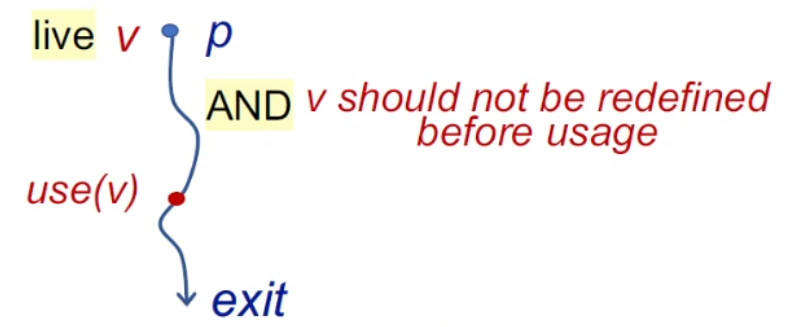

使用场景：假设程序运行到点p处时，寄存器满了需要清空一个寄存器。那么最好的就是清空一个死掉的（即后续不会被用到的）变量所占用的寄存器。此时就需要判断所有变量在点p处哪个是live

对于Live Variables Analysis来说，显然backward（数据流反方向）分析更合适，不然沿着数据流分析在后面找到使用点之后还得重新返回点p

### 3.3.1 data abstraction

算法执行时需要关注程序中的所有变量，因此将所有变量组成一个bit vector

计算所有点的bit vector，如果在某点处bit vector中对应的某个变量bit值为1，说明该变量在该点是Live的，否则是dead的

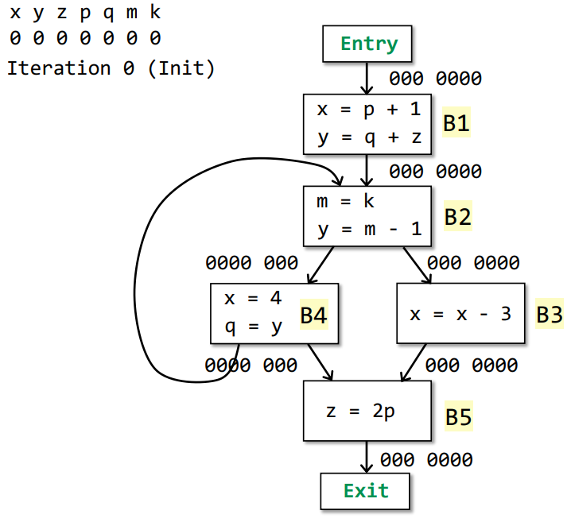

### 3.3.2 transfer function

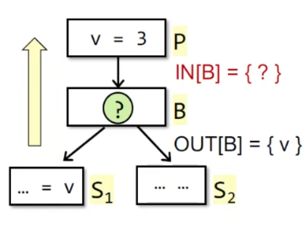

backward分析，就是已知OUT[B]求IN[B]，transfer function如下

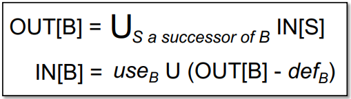

- OUT[B]就是IN[S]（所有后继节点的IN）的并集

- IN[B]，在OUT[B]的基础上观察B中的语句

  OUT[B] - defB : 如果在B中有某个变量的定义点，那就直接删掉

  useB：但是如果该变量在定义之前被使用了（这里useB特指定义前被使用 ），那就得重新加回来

### 3.3.3 Algorithm

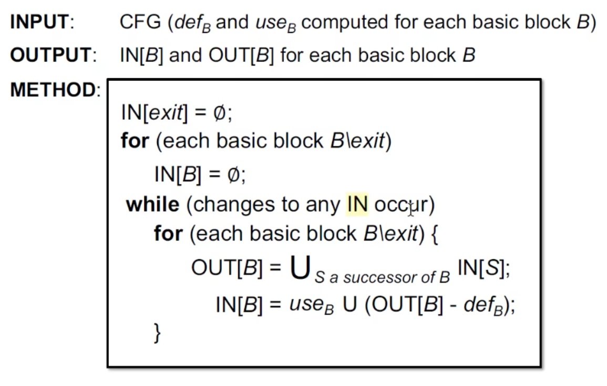

由于是backward分析，因此要从exit作为入口进行分析，初始化IN[exit]是空集，其他所有结点IN[B]也全是空

后面就是遍历所有节点，根据Transfer function求节点状态。不断遍历直到某次遍历后所有IN状态都不变

## 3.4 Available Expressions Analysis

这是一个must analysis

Available Expressions Analysis目标是求在程序一点p处，表达式x op y 是否是可用的

如果从程序入口到程序点p的所有路径 都必须经过 x op y 的计算，并且在最后一次计算x op y到程序点p之间，x和y都没有被重新定义，我们就说x op y在点p是可用的

如果x op y在点p是可用的，那么我们就可以在点p处将x op y这个表达式替换为它最后一次的计算值，这样就可以减少一次计算。可以用于编译优化

### 3.4.1 data abstraction

抽象程序中的所有表达式，将所有表达式用一个bit vector表示，其中每一个bit表示该表达式是否是Available

### 3.4.2 transfer function

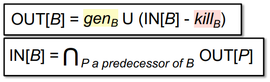

由于是must analysis，因此这里要求并集

举一个具体例子：

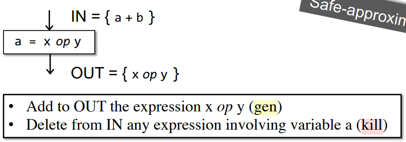

经过一个代码块时，代码块中的x op y表达式直接加入OUT的结果中，同时要把含变量a的表达式全部都kill掉，因为a被重新定义了

### 3.4.3 Algorithm

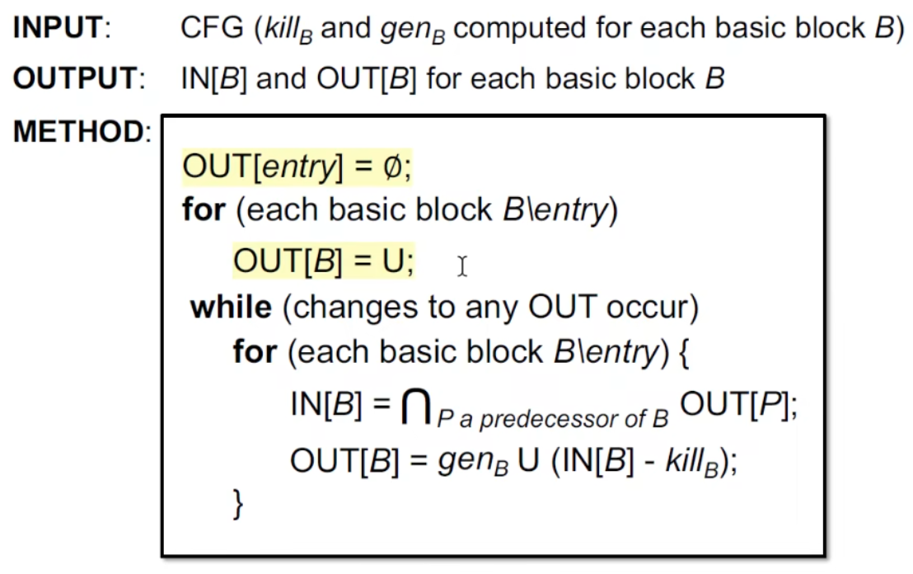

这里要注意，初始化时entry入口的起始是空集，其他block的起始都是全集，即起始认为在所有点所有语句都是available的

# 4. Data Flow Analysis

## 4.1 基础概念

### 4.1.1 不动点 fixed point

我们以另一个角度看一下数据流分析中的迭代算法 iteration Algothrim，可以这样表述：

给定一个k个节点的CFG（每个Basic Block或者statement就是一个节点），迭代算法在每一次迭代中做的工作就是 （根据Transfer Function和CFG）更新每个节点的OUT[n]（OUT[n]具体样式由data abstraction决定）。那么每轮迭代中得到的结果如下：

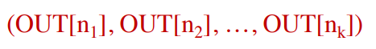

假如将数据流分析中关心的值域定义为V，即OUT[n1] = V1，则每次迭代之后获得的结果如下

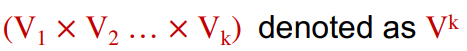

整个数据流分析过程可以进行如下表示：

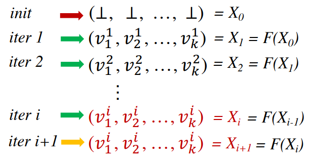

最后当两轮迭代得到的结果相同时，算法结束，即：

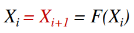

在数学上，X=F(X)的点就称为不动点

### 4.1.2 偏序关系 Partial Order

定义偏序集poset：(P, ⊑) ，其中P是一个集合，⊑ 是在集合P上定义的二元关系。如果⊑满足以下性质，我们就说(P, ⊑) 是一个偏序集。

（以下性质的描述中我们以 <= 为例来代替⊑）

- 自反性 Reflexivity

  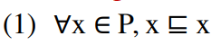

  对于集合中的所有元素x，都满足x <= x

- 反对称性 antisymmetry

  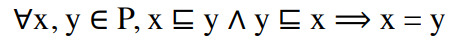

  对于P集合中的所有元素，如果有x <= y 并且 y <= x，那么x = y

- 传递性 transitivity

  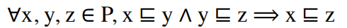

  对于P集合中的所有元素，如果满足 x<=y 并且 y<=z 则x<=z

根据以上定义，整数集和小于等于关系是偏序集，整数集和小于关系不是偏序集，英文单词集合和substring关系是偏序集

需要注意的是， 偏序关系的另一种含义就是，偏序集P中的元素可以是不可比较的。也就是说偏序集并不要求集合中的所有元素都一定满足 ⊑。比如并不要求整数集中任意两个元素x y都要满足x <= y

### 4.1.3 上下界 Upper and Lower Bounds

**上下界**

给定一个偏序集(P, ⊑) 。再给定一个P的子集S

- 如果给定一个P中的元素u，∀x ∈ S, x ⊑ u，即S中的所有元素x都满足x<= u，那么就说u是S的上界

  上界可能不止一个

- 相似地，给定P中元素l，∀x ∈ S, l ⊑ x，即S中的所有元素x都满足 l <= x，就说l是S的下界

  下界可能不止一个

**最小上界和最大下界**

- 最小上界 least upper bound （也叫lub 、 join）

  S的最小上界写作⊔S，就是S的所有上界中的最小值

  形式化表述为：任意给定一个S的上界u，⊔S（最小上界）都满足⊔S ⊑ u

  特别的：如果S中只有两个元素 S = {a, b}，那么⊔S可以被写为 a ⊔ b

- 最大下界 greatest lower bound （也叫glb、meet）

  写作⊓S，就是S的所有下界中的最大值

  任意给定一个S的下界l，都满足l ⊑ ⊓S

  特别的：如果S中只有两个元素 S = {a, b}，那么⊓S可以被写为 a ⊓ b

举例来说，对于整数P和小于等于关系组成的偏序集来说，⊔就表示求max，⊔S就表示max(S)；⊓就表示min，⊓S就表示min(S)

对于一个集合的幂集和子集偏序关系组成的偏序集（如下图）来说，⊔就表示求并集（join），⊔S就表示求S中所有集合的并集；⊓就表示求交集，⊓S就表示求S中所有集合的交集（meet）。

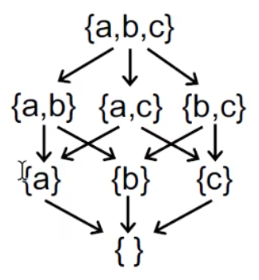

**一些性质**

- 不是所有偏序集都有lub和glb
- 如果一个偏序集有lub和glb，那这个 lub和glb肯定是唯一的

### 4.1.4 格 Lattice

**Lattice 格**

```
Given a poset (P, ⊑), ∀a, b ∈ P, if a ⊔ b and a ⊓ b exist, then
(P, ⊑) is called a lattice
```

给定一个偏序集P，如果P中任意两个元素组成的集合都有最小上界和最大下界，那么就说这个偏序集P是一个格

 那么整数P和小于等于关系组成的偏序集是格；幂集和子集偏序关系组成的偏序集也是格

**Complete Lattice 全格**

给定一个格(P, ⊑)，对于格中的任意子集S，S的最小上界和最大下界都存在，就称P为全格

与格的定义相比，就是要求 从任意两个元素组成的集合 扩大到了 任意元素组成的集合

实际上，只要一个lattice是有穷的（有边界的），那它一定是Complete Lattice。但是Complete Lattice并不一定是有穷的，比如[0,1]的实数组成的lattice。

整数P和小于等于关系组成的格不是全格，因为它的边界是正无穷，没有边界，也就没有上下界；幂集和子集偏序关系组成的格是全格

**Top Bottom**

所有的全格都存在Top 和 Bottom

整个全格P的最大元素就称为Top，称为T，T = ⊔P（P的最小上界）

整个全格P的最小元素就称为Bottom，称为⊥， ⊥=⊓P（P的最大下界）

**Product Lattice**

就是一组格组成一个格

```
Given lattices L1 = (P1, ⊑1), L2 = (P2, ⊑2), …, Ln
= (Pn, ⊑n), if for all i,(Pi, ⊑i) has ⊔i (least upper bound) and ⊓i (greatest lower bound), then we can have a product lattice Ln = (P, ⊑)
```

其中P = (P1, P2, P3, ..., Pn)

这一组Lattice组成的Product Lattice具体定义如下

- P = P1 × … × Pn

  值域就是所有格的值域的集合

- (x1, …, xn) ⊑ (y1, …, yn) ⟺ (x1 ⊑ y1) ∧ … ∧ (xn ⊑ yn)

  如果Ln中的两个元素满足偏序关系（这两个元素都是从P1, P2....Pn中各取一个元素组成的），那么对应Pn中的元素也满足偏序关系

- (x1, …, xn) ⊔ (y1, …, yn) = (x1 ⊔1 y1, …, xn ⊔n yn)

  最小上界是所有最小上界组成的集合

Product Lattice也是格，并且如果组成Product Lattice的格都是全格，那Product Lattice也是全格

## 4.2 格

### 4.2.1 用格表示数据流分析

数据流分析框架可以用（D，L，F）表示：

- D：direction

  数据流分析的方向，forwards or backwards

- L：Lattice

  实际上就是data abstraction，在不动点的介绍中将data abstraction用V来表示，这里的L就是 V的值域集合 + 偏序关系（交集meet 或者 并集join 操作）

- F：transfer function

  一组可以转换函数，可以实现V之间的转化，即F(V) = V1

### 4.2.2 格的单调性定理

这里是针对有关格的函数的单调性定理，格的函数是指接收一个格的元素作为输入，输出的元素也在格中，即能把格（偏序集这个集合）从一个状态转化为另一个状态 f: L --> L

```
A function f: L → L (L is a lattice) is monotonic if ∀x, y ∈ L,
x ⊑ y ⟹ f(x) ⊑ f(y)
```

关于的格的函数如果满足一下要求，则说它是单调的：对于任意L中的元素，如果x <= y，则f(x) <= f(y)

### 4.2.3 不动点定理

给定一个全格，如果这个全格是有限的，并且在这个全格上定义的函数是单调的，那这个函数的最小不动点一定可以被找到，并且用以下方式就能找到：

求f(⊥), f(f(⊥)), …, fk(⊥) until a fixed point is reached

即从格的bottom作为输入作为起点开始，不断迭代，直到到达不动点，那这个不动点就是最小不动点

**证明**

- 证明能到达不动点

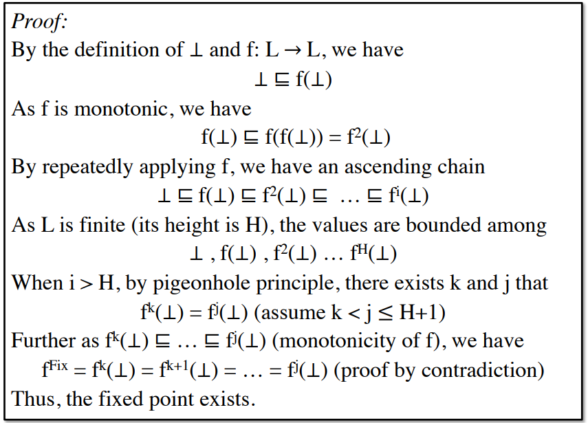

1. 首先，由于格上定义的函数 f 求出的值一定也在格上（函数定义），又由于Bottom⊥是格上最小值，因此有

    ⊥ ⊑ f(⊥)

2. 由于 f 是单调的，因此给左右两边都加个f，就有

   f(⊥) ⊑ f(f(⊥)) = f2(⊥)

3. 就这样重复，一直给左右两边加 f ，就可以得到一个 ascending chain

   ⊥ ⊑ f(⊥) ⊑ f2(⊥) ⊑ … ⊑ fi (⊥)

4. 由于这个格是有限的，所以值肯定不能一直往上增加，肯定会在某一个点停下来，即存在一点

   fk(⊥) = fj (⊥) (assume k < j ≤ H+1)

5. 此时这点就是不动点了，完成证明这个方法能到达不动点

- 证明求得的不动点是最小不动点

用反证法和数学归纳法

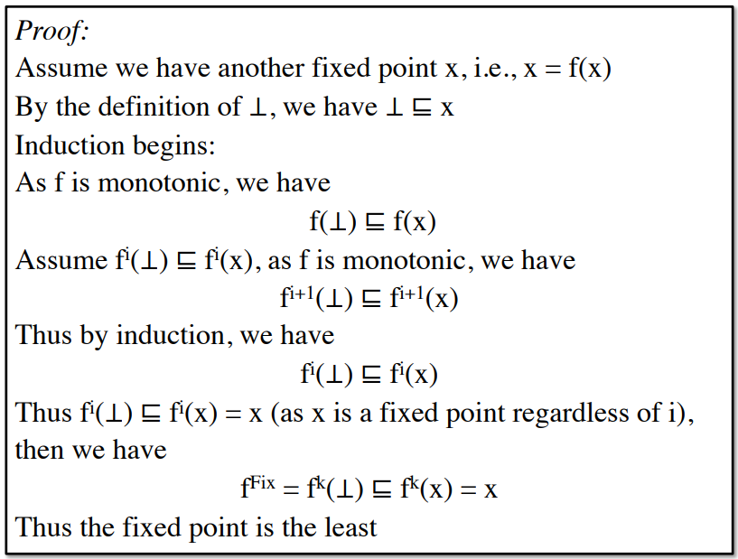

假设有另一个不动点 x = f(x)

1. 由定义可得，⊥ ⊑ x
2. 由于 f 是单调的，有 f(⊥) ⊑ f(x) ── 初始条件
3. 假设 fi (⊥) ⊑ fi (x) ── 假设第i步成立

4. 则有 fi+1(⊥) ⊑ fi+1(x) ── 归纳出 第i+1步成立

   此时归纳出，对于任意 i，都有fi (⊥) ⊑ fi (x) = x （因为x是不动点，因此f(x) = x）

5. 此时假设我们求出的不动点是 fk(⊥) 

   那就有： fFix = fk(⊥) ⊑ fk(x) = x

   求得我们的不动点fFix <= x，因此我们求出的是最小不动点，命题得证

## 4.3 Iterative Algorithm和不动点定理的联系

### 4.3.1 联系

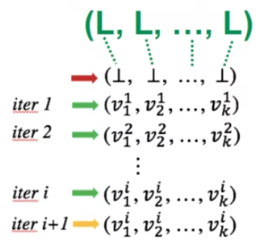

在介绍不动点时，我们就对iterative algorithm做了抽象和形式化表述。其中V11表示第一轮循环中第一个节点的OUT值（forward方向），Vxy(x是上标y是下标)表示第x轮循环中第y个节点的OUT值。

其中每个节点的OUT值都是一个格，而所有节点的OUT值合在一起可以构成product lattice，这个product lattice就是一次遍历得到的结果

那么一次遍历就是从iter_i对应的格，变为iter_i+1的格，而这种遍历的规则是转换函数f + 将数据流合在一起的join并或meet交操作。那么就可以表示为F(iter_i) = iter_i+1。F就是格上定义的函数

现在只需要证明转换函数F是单调的，上面介绍的格的不动点定理等性质就都可以用在iterative algorithm中

### 4.3.2 证明单调性

F包含两个部分

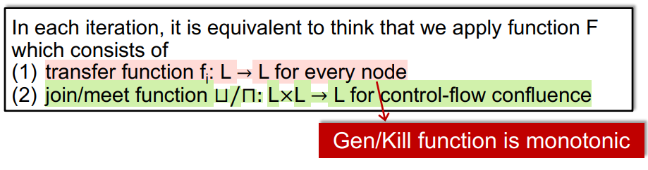

1. transfer function

   在前面的data flow的应用中，可以注意到在迭代过程中所有节点从IN到OUT都是not shrink的，也就是OUT值只会变大，所有值都只会从0变为1或从0变为0，而不会从1变为0。

   由此可以给出，对于Gen\Kill转换函数来说，是单调的

2. 迭代的另一个计算部分就是多个数据流进行合并时的join/meet function，即并/交操作

   此时需要将多个格合并为一个格，这里以两个格的合并为例来进行证明

上面的证明可以转化为下面这个证明式子

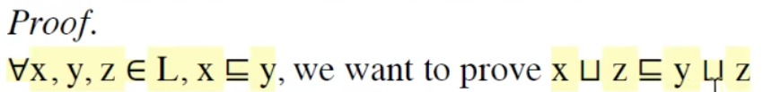

任取格L中三个元素x，y，z，并且x<=y，证明x和z求并集 <= y和z求并集（实际上是求最小上界）

 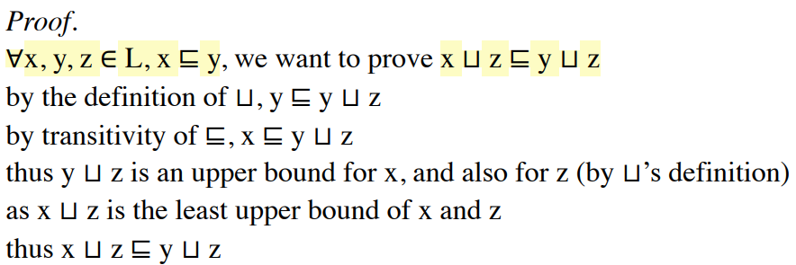

1. 由于y ⊔ z 是 y和z的最小上界，因此根据定义有

   y ⊑ y ⊔ z，z ⊑ y ⊔ z

2. 由于x ⊑ y，根据传递性有

   x ⊑ y ⊔ z

3. 因此y ⊔ z既是x的上界，也是z的上界，即它是x和z的上界

4. 由定义，x ⊔ z是最小上界，即所有上界中的最小值，又y ⊔ z是x和z的一个上界，因此有

   x ⊔ z ⊑ y ⊔ z

   命题得证

根据不动点定理，在iterative algorithm中，格的值域是有限的，并且格函数是单调的，因此它一定可以求得最小/最大不动点。所以iterative algorithm一定有解，并且是最优解

## 4.4 以格的视角看May/Must Analysis

### 4.4.1 May Analysis

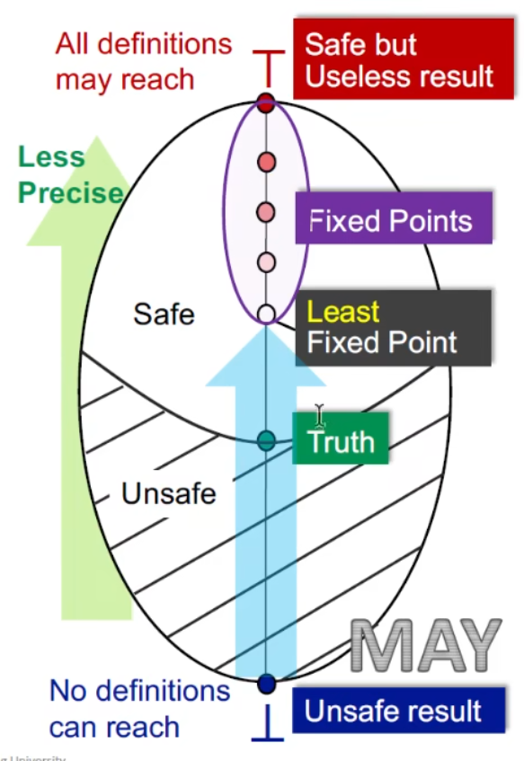

### 4.4.2 Must Analysis

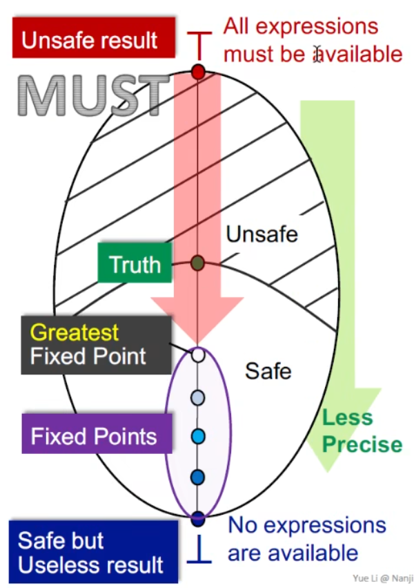


## 4.5 分析精度

### 4.5.1 MOP

Meet-Over-All-Paths Solution（MOP）

MOP，就是把到达某点所有可能的路径都计算出来，将结果做meet/join操作得到该点的值。

但是有一些路径可能永远不会执行到，这就会导致一些精度损失。同时分析所有Paths 的话，程序中的所有Path是Unbounded and not enumerable的，即无限且不可枚举

### 4.5.2 精度比较

**iterative algorithm和MOP的不同**

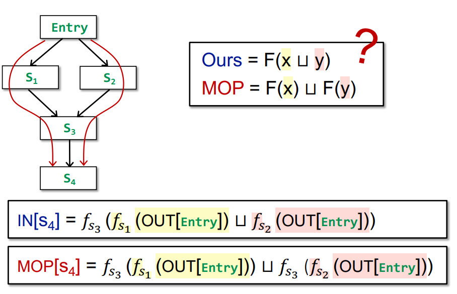

- iterative algorithm

  在迭代算法中，我们会先将S1和S2的OUT进行合并求出S3的IN，再求出S3的OUT，也就是S4的IN

- MOP

  MOP会直接将S1的OUT单独作为S3的IN直接求出S3的OUT，再直接将S2的OUT单独作为S3的IN求出S3的OUT，最后再合并得到S3的IN

如果把两个式子中的公共部分设为x和y，就可以得到Ours = F(x ⊔ y)、MOP = F(x) ⊔ F(y)

那么这两个算法哪个求得的值更好呢

**精度比较**

比较F(x ⊔ y) 和 F(x) ⊔ F(y)，哪个值更小对应的算法精度就更高

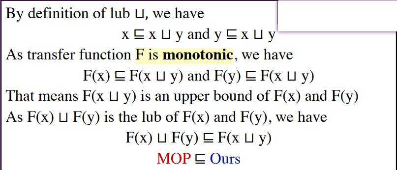

可以看出MOP精度更高

### 4.5.3 distributive

当F是distributive的时候，有F(x ⊔ y) = F(x) ⊔ F(y)，此时二者精度相同

也就是说，如果迭代算法的F是distributive的，那求得的结果和MOP精度相同。

一般，Bit-vector or Gen/KIll 问题的F都是distributive的

## 4.6 Worklist Algorithm

worklist algorithm是iterative algorithm的改进

在iterative中，只要在一次遍历中有一个节点的OUT发生了改变，那算法就不能终止，需要进行下一次迭代将所有节点都遍历一遍。但是在遍历中有很多节点是不会再发生改变的，这样就造成了资源浪费。

worklist的思想就是在遍历时只遍历上次迭代时发生了变化的节点，将这些发生变化的节点保存在worklist中，遍历时只访问worklist中的节点


1. 将所有待分析的节点都加入worklist中

2. 取出worklist中的节点进行计算

   如果计算前后节点OUT值相同，则说明没变

   如果计算前后OUT值发生变化，则将这个节点及其所有后继节点都加入worklist中

   这是因为，节点的OUT值就是其后继节点的IN值，而如果节点IN值不变则该节点OUT也不变，如果IN值变了那它OUT值就可能发生改变，因此需要重新计算

# X.程序间分析

## X.1 构建函数调用图Call Graph

函数调用图说明了在函数内部的所有函数调用点指向哪个具体函数，以及函数返回值具体返回到哪里。这对于程序间分析来说是必须的

### X.1.1 求单个调用点

构建函数调用图有许多算法，比如CHA算法，其中最重要的一步就是确定某处调用的函数具体的定义在哪里，也就是具体调用了哪个函数。

函数的定义可以由函数签名来表示。函数签名的形式为`<C: T foo(P,Q,R)>`，表示foo函数定义在类C中，返回值为T，参数类型为P,Q,R

定义Dispatch(c, m)来确定某一点的函数签名，其中c是函数调用对象，m是函数签名，即调用是`c.m()`。如果对象c中有m，则结果就是m；否则就往c的父类c'中找m，直到找到m。

函数调用类型如下

- Static call

  静态方法

  此时调用的方法肯定是唯一的，而且就是m本身

- Special call

  包括三种调用：构造器、类中的私有成员方法、父类的成员方法

  构造器和类中私有成员方法是m本身，父类成员方法需要通过dispatch方法寻找，但肯定是唯一确定的

- Virtual call

  调用Special以外的其他静态方法，主要是接口调用和多态调用（父类引用指向子类对象）

  此时具体的方法签名只能在运行时才能知道，所以必须通过dispatch方法寻找，且不能唯一确定

具体算法如下：


需要注意的是，在处理virtual call时，只会考虑c的声明（引用）类型，而不会在意c的真正类型

### x.1.2 求整个调用图

求调用图的步骤

1. 从程序的入口函数（main函数）开始
2. 对于入口函数中的每个函数调用点，都通过Resolve找到它们对应的函数。将这些函数与main函数用边连起来（表示调用关系）。
3. 再从这些新找到的函数中再找其中的每个调用点，进一步找到对应函数，再连起来。重复以上步骤直到所有方法都被加入到调用图中

# Y 指针分析

指针分析就是求解一个指针都可能指向哪些内存地址

对于面向对象语言来说（以Java为例），指针分析就是求解一个指针（变量variable或者属性field）能指向哪些对象（object）

指针分析是may analysis，也就是说求出的可能指向是比实际上要多的

**注意：** 别名分析研究的是：两个指针指向同一个object吗，如果能指向，则说这两个指针是别名。别名分析可以从指针分析的结果中推断而来

最终的指针分析会选择 Allocation-site、Context-sensitive、Flow-insensitive、Whole-program

## Y.1 指针分析分类

根据对指针分析过程中一些因素的选择和问题的回答，可以从以下几个方面进行分类

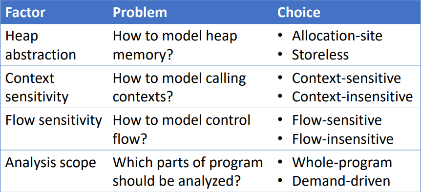

### Y.1.1 Heap abstraction

如何对堆内存进行抽象

在程序实际运行过程中，堆中的对象数量可能是无限的。在静态分析过程中，如何将运行过程中可能产生的无限对象 抽象为静态分析时有限的对象就是一个很关键的问题

主要分为两大流派：Store base model和Storeless model

其中Store based model中的一种Allocation sites，思路是只在创建对象的地方新建一个抽象对象，即只在new语句处新建对象。即使这个new语句在循环中执行多次也只会创建一个。

### Y.1.2 Context Sensitivity

如何对调用上下文进行建模

上下文是指，在程序运行时一个方法会被调用很多次，在不同的地方被调用，而在每次调用时都会产生对应的上下文，由于被调用点不同，调用该函数之前执行的代码语句也不同，因此在不同的上下文中函数内的变量、形参等会不同。

上下文敏感就是对于同一个方法的不同上下文环境分别做静态分析；上下文不敏感就是把函数执行时所有可能的上下文都合并成一个上下文进行分析

### Y.1.3 Flow Sensitivity

如何对控制流进行建模

流敏感分析是指，在分析过程中尊重程序执行顺序，做法是在每条语句上都保存 程序执行到该点时的数据流信息（比如前面变量的指向关系）。在流敏感分析中，每个语句都会对应一个指向关系映射图

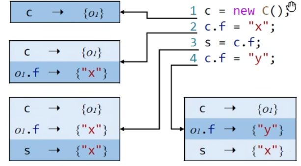

流非敏感是指，在分析过程中忽视控制流信息，即忽视程序执行顺序，而是将程序视作一些语句的无序集合 。对于流非敏感来说，整个程序只会对应一个指向关系映射图

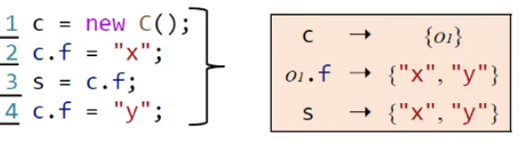

### Y.1.4 Analysis Scope

分析程序当中的哪些部分

Whole-program：对整个程序中的所有指针都进行指向分析

Demand-driven：只对需求中所需要的指针进行指针分析

## Y.2  指针分析关注点

指针分析中只会关注会影响指针的语句（pointer-affecting statements），对于结构跳转语句（if-else、switch-case、for/while/do-while、break/continue）这种对指针没影响的语句不会关注

在Java中的指针有以下几类：

- Local variable，x，局部变量

- Static field，C.f，静态成员变量

- Instance field，x.f，成员变量

- Array element：array[i] 数组

  忽略下标，将数组看作只有一个field的对象

  原代码：

  ```java
  array = new String[10];
  array[0] = "x";
  array[1] = "y";
  s = array[0];
  ```

  指针分析处理中的代码，会忽略掉所有下标

  ```java
  array = new String[];
  array.arr = "x";
  array.arr = "y";
  s = array.arr;
  ```

为了简化分析，Static field和Local variable分析方式类似，Array element和Instance field分析方式类似，因此下面只关注Local variable和Instance field

针对于上面的几类指针，对应需要关注的语句Pointer-Affecting Statements类型有

- New，创建一个对象并复制给局部变量 x = new T()
- Assign，给局部变量赋值 x = y
- Store，向成员变量中存值，x.f = y
- Load，从成员变量中取值，y = x.f
- Call，方法调用，r = x.k(a, ...)

## Y.3 指针分析中的符号

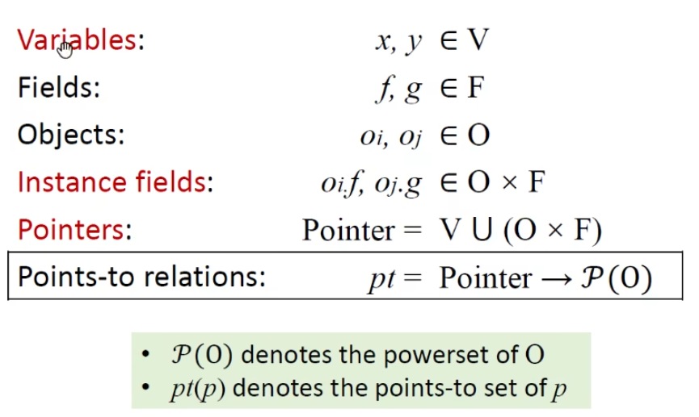

- Variables：x，y表示程序中的变量，Y表示程序中所有变量的集合

- Fields：程序中的所有域

- Objects：表示程序中的对象

  由于使用allocation site，所有对象都抽象为了new语句处创建的对象，所以这个O实际上就表示程序中所有对象创建点的集合

- Instance Fields：Objects对象中的域，所以集合就是O和F的乘积

- Pointers：指针由两部分组成，程序中所有Variables和所有Instance Fields

最后的指向关系用pt表示，pt表示一种映射关系mapper，它的key是程序中某个具体的指针，value就是该指针对应的指针集，指针集就是该指针能指向的所有对象的集合。那么这个指针集一定属于O的幂集（幂集是所有子集构成的集合），用p(O)表示

pt(p)就表示指针p对应的指针集，即指针p能指向的所有对象的集合。

## Y.4 指针分析规则

当指针分析过程中遇到Pointer-Affecting Statements时，需要执行的动作

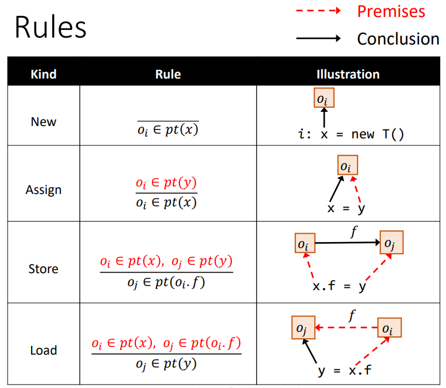

在rule一栏中，横线上面表示前提条件，下面表示结果

- **New**

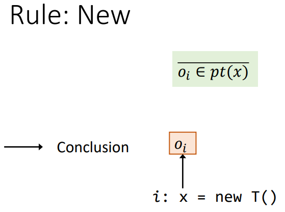

new语句会创建一个新的对象oi，这个新对象oi会无条件加入x的指针集中，即将oi加入x可以指向的对象集合

- **Assign**

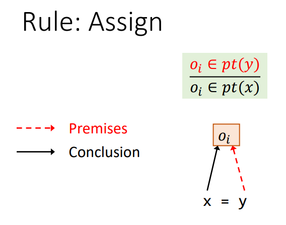

将y赋值给x，那么y可能指向的对象x现在也都可以指向了。

因此规则就是，如果一个对象oi在y的指针集中，那么就将这个对象加入到x的指针集中。即如果y指向oi，则让x也指向oi。也即将y指针集中的所有元素都加入到x的指针集中

- **Store**

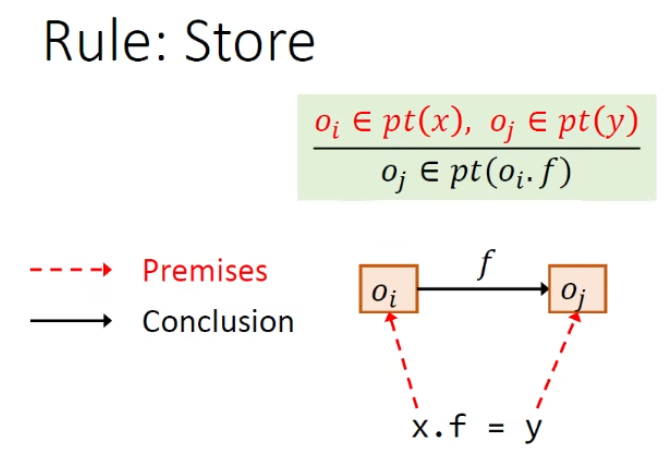

将y赋值给x的成员变量f，也就是将y的指针集的所有元素都加入到x.f的指针集中

规则是，如果oi在x的指针集中，oj在y的指针集中，那么将oj加入到oi.f的指针集中。即x的指针集中的所有对象的域f都有可能指向oj所能指向的对象

- **Load**

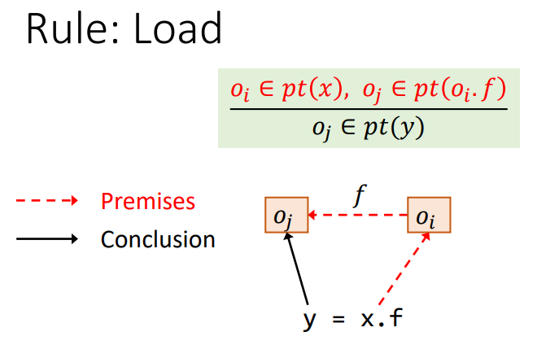

从x指向的对象 的field里面，读取一个对象f赋值给y

规则是，如果oi在x的指针集，并且同时oj在oi.f的指针集中，那么就把oj加入到y的指针集中

并不是直接把x.f的指针集中对象全都加入到y的指针集中，而是要先取x的指针集，再在指针集中取f域的指针集

# Z. 安全

安全保证措施：

- Access Control 访问控制，点

  在获取信息之前先检查是否有访问权限，有权限才会给信息

- Information flow security 信息流安全 端到端

  在程序获取信息之后，追踪信息在程序中的流动（信息流），保证程序是以安全的方式处理这个信息

## Z.1 信息流安全

信息流定义：如果变量x中的信息被传递给变量y（最简单的比如y=x），那么就说存在一条信息流x->y

信息流应用在安全中：根据考虑的视角不同，分为Confidentiality（读保护）和Integrity（写保护）

**Confidentiality保密性**

防止隐私信息泄露

- 首先给程序中的变量划分为不同的安全等级（security levels）

  最简单的分级，分为高级H和低级L，高级代表敏感信息，低级表示公共信息

- Information Flow Policy：规定信息流在不同安全等级的变量之间如何流动

  比如，Noninterference policy 非干涉策略：保证security变量的信息不能流动到public变量中

**Integrity完整性**

阻止untrusted信息（比如来自外界的输入信息）污染trusted信息

此时H表示高完整性trusted数据，L表示低完整性trusted数据，就要阻止L数据流向H数据

## Z.2 信息流传播形式

信息流可以通过多种形式传播，数据流只是信息流的一种传播方式

**Explicit flow 显式传播**

和数据流类似，通过直接赋值的方式进行传播

```java
Xh = Yh;
```

**Implicit Flow 隐式传播**

```java
secretH = getSecret();
if (secretH < 0)
    publicL = 1;
else 
    publicL = 0;
```

此时可以通过公开数据推断出秘密数据是否是负数，因此也算信息泄露

隐式传播发生在控制流被隐私数据影响时

信道：

用于传递信息的机制统称为信道channel；如果某个机制本意不是用来传递信息，但是实际上传递了信息，就称为convert/hidden channels隐藏信道

implicit flow隐藏信道很难被找到，但是从保密性角度考虑，它泄露的信息很少；从完整性角度考虑，也很难通过隐藏信道传递恶意信息破坏系统完整性，

## Z.3 污点分析

Taint Analysis，是目前使用最广泛的信息流分析技术

污点分析会将数据分为两类，对于感兴趣要追踪的data称为tainted data，会为这种数据打上标签；其他数据称为untainted data

tainted data的来源称为sources。实际上tainted data一般来自某些函数（特殊api）的返回值，所以sources一般都是这种函数

taint analysis就是跟踪tainted data在程序中是如何流动的，以及它们是否会流经特定的位置（这个位置称为sinks）。sink一般是我们关注的比较敏感的方法。

污点分析和指针分析实际上是非常接近的，将tainted data看作是抽象对象，将数据源点sources当作是allocation sites。这样就可以借助指针分析查看tained data是如何从sources开始传播的。
