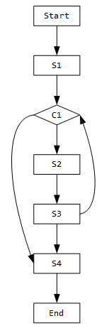

影响域分析和程序切片有什么区别和联系

# 1. PDG

PDG，Program Dependence Graph，程序依赖图。由控制依赖图和数据依赖图组成

## 1.1 控制依赖图CDG

### 1.1.1 控制依赖

ni和nj是CFG中两个节点，且nj在ni后面

**支配关系定义**

- 前支配关系

- 后支配关系 post-dominate 等价于 在xx必经之路上

  nj 后支配 ni，可以理解为nj在ni必经之路上

  定义：如果CFG中所有从ni开始到end节点的路径都经过nj，就称nj post-dominate ni（nj节点后支配ni节点）
  
  一个节点永远不会post-dominate它自己

**控制依赖定义**

如果CFG中存在一个从ni 到 nj 的路径，并且满足

1.  nj 后支配 这条路径上除了ni和nj外的所有节点
2. 并且 nj 不后支配ni

就说nj控制依赖于ni

就是说，如果nj 控制依赖于 ni，那么ni需要有两条出边（实际上控制图上的节点最多有两条出边），其中一条边上nj是必经之路，另一条边不能经过nj

**换个角度：** 谓词（就是bool表达式）和语句之间，如果谓词的值立即（immediately）会影响语句的执行，那么就说二者有控制依赖

控制依赖图就是把所有存在控制依赖关系的节点用边连接，丢弃其他节点。

**示例**

- if-else

```c
S1;
if (C1){
    S2;
    S3;
}
else
    S4;
S5;
S6;
```


从控制流图中可以看到，在顺序执行的语句中，C1 post-dominate S1，S5、S6 post-dominate前面所有节点，因此S1、S5、S6都不可能存在控制依赖关系

对于路径C1-S2，S2不post-dominateC1，且该路径只有两个节点，可以说S2 post-dominate除S2、C1外的所有节点，因此S2 控制依赖于C1

对于路径C1-S2-S3，S3 post-dominate S2，S3 不post-dominate C1，因此S3 控制依赖于C1，而不控制依赖于S2

C1-S4路径同理，因此最终的CPG为


可以看出CPG只会保留存在分支、循环的部分，而不会保留顺序执行的部分

- 嵌套if-else

```c
S1;
if (C1){
    S2;
    if (C2)
       S7;
}
else
    S4;
S5;
S6;
```


同理，顺序结构语句 S1、S5、S6先剔除


- while循环

```c
S1;
while (C1){
    S2;
    S3;
}
S4;
```



路径C1-S2-S3：S2 和 S3均不post-dominate C1，S3 post-dominate S2，因此S2和S3都控制依赖于C1

注意：控制依赖关系要求后面的节点控制依赖于前面的节点，因此无需考虑S3-C1这条路径

路径C1-S4：S4 post-dominate C1，因此不存在控制依赖关系


### 1.1.2 构造控制依赖图

控制依赖图由控制流图和FDT（Forward dominance Tree，前向支配树）生成

1. 构造cfg
2. 翻转cfg，再得到FDT
3. FDT+CFG就可以得到控制依赖图

也有说用[augmented postdominator tree（APT）](Keshav Pingali and Gianfranco Bilardi. 1995. APT: A data structure for optimal control dependence computation. In Proceedings of the ACM SIGPLAN 1995 Conference on Programming Language Design and Implementation (PLDI’95). ACM, New York, NY, 32–46. DOI:http://dx.doi.org/10.1145/207110.207114)增强后支配树生成

## 1.2 数据依赖图DDG

**数据依赖定义**

如果S1语句在S2语句之前执行，且S1置（define）一个值而S2使用（use）该值，则称存在一个流依赖（flow dependence）或真依赖（true denpendence）

在VFG（value flow graph）中，考虑节点X（定义变量v）和Y（使用变量v），如果存在从X到Y的路径，并且路径上没有重新定义v，则Y数据依赖于X

**换个角度：** 两个语句，如果两个语句颠倒，则一个语句中出现的变量可能具有不正确的值，此时就说这两个语句有数据依赖关系

上面的数据依赖定义只考虑了 `=`  赋值的情况，没有考虑指针别名问题

# 2.CE-PDG

Galindo C, Krinke J, Pérez S, et al. Field-sensitive program slicing[J]. Journal of Systems and Software, 2024, 210: 111939.

为了解决PDG不能处理composite data structure（复合数据结构如数组、元组）的问题，在原有PDG的基础上进行改进

## 2.1 CE-PDG构造

1. 如果PDG的节点值是复合数据结构，那就将这个节点继续扩展，拆分成以原PDG节点为根节点的树

   用这个树来表示这个复合数据结构，树中每个节点就表示复合结构中的每个元素

2. 拆分出新节点之后，给这些新节点之间也连上Structural Edges

   如果原节点是对复合数据结构的定义，那么拆分出来的节点依赖于原节点

   如果原节点是对复合数据结构的使用，那么原节点依赖于拆分出的节点

3. 将CE-PDG中的所有边都加上constraint标签


